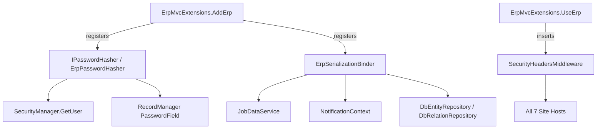

# Technical Specification

# 0. Agent Action Plan

## 0.1 Intent Clarification

Based on the prompt, the Blitzy platform understands that the objective is to conduct a comprehensive security audit of the WebVella ERP codebase and remediate the discovered vulnerabilities in place, organized by OWASP Top 10 (2021) category, while preserving all existing functionality. Although this Agent Action Plan is rendered using the refactoring template (source-to-target file mapping with UPDATE/CREATE/REFERENCE transformation modes), the underlying intent is a **Security Hardening transformation**: a behavior-preserving, constrained modification of existing code rather than a feature change or architectural rewrite. This interpretation is faithful to the prompt's MINIMAL CHANGE CLAUSE, which directs that only changes necessary to remediate vulnerabilities be made, with no feature additions and no refactoring beyond security.

This work corresponds directly to the security backlog already catalogued in the technical specification. The specification's success criteria explicitly list "OWASP audit remediation — Closure of vulnerabilities identified in PR #1" [§1.2.3.1], and the authentication-continuity criterion requires that existing users with MD5-hashed credentials continue to authenticate while stronger hashing is introduced for new credentials [§1.2.3.2]. The remediation therefore targets a pre-identified set of loci rather than an open-ended discovery exercise.

### 0.1.1 Core Remediation Objective

- **Refactoring type:** Security Hardening (a behavior-preserving subtype of code-structure refactoring). The transformation modifies how the system protects credentials, sessions, configuration, deserialization, and its HTTP edge — without altering business semantics, public APIs, or the database schema.
- **Target repository:** Same repository, in-place. There is no migration to a new repository; all changes land within the existing WebVella ERP solution (core library `WebVella.Erp`, web layer `WebVella.Erp.Web`, the seven site hosts, the WebAssembly projects, and the console app).
- **Severity-driven completion bar:** Per the prompt's severity matrix, the platform understands the bar as "zero Critical and zero High vulnerabilities remaining in the final codebase, with all Medium findings documented and addressed where low-cost, and the security scan passing — all while existing functionality is preserved."

The remediation goals, restated with technical precision, group into the following objectives:

- **G1 — Cryptographic failures (A02/A07):** Replace unsalted MD5 password hashing with a salted, adaptive key-derivation function and migrate credentials transparently on next login; remove the hardcoded symmetric encryption key from source and externalize all committed secrets.
- **G2 — Security misconfiguration (A05):** Fail fast when the default JWT signing key is present, tighten permissive CORS to an explicit origin allowlist, emit the prompt-specified security response headers, and eliminate the synchronous-I/O DoS setting.
- **G3 — Software & data integrity (A08):** Constrain Newtonsoft.Json polymorphic deserialization with an allowlist `ISerializationBinder` at every `TypeNameHandling` site.
- **G4 — Authentication & session failures (A07/A04):** Bound the authentication cookie lifetime, set the cookie `Secure` and `SameSite` flags, force rotation of the default administrator credential, and introduce account lockout / rate limiting.
- **G5 — Vulnerable & outdated components (A06):** Upgrade the End-of-Support .NET 7 WebAssembly projects to the supported framework already used by the rest of the solution, and apply software-composition-analysis (SCA) patch/pin remediation.
- **G6 — Injection & file handling (A03):** Preserve the existing parameterized-query protections and harden file-upload filename/content-type handling; document the deliberately trusted-author runtime code-evaluation boundary.
- **G7 — Denial of service (A05):** Remove `AllowSynchronousIO=true` and rely on asynchronous I/O.
- **G8 — Security logging (A09):** Preserve the existing `system_log` facility and document optional audit logging of authentication failures and permission denials as a Medium-severity enhancement.

**Implicit requirements surfaced** (unstated in the prompt but technically necessary):

- The MD5-to-KDF change forces a structural change to the credential-validation path, because today the password is matched inside the SQL `WHERE` clause [WebVella.Erp/Api/SecurityManager.cs:L77-96]; a salted hash cannot be compared by equality in SQL, so validation must move into application code (fetch-by-email, then verify in memory).
- Backward compatibility must be maintained for the legacy encryption-key typo fallback `Settings:EncriptionKey` [WebVella.Erp/ErpSettings.cs:L59-64], which is an intentional compatibility shim and must be preserved.
- Externalizing secrets must be schema-preserving: the configuration keys remain identical, only their values move to environment variables / a secret store, so deserialization and binding contracts do not break.
- Credential verification must use a constant-time comparison to avoid timing side channels.
- A strict Content-Security-Policy can break existing inline scripts/styles and vendored client libraries, so the policy must be tunable / deployable in Report-Only mode first to preserve UI behavior (functional parity).

### 0.1.2 Technical Interpretation

This remediation translates to the following technical transformation strategy: introduce a small number of new, centralized security components (a password-hasher abstraction, a serialization allowlist binder, and a security-headers middleware), wire them once into the composition root so all seven site hosts inherit them, and otherwise apply targeted in-place hardening to the specific files that contain each vulnerability.

The mapping from the current posture to the target hardened posture is summarized below.

| Concern | Current State (verified) | Target Hardened State |
|---------|--------------------------|------------------------|
| Password storage | Unsalted MD5 [WebVella.Erp/Utilities/PasswordUtil.cs:L9-31] | Salted adaptive KDF via `IPasswordHasher`, with transparent rehash-on-login of legacy MD5 hashes |
| Credential check | Password equality inside SQL `WHERE` [WebVella.Erp/Api/SecurityManager.cs:L77-96] | Fetch-by-email then constant-time in-code verify |
| Symmetric key | Hardcoded literal in source [WebVella.Erp/Utilities/CryptoUtility.cs:L16] | Required from configuration; no literal in source |
| Committed secrets | `EncryptionKey` / `Jwt:Key` literals in 8 `Config.json` files [WebVella.Erp.Site/Config.json:L25] | Placeholders / environment references; fail-fast on defaults |
| Deserialization | `TypeNameHandling` with no binder, 12 sites across 4 files [WebVella.Erp/Jobs/JobDataService.cs:L27] | Allowlist `ISerializationBinder` at every site |
| Cookie lifetime | `ExpiresUtc = UtcNow.AddYears(100)` [WebVella.Erp.Web/Services/AuthService.cs:L44] | Bounded operational lifetime |
| Cookie flags | `HttpOnly` only; no `Secure`/`SameSite` [WebVella.Erp.Site/Startup.cs:L93-101] | `Secure=Always`, `SameSite` set |
| CORS | `AllowAnyOrigin` on default host [WebVella.Erp.Site/Startup.cs:L58-64] | Explicit per-host origin allowlist |
| Security headers | None at code level on standard hosts | Dedicated middleware emitting the prompt's header set |
| Sync I/O | `AllowSynchronousIO=true` [WebVella.Erp.Web/Middleware/ErpMiddleware.cs:L25-27] | Asynchronous I/O |
| Default admin | `erp@webvella.com` / `erp` [WebVella.Erp/ERPService.cs:L467-468] | Randomized / force-reset credential |
| Runtime | `net7.0` (EOL) on WASM Server/Shared | Supported framework (`net10.0`, matching the rest of the solution) |
| Brute force | No lockout or rate limiting (verified absent) | Account lockout + rate limiter |

The transformation rules are: (1) prefer in-place `UPDATE` of the file owning each vulnerability; (2) introduce a `CREATE` only where a centralized, reusable security primitive is warranted (hasher, binder, headers middleware); (3) treat existing secure patterns (parameterized queries, antiforgery, role-based access control, JWT validation flags) as `REFERENCE` controls to be preserved, not re-implemented; and (4) keep all public API signatures, configuration keys, and the database schema stable so that downstream callers, persisted data, and the published NuGet artifact contracts remain compatible.


## 0.2 Scope Boundaries

This section defines the exhaustive set of files that the remediation will touch and the explicit boundaries it will not cross. Because the user-specified rules list is empty, there are no additional rule-mandated files beyond those implied by the prompt itself; the binding constraints derive from the prompt's MINIMAL CHANGE CLAUSE and the security backlog already verified in the repository.

### 0.2.1 Exhaustively In Scope

**Cryptography and credentials (A02 / A07):**

- `WebVella.Erp/Utilities/PasswordUtil.cs` — replace internal MD5 hashing while keeping legacy verification for migration [WebVella.Erp/Utilities/PasswordUtil.cs:L9-31]
- `WebVella.Erp/Utilities/IPasswordHasher.cs` — new strategy abstraction (CREATE)
- `WebVella.Erp/Utilities/ErpPasswordHasher.cs` — new salted-KDF implementation (CREATE)
- `WebVella.Erp/Api/SecurityManager.cs` — restructure credential validation to fetch-by-email then in-code verify [WebVella.Erp/Api/SecurityManager.cs:L77-96]
- `WebVella.Erp/Api/RecordManager.cs` — route `PasswordField.Encrypted` hashing through the new hasher [WebVella.Erp/Api/RecordManager.cs:L2008-2020]
- `WebVella.Erp/Utilities/CryptoUtility.cs` — remove the hardcoded `defaultCryptKey` literal [WebVella.Erp/Utilities/CryptoUtility.cs:L16]
- `WebVella.Erp/ErpSettings.cs` — fail-fast on default/empty JWT key; distinct issuer/audience; preserve the `EncriptionKey` fallback [WebVella.Erp/ErpSettings.cs:L59-64]

**Software & data integrity — deserialization (A08):**

- `WebVella.Erp/Utilities/ErpSerializationBinder.cs` — new allowlist `ISerializationBinder` (CREATE)
- `WebVella.Erp/Jobs/JobDataService.cs` — add binder at the four `TypeNameHandling.All` sites [WebVella.Erp/Jobs/JobDataService.cs:L27,L96,L297,L346]
- `WebVella.Erp/Notifications/NotificationContext.cs` — add binder at the two sites [WebVella.Erp/Notifications/NotificationContext.cs:L110,L155]
- `WebVella.Erp/Database/Db*Repository.cs` — add binder at all `TypeNameHandling.Auto` sites in `DbEntityRepository.cs` [WebVella.Erp/Database/DbEntityRepository.cs:L50,L165,L212] and `DbRelationRepository.cs` [WebVella.Erp/Database/DbRelationRepository.cs:L47,L128,L173]

**HTTP edge — headers, CORS, cookies, rate limiting (A05 / A07):**

- `WebVella.Erp.Web/Middleware/SecurityHeadersMiddleware.cs` — new middleware emitting the prompt's header set (CREATE)
- `WebVella.Erp.Web/ErpMvcExtensions.cs` — register the new services in `AddErp()` and insert the headers middleware in `UseErp()` [WebVella.Erp.Web/ErpMvcExtensions.cs:L26,L39]
- `WebVella.Erp.Site*/Startup.cs` — tighten CORS, set cookie `Secure`/`SameSite`, register the rate limiter, ensure header middleware across all seven hosts (`WebVella.Erp.Site`, `.Site.Crm`, `.Site.Mail`, `.Site.MicrosoftCDM`, `.Site.Next`, `.Site.Project`, `.Site.Sdk`) [WebVella.Erp.Site/Startup.cs:L58-64,L93-101]
- `WebVella.Erp.Web/Middleware/ErpMiddleware.cs` — remove `AllowSynchronousIO=true` [WebVella.Erp.Web/Middleware/ErpMiddleware.cs:L25-27]

**Secrets configuration (A02 / A05):**

- `WebVella.Erp.Site*/Config.json` and `WebVella.Erp.ConsoleApp/Config.json` — replace committed `EncryptionKey` and `Jwt:Key` literals with placeholders / environment references (eight files total) [WebVella.Erp.Site/Config.json:L25]

**Sessions and default administrator (A07):**

- `WebVella.Erp.Web/Services/AuthService.cs` — bound the cookie `ExpiresUtc` lifetime; preserve the JWT path [WebVella.Erp.Web/Services/AuthService.cs:L44,L155-158]
- `WebVella.Erp/ERPService.cs` — randomize / force-reset the default admin password [WebVella.Erp/ERPService.cs:L467-468]
- `WebVella.Erp.Web/Pages/login.cshtml.cs` — integrate lockout / throttling at the login hook

**File upload hardening (A03):**

- `WebVella.Erp.Web/Controllers/WebApiController.cs` — sanitize and validate upload filenames and content types at the upload endpoints [WebVella.Erp.Web/Controllers/WebApiController.cs:L3329,L3908,L3964-3977]

**Vulnerable / outdated components (A06):**

- `WebVella.Erp.WebAssembly/Server/*.csproj` — upgrade `TargetFramework` from `net7.0` to the supported framework and bump `Microsoft.AspNetCore.Components.WebAssembly.Server`
- `WebVella.Erp.WebAssembly/Shared/*.csproj` — upgrade `TargetFramework` from `net7.0`
- Any `*.csproj` flagged by SCA — patch/pin vulnerable transitive packages

**Documentation-only (no code change):**

- `WebVella.Erp.Web/Services/CodeEvalService.cs` — document the trusted-author runtime-eval boundary; no code change unless escalated [WebVella.Erp.Web/Services/CodeEvalService.cs:L44-45]

### 0.2.2 Explicitly Out of Scope

- **Vendored / third-party libraries:** No source modification of NuGet packages or bundled client libraries (jQuery, Stencil, Select2, Chart.js, toastr); only version updates / pins where SCA flags a CVE.
- **Infrastructure outside the application boundary:** Reverse proxies, IIS host configuration beyond the single existing `WebVella.Erp.Site/web.config`, TLS termination, network controls, and container/orchestration assets are not modified in code.
- **External integrations' server-side behavior:** SMTP (MailKit), cloud blob storage (Storage.Net), and the Microsoft CDM plugin are not re-architected; SSRF and outbound-fetch risks are documented as a review surface only.
- **Database schema and stored data:** No schema migration. The existing `password` column is reused; only the stored value format changes, and that change is backward compatible (legacy MD5 values continue to verify and are upgraded transparently on next login).
- **Feature additions and non-security refactoring:** No new product capability, no module decomposition, and no microservices extraction (the latter belongs to a separate modernization effort, not this PR #1 closure).
- **Test-project creation:** The solution contains no test projects and the prompt does not mandate creating any; none are created.
- **Already-correct controls (preserve, do not duplicate):** Parameterized `NpgsqlCommand` / `EqlParameter` queries [WebVella.Erp/Api/SecurityManager.cs:L85-86], antiforgery on Razor POSTs, `[Authorize]` / `AuthorizeFolder` + `HasEntityPermission` role-based access control, `[JsonIgnore]` redaction on sensitive `ErpUser` fields, `DevelopmentMode`-gated error masking [WebVella.Erp.Web/ApiControllerBase.cs:L49-58], and the JWT `ValidateIssuer`/`ValidateAudience`/`ValidateLifetime`/`ValidateIssuerSigningKey` flags [WebVella.Erp.Site/Startup.cs:L102-114] are left intact.


## 0.3 Target Design and Remediation Patterns

The target design preserves the existing WebVella ERP structure and adds three small, centralized security primitives. The guiding principle is concentration: rather than scattering ad-hoc fixes, each cross-cutting concern (password hashing, deserialization safety, HTTP response headers) is implemented once and wired through the existing composition root [WebVella.Erp.Web/ErpMvcExtensions.cs:L26,L39] so that all seven site hosts inherit it without per-host duplication.

### 0.3.1 Hardened Structure Planning

The new and modified files relative to the existing tree are shown below. Files marked **(new)** are `CREATE`; all others are in-place `UPDATE`.

```
WebVella.Erp/
├── Utilities/
│   ├── PasswordUtil.cs            (UPDATE - legacy MD5 retained for verify-only)
│   ├── IPasswordHasher.cs         (new - Strategy abstraction)
│   ├── ErpPasswordHasher.cs       (new - salted adaptive KDF + legacy verify)
│   ├── ErpSerializationBinder.cs  (new - ISerializationBinder allowlist)
│   └── CryptoUtility.cs           (UPDATE - remove hardcoded key)
├── Api/
│   ├── SecurityManager.cs         (UPDATE - fetch-by-email then verify + rehash)
│   └── RecordManager.cs           (UPDATE - route hashing via IPasswordHasher)
├── Jobs/JobDataService.cs         (UPDATE - attach binder)
├── Notifications/NotificationContext.cs (UPDATE - attach binder)
├── Database/
│   ├── DbEntityRepository.cs      (UPDATE - attach binder)
│   └── DbRelationRepository.cs    (UPDATE - attach binder)
├── ErpSettings.cs                 (UPDATE - fail-fast on default JWT key)
└── ERPService.cs                  (UPDATE - randomize default admin)

WebVella.Erp.Web/
├── Middleware/
│   ├── SecurityHeadersMiddleware.cs (new - emits prompt header set)
│   └── ErpMiddleware.cs           (UPDATE - remove AllowSynchronousIO)
├── ErpMvcExtensions.cs            (UPDATE - DI + pipeline registration)
├── Services/AuthService.cs        (UPDATE - bound cookie lifetime)
├── Controllers/WebApiController.cs (UPDATE - sanitize uploads)
└── Pages/login.cshtml.cs          (UPDATE - lockout/throttle hook)

WebVella.Erp.Site*/                 (7 hosts)
├── Startup.cs                      (UPDATE - CORS, cookie flags, rate limiter)
└── Config.json                     (UPDATE - externalize secrets)

WebVella.Erp.WebAssembly/
├── Server/*.csproj                 (UPDATE - net7.0 -> net10.0)
└── Shared/*.csproj                 (UPDATE - net7.0 -> net10.0)
```

The single most important wiring point is `WebVella.Erp.Web/ErpMvcExtensions.cs`: `AddErp()` is the dependency-injection registration site [WebVella.Erp.Web/ErpMvcExtensions.cs:L26] and `UseErp()` is the pipeline-assembly site [WebVella.Erp.Web/ErpMvcExtensions.cs:L39]. Because only one `web.config` exists in the solution (`WebVella.Erp.Site/web.config`) and no custom headers are configured at the IIS layer, code-level middleware is the correct and uniform place to emit security headers.

### 0.3.2 Web Search Research Conducted

Targeted research was conducted to ground the remediation in current best practice for the two highest-risk classes:

- **Password storage (OWASP Password Storage guidance):** Fast hashes such as MD5 and SHA-256 are unsuitable for passwords; a slow, adaptive key-derivation function with a per-password unique salt is required. The preferred algorithms are Argon2id (memory-hard; OWASP minimum configuration of roughly 19 MiB memory, two iterations, parallelism one), bcrypt (work factor at least 10; the prompt mandates a cost factor of 12 or higher), and PBKDF2-HMAC-SHA256 (600,000+ iterations) where a FIPS-validated or dependency-free option is required. A pepper may be added as defense-in-depth.
- **Insecure deserialization (Microsoft CA2328/CA2329/CA2330 and Newtonsoft.Json guidance):** When `TypeNameHandling` is anything other than `None` and the `SerializationBinder` is null, deserialization is vulnerable to remote code execution via the embedded `$type` directive (for example, gadget chains using `ObjectDataProvider`). The recommended remediation is to prefer `TypeNameHandling.None`, or — where polymorphism is genuinely required, as it is in WebVella's persisted job/notification payloads — to supply a custom `ISerializationBinder` whose `BindToType` allowlists only the expected types and delegates to `DefaultSerializationBinder` for known types.
- **Component currency (.NET support lifecycle):** .NET 7 reached End of Support on May 14, 2024 (an 18-month Standard-Term-Support release) and no longer receives security updates. The `net7.0` WebAssembly Server and Shared projects are therefore a genuine A06 finding, and the target framework is `net10.0` to match the rest of the solution.

The candidate hashing-library versions were verified on the package registry to avoid placeholder versions: <cite index="1-19">BCrypt.Net-Next is at version 4.2.0</cite>, with <cite index="1-1">v4.1.0 adding a net10 target and removing older core targets</cite>, and <cite index="11-5,11-16">Konscious.Security.Cryptography.Argon2 is at version 1.3.1, a C# implementation of the Argon2 specification with Argon2id support</cite>.

### 0.3.3 Design Pattern Applications

- **Strategy** — `IPasswordHasher` abstracts the hashing algorithm behind a stable interface (`HashPassword`, `Verify`), allowing the concrete KDF (Argon2id / bcrypt / PBKDF2) to be selected and tuned without touching callers.
- **Transparent upgrade (rehash-on-verify)** — `Verify(plaintext, stored)` returns both a success flag and a `needsUpgrade` flag; when a legacy MD5 hash (32-hex, no scheme prefix) or a stale work factor is detected, the caller transparently re-hashes and persists via `SaveUser`, satisfying the authentication-continuity criterion [§1.2.3.2].
- **Allowlist guard** — `ErpSerializationBinder.BindToType` returns only the expected WebVella payload types and rejects everything else, neutralizing the `$type` gadget vector while preserving the existing on-wire format.
- **Middleware / chain-of-responsibility** — `SecurityHeadersMiddleware` and the ASP.NET Core rate limiter slot into the request pipeline, applying uniformly to every response.
- **Options with fail-fast validation** — `ErpSettings` validates security-critical configuration at startup, refusing to run with a default or empty JWT signing key while preserving the legacy `EncriptionKey` typo fallback [WebVella.Erp/ErpSettings.cs:L59-64].
- **Centralized composition root** — all new services are registered once in `AddErp()` and the middleware inserted once in `UseErp()`, so the seven hosts inherit identical behavior.

Deliberately **not** applied: there is no introduction of a repository layer, factory hierarchy, or dependency-injection overhaul. Such restructuring would exceed the minimal-change discipline mandated by the prompt.

### 0.3.4 User Interface Impact

No design system or component library is specified in the prompt, and no Figma attachments were provided; therefore the **Design System Compliance** protocol is not applicable and there is no visual redesign. The only indirect UI considerations are operational rather than aesthetic:

- A strict `Content-Security-Policy` (`default-src 'self'`) can block existing inline scripts/styles and vendored client libraries. To preserve current UI behavior (functional parity), the CSP is designed to be configurable and deployable in `Content-Security-Policy-Report-Only` mode first, then tightened.
- Setting the cookie `Secure` flag requires HTTPS in every environment, which is an operational prerequisite rather than a visible change.

These considerations do not alter any screen, layout, or component; they constrain only headers and transport.


## 0.4 File-by-File Transformation Mapping

This section maps every target file to a source file. `UPDATE` hardens a file in place; `CREATE` introduces a new component modeled on an existing pattern; `REFERENCE` denotes an existing secure pattern or contract to emulate or preserve with no code change.

### 0.4.1 Transformation Plan

| Target File | Transformation | Source File | Key Changes |
|-------------|----------------|-------------|-------------|
| `WebVella.Erp/Utilities/PasswordUtil.cs` | UPDATE | self | Retain MD5 helpers for legacy verification only; route new hashing through `IPasswordHasher` [WebVella.Erp/Utilities/PasswordUtil.cs:L9-31] |
| `WebVella.Erp/Utilities/IPasswordHasher.cs` | CREATE | `WebVella.Erp/Utilities/PasswordUtil.cs` | New Strategy abstraction: `HashPassword` and `Verify` returning success + `needsUpgrade` |
| `WebVella.Erp/Utilities/ErpPasswordHasher.cs` | CREATE | `WebVella.Erp/Utilities/CryptoUtility.cs` | Salted KDF (Argon2id / bcrypt cost ≥ 12 / PBKDF2-HMAC-SHA256 ≥ 600k); versioned self-describing hash; legacy-MD5 verify branch |
| `WebVella.Erp/Api/SecurityManager.cs` | UPDATE | self | Restructure `GetUser(email,password)` from password-in-`WHERE` to fetch-by-email → constant-time `Verify` → transparent rehash via `SaveUser` when `needsUpgrade` [WebVella.Erp/Api/SecurityManager.cs:L77-96,L229,L282] |
| `WebVella.Erp/Api/RecordManager.cs` | UPDATE | self | Route `PasswordField.Encrypted` hashing through `IPasswordHasher` instead of MD5 [WebVella.Erp/Api/RecordManager.cs:L2008-2020] |
| `WebVella.Erp/Utilities/CryptoUtility.cs` | UPDATE | self | Remove hardcoded `defaultCryptKey` literal; require configured key; keep `EncryptText`/`EncryptData` contract [WebVella.Erp/Utilities/CryptoUtility.cs:L16] |
| `WebVella.Erp/Api/Models/FieldTypes/PasswordField.cs` | REFERENCE | self | Preserve field contract and `Encrypted` flag semantics |
| `WebVella.Erp/Utilities/ErpSerializationBinder.cs` | CREATE | Microsoft CA2329 allowlist-binder pattern | `ISerializationBinder` allowlist delegating to `DefaultSerializationBinder` for known types |
| `WebVella.Erp/Jobs/JobDataService.cs` | UPDATE | self | Attach `SerializationBinder` to the four `TypeNameHandling.All` settings sites [WebVella.Erp/Jobs/JobDataService.cs:L27,L96,L297,L346] |
| `WebVella.Erp/Notifications/NotificationContext.cs` | UPDATE | self | Attach binder at the two `.Auto` sites [WebVella.Erp/Notifications/NotificationContext.cs:L110,L155] |
| `WebVella.Erp/Database/DbEntityRepository.cs` | UPDATE | self | Attach binder at the three `.Auto` sites [WebVella.Erp/Database/DbEntityRepository.cs:L50,L165,L212] |
| `WebVella.Erp/Database/DbRelationRepository.cs` | UPDATE | self | Attach binder at the three `.Auto` sites [WebVella.Erp/Database/DbRelationRepository.cs:L47,L128,L173] |
| `WebVella.Erp.Web/Middleware/SecurityHeadersMiddleware.cs` | CREATE | `WebVella.Erp.Web/Middleware/ErpMiddleware.cs` | New middleware emitting the prompt's header set; configurable / Report-Only CSP for UI parity |
| `WebVella.Erp.Web/ErpMvcExtensions.cs` | UPDATE | self | Register `IPasswordHasher` + `ErpSerializationBinder` in `AddErp()`; insert `SecurityHeadersMiddleware` early in `UseErp()` so all 7 hosts inherit [WebVella.Erp.Web/ErpMvcExtensions.cs:L26,L39] |
| `WebVella.Erp.Web/Middleware/ErpMiddleware.cs` | UPDATE | self | Remove `AllowSynchronousIO=true`; rely on async I/O [WebVella.Erp.Web/Middleware/ErpMiddleware.cs:L25-27] |
| `WebVella.Erp.Site/Startup.cs` | UPDATE | self | Tighten CORS [L58-64]; cookie block add `Secure=Always` + `SameSite` [L93-101]; register rate limiter; ensure header middleware / `UseHsts` |
| `WebVella.Erp.Site.Crm/Startup.cs` | UPDATE | `WebVella.Erp.Site/Startup.cs` | Same hardening; CORS already localhost-scoped (`AllowNodeJsLocalhost`) [WebVella.Erp.Site.Crm/Startup.cs:L35-36] |
| `WebVella.Erp.Site.Next/Startup.cs` | UPDATE | `WebVella.Erp.Site/Startup.cs` | Same hardening; CORS already localhost-scoped [WebVella.Erp.Site.Next/Startup.cs:L38-39] |
| `WebVella.Erp.Site.Project/Startup.cs` | UPDATE | `WebVella.Erp.Site/Startup.cs` | Same hardening; CORS currently `AllowAnyOrigin` [WebVella.Erp.Site.Project/Startup.cs:L53] |
| `WebVella.Erp.Site.Mail/Startup.cs`, `.Site.MicrosoftCDM/Startup.cs`, `.Site.Sdk/Startup.cs` | UPDATE | `WebVella.Erp.Site/Startup.cs` | Same hardening (covered by `WebVella.Erp.Site*/Startup.cs`) |
| `WebVella.Erp/ErpSettings.cs` | UPDATE | self | Fail-fast if `Jwt:Key` is default/empty; distinct issuer ≠ audience; preserve `EncriptionKey` fallback [WebVella.Erp/ErpSettings.cs:L59-64] |
| `WebVella.Erp.Site*/Config.json` + `WebVella.Erp.ConsoleApp/Config.json` | UPDATE | `WebVella.Erp.Site/Config.json` | Replace committed `EncryptionKey` / `Jwt:Key` literals with placeholders / env references (8 files) [WebVella.Erp.Site/Config.json:L25] |
| `WebVella.Erp.Web/Services/AuthService.cs` | UPDATE | self | Cookie `ExpiresUtc` 100-year → bounded; keep `IsPersistent` semantics + JWT path [WebVella.Erp.Web/Services/AuthService.cs:L44,L155-158] |
| `WebVella.Erp/ERPService.cs` | UPDATE | self | Default admin seed → random / force-reset password; keep email identity [WebVella.Erp/ERPService.cs:L467-468] |
| `WebVella.Erp.Web/Pages/login.cshtml.cs` | UPDATE | self | Integrate lockout / throttle at the login hook (paired with the rate limiter) |
| `WebVella.Erp.Web/Controllers/WebApiController.cs` | UPDATE | self | Sanitize / validate upload filenames + content type; canonicalize path, strip traversal [WebVella.Erp.Web/Controllers/WebApiController.cs:L3329,L3908,L3964-3977] |
| `WebVella.Erp.WebAssembly/Server/*.csproj` | UPDATE | self | `net7.0` → `net10.0`; bump `Microsoft.AspNetCore.Components.WebAssembly.Server` 7.0.13 |
| `WebVella.Erp.WebAssembly/Shared/*.csproj` | UPDATE | self | `net7.0` → supported framework |
| `WebVella.Erp.Web/Services/CodeEvalService.cs` | REFERENCE | self | Document the trusted-author boundary; no code change unless escalated [WebVella.Erp.Web/Services/CodeEvalService.cs:L44-45] |

### 0.4.2 Cross-File Dependencies and Registration Changes

- **Dependency injection:** `IPasswordHasher` and `ErpSerializationBinder` are registered exactly once in `ErpMvcExtensions.AddErp()` (the composition root), then consumed by `SecurityManager` and `RecordManager` (hasher) and by `JobDataService`, `NotificationContext`, `DbEntityRepository`, and `DbRelationRepository` (binder, applied to the shared `JsonSerializerSettings`).
- **Pipeline ordering:** `SecurityHeadersMiddleware` must run before the response is written, so it is inserted in `UseErp()` ahead of the existing `ErpMiddleware`. The rate limiter is registered per host (`AddRateLimiter`) and `UseRateLimiter` is placed before authentication.
- **Credential-path reshaping:** The `SecurityManager` change alters the query shape from `... WHERE email ~* @email AND password = @password` to `... WHERE email ~* @email`, then verifies the hash in code [WebVella.Erp/Api/SecurityManager.cs:L77-96]. The method still returns an `ErpUser`, so the login flow and all callers are unaffected.
- **New using directives:** `SecurityManager` and `RecordManager` add `using WebVella.Erp.Utilities` for `IPasswordHasher`; the four deserialization files add `using WebVella.Erp.Utilities` for `ErpSerializationBinder`; `ErpMvcExtensions` adds `using WebVella.Erp.Web.Middleware`. No namespaces are relocated.
- **Configuration contract:** Config keys are unchanged; only values are externalized, so there is zero deserialization or binding break.

The dependency flow is illustrated below.



### 0.4.3 Wildcard Patterns

Wildcards are used only where a uniform change applies across a known file group, and only as trailing patterns:

- `WebVella.Erp.Site*/Startup.cs` — the seven host startup files
- `WebVella.Erp.Site*/Config.json` — the seven host configuration files (plus the explicitly listed `WebVella.Erp.ConsoleApp/Config.json`)
- `WebVella.Erp/Database/Db*Repository.cs` — the two repository files carrying deserialization sites
- `WebVella.Erp.WebAssembly/Server/*.csproj` and `WebVella.Erp.WebAssembly/Shared/*.csproj` — the two EOL-framework projects

All other targets are addressed by their exact paths.

### 0.4.4 One-Phase Execution

The entire remediation is executed by Blitzy in a single phase. Every file enumerated above — the three new components, all in-place updates, and the framework upgrade — is included together, with no multi-phase split. This keeps the cross-file registrations (DI, pipeline ordering, and the credential-path reshaping) internally consistent at all times.


## 0.5 Dependency Inventory

All versions below are the exact values pinned in the project manifests; no placeholder versions are used. Candidate new-dependency versions were verified on the NuGet registry.

### 0.5.1 Key Packages

| Registry | Package | Version | Purpose / Security Relevance |
|----------|---------|---------|------------------------------|
| NuGet | Newtonsoft.Json | 13.0.4 | JSON serialization; the `TypeNameHandling` deserialization sink (A08). Retained and mitigated via binder, not replaced |
| NuGet | Npgsql | [9.0.4] | PostgreSQL driver; parameterized queries are the A03 SQLi control |
| NuGet | System.IdentityModel.Tokens.Jwt | 8.15.0 | JWT token creation/validation (A02/A07) |
| NuGet | Microsoft.AspNetCore.Authentication.JwtBearer | 10.0.1 | JWT bearer authentication middleware (A07) |
| NuGet | Microsoft.AspNetCore.Mvc.NewtonsoftJson | 10.0.1 | MVC JSON formatter; binds to Newtonsoft settings, so the binder applies here too |
| NuGet | CS-Script (CSScriptLib) | 4.13.1 | Runtime C# evaluation (A03/A08 surface; trusted-author boundary) |
| NuGet | Microsoft.CodeAnalysis.* (Roslyn) | 5.0.0 | Compilation backing CS-Script |
| NuGet | HtmlAgilityPack | 1.12.4 | HTML parsing (output-handling relevance) |
| NuGet | Wangkanai.Detection | 8.20.0 | Device/client detection |
| NuGet | Storage.Net | 9.3.0 | File/blob storage (file-upload / path-traversal A03 surface) |
| NuGet | System.Drawing.Common | 10.0.1 | Image processing |
| NuGet | AutoMapper | [14.0.0] | Object mapping |
| NuGet | MailKit | 4.14.1 | SMTP (Plugins.Mail) |
| NuGet | Microsoft.AspNetCore.Components.WebAssembly.Server | 7.0.13 | WASM Server hosting on `net7.0` — End-of-Support (A06) |
| NuGet | Microsoft.Web.LibraryManager.Build | 3.0.71 | Client-library (libman) restore |

The published NuGet artifact versions that must remain contract-compatible are WebVella.Erp 1.7.7, WebVella.Erp.Web 1.7.9, Plugins.Sdk 1.7.4, and Plugins.Mail 1.7.5.

### 0.5.2 Dependency Updates

- **Mandatory runtime upgrade (A06):** Raise the `TargetFramework` of `WebVella.Erp.WebAssembly/Server` and `WebVella.Erp.WebAssembly/Shared` from `net7.0` to `net10.0` (the framework the rest of the solution already targets), since .NET 7 reached End of Support on May 14, 2024. Bump `Microsoft.AspNetCore.Components.WebAssembly.Server` from 7.0.13 to the matching 10.0.x.
- **Password-hashing library decision (new capability):** A salted KDF requires either a built-in API or a new package. The options, all with verified versions, are:
  - *Preferred — zero new third-party dependency:* PBKDF2 via the built-in `System.Security.Cryptography.Rfc2898DeriveBytes`, or the first-party `Microsoft.AspNetCore.Cryptography.KeyDerivation` aligned with the ASP.NET Core 10.0.x line already in use. This best fits the minimal-change clause and avoids new supply-chain surface.
  - *Option B — memory-hard (OWASP first choice):* <cite index="11-5,11-16">Konscious.Security.Cryptography.Argon2 version 1.3.1, a C# implementation of the Argon2 spec with Argon2id support</cite>.
  - *Option C — battle-tested:* <cite index="1-19">BCrypt.Net-Next version 4.2.0</cite>, which <cite index="1-1">added a net10 target in v4.1.0</cite> and supports the cost factor of 12+ required by the prompt.
  - The default recommendation is the first-party PBKDF2 path; the downstream agent selects one implementation behind the `IPasswordHasher` interface.
- **Rate limiting:** Use the built-in `Microsoft.AspNetCore.RateLimiting` (in-framework on .NET 8+), available on the `net10.0` hosts — no new package required.
- **SCA-driven posture:** During execution, run `dotnet list package --vulnerable` and/or OWASP Dependency-Check; patch or pin any flagged transitive package to its nearest fixed version and pin floating references. No vulnerable package is confirmed beyond the `net7.0` EOL runtime (the sandbox lacks internet/SDK to run SCA during authoring; this is a downstream validation step).
- **Newtonsoft.Json:** Not upgraded or replaced (13.0.4 retained). The remediation is configuration — attaching a `SerializationBinder` — not a version bump.
- **No-new-dependency fixes:** Security headers, asynchronous I/O, cookie flags, CORS tightening, and fail-fast configuration validation all use built-in ASP.NET Core APIs and add no packages.

### 0.5.3 Import / Registration Refactoring

- **New using directives:** `using WebVella.Erp.Utilities` in `SecurityManager.cs` and `RecordManager.cs` (for `IPasswordHasher`) and in `JobDataService.cs`, `NotificationContext.cs`, `DbEntityRepository.cs`, and `DbRelationRepository.cs` (for `ErpSerializationBinder` on `JsonSerializerSettings`); `using WebVella.Erp.Web.Middleware` in `ErpMvcExtensions.cs`.
- **Centralized DI:** `services.AddSingleton<IPasswordHasher, ErpPasswordHasher>()` and the shared serializer-settings/binder are registered in `ErpMvcExtensions.AddErp()` so all seven site hosts inherit them [WebVella.Erp.Web/ErpMvcExtensions.cs:L26].
- **Per-host registration:** Each `WebVella.Erp.Site*/Startup.cs` adds `services.AddRateLimiter(...)` plus `app.UseRateLimiter()`, the cookie `Secure`/`SameSite` options, and an explicit CORS `WithOrigins` allowlist.
- **Stability guarantee:** No namespace relocations, no project-reference graph changes, and no public API signature changes — preserving the published NuGet artifact contracts.


## 0.6 Special Analysis: OWASP Top 10 Coverage

This section maps the prompt's required OWASP Top 10 (2021) categories to concrete, repository-verified findings, assigns severities per the prompt's matrix, and records the finding-documentation format to be used during execution.

### 0.6.1 Severity Classification and Finding Format

The prompt's severity matrix governs prioritization:

- **Critical** — remote code execution, authentication bypass, sensitive-data exposure, privilege escalation.
- **High** — SQL injection, stored XSS, insecure direct object reference (IDOR), session hijacking.
- **Medium** — reflected XSS, CSRF, information disclosure, weak cryptographic configuration.
- **Low** — missing security headers, verbose errors, minor misconfiguration.

The completion bar requires that all Critical and High findings be remediated and all Medium findings be documented and addressed where low-cost. Each finding is recorded during execution in the prompt's prescribed format. An illustrative entry:

```
FINDING:     Unsalted MD5 password hashing
SEVERITY:    Critical
CWE:         CWE-327 / CWE-916
LOCATION:    WebVella.Erp/Utilities/PasswordUtil.cs:L9-31; WebVella.Erp/Api/SecurityManager.cs:L77-96
DESCRIPTION: Passwords are hashed with unsalted MD5 and matched inside the SQL WHERE clause.
IMPACT:      Offline brute-force / rainbow-table recovery of credentials on database disclosure.
EVIDENCE:    md5Hash = MD5.Create(); GetMd5Hash() has no salt; password compared as a query parameter.
REMEDIATION: Salted adaptive KDF via IPasswordHasher; transparent rehash-on-login of legacy hashes.
```

### 0.6.2 OWASP A01–A10 Mapping

| Category | Finding | Severity | CWE | Location | Remediation |
|----------|---------|----------|-----|----------|-------------|
| A01 Broken Access Control | File path traversal in upload/serve endpoints | High | CWE-22 / CWE-639 | [WebVella.Erp.Web/Controllers/WebApiController.cs:L3908,L3964-3977,L3329] | Canonicalize path, strip traversal, validate ownership |
| A02 Cryptographic Failures | Unsalted MD5 password hashing | Critical | CWE-327 / CWE-916 | [WebVella.Erp/Utilities/PasswordUtil.cs:L9-31] | Salted adaptive KDF + rehash-on-login |
| A02 Cryptographic Failures | Hardcoded symmetric key committed to source/config | Critical | CWE-321 / CWE-798 | [WebVella.Erp/Utilities/CryptoUtility.cs:L16] | Remove literal; require configured key; placeholders in Config.json |
| A02 Cryptographic Failures | Cookie `Secure` flag absent | Medium | CWE-614 | [WebVella.Erp.Site/Startup.cs:L93-101] | Set `Secure=Always` |
| A03 Injection | Upload filename / content-type not validated | High | CWE-22 / CWE-434 | [WebVella.Erp.Web/Controllers/WebApiController.cs:L3329] | Allowlist content types; sanitize filename |
| A03 Injection | Unsandboxed runtime C# eval (trusted-author boundary) | Medium (document) | CWE-94 / CWE-95 | [WebVella.Erp.Web/Services/CodeEvalService.cs:L44-45] | Document admin-only authorship; no code change unless escalated |
| A04 Insecure Design | No account lockout / rate limiting | High | CWE-307 / CWE-799 | Verified absent across hosts | `AddRateLimiter` + login throttle/lockout |
| A04 Insecure Design | 100-year cookie lifetime | High | CWE-613 | [WebVella.Erp.Web/Services/AuthService.cs:L44] | Bounded operational lifetime |
| A04 Insecure Design | Built-in default admin `erp@webvella.com` / `erp` | High | CWE-1392 / CWE-521 | [WebVella.Erp/ERPService.cs:L467-468] | Randomize / force-reset |
| A05 Security Misconfiguration | Default JWT signing key shipped | Critical | CWE-1188 / CWE-798 | [WebVella.Erp.Site/Config.json:L25] | Fail-fast on default/empty |
| A05 Security Misconfiguration | Permissive CORS `AllowAnyOrigin` | Medium | CWE-942 | [WebVella.Erp.Site/Startup.cs:L58-64] | Explicit `WithOrigins` allowlist |
| A05 Security Misconfiguration | Missing security headers | Medium | CWE-693 / CWE-1021 | Standard hosts (no code-level headers) | `SecurityHeadersMiddleware` with prompt's header set |
| A05 Security Misconfiguration | `AllowSynchronousIO=true` (DoS) | Medium | CWE-400 | [WebVella.Erp.Web/Middleware/ErpMiddleware.cs:L25-27] | Asynchronous I/O |
| A05 Security Misconfiguration | JWT issuer == audience | Low | CWE-1188 | [WebVella.Erp/ErpSettings.cs:L59-64] | Distinct per-environment values |
| A06 Vulnerable & Outdated Components | .NET 7 EOL runtime | High | CWE-1104 | `WebVella.Erp.WebAssembly` Server/Shared `net7.0` | Upgrade `net7.0` → `net10.0` |
| A07 Authentication Failures | MD5 storage, 100-yr cookie, default admin, no lockout, no `Secure`/`SameSite` | Critical / High / Medium | CWE-614 / CWE-1275 (+ above) | See A02/A04 loci; [WebVella.Erp.Site/Startup.cs:L93-101] | See A02/A04; set cookie flags |
| A08 Software & Data Integrity | Insecure deserialization (`TypeNameHandling`, 12 sites) | Critical | CWE-502 | [WebVella.Erp/Jobs/JobDataService.cs:L27,L96,L297,L346] | Allowlist `ISerializationBinder` at every site |
| A09 Security Logging Failures | No audit logging of auth failures / permission denials | Medium | CWE-778 | `system_log` exists but auth/authz events unrecorded | Optional: log failed logins + permission denials at `system_log` |
| A10 SSRF | Outbound-integration review surface | Low / Informational | CWE-918 | MailKit, Storage.Net, Microsoft CDM plugin | Document; validate any user-supplied URLs (out of scope unless confirmed) |

This yields four Critical classes (unsalted MD5, hardcoded key, default JWT key, insecure deserialization) and five High findings (file path traversal, no lockout, 100-year cookie, default admin, .NET 7 EOL) — all remediated — plus six Medium and two Low findings that are documented and addressed where low-cost.

The following controls are already correct and are explicitly preserved (not duplicated): parameterized `NpgsqlCommand` / `EqlParameter` queries [WebVella.Erp/Api/SecurityManager.cs:L85-86], antiforgery on Razor POSTs, `[Authorize]`/`AuthorizeFolder` + `HasEntityPermission` role-based access control, `[JsonIgnore]` redaction on `ErpUser`, `DevelopmentMode`-gated error masking [WebVella.Erp.Web/ApiControllerBase.cs:L49-58], and the JWT `Validate*` flags [WebVella.Erp.Site/Startup.cs:L102-114].

### 0.6.3 Cross-Cutting Deep Analysis

- **MD5 → KDF transparent migration.** The credential check is changed from matching the password inside the SQL `WHERE` clause to fetching the user by email and calling `IPasswordHasher.Verify(plaintext, stored)`, which returns `(ok, needsUpgrade)` [WebVella.Erp/Api/SecurityManager.cs:L77-96]. When `needsUpgrade` is true — a legacy 32-hex MD5 hash with no scheme prefix is verified, or the stored work factor is stale — the caller rehashes and persists via `SaveUser` [WebVella.Erp/Api/SecurityManager.cs:L229,L282]. The stored hash is a versioned, self-describing string (`$scheme$params$salt$hash`), with the legacy MD5 case handled as the no-prefix branch. This satisfies the authentication-continuity criterion [§1.2.3.2] while upgrading users invisibly on their next successful login.
- **`ISerializationBinder` allowlist.** `BindToType` returns only the expected WebVella job/notification/database payload types (delegating to `DefaultSerializationBinder` for known types and rejecting everything else). The existing `TypeNameHandling` values are kept so persisted wire-format remains readable; the allowlist defeats the `$type` gadget RCE vector across all 12 sites in the four sink files.
- **Headers / CORS / cookies.** A single `SecurityHeadersMiddleware` inserted in `UseErp()` ensures all seven hosts emit identical headers. The CSP is tuned and deployable in Report-Only mode first to avoid breaking inline Razor/Stencil scripts and vendored libraries (functional parity). CORS becomes an explicit per-host allowlist, and cookies gain `Secure=Always` + `SameSite`.
- **Secrets externalization.** The change is schema-preserving: the same configuration keys are retained while values move to environment variables / a secret store, with fail-fast validation in `ErpSettings` and the deliberate `EncriptionKey` typo fallback preserved [WebVella.Erp/ErpSettings.cs:L59-64].
- **Brute-force defense.** The built-in `AddRateLimiter` is combined with a login lockout after five failed attempts, paired at the login hook [WebVella.Erp.Web/Pages/login.cshtml.cs].


## 0.7 Remediation Rules and Constraints

No user-specified implementation rules were provided (the rules list is empty), so the binding constraints derive from the prompt's own MINIMAL CHANGE CLAUSE and system-boundary guidelines, supplemented by the authentication-continuity criterion in the technical specification [§1.2.3.2].

### 0.7.1 Preservation Requirements

- Preserve all public API contracts and method signatures; downstream callers and the published NuGet artifacts (WebVella.Erp 1.7.7, WebVella.Erp.Web 1.7.9, Plugins.Sdk 1.7.4, Plugins.Mail 1.7.5) must remain compatible.
- Preserve the database schema and stored data; the `password` column is reused and the value-format change is backward compatible.
- Preserve all existing functionality and user-facing behavior; performance must remain within 10% of baseline.
- Preserve the existing code style and the established secure controls (parameterized queries, antiforgery, role-based access control, `[JsonIgnore]` redaction, `DevelopmentMode` error masking, JWT `Validate*` flags).
- Preserve the legacy `Settings:EncriptionKey` typo fallback as an intentional compatibility shim [WebVella.Erp/ErpSettings.cs:L59-64].
- Maintain authentication continuity: existing users with MD5-hashed credentials must continue to authenticate while stronger hashing is introduced [§1.2.3.2].

### 0.7.2 Modification Boundaries and Minimal-Change Clause

- Make only the changes necessary to remediate identified vulnerabilities — no feature additions and no refactoring beyond security.
- Group changes by vulnerability class so that each class corresponds to an atomic, reviewable unit of work.
- Do not modify infrastructure outside the application boundary, vendored third-party library source, or external integrations' server-side behavior; address vulnerable components only through version updates/pins.
- Do not create test projects (none exist and none are mandated).
- The on-wire serialization format is preserved; the deserialization fix is additive (a binder), not a format change.
- The configuration schema is preserved; only secret values are externalized.

### 0.7.3 Special Instructions and User Examples

- **Security header values (User Example — reproduced exactly as provided):** `Content-Security-Policy: default-src 'self'; script-src 'self'; style-src 'self'`; `Strict-Transport-Security: max-age=31536000; includeSubDomains`; `X-Content-Type-Options: nosniff`; `X-Frame-Options: DENY`; `X-XSS-Protection: 0`; `Referrer-Policy: strict-origin-when-cross-origin`; `Permissions-Policy: geolocation=(), microphone=(), camera=()`.
- **Authentication hardening standards (User Example):** passwords of 12+ characters, lockout after 5 failed attempts, `HttpOnly`/`Secure`/`SameSite` cookies, session invalidation on logout, and constant-time credential comparison.
- **Cryptography standards (User Example):** TLS 1.2+; AES-256-GCM for symmetric encryption; RSA-2048+ or ECDSA P-256+ for asymmetric; bcrypt/scrypt/Argon2 with a cost factor of 12+ for passwords; a cryptographically secure RNG for all secrets.
- **Validation requirement:** the final codebase must pass the security scan with zero Critical and zero High findings, with all Medium findings documented; SAST (e.g., Security Code Scan / Semgrep .NET rules), SCA (`dotnet list package --vulnerable` / OWASP Dependency-Check), and secrets scanning (e.g., gitleaks) are downstream validation activities to be run during execution.
- **Atomic-commit discipline:** one commit per vulnerability class, each preserving a building, behavior-equivalent solution.


## 0.8 Attachments

No attachments were provided for this project. There are no PDF or image files, and no Figma design frames or URLs accompany the prompt. Consequently, no design-to-system mapping or Figma analysis applies, and all remediation guidance is derived from the prompt text, the user-specified rules (empty), and the verified WebVella ERP repository together with the technical specification's pre-catalogued OWASP PR #1 backlog.


