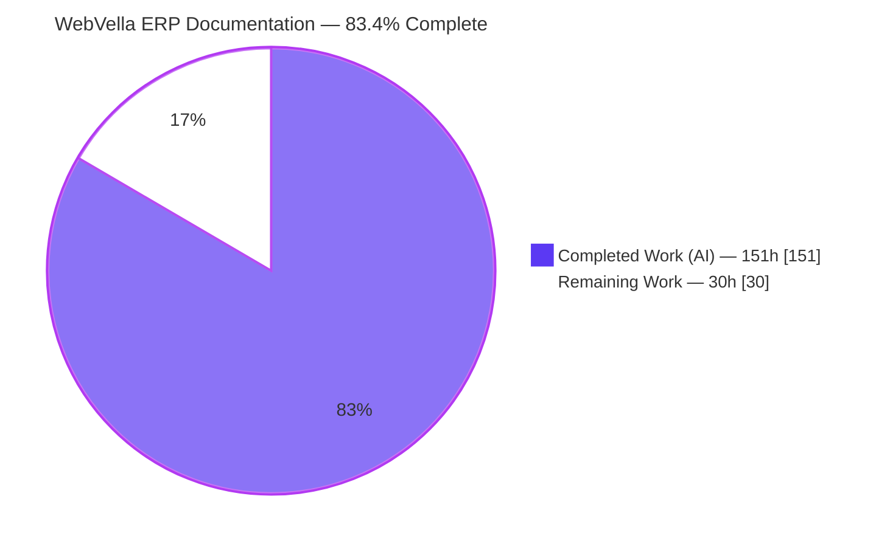
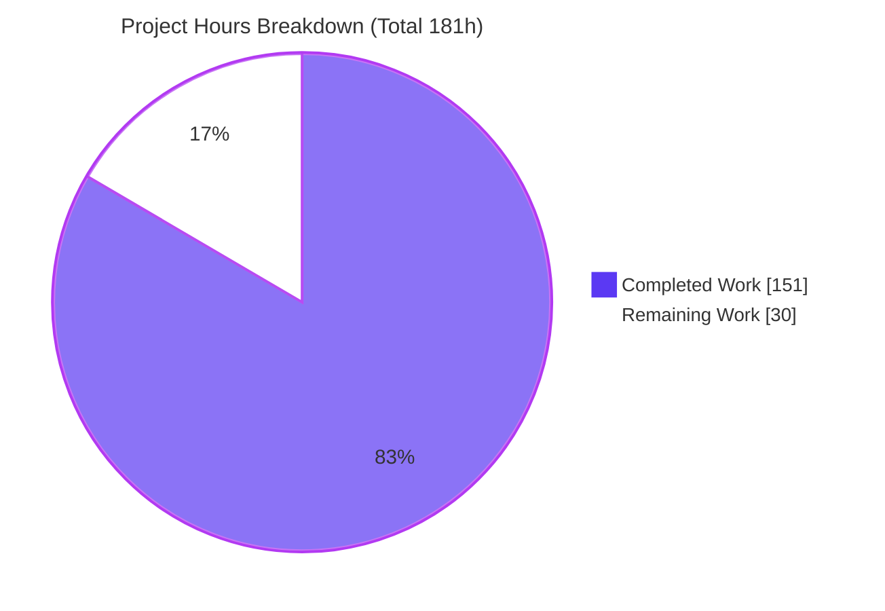
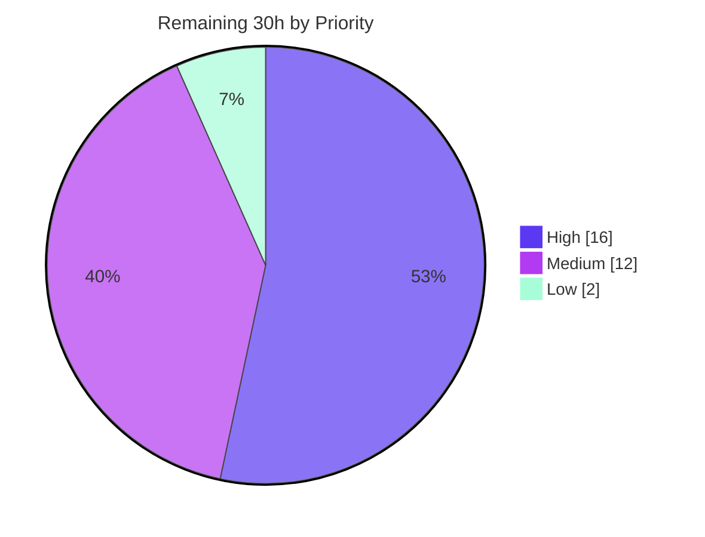

# Blitzy Project Guide — WebVella ERP Headless Refactor: Documentation Workstream

> **Scope note.** This project guide covers the **documentation-only workstream** defined by the Agent Action Plan (AAP §0.9). Application source code (`WebVella.Erp.Api`, `WebVella.Erp.Client`, `WebVella.Erp.Worker`, the `IErpPlugin` runtime, and the `ICodeVariable`/`BaseErpPageModel` adapter itself) is **explicitly out of scope** and is delivered by sibling workstreams. All completion figures below measure autonomous documentation work delivered against the AAP plus standard path-to-production activities for that documentation.

---

## 1. Executive Summary

### 1.1 Project Overview

This workstream produces and refreshes the complete documentation set required by WebVella ERP's move to a headless, container-native platform. It delivers an auto-generatable REST/OpenAPI 3.1 reference for the new `/api/v1/` surface, an `IErpPlugin` SDK developer guide, headless architecture documentation (including the mandatory `ICodeVariable`/`BaseErpPageModel` compatibility-shim document), migration/cutover guides, container deployment and operations guides, a consolidated configuration reference, and a Rule-E README for every in-scope module — while remediating the substantial drift in the existing Backstage TechDocs/MkDocs site. Target audiences are developers, plugin integrators, and operators. The result is a strict-mode-clean documentation site that is accurate to the target architecture.

### 1.2 Completion Status

The project is **83.4% complete** on an AAP-scoped, hours-based basis (PA1 methodology). All autonomous documentation work is physically present and passes every reproducible gate; the remaining 30 hours are path-to-production activities that require human decisions or out-of-scope code artifacts.


```mermaid
%%{init: {"theme":"base", "themeVariables": {"pie1":"#5B39F3","pie2":"#FFFFFF","pieStrokeColor":"#B23AF2","pieStrokeWidth":"2px","pieOuterStrokeColor":"#B23AF2","pieOuterStrokeWidth":"2px","pieTitleTextSize":"16px","pieSectionTextSize":"15px","pieLegendTextSize":"14px"}}}%%
pie showData title WebVella ERP Documentation — 83.4% Complete
    "Completed Work (AI) — 151h" : 151
    "Remaining Work — 30h" : 30
```

| Metric | Hours |
|--------|------:|
| **Total Hours** (AAP-scoped + path-to-production) | **181** |
| **Completed Hours (AI + Manual)** — AI: 151, Manual: 0 | **151** |
| **Remaining Hours** | **30** |
| **Percent Complete** | **83.4%** |

> Calculation: `151 / (151 + 30) × 100 = 83.4%`. Colors: Completed = Dark Blue `#5B39F3`, Remaining = White `#FFFFFF`.

### 1.3 Key Accomplishments

- [x] **REST/OpenAPI reference created** — `docs/api-reference/**` (8 pages, ~2,120 lines) covering base URL/versioning, OpenAPI 3.1 exposure, authentication, records, entities, EQL, files, and error model.
- [x] **Plugin SDK guide created** — `docs/plugin-sdk/**` (5 pages) documenting the `IErpPlugin` lifecycle (`OnLoadAsync`, `MapEndpoints`, `OnMigrateAsync`), `.wvplugin` packaging, and `AssemblyLoadContext` hosting.
- [x] **MANDATORY compatibility-shim doc delivered** — `docs/architecture/icodevariable-adapter.md` documents the `ICodeVariable`/`BaseErpPageModel` shim with a before/after Mermaid diagram and explicit rationale (user directive, Blocker-priority).
- [x] **Full architecture, migration, and deployment guides created** — headless overview, plugin host, data-access, observability, security; RazorPages→React and Blazor-retirement cutover guides; Docker Compose, Kubernetes/Helm, CI/CD, and configuration reference.
- [x] **Rule-E READMEs for 10 in-scope modules** — four-part structure (what / build-run-test / configs+defaults / failure modes) with `Source:` citations.
- [x] **Documentation gaps closed** — populated the empty `LIBRARIES.md` (0 → 290 lines); created the missing `INSTRUCTIONS.md`.
- [x] **Drift remediated across 115 developer pages** — `/api/v3/`→`/api/v1/`, cookie→OIDC/JWT, `ErpPlugin`→`IErpPlugin`; 74/74 tag-helper deprecation banners; getting-started modernized to Docker Compose.
- [x] **Documentation CI established** — `.github/workflows/docs.yml` with a strict build plus 5 content gates (Mermaid render, links/anchors, frontmatter/folder.json, no-secrets, markdown-lint), SHA-pinned actions, hash-pinned dependencies.
- [x] **Validated green** — `mkdocs build --strict` EXIT 0 (160 pages); all blocking gates pass; Chrome subagent browser validation PASS across 9 pages with zero console errors.

### 1.4 Critical Unresolved Issues

| Issue | Impact | Owner | ETA |
|-------|--------|-------|-----|
| 3 AAP decision points unresolved (auth provider Duende vs Keycloak; worker scheduler Quartz.NET vs Hangfire; target framework .NET 9 vs `net10.0`) | Provider-/scheduler-/version-specific sections remain intentionally marked "Not available" (266 flags); final accuracy pending decisions | Solution Architect | On decision + 8h doc-fill |
| Auto-generated `openapi/v1.json` not yet available | Hand-authored API reference cannot be reconciled to the generated schema, and the Spectral CI gate stays in graceful-skip, until the out-of-scope `WebVella.Erp.Api` code workstream emits the document | API code workstream + Docs | On spec emit + 8h |
| Documentation not yet published to live Backstage TechDocs | CI is build/validate-only (AAP §0.9.1); the site has never run through CI on `master` nor rendered in the live catalog | DevOps/Docs | 4h after branch merge |

> There are **no open Blocker or High code-quality defects** — the documentation build is fully green. The items above are decision- and dependency-driven, not implementation failures.

### 1.5 Access Issues

| System/Resource | Type of Access | Issue Description | Resolution Status | Owner |
|-----------------|----------------|-------------------|-------------------|-------|
| Git repository / branch `blitzy-443fc3be-…` | Read/Write | None — 26 commits authored successfully as `Blitzy Agent`; branch up to date with origin | ✅ No issue | — |
| Documentation toolchain (mkdocs, mmdc, markdownlint) | Local execution | None — all tools present and functional; strict build and all gates reproduced locally | ✅ No issue | — |
| `openapi/v1.json` (from `WebVella.Erp.Api`) | Build artifact dependency | Not an access restriction — the artifact does not yet exist because the producing code workstream is out of scope | ⚠ Pending upstream artifact | API code workstream |
| Live Backstage TechDocs publishing target | Deploy credentials | Not yet exercised — no publish/deploy job in scope; first publish requires environment access to be confirmed | ⚠ To confirm at publish | DevOps |

> No repository-permission, service-credential, or third-party-API access issues prevented the autonomous documentation work. The two ⚠ rows are upstream/deploy dependencies, not access denials.

### 1.6 Recommended Next Steps

1. **[High]** Resolve the three AAP decision points (auth provider, worker scheduler, target framework) and fill the decision-dependent content currently marked "Not available" — `architecture/security.md`, `api-reference/authentication.md`, the Worker README, `developer/background-jobs`, and version references. *(HT-1, 8h)*
2. **[High]** Once `WebVella.Erp.Api` emits `openapi/v1.json`, integrate it into `api-reference/openapi.md`, reconcile the hand-authored resource pages against the generated schema, and activate the Spectral OpenAPI lint gate. *(HT-2, 8h)*
3. **[Medium]** Merge the documentation branch to `master` so the Documentation CI runs in CI, then perform the first Backstage TechDocs publish and verify the live catalog renders. *(HT-3, 4h)*
4. **[Medium]** Obtain SME/stakeholder technical accuracy sign-off on the target-state content (api-reference, plugin-sdk, architecture incl. the adapter shim, migration, deployment). *(HT-4, 8h)*
5. **[Low]** Add a link-check allowlist for the known false positives (anchor-slugifier differences and deploy-time routes) and complete a final Markdown polish pass. *(HT-5, 2h)*

---

## 2. Project Hours Breakdown

### 2.1 Completed Work Detail

Every completed component traces to a specific AAP deliverable (D1–D11) or to autonomous QA remediation.

| Component | Hours | Description |
|-----------|------:|-------------|
| **D1 — REST/OpenAPI reference** (`docs/api-reference/**`) | 18 | 8 pages / ~2,120 lines: overview, `openapi.md`, `authentication.md`, `records`, `entities`, `eql`, `files`, `errors` + `folder.json`; HTTP request-pipeline Mermaid. Hand-authored content complete. |
| **D2 — Plugin SDK guide** (`docs/plugin-sdk/**`) | 14 | 5 pages / ~1,178 lines: `IErpPlugin` contract, migrating-from-`ErpPlugin`, `.wvplugin` packaging, `AssemblyLoadContext` hosting, `OnMigrateAsync` migrations + load-sequence Mermaid. |
| **D3 — Architecture docs** (`docs/architecture/**`, incl. MANDATORY adapter doc) | 16 | 6 pages / ~618 lines: overview, plugin-host, **icodevariable-adapter (Blocker, before/after diagram)**, data-access, observability, security. |
| **D4 — Migration guides** (`docs/migration/**`) | 12 | 6 pages / ~475 lines: overview, razorpages-to-react, blazor-retirement, plugin-migration, database-migration-job, rollback-plan + before/after topology diagram. |
| **D5 — Deployment/ops** (`docs/deployment/**`) | 13 | 5 pages / ~633 lines: docker-compose, kubernetes-helm, ci-cd, configuration-reference (env vars/K8s Secrets, **no secret values** — Rule D), troubleshooting. |
| **D6 — Contributing** (`docs/contributing/**`) | 3 | 2 pages / ~195 lines: build-and-test, TechDocs authoring (frontmatter, folder.json, Mermaid). |
| **D7 — Per-module READMEs** (Rule E) | 16 | 10 module READMEs (~1,182 lines): Api, Client, Worker, Plugins.Crm/Next/Project/MicrosoftCDM (created); core WebVella.Erp, Plugins.SDK, Plugins.Mail (expanded from stubs). Four-part Rule-E structure. |
| **D8 — Gap fixes** | 7 | `LIBRARIES.md` populated (0 → 290 lines) + `INSTRUCTIONS.md` created (202 lines). |
| **D9 — Drift remediation** | 20 | 115 `docs/developer/**` pages updated (v3→v1, cookie→OIDC/JWT, `ErpPlugin`→`IErpPlugin`); 74/74 tag-helper deprecation banners; getting-started modernized; root `README.md` + `docs/index.md` rewritten. |
| **D10 — Documentation config** | 6 | `mkdocs.yml` nav (278 lines), `catalog-info.yaml`, 20 `folder.json` manifests, `mkdocs_hooks.py` (doc-images publish hook). |
| **D11 — Documentation CI + lint configs** | 12 | `.github/workflows/docs.yml` (382 lines, 5 gates, SHA-pinned actions, hash-pinned deps) + `.markdownlint.json`, `.markdownlintignore`, `.spectral.yaml`, `requirements-docs.in/.txt`. |
| **QA — Iterative review remediation** | 14 | 26 commits resolving 33+22+19+ review findings; brace-expansion HIGH CVE fix; browser validation across 9 pages; 2,500 screenshots + 61 recordings. |
| **Total Completed** | **151** | |

### 2.2 Remaining Work Detail

Every remaining category traces to a specific AAP decision point or a path-to-production dependency, and maps 1:1 to a human task (HT-1…HT-5) in Section 8.

| Category | Hours | Priority |
|----------|------:|----------|
| **R1 — Resolve 3 AAP decision points + fill decision-dependent content** (auth provider, scheduler, target framework; update the 266 "Not available" flags) | 8 | High |
| **R2 — Integrate auto-generated `openapi/v1.json` + enable Spectral gate** (reconcile hand-authored API pages to generated schema; flip openapi-lint from graceful-skip to active) | 8 | High |
| **R3 — First TechDocs/Backstage publish + live-site deploy verification** (merge to `master`, confirm CI gates run in CI, verify catalog render) | 4 | Medium |
| **R4 — SME/stakeholder technical accuracy review & sign-off** (target-state content vs delivered code) | 8 | Medium |
| **R5 — Link-check false-positive allowlist tuning + final Markdown polish** | 2 | Low |
| **Total Remaining** | **30** | |

Remaining by priority: **High 16h · Medium 12h · Low 2h**.

### 2.3 Totals and Reconciliation

| Roll-up | Hours |
|---------|------:|
| Section 2.1 Completed total | 151 |
| Section 2.2 Remaining total | 30 |
| **Total Project Hours** (2.1 + 2.2) | **181** |
| **Percent Complete** (151 ÷ 181) | **83.4%** |

> Confidence: **High** for the completed documentation (physically present, strict build green, gates pass). **Medium** for R1/R4 (depend on human decisions and SME availability) and R2 (depends on an out-of-scope artifact). Estimates for decision-dependent items are held conservatively.

---

## 3. Test Results

For a documentation workstream, "tests" are the **autonomous CI documentation content gates** plus the strict build and browser validation. Every row below originates from Blitzy's autonomous validation logs for this project (INTEGRITY RULE — Section 3).

| Test Category | Framework | Total Tests | Passed | Failed | Coverage % | Notes |
|---------------|-----------|------------:|-------:|-------:|-----------:|-------|
| Strict build ("compile") | MkDocs 1.6.1 `build --strict` | 1 | 1 | 0 | 100% (160 pages) | EXIT 0 in ~5.7s; 25 doc-images published; `--strict` promotes any warning to a failing error → zero warnings. |
| Mermaid diagram render (Gate 2) | `@mermaid-js/mermaid-cli` (mmdc 11.16.0) | 23 | 23 | 0 | 100% | Every ` ```mermaid ` block rendered to SVG (threshold ≥ 18). |
| Internal links & anchors (Gate 3, blocking) | Custom validator vs built `site/` | 679 | 679 | 0 | 100% | 610 file-links (threshold ≥ 500) + 69 anchors; 0 broken. |
| Frontmatter & folder.json (Gate 4) | Custom convention validator | 179 | 179 | 0 | 100% | 159 `.md` frontmatter + 20 `folder.json` (threshold ≥ 15); 0 malformed. |
| No-secrets scan (Gate 5, Rule D) | Custom secret-shape scanner | 184 | 184 | 0 | 100% | 184 files scanned (threshold ≥ 140); 0 hits. |
| Markdown lint (blocking) | markdownlint-cli 0.49.1 | 46 | 46 | 0 | 100% | In-scope authored `.md` honoring `.markdownlint.json`/ignore; 0 violations; verified non-vacuous & live. |
| Runtime UI validation | Chrome subagent (headless Chrome) | 9 | 9 | 0 | 100% | 9 pages HTTP 200; 0 console errors/warnings; all Mermaid rendered as `<svg>`; header search functional. |
| OpenAPI lint | Spectral (`@stoplight/spectral-cli`) | 0 | 0 | 0 | N/A | **Graceful skip** — `openapi/v1.json` produced by out-of-scope code workstream is absent by design (Rule F); ruleset valid and ready. |
| Link-check (non-blocking) | markdown-link-check 3.14.2 | — | — | — | N/A | Findings proven false positives (GitHub-vs-MkDocs anchor slugifier; deploy-time routes); job is `continue-on-error`. |
| **Totals (blocking + runtime)** | | **961** | **961** | **0** | **100%** | All blocking gates green; runtime browser-validated. |

---

## 4. Runtime Validation & UI Verification

Runtime for this workstream = the rendered MkDocs/Backstage-TechDocs site (built from `site/`, served locally for verification; `mkdocs serve` is never used in automation).

**Site health**
- ✅ **Operational** — Strict build produces 160 HTML pages; served via `python3 -m http.server`; all key pages return HTTP 200 with all network requests 200/304.
- ✅ **Operational** — Zero console errors or warnings on every validated page.
- ✅ **Operational** — Left navigation lists all 7 top-level sections (api-reference, plugin-sdk, architecture, migration, deployment, contributing, developer).
- ✅ **Operational** — Header search functional (query "plugin" → 52 matching documents, 10 results).

**Diagram & content verification**
- ✅ **Operational** — All required Mermaid diagrams render as real `<svg>` (`data-processed=true`), including the mandatory before/after diagram in `icodevariable-adapter.md`; zero raw Mermaid source visible.
- ✅ **Operational** — Both anchors previously flagged by the non-blocking link-checker resolve to visible headings in-browser (`#claim-role-permission-mapping`, `#oidc-identity-provider-proposed`), confirming those findings were false positives.
- ✅ **Operational** — 12 verification screenshots saved under `blitzy/screenshots/` this session (2,500 cumulative screenshots + 61 recordings across sessions).

**API integration outcomes**
- ⚠ **Partial (by design)** — The interactive OpenAPI reference (Scalar) and the generated `openapi/v1.json` belong to the out-of-scope `WebVella.Erp.Api` runtime; documentation describes how they are exposed but cannot render a live spec until that code exists.
- ⚠ **Partial (by design)** — `catalog-info.yaml`'s optional `kind: API` entity references an OpenAPI document that resolves only after the spec is emitted.

---

## 5. Compliance & Quality Review

AAP deliverables and binding rules cross-mapped to Blitzy quality/compliance benchmarks. "Fixes applied" reflect autonomous validation remediation.

| Benchmark / AAP Rule | Requirement | Status | Evidence / Fixes Applied |
|----------------------|-------------|:------:|--------------------------|
| **User directive (verbatim)** | Document the `ICodeVariable`/`BaseErpPageModel` adapter shim | ✅ Pass | `docs/architecture/icodevariable-adapter.md` (135 lines) with rationale, before/after Mermaid, and `Source:` citations to `ICodeVariable.cs` / `BaseErpPageModel.cs`. |
| **Rule B — Public APIs** | Purpose, I/O, side effects, error modes for public REST endpoints and plugin lifecycle | ✅ Pass | Per-resource api-reference pages + `plugin-sdk/ierplugin-contract.md` cover all three lifecycle methods. |
| **Rule C — Conventions** | HTML-comment frontmatter, `folder.json`, `mermaid2` | ✅ Pass | Gate 4: 159 frontmatter + 20 `folder.json`, 0 malformed; strict build wires all 23 diagrams. |
| **Rule D — No secrets** | Config docs reference env vars / K8s Secrets only | ✅ Pass | Gate 5: 184 files, 0 secret hits; `configuration-reference.md` uses `Settings__` keys with no values. |
| **Rule E — Per-module README** | Four-part README for every in-scope module | ✅ Pass | 10/10 in-scope modules at the four-part bar (stubs for SDK & Mail expanded). |
| **Rule F — Evidence + severity + "Not available"** | Cite sources; classify severity; flag unknowns | ✅ Pass | 301 `Source:` citations; severity classification in AAP §0.3.2; 266 "Not available/to be confirmed" flags for the 3 decision points. |
| **Minimal-change clause** | Surgical drift fixes; don't fight existing style | ✅ Pass | 123 files modified in place; legacy UI docs get deprecation banners, not deletion (0 deletes). |
| **Mermaid-by-default** | ≥ 1 diagram per architecture & migration doc | ✅ Pass | 23 Mermaid-bearing files; browser-verified as SVG. |
| **Supply-chain hardening** | Pinned dependencies & actions | ✅ Pass | `requirements-docs.txt` hash-pinned; GitHub Actions SHA-pinned; brace-expansion HIGH CVE remediated (`2462ce39b`). |
| **OpenAPI reference completeness** | Reconcile to generated `openapi/v1.json` | ⚠ In progress | Hand-authored complete; auto-generated integration pending out-of-scope artifact (R2). |
| **Decision-point content** | Provider/scheduler/framework specifics | ⚠ In progress | Authored provider-neutral; final content pending human decisions (R1). |
| **Live publish** | Site rendered in Backstage catalog | ⚠ Pending | Build/validate-only in scope; first publish is a human step (R3). |

---

## 6. Risk Assessment

12-item register across the four PA3 categories. No open Blocker or High-severity risks remain (the one High-severity security item is fully resolved).

| Risk | Category | Severity | Probability | Mitigation | Status |
|------|----------|:--------:|:-----------:|------------|--------|
| **T1** — Target-state docs describe not-yet-built code (Api/Client/Worker have no `.csproj`); risk of doc↔code divergence when code lands | Technical | Medium | Medium | Rule-F "planned/Not available" labeling + 301 `Source:` citations; R4 SME review reconciles at code-land | Mitigated / Open |
| **T2** — Hand-authored api-reference may drift from the eventual generated `openapi/v1.json` | Technical | Medium | Medium | `openapi.md` documents the generation flow; R2 reconciles when the spec lands; Spectral gate ready | Open (dependency) |
| **T3** — Site rendering depends on `techdocs-core` + `mermaid2` version compatibility | Technical | Low | Low | `requirements-docs.txt` hash-pinned; strict build green; 23 diagrams browser-verified as SVG | Mitigated |
| **S1** — `pymdown-extensions==10.21.3` Medium CVE (GHSA-9xwg-3r6f-jcx2 / CVE-2026-61632, CVSS 5.3), transitively hard-pinned by `techdocs-core==1.7.0` | Security | Medium | Low | Vulnerable sink (`pymdownx.b64`) not enabled — only `superfences` used → unreachable; documented in `LIBRARIES.md` with do-not-bump note | Mitigated / Accepted residual |
| **S2** — `brace-expansion` HIGH CVE in the npm tool chain | Security | High | — | Remediated in commit `2462ce39b` | ✅ Resolved |
| **S3** — Future contributor leaks a secret into docs (Rule D) | Security | Low | Low | CI Gate 5 no-secrets scan (0 hits / 184 files) blocks the build | Mitigated |
| **O1** — No docs publish/deploy job — CI is build/validate-only (AAP §0.9.1); site not yet on live Backstage TechDocs | Operational | Medium | High | R3 first publish + deploy verification (human) | Open (path-to-production) |
| **O2** — CI triggers only on `master` push/PR; work is on a feature branch → gates not yet exercised in CI | Operational | Low | Medium | All gates reproduced green locally; run automatically on merge/PR | Mitigated |
| **O3** — Non-blocking link-check could mask a future real broken link | Operational | Low | Low | Blocking internal-link Gate 3 covers real links; R5 tunes the allowlist | Mitigated |
| **I1** — 3 unresolved decision points (auth provider; scheduler; framework) | Integration | Medium | High | Provider-neutral authoring + 266 "Not available" flags; R1 fills once decided | Open (awaiting decision) |
| **I2** — OpenAPI integration depends on out-of-scope `WebVella.Erp.Api` emitting `openapi/v1.json` | Integration | Medium | Medium | Spectral gate graceful-skips until present; R2 completes integration | Open (dependency) |
| **I3** — `catalog-info.yaml` `kind: API` entity references a spec that 404s until it exists | Integration | Low | Medium | Documented as optional; resolves with I2/R2 | Open (low) |

---

## 7. Visual Project Status

**Overall hours** (Completed = Dark Blue `#5B39F3`, Remaining = White `#FFFFFF`):


```mermaid
%%{init: {"theme":"base", "themeVariables": {"pie1":"#5B39F3","pie2":"#FFFFFF","pieStrokeColor":"#B23AF2","pieStrokeWidth":"2px","pieOuterStrokeColor":"#B23AF2","pieOuterStrokeWidth":"2px","pieTitleTextSize":"16px","pieSectionTextSize":"15px","pieLegendTextSize":"14px"}}}%%
pie showData title Project Hours Breakdown (Total 181h)
    "Completed Work" : 151
    "Remaining Work" : 30
```

**Remaining work by priority** (High 16h · Medium 12h · Low 2h = 30h):


```mermaid
%%{init: {"theme":"base", "themeVariables": {"pie1":"#5B39F3","pie2":"#B23AF2","pie3":"#A8FDD9","pieStrokeColor":"#333333","pieStrokeWidth":"1px","pieTitleTextSize":"16px","pieSectionTextSize":"15px","pieLegendTextSize":"14px"}}}%%
pie showData title Remaining 30h by Priority
    "High" : 16
    "Medium" : 12
    "Low" : 2
```

**Remaining hours per category (Section 2.2):**

| Category | Hours | Bar |
|----------|------:|-----|
| R1 — Decision points + content fill (High) | 8 | ████████ |
| R2 — OpenAPI integration + Spectral (High) | 8 | ████████ |
| R3 — Publish + deploy verification (Medium) | 4 | ████ |
| R4 — SME accuracy review (Medium) | 8 | ████████ |
| R5 — Link-check tuning + polish (Low) | 2 | ██ |
| **Total** | **30** | |

> INTEGRITY: "Remaining Work" = **30h** in the pie chart matches Section 1.2 (Remaining = 30) and the Section 2.2 Hours sum (30). "Completed Work" = **151h** matches Section 1.2 and the Section 2.1 sum.

---

## 8. Summary & Recommendations

**Achievements.** The documentation workstream is **83.4% complete** (151h of 181h). Every AAP CREATE/UPDATE/FIX deliverable in the file-by-file plan (§0.6.1) is physically present and builds cleanly: the `/api/v1/` REST reference, the `IErpPlugin` SDK guide, the full architecture set (including the **mandatory** `ICodeVariable`/`BaseErpPageModel` adapter document), migration/deployment guides, 10 Rule-E module READMEs, the populated `LIBRARIES.md` and new `INSTRUCTIONS.md`, drift remediation across 115 developer pages, and a hardened Documentation CI. `mkdocs build --strict` exits 0 with zero warnings, all blocking content gates pass, and the site is browser-validated across 9 pages with zero console errors.

**Remaining gaps (30h).** The outstanding work is not implementation failure — the build is green — but path-to-production activity: (1) three human decision points (auth provider, worker scheduler, target framework) and the content that depends on them; (2) integrating the auto-generated `openapi/v1.json` and activating the Spectral gate once the out-of-scope code workstream emits it; (3) the first Backstage TechDocs publish + deploy verification; (4) SME/stakeholder accuracy sign-off; and (5) minor link-check tuning.

**Critical path to production.** Decisions first (**HT-1**, unblocks the 266 "Not available" flags), then OpenAPI reconciliation when the spec lands (**HT-2**), then first publish (**HT-3**), with SME review (**HT-4**) proceeding in parallel and final polish (**HT-5**) last.

**Success metrics.** Strict build EXIT 0; 5/5 blocking gates green; 961/961 blocking + runtime checks passed; 301 source citations; 266 decision-point flags; 0 secret hits; 0 broken internal links.

**Production-readiness assessment.** The documentation is **release-candidate quality for the target architecture as currently known**, gated on the three human decisions and the upstream OpenAPI artifact. Per honest-assessment principles, completion is reported at **83.4%** and not as 100% — human decisions, an out-of-scope dependency, and a live publish remain.

| Human Task | Maps to | Priority | Hours |
|-----------|---------|----------|------:|
| HT-1 Resolve 3 decision points + fill decision-dependent content | R1 | High | 8 |
| HT-2 Integrate `openapi/v1.json` + enable Spectral gate | R2 | High | 8 |
| HT-3 First TechDocs/Backstage publish + deploy verification | R3 | Medium | 4 |
| HT-4 SME/stakeholder technical accuracy review & sign-off | R4 | Medium | 8 |
| HT-5 Link-check allowlist tuning + final polish | R5 | Low | 2 |
| **Total** | | | **30** |

---

## 9. Development Guide

How to build, validate, preview, and troubleshoot the documentation site. All commands were reproduced this session.

### 9.1 System Prerequisites

- **OS:** Linux (validated on Ubuntu 25.10 container); macOS/WSL2 also supported.
- **Python:** 3.13.x (validated **3.13.7**), with `pip` 25.x.
- **Node.js:** 20 LTS or newer (validated **v22.23.1**) with npm 11.x — for `mmdc`, `markdownlint-cli`, and `markdown-link-check` via `npx`.
- **Headless Chromium** — bundled with `@mermaid-js/mermaid-cli` for diagram rendering (container flags required, see Troubleshooting).

### 9.2 Environment Setup

> Ubuntu 25.x system Python is PEP-668 "externally managed." Use a virtual environment (preferred) or `--break-system-packages`.

```bash
# From the repository root
cd /path/to/blitzy-WebVella-ERP

# Option A (preferred): virtual environment
python3 -m venv .venv
source .venv/bin/activate

# Option B: system install
#   python3 -m pip install --break-system-packages -r requirements-docs.txt
```

### 9.3 Dependency Installation

```bash
# Python docs toolchain — hash-pinned for supply-chain integrity
python3 -m pip install -r requirements-docs.txt

# Verify key tool versions
mkdocs --version          # -> mkdocs, version 1.6.1
python3 -m pip show mkdocs-techdocs-core | grep Version   # -> 1.7.0
```

Expected (pinned) versions: `mkdocs==1.6.1`, `mkdocs-techdocs-core==1.7.0`, `mkdocs-mermaid2-plugin==1.2.3`, `mkdocs-material==9.7.6`, `pymdown-extensions==10.21.3`.

Node CLIs are fetched on demand via `npx` (no global install needed): `markdownlint-cli@0.49.1`, `markdown-link-check@3.14.2`, `@mermaid-js/mermaid-cli` (`mmdc` 11.16.0).

### 9.4 Build ("compile") the Documentation

```bash
# Strict build — the documentation "compile". --strict promotes any
# warning to a build-failing error, so EXIT 0 proves zero warnings.
mkdocs build --strict --site-dir site
```

**Expected output (verified this session):**
```
INFO    -  MERMAID2  - Page '...': found N diagrams, adding scripts
INFO    -  doc-images: copied 25 asset(s) into .../site/doc-images
INFO    -  Documentation built in ~5.7 seconds
# EXIT 0 · 160 HTML pages · 25 doc-images · 23 Mermaid diagrams wired
```
> The red "Warning from the Material for MkDocs team" line is a **vendor stderr promo banner**, not an MkDocs log warning — the build still exits 0. There are zero `WARNING -` log lines.

### 9.5 Verification Steps (reproduce the CI content gates)

```bash
# Gate 2 — Mermaid diagrams render (headless Chromium)
mmdc --version   # -> 11.16.0
# Render a block:  mmdc -i diagram.mmd -o diagram.svg --no-sandbox --disable-dev-shm-usage

# Blocking Markdown lint (honors .markdownlint.json / .markdownlintignore)
CI=true npx --yes markdownlint-cli@0.49.1 "**/*.md"     # -> exit 0, zero violations

# OpenAPI lint — skips gracefully until openapi/v1.json exists (out of scope today)
# npx --yes @stoplight/spectral-cli lint openapi/v1.json --ruleset .spectral.yaml

# Artifact sanity counts
find docs -name '*.md' | wc -l        # -> 159
find docs -name 'folder.json' | wc -l # -> 20
grep -rl '```mermaid' docs | wc -l    # -> 23
```

### 9.6 Local Preview & Example Usage

```bash
# Preview the BUILT site (human/local only — never run mkdocs serve in automation)
python3 -m http.server 8137 --directory site
# Then open http://localhost:8137/  (verify pages, nav, search, and rendered Mermaid SVGs)
```

Example checks after preview:
- Landing page and all 7 top-level sections load (HTTP 200).
- Header search for `plugin` returns matching documents.
- `architecture/icodevariable-adapter/` shows the before/after diagram as an inline `<svg>` (no raw Mermaid text).

### 9.7 Troubleshooting

- **`error: externally-managed-environment` on `pip install`** — use a venv (`python3 -m venv .venv && source .venv/bin/activate`) or pass `--break-system-packages`.
- **Mermaid render fails in a container** — pass `--no-sandbox --disable-dev-shm-usage` to `mmdc`; ensure the bundled Chromium can launch headless.
- **`mkdocs build --strict` fails** — read the first `WARNING -`/`ERROR -` log line; common causes are a broken internal link or missing `folder.json`/frontmatter (Gates 3–4).
- **Spectral/OpenAPI job "skips"** — expected: `openapi/v1.json` is produced by the out-of-scope `WebVella.Erp.Api` code workstream; the gate activates once the file exists.
- **`markdown-link-check` reports broken anchors** — these are known false positives (its GitHub-style slugifier differs from MkDocs'); the anchors resolve in the built site. The job is non-blocking by design; do **not** rename anchors (would break them in the real site — Rule C).
- **Do not commit `site/` or `blitzy/`** — regenerable build output and multi-GB QA artifacts respectively; both are intentionally untracked.

---

## 10. Appendices

### A. Command Reference

| Purpose | Command |
|---------|---------|
| Install docs toolchain | `python3 -m pip install -r requirements-docs.txt` |
| Build (compile) | `mkdocs build --strict --site-dir site` |
| Markdown lint (blocking) | `CI=true npx --yes markdownlint-cli@0.49.1 "**/*.md"` |
| Render a Mermaid diagram | `mmdc -i in.mmd -o out.svg --no-sandbox --disable-dev-shm-usage` |
| OpenAPI lint (when spec exists) | `npx --yes @stoplight/spectral-cli lint openapi/v1.json --ruleset .spectral.yaml` |
| Link check (non-blocking) | `npx --yes markdown-link-check <file>.md` |
| Local preview (human only) | `python3 -m http.server 8137 --directory site` |
| Diff vs baseline | `git diff --stat c8ea6bd46..HEAD` |

### B. Port Reference

| Port | Use | Notes |
|------|-----|-------|
| 8137 | Local static preview of built `site/` (`python3 -m http.server`) | Verification only; arbitrary/free port |
| 8000 | `mkdocs serve` default | **Human/local only — never in automation** |
| `/scalar`, `/openapi/v1.json` | Interactive API UI + generated spec | Served by the out-of-scope `WebVella.Erp.Api` (Development only); not part of this workstream |

### C. Key File Locations

| Path | Purpose |
|------|---------|
| `mkdocs.yml` | Site config + navigation (`techdocs-core` + `mermaid2`) |
| `mkdocs_hooks.py` | `on_post_build` hook that publishes `doc-images/` into the built site |
| `requirements-docs.in` / `.txt` | Docs toolchain (hash-pinned) |
| `docs/api-reference/**` | REST/OpenAPI 3.1 reference |
| `docs/plugin-sdk/**` | `IErpPlugin` SDK guide |
| `docs/architecture/icodevariable-adapter.md` | **Mandatory** compatibility-shim document |
| `docs/migration/**`, `docs/deployment/**`, `docs/contributing/**` | Cutover, ops, and contribution guides |
| `docs/developer/**` | Existing dev docs (drift-remediated) |
| `LIBRARIES.md`, `INSTRUCTIONS.md` | Populated / newly created gap fixes |
| `catalog-info.yaml` | Backstage TechDocs entity (`techdocs-ref: dir:.`) |
| `.github/workflows/docs.yml` | Documentation CI (strict build + 5 gates) |
| `.markdownlint.json`, `.markdownlintignore`, `.spectral.yaml` | Lint configs |

### D. Technology Versions

| Tool / Package | Version | Role |
|----------------|---------|------|
| Python | 3.13.7 | Docs runtime |
| MkDocs | 1.6.1 | Static site generator ("compile") |
| mkdocs-techdocs-core | 1.7.0 | Backstage TechDocs wrapper |
| mkdocs-mermaid2-plugin | 1.2.3 | Build-time Mermaid rendering |
| mkdocs-material | 9.7.6 | Theme |
| pymdown-extensions | 10.21.3 | Markdown extensions (superfences only; see risk S1) |
| Node.js / npm | 22.23.1 / 11.18.0 | CLI host |
| @mermaid-js/mermaid-cli (`mmdc`) | 11.16.0 | Mermaid → SVG render gate |
| markdownlint-cli | 0.49.1 | Blocking Markdown lint |
| markdown-link-check | 3.14.2 | Non-blocking link check |
| @stoplight/spectral-cli | 6.x | OpenAPI lint (activates with the spec) |

### E. Environment Variable Reference

> Documentation records **keys and defaults only** — never secret values (Rule D). Full detail lives in `docs/deployment/configuration-reference.md`. `.NET` config keys use the `Settings__Section__Key` environment-variable form; secrets are supplied via Kubernetes Secrets.

| Key (documented) | Purpose | Value in docs |
|------------------|---------|---------------|
| Database connection (`ConnectionStrings__*`) | PostgreSQL (Npgsql) connection | Key only — no value; via Secret |
| OIDC / JWT (`Jwt__Issuer`, `Jwt__Audience`, signing key) | Auth validation | Non-secret defaults documented; signing key via Secret |
| Worker scheduler | Quartz.NET vs Hangfire selection | **Not available / to be confirmed** (decision point) |
| Serilog / OTLP endpoint | Structured logging + trace export | Endpoint key only |
| Plugin directory | `.wvplugin` load path for `AssemblyLoadContext` | Path key only |

### F. Developer Tools Guide

- **MkDocs** — authoring/build engine; always build with `--strict` in CI. Local iteration may use `mkdocs serve` (never in automation).
- **mermaid-cli (`mmdc`)** — validates every ` ```mermaid ` block renders; needs `--no-sandbox --disable-dev-shm-usage` in containers.
- **markdownlint-cli** — blocking style gate; honors `.markdownlint.json` and `.markdownlintignore` (legacy `docs/developer/` excluded by policy).
- **Spectral** — OpenAPI linter; ruleset `.spectral.yaml` extends `spectral:oas`; runs once `openapi/v1.json` exists.
- **markdown-link-check** — non-blocking; expect anchor-slugifier false positives (resolve in the built site).

### G. Glossary

| Term | Meaning |
|------|---------|
| **Entity / Record** | Core WebVella data model — a metadata-defined type and an instance of it. |
| **EQL** | Entity Query Language — WebVella's query syntax, exposed via a `/api/v1/` query endpoint. |
| **Plugin / hook** | Extensibility units; hooks intercept lifecycle events; plugins package capabilities. |
| **`IErpPlugin`** | New plugin contract (`OnLoadAsync`, `MapEndpoints`, `OnMigrateAsync`) replacing legacy `ErpPlugin`/`Initialize(IServiceProvider)`. |
| **`ICodeVariable` / `BaseErpPageModel` adapter** | Compatibility shim that synthesizes a `BaseErpPageModel` so `ICodeVariable.Evaluate(...)` runs outside the RazorPages lifecycle — the mandatory documented surface. |
| **`.wvplugin`** | Plugin package format loaded via a collectible `AssemblyLoadContext`. |
| **TechDocs** | Backstage's docs-as-code system wrapping MkDocs; site registered via `catalog-info.yaml`. |
| **OpenAPI 3.1** | REST contract format for `/api/v1/`, generated by `Microsoft.AspNetCore.OpenApi` and browsed via Scalar (out-of-scope runtime). |
| **Content gate** | A CI check treating documentation quality (diagrams, links, frontmatter, secrets, lint) as a pass/fail "test." |
| **Decision point** | An unresolved choice (auth provider, scheduler, target framework) surfaced as "Not available/to be confirmed" rather than guessed (Rule F). |
