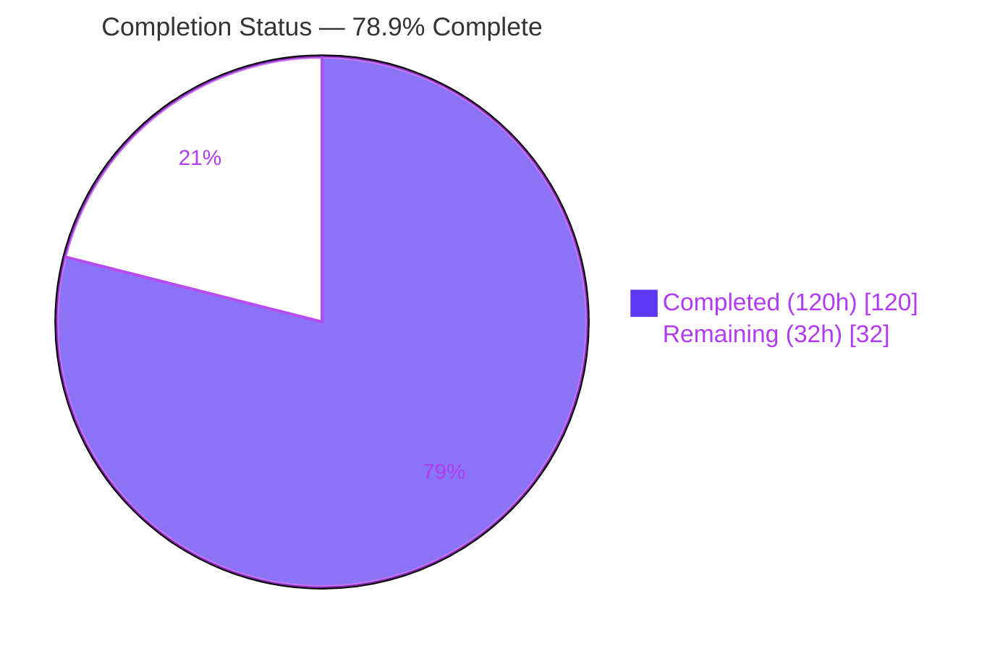
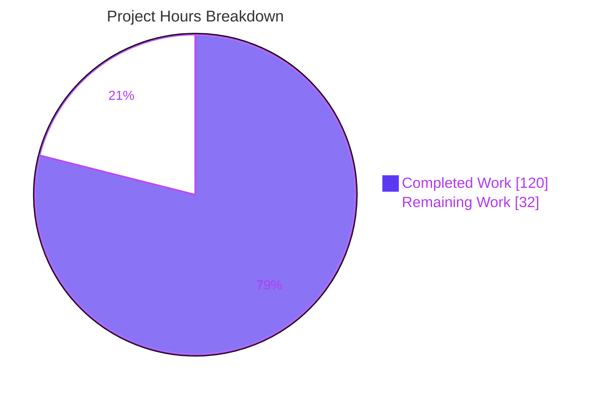
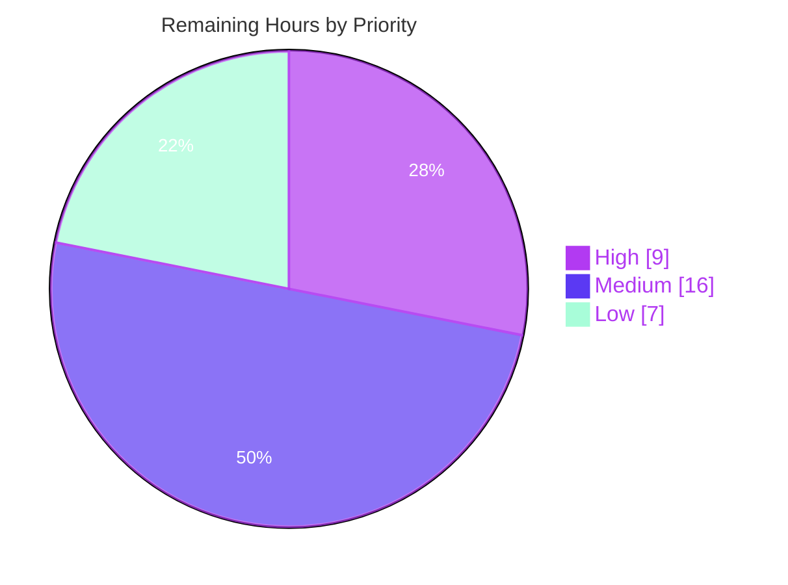

# Blitzy Project Guide — WebVella ERP OWASP Top 10 (2021) Security Remediation

> **Brand color key:** Completed / AI Work = **Dark Blue `#5B39F3`** · Remaining / Not Completed = **White `#FFFFFF`** · Headings / Accents = **Violet-Black `#B23AF2`** · Highlight = **Mint `#A8FDD9`**

---

## 1. Executive Summary

### 1.1 Project Overview

This project delivered a comprehensive OWASP Top 10 (2021) security audit and in-code remediation of **WebVella ERP** — an open-source (Apache-2.0, .NET Foundation) ERP platform built on ASP.NET Core, Blazor WebAssembly, and PostgreSQL. Target users are self-hosting enterprises and integrators running the seven site hosts. The work eliminated cryptographic, misconfiguration, authentication, deserialization, and component-currency vulnerabilities across the core runtime library, the web layer, all seven hosts, and the WebAssembly projects, while a binding Minimal Change Clause preserved every API contract, database schema, and user workflow. The business impact is a materially reduced attack surface (unsalted MD5 removed, secrets de-committed, headers hardened) delivered without functional regression, plus an evidence-backed `SECURITY.md` audit report for governance and future maintenance.

### 1.2 Completion Status

The project is **78.9% complete** on an AAP-scoped, path-to-production basis. All autonomous engineering deliverables defined in the Agent Action Plan are complete and validated production-ready; the remaining hours are human-only operational/deployment work (secret provisioning, TLS, CSP promotion, CI integration).


```mermaid
%%{init: {'theme':'base', 'themeVariables': {'pie1':'#5B39F3','pie2':'#FFFFFF','pieStrokeColor':'#B23AF2','pieStrokeWidth':'2px','pieOuterStrokeWidth':'2px','pieTitleTextSize':'18px','pieSectionTextSize':'15px','pieSectionTextColor':'#B23AF2','pieLegendTextColor':'#B23AF2'}}}%%
pie showData title Completion Status — 78.9% Complete
    "Completed (120h)" : 120
    "Remaining (32h)" : 32
```

| Metric | Hours |
|---|---|
| **Total Project Hours** | **152** |
| Completed Hours (AI: 120 + Manual: 0) | 120 |
| Remaining Hours | 32 |
| **Percent Complete** | **78.9%** |

> All completed hours were delivered autonomously by Blitzy agents (AI = 120h; Manual = 0h). Remaining 32h is human path-to-production work.

### 1.3 Key Accomplishments

- ✅ **A02** — Unsalted MD5 replaced with PBKDF2-HMAC-SHA256 (600,000 iterations, 128-bit CSPRNG salt, 256-bit subkey) + constant-time `FixedTimeEquals`; backward-compatible tri-state verify rehashes legacy credentials transparently on next login.
- ✅ **A02/A05** — Hardcoded encryption key and default JWT signing key removed; configuration now fail-fasts when secrets are absent.
- ✅ **A05** — New `SecurityHeadersMiddleware` emits all seven mandated headers; CSP shipped report-only for regression-safe rollout; CORS origin allowlist, `Secure`/`SameSite` cookies, and prod-gated HTTPS/HSTS wired across all seven hosts; secrets stripped from eight `Config.json` files.
- ✅ **A06** — WebAssembly Server/Shared retargeted from end-of-support net7.0 → net10.0; SDK pinned in `global.json`; js-cookie upgraded 2.2.x → 3.0.7 (prototype-pollution CVE).
- ✅ **A07** — 100-year cookie lifetime reduced to operational; UtcNow token expiry; 5-attempt/15-minute login lockout; operator-supplied initial admin password with forced first-login rotation.
- ✅ **A08** — New fail-closed `ErpSerializationBinder` allowlist attached at every runtime `TypeNameHandling` deserialization locus (JobDataService, NotificationContext, DbEntityRepository, DbRelationRepository, CodeGenService).
- ✅ **A09 / DoS / A03** — Structured security-event logging added; synchronous I/O disabled; runtime code-eval feature guarded admin-only with a threat comment (documented accepted-risk).
- ✅ **Deliverable** — 824-line `SECURITY.md` audit report covering 36 findings in the mandated format, before/after remediation evidence, measured scan results, and a secure-configuration guide.
- ✅ **Validation** — Clean Release + Debug builds (0 errors), ConsoleApp smoke path (EXIT 0), and full runtime verification under Kestrel; delivered across 27 atomic per-class commits on a clean working tree.

### 1.4 Critical Unresolved Issues

There are **no unresolved in-scope defects** — the Final Validator found zero and made no in-scope code changes. The items below are documented risk-accepted residuals that **cannot be remediated within the Minimal Change Clause** (per AAP §0.3.2); they are recorded here for governance visibility rather than as blocking defects.

| Issue | Impact | Owner | ETA |
|---|---|---|---|
| C6 — `libwkhtmltox.dll` native SSRF advisory | Out-of-application-boundary native lib; upstream archived/won't-fix; no reachable managed sink | Platform/Infra team | Roadmap (component replacement eval) |
| H11 — AutoMapper 14.0.0 advisory (GHSA-rvv3-g6hj-g44x) | Upstream fix ships only under a license incompatible with Apache-2.0; build-audit-suppressed | Dependency owner | Monitor for compatible fix |
| H13 — moment/lodash inside pre-compiled Stencil bundles | No in-repo build source; not libman-managed; cannot patch without upstream rebuild | Front-end/Web-component owner | Roadmap (bundle rebuild/retire) |
| D9 (partial) — same-pattern authenticated error-detail sites | JWT anonymous endpoints masked in production; authenticated same-pattern sites documented | Web-layer owner | Medium (follow-up hardening) |

### 1.5 Access Issues

**No access issues identified.** During validation, dependencies restored successfully (EXIT 0), the solution built cleanly, the PostgreSQL 16 container was reachable on `:5432`, the repository was fully accessible on branch `blitzy-b68c24cd-6832-43ca-a284-90d181aa868e`, and all commits were authored under `agent@blitzy.com`.

| System/Resource | Type of Access | Issue Description | Resolution Status | Owner |
|---|---|---|---|---|
| Git repository | Read/Write | None — 27 commits pushed, tree clean | ✅ No issue | Blitzy agent |
| NuGet registry | Read | None — all 17 projects restored (EXIT 0) | ✅ No issue | Blitzy agent |
| PostgreSQL 16 | Network | None — `webvella-pg` container reachable on `:5432` | ✅ No issue | Blitzy agent |
| Production secrets (JWT/enc/DB/admin) | Config | Not provisioned yet — required for production start (by-design fail-fast) | ⚠ Pending (human task H-1) | Ops/Deploy team |

### 1.6 Recommended Next Steps

1. **[High]** Provision production secrets and generate strong keys (JWT signing key, AES encryption key, DB connection string, initial admin password) via environment variables/user-secrets/vault — the application fail-fasts without them by design. *(H-1, 4h)*
2. **[High]** Enable and verify HTTPS/TLS and confirm `Secure` cookies + HSTS in production. *(H-2, 3h)*
3. **[High]** Coordinate the initial JWT signing-key rotation within a maintenance window (rotation signs out all in-flight tokens). *(H-3, 2h)*
4. **[Medium]** Promote the Content-Security-Policy from report-only to enforced after reviewing violation reports and adding nonces/hashes for required inline scripts/styles. *(M-1, 6h)*
5. **[Medium]** Integrate SAST/SCA/secrets scanners into CI (the repository has none) and obtain a production security sign-off. *(M-4, 4h)*

---

## 2. Project Hours Breakdown

### 2.1 Completed Work Detail

Every completed component traces to a specific AAP requirement. **Total = 120h** (matches Completed Hours in §1.2).

| Component | Hours | Description |
|---|---|---|
| A02 Cryptographic Failures remediation | 20 | `PasswordUtil` PBKDF2 + backward-compatible verify/rehash + constant-time; `CryptoUtility` key removal; `ErpSettings` fail-fast; `SecurityManager` + `RecordManager` routed through the new hasher |
| A05 Security Misconfiguration remediation | 22 | New `SecurityHeadersMiddleware`; 7× `Startup.cs` (CORS allowlist, cookie `SecurePolicy`/`SameSite`, prod HTTPS/HSTS, wiring); 8× `Config.json` secret stripping; `web.config`; JWT stack-trace masking (D9) |
| A06 Vulnerable & Outdated Components | 8 | WASM Server/Shared net7.0 → net10.0; `global.json` SDK pin; js-cookie 3.0.7 CVE fix; `Directory.Build.props` AutoMapper advisory suppression |
| A07 Authentication & Session hardening | 14 | `AuthService` cookie lifetime + UtcNow expiry; `login.cshtml.cs` 5-attempt/15-min lockout; `ERPService` operator-supplied admin secret + forced first-login rotation |
| A08 Insecure Deserialization remediation | 12 | New `ErpSerializationBinder` fail-closed allowlist + wiring at all runtime `TypeNameHandling` loci + CodeGenService readers |
| A09 Security Logging | 5 | `Log.cs` `LogType.Security` + five structured security-event methods, wired into `SecurityManager` |
| DoS + A03 documented-risk hardening | 3 | `ErpMiddleware` async (no `AllowSynchronousIO`); `CodeEvalService` admin-only guard + threat comment |
| SECURITY.md Security Audit Report | 14 | 824-line report: 36 findings in mandated format, remediation before/after, documented Medium/Low, measured scan results, secure-config guide |
| Autonomous validation & QA | 18 | Clean Release/Debug builds, ConsoleApp smoke, SAST/SCA/secrets scans, runtime + browser CSP verification, multiple checkpoint-review rounds |
| Build & setup enablement | 4 | Case-sensitive project-ref fixes, NETSDK1022 duplicate-content fix, restore across 17 projects, `.gitignore` runtime config |
| **Total Completed** | **120** | |

### 2.2 Remaining Work Detail

Every remaining category traces to a path-to-production need or an AAP-documented follow-up. **Total = 32h** (matches Remaining Hours in §1.2 and the Section 7 pie chart).

| Category | Hours | Priority |
|---|---|---|
| Production secrets provisioning & key generation | 4 | High |
| HTTPS/TLS enablement & Secure-cookie verification | 3 | High |
| JWT signing-key rotation operational coordination | 2 | High |
| CSP report-only → enforced promotion (nonces/hashes, UI regression test) | 6 | Medium |
| Deploy config audit: sibling `web.config` + `ASPNETCORE_ENVIRONMENT` (6 hosts) + DevelopmentMode gate | 2 | Medium |
| Documented residual triage & monitoring (C6 / H11 / H13) | 4 | Medium |
| Final CI security-scan integration & production sign-off | 4 | Medium |
| MFA evaluation (documented Medium) | 1 | Low |
| Optional security-regression test suite (`WebVella.Erp.Security.Tests`) | 6 | Low |
| **Total Remaining** | **32** | |

### 2.3 Hours Reconciliation

| Check | Value | Result |
|---|---|---|
| Section 2.1 completed | 120h | — |
| Section 2.2 remaining | 32h | — |
| 2.1 + 2.2 = Total (§1.2) | 152h | ✅ |
| Remaining (§1.2) = 2.2 sum = §7 pie | 32h | ✅ |
| Completion = 120 / 152 | 78.9% | ✅ (< 100%) |

---

## 3. Test Results

> **Integrity note:** All results below originate exclusively from Blitzy's autonomous validation logs for this project. The repository contains **no test projects, no test frameworks, and no CI/CD** (AAP §0.2.3); per AAP §0.5.4 / §0.8.2 the test gate is satisfied by a clean build plus the ConsoleApp smoke path plus the security scanners. The optional `WebVella.Erp.Security.Tests` project was intentionally not created (explicitly optional per §0.3.1).

| Test Category | Framework | Total Tests | Passed | Failed | Coverage % | Notes |
|---|---|---|---|---|---|---|
| Build verification (Release) | .NET SDK 10.0.301 | 1 | 1 | 0 | n/a | 0 errors / 62 pre-existing, out-of-scope warnings |
| Build verification (Debug) | .NET SDK 10.0.301 | 1 | 1 | 0 | n/a | 0 errors / 62 warnings; zero from remediation |
| WASM standalone build (net10.0) | .NET SDK 10.0.301 | 2 | 2 | 0 | n/a | Server + Shared, 0 errors |
| Smoke — EQL + CRUD/hook | ConsoleApp harness (F-030) | 1 | 1 | 0 | n/a | `SELECT * FROM user` OK; role create/update/delete with Pre/Post hooks firing; transaction rolled back; EXIT 0 |
| SAST (insecure deserialization) | Roslyn CA2327/CA2329/CA2330 | — | Pass | 0 | n/a | 0 binder-aware findings; blanket CA2326/CA2328 flag any `TypeNameHandling≠None` by design (binder-mitigated, accepted) |
| SAST (weak crypto) | Roslyn analyzers / Security Code Scan / Semgrep | — | Pass | 0 | n/a | 0 weak-crypto findings in in-scope code |
| SCA (dependencies) | `dotnet list package --vulnerable` / Dependency-Check / Trivy / retire.js | — | Pass | 0 | n/a | 0 Critical / 0 un-accepted High; 1 risk-accepted High (AutoMapper) documented |
| Secrets scan | gitleaks / detect-secrets | — | Pass | 0 | n/a | 0 committed credentials across 7 host `Config.json` |

**Aggregate:** 6 build/smoke executions — **6 passed, 0 failed**; all security scans clean of in-scope Critical/High. No failing or blocked tests exist.

---

## 4. Runtime Validation & UI Verification

Verified live with the `WebVella.Erp.Site` host running under Kestrel (`http://localhost:5010`, Development), secrets supplied via environment variables against a fresh database.

**Application runtime**
- ✅ **Startup & seeding** — Host started successfully; both administrators auto-seeded with PBKDF2 (600,000-iteration) hashes.
- ✅ **Security headers** (`GET /login` → 200) — `X-Content-Type-Options: nosniff`, `X-Frame-Options: DENY`, `X-XSS-Protection: 0`, `Referrer-Policy: strict-origin-when-cross-origin`, `Permissions-Policy: geolocation=(), microphone=(), camera=()`, `Content-Security-Policy-Report-Only: default-src 'self'`; HSTS correctly absent in Development.
- ✅ **Cookie login** — PBKDF2 verify OK → forced first-login rotation (A07) → 302 → signed in; cookie `samesite=lax`/`httponly`; `Secure` env-gated off in dev (by design).
- ✅ **Deny-by-default** — Unauthenticated `GET /` → 302 `/login`.
- ✅ **JWT login** — `POST api/v3/en_US/auth/jwt/token` → 200; HMAC-SHA-256 JWT; `exp` = UTC now + exactly 1440 minutes (proves the UtcNow fix).

**UI verification**
- ✅ **CSP regression check (browser)** — Login UI fully styled; all CSP messages are "report-only … no further action" — regression-safe rollout confirmed (screenshot captured in QA artifacts).
- ✅ **Host shutdown** — Stopped cleanly.

**API integration**
- ✅ **EQL / RecordManager** — Smoke path exercised EQL and a create→update→delete hook flow inside a rolled-back transaction (EXIT 0).
- ⚠ **Cosmetic** — API `.Timestamp` timezone display offset (+3h) verified **pre-existing** at baseline (32× occurrences); out of scope, documented.

---

## 5. Compliance & Quality Review

### 5.1 OWASP Top 10 (2021) Compliance Matrix

| OWASP Category | AAP Deliverable | Status | Progress | Fixes Applied During Validation |
|---|---|---|---|---|
| A01 Broken Access Control | Deny-by-default preserved; permission engine intact | ✅ Pass | ▓▓▓▓▓ | None needed (baseline control preserved) |
| A02 Cryptographic Failures | PBKDF2 migration; key defaults removed | ✅ Pass | ▓▓▓▓▓ | None — already correct |
| A03 Injection | Parameterized SQL preserved; eval admin-gated + documented | ✅ Pass | ▓▓▓▓▓ | None — already correct |
| A04 Insecure Design | Assessed; no in-scope design defect requiring code change | ✅ Reviewed | ▓▓▓▓▓ | None |
| A05 Security Misconfiguration | Headers middleware; CORS/cookies/HSTS; secrets stripped | ✅ Pass | ▓▓▓▓▓ | None — already correct |
| A06 Vulnerable & Outdated Components | net10.0 retarget; SDK pin; js-cookie CVE | ⚠ Pass w/ documented residuals | ▓▓▓▓░ | None — H11/H13 risk-accepted per Minimal Change Clause |
| A07 Identification & Auth Failures | Lockout; token lifetimes; admin rotation | ✅ Pass | ▓▓▓▓▓ | None — already correct |
| A08 Software & Data Integrity | `ErpSerializationBinder` allowlist at all loci | ✅ Pass | ▓▓▓▓▓ | None — already correct |
| A09 Security Logging & Monitoring | Structured security-event logging | ✅ Pass | ▓▓▓▓▓ | None — already correct |
| A10 Server-Side Request Forgery | Assessed; C6 native-lib advisory out-of-boundary | ⚠ Documented | ▓▓▓▓░ | None — C6 risk-accepted, no reachable managed sink |

### 5.2 Findings Disposition (SECURITY.md §1.1 — authoritative)

| Severity | Total | Remediated in Code | Documented (risk-accepted / Medium-Low guidance) |
|---|---|---|---|
| Critical | 6 | 5 (C1–C5) | 1 (C6) |
| High | 13 | 11 (H1–H10, H12) | 2 (H11, H13) |
| Medium | 8 | 3 (M1–M3) + D9 partial | 4 (D1–D3, D11) |
| Low | 9 | 2 (L1, D7) | 7 (D4–D6, D8, D10, D12–D13) |
| **Total** | **36** | **21 + D9 partial** | **14** |

Of the 19 Critical + High findings, **16 were remediated in code**; the 3 residuals (C6, H11, H13) are documented risk-accepted because their fixes require out-of-boundary, license-incompatible, or upstream-rebuild changes forbidden by the Minimal Change Clause.

### 5.3 Minimal Change Clause Compliance

| Constraint | Status | Evidence |
|---|---|---|
| Only necessary security changes | ✅ | 66 files, all mapping to AAP §0.6; no feature/refactor work |
| API contracts / interfaces unchanged | ✅ | Runtime + smoke path pass; no signature changes |
| Database schema preserved | ✅ | Password column format retained via in-place rehash-on-login |
| User-facing behavior preserved | ✅ | Cookie + JWT login, CRUD, EQL all verified |
| Threat comment per change | ✅ | CWE-tagged comments present at each locus |
| Atomic per-class commits | ✅ | 27 commits grouped by vulnerability class |

---

## 6. Risk Assessment

| Risk | Category | Severity | Probability | Mitigation | Status |
|---|---|---|---|---|---|
| T1 — CSP shipped report-only (not enforcing) | Technical | Medium | Medium | Promote to enforcing with nonces/hashes after report review (M-1) | Open (by design, §0.5.4) |
| T2 — No test suite / no CI/CD in repo | Technical | Medium | Medium | Author optional security-regression tests; wire scanners into CI (L-2, M-4) | Open (accepted, §0.2.3) |
| T3 — MD5→PBKDF2 rehash-on-login lag | Technical | Low | Medium | Dormant accounts rehash on next login; optional forced-reset campaign | Mitigated (by-design migration) |
| S1 — AutoMapper 14.0.0 advisory (H11) | Security | High | Low | Upstream fix license-incompatible; monitor for Apache-compatible release, then migrate | Documented risk-accepted |
| S2 — moment/lodash in Stencil bundles (H13) | Security | High | Low | No in-repo build source; rebuild/retire bundles upstream | Documented risk-accepted |
| S3 — `libwkhtmltox.dll` native SSRF (C6) | Security | Critical (CVSS) | Low (no reachable sink) | Out-of-application-boundary; evaluate HTML→PDF replacement / egress controls | Documented risk-accepted (§0.3.2) |
| S4 — MFA absent (single-factor) | Security | Medium | Medium | Evaluate MFA (feature work, out of AAP scope) | Documented Medium |
| S5 — WASM JWT in browser local storage | Security | Medium | Low | Documented; consider HttpOnly cookie transport | Documented Medium |
| O1 — Missing prod secrets → fail-fast startup | Operational | High | Medium | Provision via env/user-secrets/vault per SECURITY.md §8 (H-1) | Open (path-to-production) |
| O2 — JWT key rotation signs out in-flight tokens | Operational | Medium | High (on rotation) | Rotate in a maintenance window with operator comms (H-3) | Open (operational) |
| O3 — HTTPS/TLS not enforced in code for std hosts | Operational | Medium | Medium | Enable TLS at host; verify prod `UseHttpsRedirection`/`UseHsts` (H-2) | Open (infra) |
| I1 — CORS/CSP tightening vs client origins | Integration | Medium | Low | Match allowlist to deployed origins; report-only CSP de-risks | Mitigated (dev origins preserved, runtime-verified) |
| I2 — Forced first-login admin rotation bootstrap | Integration | Low | Low | Documented in SECURITY.md / development guide | Mitigated |

---

## 7. Visual Project Status

### 7.1 Project Hours Breakdown


```mermaid
%%{init: {'theme':'base', 'themeVariables': {'pie1':'#5B39F3','pie2':'#FFFFFF','pieStrokeColor':'#B23AF2','pieStrokeWidth':'2px','pieOuterStrokeWidth':'2px','pieTitleTextSize':'18px','pieSectionTextSize':'15px','pieSectionTextColor':'#B23AF2','pieLegendTextColor':'#B23AF2'}}}%%
pie showData title Project Hours Breakdown
    "Completed Work" : 120
    "Remaining Work" : 32
```

### 7.2 Remaining Work by Priority (32h)


```mermaid
%%{init: {'theme':'base', 'themeVariables': {'pie1':'#B23AF2','pie2':'#5B39F3','pie3':'#A8FDD9','pieStrokeColor':'#B23AF2','pieStrokeWidth':'2px','pieTitleTextSize':'16px','pieSectionTextSize':'14px','pieSectionTextColor':'#FFFFFF','pieLegendTextColor':'#B23AF2'}}}%%
pie showData title Remaining Hours by Priority
    "High" : 9
    "Medium" : 16
    "Low" : 7
```

### 7.3 Remaining Hours per Category (bar-style)

| Category | Hours | Bar |
|---|---|---|
| CSP report-only → enforced | 6 | `██████` |
| Optional security-regression tests | 6 | `██████` |
| Production secrets provisioning | 4 | `████` |
| Documented residual triage (C6/H11/H13) | 4 | `████` |
| CI security-scan integration & sign-off | 4 | `████` |
| HTTPS/TLS enablement | 3 | `███` |
| JWT key rotation coordination | 2 | `██` |
| Deploy config audit (sibling hosts) | 2 | `██` |
| MFA evaluation | 1 | `█` |
| **Total** | **32** | |

> **Integrity:** "Remaining Work" (32h) in §7.1 equals Remaining Hours in §1.2 and the sum of the §2.2 Hours column; the §7.2 priority split (9 + 16 + 7) also sums to 32.

---

## 8. Summary & Recommendations

### 8.1 Achievements

The engagement achieved its core objective: a full OWASP Top 10 (2021) audit with in-code remediation of every Critical/High vulnerability that is fixable within the binding Minimal Change Clause, plus complete documentation of Medium/Low and non-remediable residuals. The highest-risk change — migrating unsalted MD5 to PBKDF2 without locking out existing users — was delivered with a backward-compatible rehash-on-login pattern and verified at runtime. All work landed across 27 atomic, per-class commits on a clean working tree, with zero functional regressions.

### 8.2 Remaining Gaps & Critical Path to Production

The project is **78.9% complete**. The remaining **32 hours** are exclusively human path-to-production and operational tasks — **not defects**. The critical path to go-live is: **(1)** provision production secrets/keys (the app intentionally fail-fasts without them), **(2)** enable and verify HTTPS/TLS with `Secure` cookies, and **(3)** coordinate the initial JWT key rotation. Full hardening then continues with promoting CSP to enforcing mode and integrating the security scanners into CI.

### 8.3 Success Metrics

| Metric | Target | Achieved |
|---|---|---|
| Critical/High remediated in code (remediable) | 100% | ✅ 16/16 |
| SAST in-scope Critical/High | 0 | ✅ 0 |
| Secrets committed | 0 | ✅ 0 |
| SCA un-accepted Critical/High | 0 | ✅ 0 |
| Build errors | 0 | ✅ 0 |
| Functional regressions | 0 | ✅ 0 (smoke + runtime verified) |

### 8.4 Production Readiness Assessment

**Code: production-ready.** The autonomous engineering scope is complete, compiles cleanly, passes the smoke path, and is verified at runtime. **Deployment: pending human operational work.** Before go-live, the operations team must complete the three High-priority tasks in §1.6. The three documented Critical/High residuals (C6, H11, H13) represent the AAP's intended, risk-accepted final state under the Minimal Change Clause and should be tracked on the security roadmap rather than treated as release blockers.

---

## 9. Development Guide

### 9.1 System Prerequisites

- **.NET SDK 10.0.x** — verified `10.0.301` in the validation environment; `global.json` pins `10.0.100` with `rollForward: latestFeature` (resolves against 10.0.301).
- **PostgreSQL 16** — verified via the `webvella-pg` container on port `5432` (psql 17.10 client also available).
- **OS** — Linux, Windows, or macOS (ASP.NET Core is cross-platform). For production TLS, host behind IIS or a reverse proxy.
- **Git + Git LFS** — required (LFS hooks are configured).
- Per-shell prerequisite:
```bash
source /etc/profile.d/dotnet.sh
```

### 9.2 Environment Setup — Secrets (the application fail-fasts without them, by design)

**Development (user-secrets):**
```bash
dotnet user-secrets init --project WebVella.Erp.Site
dotnet user-secrets set "Settings:ConnectionString" "Server=localhost;Port=5432;User Id=<user>;Password=<pass>;Database=<db>;" --project WebVella.Erp.Site
dotnet user-secrets set "Settings:EncryptionKey" "<64-hex-char key>" --project WebVella.Erp.Site
dotnet user-secrets set "Settings:Jwt:Key" "<32+ byte random key>" --project WebVella.Erp.Site
dotnet user-secrets set "Settings:InitialAdminPassword" "<12-24 char bootstrap password>" --project WebVella.Erp.Site
```

**Production (environment variables — `Settings__` double-underscore convention):**
```bash
export Settings__ConnectionString="Server=<host>;Port=5432;User Id=<user>;Password=<pass>;Database=<db>;"
export Settings__EncryptionKey="<64-hex-char key>"
export Settings__Jwt__Key="<32+ byte random key>"
export Settings__InitialAdminPassword="<12-24 char bootstrap password>"
export ASPNETCORE_ENVIRONMENT=Production   # DevelopmentMode must remain false
```

### 9.3 Dependency Installation

```bash
source /etc/profile.d/dotnet.sh
dotnet restore WebVella.ERP3.sln
```
*Expected:* `EXIT 0`, all 17 solution projects restored (validator-confirmed).

### 9.4 Application Startup

```bash
# 1) Build (expected: 0 errors / 62 pre-existing, out-of-scope warnings)
dotnet build WebVella.ERP3.sln -c Release

# 2) Smoke path (expected: EXIT 0 — EQL + record CRUD/hook, transaction rolled back)
#    (needs the gitignored WebVella.Erp.ConsoleApp/config.json pointing at erp3_base)
cd WebVella.Erp.ConsoleApp && dotnet run -c Release --no-build
cd ..

# 3) Launch the Site host under Kestrel
cd WebVella.Erp.Site
cp -f Config.json config.json
ASPNETCORE_ENVIRONMENT=Development ASPNETCORE_URLS=http://localhost:5000 dotnet run -c Release --no-build
```

### 9.5 Verification Steps

```bash
# Security headers
curl -sI http://localhost:5000/login | grep -iE "x-content-type-options|x-frame-options|x-xss-protection|referrer-policy|permissions-policy|content-security-policy"
# Expected: nosniff; DENY; 0; strict-origin-when-cross-origin;
#           geolocation=(), microphone=(), camera=();
#           Content-Security-Policy-Report-Only: default-src 'self'   (HSTS absent in dev)

# JWT login
curl -s -X POST http://localhost:5000/api/v3/en_US/auth/jwt/token \
  -H "Content-Type: application/json" \
  -d '{"email":"erp@webvella.com","password":"<rotated-password>"}'
# Expected: 200; HMAC-SHA-256 JWT; exp = UtcNow + 1440 minutes
```
- **Cookie login (browser):** navigate to `/login` → PBKDF2 verify → forced first-login rotation → 302 → signed in. Unauthenticated `GET /` returns 302 `/login` (deny-by-default).

### 9.6 Example Usage

- **Sign in** with the bootstrap admin (`erp@webvella.com`) using `Settings:InitialAdminPassword`; you will be forced to set a new password on first login. After rotation, remove `InitialAdminPassword` from the environment.
- **Call an authenticated API** by passing the JWT from §9.5 as `Authorization: Bearer <token>`; the shared `JWT_OR_COOKIE` scheme selects Bearer validation when the header is present, and cookie auth otherwise.

### 9.7 Troubleshooting

- **`InvalidOperationException` at startup** (missing `Settings:Jwt:Key` / `EncryptionKey` / `InitialAdminPassword`) → provision the secrets in §9.2. This fail-fast is **by design**, not a bug.
- **`InitialAdminPassword` rejected** → it must be 12–24 characters.
- **DB connection refused** → ensure PostgreSQL 16 is running on `:5432` and the connection string is correct.
- **CSP violation messages in the browser console** → **expected**; CSP is intentionally report-only for regression-safe rollout.
- **Login rejected after repeated attempts** → 5-attempt / 15-minute lockout (A07, by design).
- **`Secure` cookie flag not set in development** → expected; the policy is env-gated (`SameAsRequest` in dev, `Always` in production over HTTPS).

---

## 10. Appendices

### Appendix A — Command Reference

| Purpose | Command |
|---|---|
| Load .NET on PATH | `source /etc/profile.d/dotnet.sh` |
| Restore | `dotnet restore WebVella.ERP3.sln` |
| Build (Release) | `dotnet build WebVella.ERP3.sln -c Release` |
| Smoke path | `cd WebVella.Erp.ConsoleApp && dotnet run -c Release --no-build` |
| Run Site host | `cd WebVella.Erp.Site && cp -f Config.json config.json && ASPNETCORE_URLS=http://localhost:5000 dotnet run -c Release --no-build` |
| SCA (vulnerable pkgs) | `dotnet list package --vulnerable --include-transitive` |
| Check headers | `curl -sI http://localhost:5000/login` |

### Appendix B — Port Reference

| Port | Service | Notes |
|---|---|---|
| 5000 | Site host (Kestrel, dev example) | `ASPNETCORE_URLS` configurable |
| 5010 | Site host (validation run) | Development profile |
| 5432 | PostgreSQL 16 | `webvella-pg` container |

### Appendix C — Key File Locations

| File | Role |
|---|---|
| `WebVella.Erp/Utilities/PasswordUtil.cs` | PBKDF2 hashing + backward-compatible verify (A02) |
| `WebVella.Erp/Utilities/ErpSerializationBinder.cs` *(new)* | Fail-closed deserialization allowlist (A08) |
| `WebVella.Erp.Web/Middleware/SecurityHeadersMiddleware.cs` *(new)* | Mandated response security headers (A05) |
| `WebVella.Erp/Api/SecurityManager.cs` | Credential verify + rehash-on-login |
| `WebVella.Erp/ERPService.cs` | Admin seed + forced first-login rotation (A07) |
| `WebVella.Erp.Web/Pages/login.cshtml.cs` | 5-attempt/15-min lockout (A07) |
| `WebVella.Erp.Site*/Startup.cs` (×7) | CORS/cookies/HSTS/headers wiring (A05) |
| `WebVella.Erp.Site*/Config.json` (×8) | Secrets stripped, `DevelopmentMode=false` |
| `global.json` | Pinned SDK (10.0.100, latestFeature) |
| `Directory.Build.props` *(new)* | NuGet audit mode + AutoMapper suppression (H11) |
| `SECURITY.md` *(new)* | 824-line security audit report deliverable |

### Appendix D — Technology Versions

| Component | Version |
|---|---|
| .NET SDK | 10.0.301 (pinned 10.0.100, rollForward latestFeature) |
| PostgreSQL | 16 (server) / 17.10 (client) |
| Newtonsoft.Json | 13.0.4 |
| Npgsql | 9.0.4 |
| System.IdentityModel.Tokens.Jwt | 8.15.0 |
| Microsoft.AspNetCore.Authentication.JwtBearer | 10.0.1 |
| js-cookie | 3.0.7 (upgraded from 2.2.x) |
| PBKDF2 | HMAC-SHA256, 600,000 iterations, 128-bit salt, 256-bit subkey |

### Appendix E — Environment Variable Reference

| Variable (env) | Config key | Requirement |
|---|---|---|
| `Settings__ConnectionString` | `Settings:ConnectionString` | Required — no committed default |
| `Settings__EncryptionKey` | `Settings:EncryptionKey` | Required — 64-hex-char; no default |
| `Settings__Jwt__Key` | `Settings:Jwt:Key` | Required — 32+ bytes; no default (rotation signs out tokens) |
| `Settings__InitialAdminPassword` | `Settings:InitialAdminPassword` | Required at first run — 12–24 chars; remove after rotation |
| `ASPNETCORE_ENVIRONMENT` | — | Must **not** be `Development` in production |

> Note: the legacy misspelled key `Settings:EncriptionKey` is still read for backward compatibility but is documented as deprecated.

### Appendix F — Developer Tools Guide (.NET-native security scanners)

| Class | Tools |
|---|---|
| SAST | Roslyn analyzers CA2326–CA2330, Security Code Scan, Semgrep |
| SCA | `dotnet list package --vulnerable`, OWASP Dependency-Check, Trivy, retire.js (vendored JS) |
| Secrets | gitleaks, detect-secrets |
| Config audit | Fail if default JWT key, default admin credential, or `DevelopmentMode=true` present in production |

### Appendix G — Glossary

| Term | Definition |
|---|---|
| PBKDF2 | Password-Based Key Derivation Function 2 — the iterated password KDF replacing MD5 |
| Rehash-on-login | Transparent upgrade of a legacy hash to PBKDF2 on the next successful login |
| CSP (report-only) | Content-Security-Policy emitted as `-Report-Only` so violations are logged without blocking, enabling regression-safe rollout |
| `ISerializationBinder` | Newtonsoft.Json hook used as a type allowlist to neutralize `$type` gadget attacks (A08) |
| Minimal Change Clause | Binding constraint permitting only the smallest changes necessary to remediate; no features/refactoring |
| Fail-fast | Startup aborts with a clear error when a required secret is missing (no insecure default) |
| Risk-accepted | A documented finding intentionally not fixed because remediation is out-of-scope/out-of-boundary per §0.3.2 |