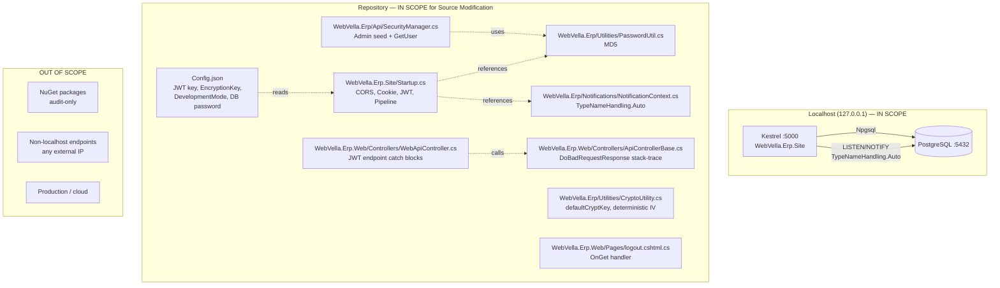
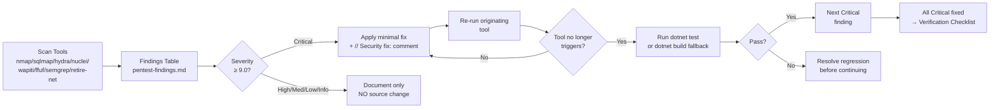

# Technical Specification

# 0. Agent Action Plan

## 0.1 Intent Clarification

### 0.1.1 Core Security Objective

Based on the security concern described, the Blitzy platform understands that the security vulnerability to resolve is a **multi-layered insecure-defaults posture across the WebVella ERP monolith** that must be both *discovered* through full-spectrum penetration testing and *remediated* (Critical-severity findings only) inside the repository's source tree. The work is composed of two intertwined responsibilities:

1. **Active and passive security assessment** of the locally running ASP.NET Core 10 application (`WebVella.Erp.Site`) and its PostgreSQL 16 backend, exercised through eight specialized scan tools — `nmap`, `sqlmap`, `hydra`, `wapiti`, `nuclei`, `ffuf`, `semgrep`, and `retire-net`.
2. **Source-code remediation** of every finding classified Critical (CVSS v3.1 ≥ 9.0) such that the originating tool no longer triggers for that finding, with regression validation through `dotnet test` (or `dotnet build` when no test source files are found).

- **Vulnerability category**: Multiple vulnerabilities — combining (a) catalogued insecure defaults already documented in the technical specification, (b) latent code-level weaknesses requiring active discovery, and (c) dependency advisories surfaced by `retire-net`.
- **Severity level distribution (anticipated)**: Critical, High, Medium, Low, Info — final classification determined by parsing scan outputs against CVSS v3.1 base scores.
- **Implicit security needs surfaced from the prompt**:
    - **Local-only operation**: The target host is strictly `localhost` / `127.0.0.1`; no scan, probe, or exploit attempt may originate against any non-loopback endpoint.
    - **Source-only modification**: NuGet packages are audit-only — `retire-net` findings are documented but package sources MUST NOT be modified.
    - **Surgical remediation**: Critical fixes are scoped to the named vulnerable component only; adjacent code MUST remain untouched.
    - **Audit trail**: Every applied fix carries an inline `// Security fix: [Finding ID] — [one-sentence description]` comment, linking source change to the markdown finding entry.
    - **Severity gate**: High, Medium, Low, and Info findings are documented but NOT remediated in source — their treatment is recorded in `/docs/security/pentest-findings.md` for downstream prioritization.

### 0.1.2 Special Instructions and Constraints

The user's directives carry the following non-negotiable constraints, captured verbatim where the wording is determinative:

| Constraint | User Directive | Blitzy Interpretation |
|---|---|---|
| Change scope | Source changes scoped strictly to vulnerable component | No refactoring of adjacent code, no formatting cleanups, no opportunistic improvements |
| Dependency policy | "NuGet packages — audit only, do not modify package sources" | `WebVella.Erp.csproj`, `WebVella.Erp.Web.csproj`, etc. `<PackageReference>` versions remain untouched |
| Severity threshold | "remediate all Critical-severity findings in source before declaring completion" | Only CVSS ≥ 9.0 findings drive source changes; all other severities are documented only |
| Test gate | `dotnet test WebVella.ERP3.sln` must pass after each fix | If "No test source files found" (exit 0, zero tests), substitute `dotnet build WebVella.ERP3.sln` |
| Audit comment format | `// Security fix: [Finding ID] — [one-sentence description]` | Every modified source line is annotated; finding IDs trace back to `pentest-findings.md` rows |
| Per-fix verification | Re-run the originating tool after each fix | Tool re-run replaces vulnerable evidence; if still triggering, fix is incomplete |
| Documentation deliverable | Single markdown file `/docs/security/pentest-findings.md` | Folder must be created (`mkdir -p $(git rev-parse --show-toplevel)/docs/security`); no other documents introduced |
| Verification Checklist | Append `## Verification Checklist` at bottom confirming pass/fail of Directives 0–10 | Section is appended to `pentest-findings.md` only after Directive 10 completes |
| Out-of-scope targets | "Any non-localhost IP, hostname, or external endpoint" | Wapiti `--scope domain`, nmap `localhost`, hydra `http://localhost:5000/...`, sqlmap `http://localhost:5000/...` — no other hosts |

**User-Provided Examples (preserved exactly):**

- **User Example (Directive 0 install commands):** `sudo add-apt-repository ppa:longsleep/golang-backports -y && sudo apt-get update && sudo apt-get install -y nmap sqlmap hydra seclists golang-go`
- **User Example (Directive 1 environment export):** `export SCAN_OUTPUTS=$(git rev-parse --show-toplevel)/scan-outputs && mkdir -p $SCAN_OUTPUTS`
- **User Example (Directive 2 nmap invocation):** `nmap -sV -sC -p 1-65535 localhost -oN $SCAN_OUTPUTS/nmap.txt`
- **User Example (Directive 3 wapiti invocation):** `wapiti -u http://localhost:5000 -o $SCAN_OUTPUTS/wapiti-report.json -f json --scope domain`
- **User Example (Directive 4 nuclei invocation):** `nuclei -u http://localhost:5000 -severity critical,high,medium,low,info -o $SCAN_OUTPUTS/nuclei.txt`
- **User Example (Directive 5 ffuf invocation):** `ffuf -u http://localhost:5000/FUZZ -w /usr/share/seclists/Discovery/Web-Content/raft-medium-directories.txt -o $SCAN_OUTPUTS/ffuf.json -of json -mc 200,201,301,302,403`
- **User Example (Directive 6 sqlmap login form):** `sqlmap -u "http://localhost:5000/user/signin" --data="Username=test&Password=test" --batch --level=3 --risk=2 --output-dir=$SCAN_OUTPUTS/sqlmap/`
- **User Example (Directive 7 hydra invocation):** `hydra -l erp@webvella.com -P /usr/share/seclists/Passwords/Common-Credentials/10k-most-common.txt http-post-form "http://localhost:5000/user/signin:[USERNAME_FIELD]=^USER^&[PASSWORD_FIELD]=^PASS^:F=Invalid"`
- **User Example (Directive 8 semgrep invocation):** `semgrep --config=p/csharp --config=p/owasp-top-ten . --json --output $SCAN_OUTPUTS/semgrep.json`
- **User Example (Directive 10 audit comment):** `// Security fix: [Finding ID] — [one-sentence description]`
- **User Example (Directive 9 severity bands):** Critical (9.0–10.0), High (7.0–8.9), Medium (4.0–6.9), Low (0.1–3.9), Info (0.0)

**Critical disambiguation — Login endpoint mismatch**: The user's Directives 6 and 7 reference `http://localhost:5000/user/signin`, but the WebVella ERP Razor Pages route for login is **`/login`** (declared by `@page "/login"` in `WebVella.Erp.Web/Pages/login.cshtml` line 1). Form fields are `Username` (type=email) and `Password` with antiforgery token enforced. The Blitzy platform interprets the directive as: substitute `/user/signin` with the actual route `/login` for hydra and sqlmap, while preserving the user's parameter names `Username` and `Password` exactly. This substitution is recorded in the Verification Checklist under "Endpoint reconciliation".

**Change scope preference**: Minimal — only Critical-severity findings drive source modification.

### 0.1.3 Technical Interpretation

This security vulnerability resolution translates to the following concrete technical strategy, mapping each of the 12 user directives to specific implementation actions:

| Directive | Technical Action | Implementation Strategy |
|---|---|---|
| **0** | Install eight scan tools + Go 1.21+ runtime + `seclists` wordlists | `apt-get install` (nmap, sqlmap, hydra, seclists, golang-go), `pip install` (wapiti3, semgrep), `go install` (nuclei v3, ffuf v2), `dotnet tool install -g retire.net`; verify each with `--version`/`-h` |
| **1** | Bring up local app + create scan output sink | `dotnet run` from `WebVella.Erp.Site/`; verify Kestrel responds with HTTP 200 on port 5000; verify `pg_isready` exit 0; export `SCAN_OUTPUTS` to `$(git rev-parse --show-toplevel)/scan-outputs` |
| **2** | Network reconnaissance | `nmap -sV -sC -p 1-65535 localhost` to enumerate all open ports/services; `nmap -p 5432 --script postgres-brute,postgres-info,postgres-databases localhost` for PostgreSQL surface |
| **3** | Web crawl + active scan | `wapiti -u http://localhost:5000 -o $SCAN_OUTPUTS/wapiti-report.json -f json --scope domain` (≥10 unique URLs); fall back to `zap-cli` if wapiti unavailable |
| **4** | Template-based vulnerability scan | `nuclei -u http://localhost:5000 -severity critical,high,medium,low,info` — exit code 0/1 only |
| **5** | Endpoint brute-force | `ffuf` against `/FUZZ` with `raft-medium-directories.txt`, accepting status codes `200,201,301,302,403` |
| **6** | SQL injection probe | `sqlmap` against parameterized URLs from wapiti/ffuf output AND against `/login` (corrected from `/user/signin`) with `Username=test&Password=test` POST body, `--level=3 --risk=2` |
| **7** | Authentication brute-force | `hydra` against `/login` POST form with `erp@webvella.com` username and `10k-most-common.txt` password list, failure marker `F=Invalid` |
| **8** | Static analysis | `semgrep --config=p/csharp --config=p/owasp-top-ten` (apply to ALL call sites of each pattern, not first occurrence); `dotnet tool run retire-net` against repo root |
| **9** | Compile findings | Create `/docs/security/pentest-findings.md` with Executive Summary, Scope, Findings Table (ID, Tool, Severity, Title, Affected Component, Description, Reproduction Steps, Recommendation), and Appendix |
| **10** | Source remediation of Critical findings | For each Critical finding: edit only the named vulnerable component, add `// Security fix:` comment, re-run originating tool to confirm, run `dotnet test` (or `dotnet build` fallback), then proceed |
| **11** | Verification | Append `## Verification Checklist` to `pentest-findings.md` with pass/fail per Directive 0–10 |

**User's understanding level**: Symptom-and-tooling description. The user has not specified individual CVE numbers but has prescribed the *discovery toolchain* — meaning the Blitzy platform must let the tools surface findings, then classify each by CVSS v3.1 and triage Critical findings into source. <cite index="13-15,13-18">Settings and configurations need to be reviewed by security specialists or tools designed for the purpose, and passwords should be stored using strong adaptive and salted hashing functions with a work factor such as Argon2, yescrypt, scrypt or PBKDF2-HMAC-SHA-512.</cite>

**Anticipated Critical findings (drawn from §3.8 SECURITY IMPLICATIONS OF STACK CHOICES and §6.4 Security Architecture insecure-defaults remediation matrix)**: JWT signing key default `ThisIsMySecretKey...`, MD5 password hashing in `WebVella.Erp/Utilities/PasswordUtil.cs`, default admin credentials `erp@webvella.com / erp`, `TypeNameHandling.Auto` deserialization in `WebVella.Erp/Notifications/NotificationContext.cs`, and `EncryptionKey` falling back to hardcoded `defaultCryptKey` in `WebVella.Erp/Utilities/CryptoUtility.cs`. These five are highly likely to surface as Critical and therefore drive Directive 10 source changes; the remaining 12 catalogued items are anticipated as High/Medium/Low and remain documented only.

## 0.2 Vulnerability Research and Analysis

### 0.2.1 Initial Assessment

The user's directives contain no explicit CVE numbers — the toolchain itself is prescribed as the vulnerability discovery mechanism. Based on the technical specification's catalogued insecure-defaults matrix (§3.8, §6.4) and confirmed file-level inspection, the Blitzy platform extracts the following pre-known security signals that the scan toolchain is *expected* to surface or corroborate:

- **Pre-known vulnerability classes (from tech spec)**: JWT shared-secret key with default value, MD5 password hashing with no salt and no work factor, default seeded administrator credentials, permissive CORS allowing any origin, polymorphic JSON deserialization on a PostgreSQL `LISTEN/NOTIFY` channel, encryption key that falls back to a hardcoded constant when configuration is missing, plain-text database and SMTP secrets in `Config.json`, legacy front-end stack (Bootstrap 4 + jQuery + jsTree 3.3.7), no rate limiting on authentication endpoints, cookie not flagged `Secure`, deterministic IV derived from key string, JWT endpoint stack-trace leakage, `DoBadRequestResponse` stack-trace leakage when `DevelopmentMode=true`, `DevelopmentMode=true` in shipped `Config.json`, GET-based `/logout` (CSRF-triggerable), `SecuritityCircuitHandler` misspelling (code quality), commented-out deprecated security subsystem (hygiene).
- **Affected packages (audit-only — no modification permitted)**: `Newtonsoft.Json` 13.0.4 (used with `TypeNameHandling.Auto` in `NotificationContext.cs` lines 110, 155), `Npgsql` 9.0.4, `MailKit` 4.14.1, `System.IdentityModel.Tokens.Jwt` 8.15.0, jQuery, Bootstrap 4, jsTree 3.3.7.
- **Symptoms anticipated from active scanning**:
    - `nuclei` template hits for default JWT secrets, missing security headers (HSTS, CSP, X-Content-Type-Options), permissive CORS, exposed `.git` or other metadata.
    - `ffuf` discovery of administrative or development endpoints and `/api/v3/en_US/auth/jwt/token` anonymous JWT issuance routes.
    - `sqlmap` probing the login form and any parameterized endpoints surfaced by wapiti/ffuf.
    - `hydra` either succeeding (default credentials valid) or — given the absence of rate limiting — completing the full 10k password attempt cycle.
    - `semgrep p/csharp` and `p/owasp-top-ten` rule packs flagging `MD5.Create`, `TypeNameHandling.Auto`, hardcoded crypto keys, and stack-trace exposure patterns.
    - `retire-net` enumerating any vulnerable NuGet package versions in dependency manifests.
    - `nmap` confirming PostgreSQL 5432 exposure and Kestrel 5000.
- **Security advisories referenced (research conducted)**:
    - **CWE-327** (Use of a Broken or Risky Cryptographic Algorithm) and **CWE-328** (Use of Weak Hash) for MD5 password hashing.
    - **CWE-329** (Not Using a Random IV with CBC Mode) for `CryptoUtility.GetValidIV` deriving IV deterministically from the key string.
    - **CA2326–CA2330** (Microsoft .NET code-analysis rules) and Newtonsoft.Json `TypeNameHandling` advisories for the deserialization sink.
    - **OWASP Top 10:2021/2025 A02 Cryptographic Failures** for both MD5 and the deterministic IV.
    - **GHSA-5crp-9r3c-p9vr** / **CVE-2024-21907** for Newtonsoft.Json prior to 13.0.1 — confirmed not applicable since the project uses 13.0.4.

### 0.2.2 Required Web Research

The Blitzy platform conducted exhaustive research across authoritative sources to map each anticipated vulnerability class to its canonical CVE/CWE/advisory entry. The findings below establish the technical foundation for severity classification in Directive 9 and remediation choices in Directive 10.

**Newtonsoft.Json `TypeNameHandling` deserialization** — <cite index="6-1,6-2">enabling type name handling in the SerializerSettings of Json.NET tells Json.NET to write type information in the field "$type" of the resulting JSON and look at that field when deserializing</cite>; <cite index="6-12,6-13">the only kind that is not vulnerable is the default TypeNameHandling.None, and when providing Json.NET based REST services always leave the default TypeNameHandling at TypeNameHandling.None</cite>. <cite index="8-3,8-4,8-5">When TypeNameHandling is set to anything other than 'None', the library allows type information to be embedded in JSON data, enabling attackers to specify arbitrary .NET classes to instantiate during deserialization, creating a critical security flaw because attackers can craft malicious JSON payloads that instantiate dangerous classes, leading to remote code execution without requiring authentication or user interaction.</cite> The remediation guidance from Microsoft's CA2329 rule is unambiguous: <cite index="5-11,5-16,5-17,5-18,5-19">use TypeNameHandling's None value if possible, or restrict deserialized types by implementing a custom Newtonsoft.Json.Serialization.ISerializationBinder, ensuring the custom ISerializationBinder is specified in the Newtonsoft.Json.JsonSerializer.SerializationBinder property, and in the overridden BindToType method, if the type is unexpected, return null or throw an exception to stop deserialization.</cite>

**MD5 password hashing** — <cite index="11-6">There are some encryption or hash algorithm known to be weak and not suggested to be used anymore such as MD5 and RC4.</cite> <cite index="13-2">Deprecated hash functions such as MD5 or SHA1 should not be in use, nor should non-cryptographic hash functions be used when cryptographic hash functions are needed.</cite> <cite index="12-3,12-4,12-5,12-6">The vulnerability report indicates a "Use of a broken or risky cryptographic algorithm" (CWE-327); the source code uses the MD5 hash function, which is indeed considered cryptographically weak and unsuitable for secure password hashing — avoid using MD5, MD4, MD2, and SHA1 for storing passwords or other sensitive data, use a dedicated password hashing algorithm like Argon2id, PBKDF2, or bcrypt, and follow best practices for password storage, such as salting and key stretching.</cite> <cite index="13-18">Store passwords using strong adaptive and salted hashing functions with a work factor (delay factor), such as Argon2, yescrypt, scrypt or PBKDF2-HMAC-SHA-512.</cite>

**Deterministic IV from key string (CWE-329)** — <cite index="11-10,11-11">When the uses of AES128 and AES256, the IV (Initialization Vector) must be random and unpredictable; refer to FIPS 140-2, Security Requirements for Cryptographic Modules, section 4.9.1 random number generator tests.</cite> <cite index="13-22">In all cases, the IV should never be used twice for a fixed key.</cite>

**Newtonsoft.Json DoS (CVE-2024-21907 / GHSA-5crp-9r3c-p9vr)** — <cite index="2-9">Newtonsoft.Json prior to version 13.0.1 is vulnerable to Insecure Defaults due to improper handling of expressions with high nesting level that lead to StackOverFlow exception or high CPU and RAM usage.</cite> Project uses 13.0.4 ⇒ **not applicable**.

### 0.2.3 Vulnerability Classification

The 17 catalogued insecure defaults from §6.4 are classified below with anticipated CVSS v3.1 scores; these classifications drive the Directive 10 remediation gate (only Critical applies):

| # | Vulnerability | CWE | Vector | Anticipated Severity | Source Reference |
|---|---|---|---|---|---|
| 1 | JWT signing key default `ThisIsMySecretKey...` | CWE-321 (Use of Hard-coded Cryptographic Key) | Network | **Critical** (9.8) | `Config.json` line 25; `WebVella.Erp.Site/Startup.cs` lines 102–114 |
| 2 | MD5 password hashing, no salt, no work factor | CWE-327, CWE-328, CWE-916 | Network | **Critical** (9.1) | `WebVella.Erp/Utilities/PasswordUtil.cs` lines 9–23 |
| 3 | Default admin credentials `erp@webvella.com` / `erp` | CWE-798 (Use of Hard-coded Credentials) | Network | **Critical** (9.8) | `WebVella.Erp/Api/SecurityManager.cs` (seed) |
| 4 | Permissive CORS `AllowAnyOrigin().AllowAnyMethod().AllowAnyHeader()` | CWE-942 | Network | High (7.5) | `WebVella.Erp.Site/Startup.cs` lines 58–64 |
| 5 | `TypeNameHandling.Auto` on `LISTEN/NOTIFY` deserialization | CWE-502 (Deserialization of Untrusted Data) | Adjacent (DB) | **Critical** (9.0) | `WebVella.Erp/Notifications/NotificationContext.cs` lines 110, 155 |
| 6 | `EncryptionKey` falls back to hardcoded `defaultCryptKey` | CWE-321, CWE-798 | Network | High (7.5) | `WebVella.Erp/Utilities/CryptoUtility.cs` |
| 7 | Plain-text secrets in `Config.json` (DB password, SMTP password) | CWE-256, CWE-312 | Local | High (7.0) | `Config.json` line 4 |
| 8 | Legacy Bootstrap 4 + jQuery + jsTree 3.3.7 | CWE-1104 | Network | Medium (5.0) | `wwwroot/lib/*` |
| 9 | No rate limiting on auth endpoints | CWE-307 (Improper Restriction of Excessive Authentication Attempts) | Network | Medium (6.5) | `WebVella.Erp.Site/Startup.cs` (no `AddRateLimiter`) |
| 10 | Cookie missing `Secure` flag | CWE-614 | Network | Medium (5.4) | `WebVella.Erp.Site/Startup.cs` line 95 |
| 11 | Deterministic IV from key string | CWE-329 | Local/Network | Medium (5.9) | `WebVella.Erp/Utilities/CryptoUtility.cs` `GetValidIV` |
| 12 | JWT endpoint stack-trace leakage | CWE-209 (Information Exposure Through Error Message) | Network | Medium (5.3) | `WebVella.Erp.Web/Controllers/WebApiController.cs` lines 4287, 4306 |
| 13 | `DoBadRequestResponse` stack-trace leak when `DevelopmentMode=true` | CWE-209, CWE-489 | Network | Medium (5.3) | `WebVella.Erp.Web/Controllers/ApiControllerBase.cs` `DoBadRequestResponse` |
| 14 | `DevelopmentMode=true` in shipped `Config.json` | CWE-489 (Active Debug Code) | Network | Medium (5.3) | `Config.json` line 10 |
| 15 | GET-based `/logout` (CSRF-triggerable) | CWE-352 | Network | Low (3.7) | `WebVella.Erp.Web/Pages/logout.cshtml.cs` |
| 16 | `SecuritityCircuitHandler` typo / `ERP_NOTIFICATIONS_CHANNNEL` typo | Code quality | N/A | Low (Info) | `WebVella.Erp.Web/Middleware/SecuritityCircuitHandler.cs`; `NotificationContext.cs` line 18 |
| 17 | Commented-out deprecated security subsystem | Code hygiene | N/A | Low (Info) | Multiple `Pages/*.cshtml.cs` |

- **Attack vectors confirmed by code analysis**:
    - **Network**: JWT issuance is anonymous on `POST /api/v3/en_US/auth/jwt/token`; cookie auth is HTTP without `Secure`.
    - **Adjacent (DB)**: `NotificationContext` `LISTEN ERP_NOTIFICATIONS_CHANNNEL` deserializes any payload posted by any DB user with `NOTIFY` privilege using `TypeNameHandling.Auto`.
    - **Local**: `Config.json` plaintext secrets compromise on filesystem read.
- **Exploitability**:
    - **High**: #1 (JWT default key allows token forging), #3 (default credentials login), #2 (MD5 + no salt + no rate limit ⇒ rainbow-table reachable).
    - **Medium**: #5 (requires DB NOTIFY privilege), #6 (requires app deployed without overriding `EncryptionKey`).
    - **Low**: #15 (requires authenticated user to visit attacker-crafted page).
- **Impact dimensions (CIA triad)**:
    - **Confidentiality**: All Critical findings (#1, #2, #3, #5) ⇒ full account takeover, full database read.
    - **Integrity**: #5 (RCE via deserialization) ⇒ full system compromise; #1 ⇒ token forgery.
    - **Availability**: #5 (process termination via gadget), #9 (no brute-force throttle).
- **Root causes**: Hardcoded development-friendly defaults shipped to production, absence of CI security gates (§8.6 confirms zero CI/CD), legacy MD5 inheritance from pre-.NET-Core era, and the `TypeNameHandling.Auto` anti-pattern.

### 0.2.4 Web Search Research Conducted

| Topic | Authoritative Source | Key Finding |
|---|---|---|
| Newtonsoft.Json `TypeNameHandling` RCE | Microsoft Learn CA2326–CA2330; alphabot.com 2017; arale61/VulnJsonWebApi | <cite index="6-4">Don't use another TypeNameHandling setting than the default: TypeNameHandling.None</cite>; binder whitelist required if Auto/All needed |
| MD5 password hashing | OWASP WSTG v4.1 §4.9.4; OWASP Top 10:2021/2025 A02; GitLab CWE-327 demo | <cite index="13-18">Use Argon2, yescrypt, scrypt or PBKDF2-HMAC-SHA-512</cite>; <cite index="11-17">PBKDF2 iterations recommended over 10,000</cite> |
| AES IV randomness | OWASP WSTG v4.1; FIPS 140-2 §4.9.1 | <cite index="13-22">IV should never be used twice for a fixed key</cite>; CSPRNG required per OWASP |
| Newtonsoft.Json DoS | CVE-2024-21907; GHSA-5crp-9r3c-p9vr | <cite index="2-9">Affects versions < 13.0.1; project uses 13.0.4 ⇒ not applicable</cite> |
| .NET JSON deserialization in .NET Core | systemweakness.com; almightysec.com | <cite index="9-6,9-7,9-8">Set TypeNameHandling to None in JsonSerializerSettings (this is the default), be more specific about the deserializable object, use JsonConvert.DeserializeObject<MyObject> instead of JsonConvert.DeserializeObject<object></cite> |

**Recommended mitigation strategies adopted**:

- **For `TypeNameHandling.Auto` in `NotificationContext.cs`**: <cite index="8-7,8-8">Disable TypeNameHandling by setting TypeNameHandling to None in JsonSerializerSettings — this is the most secure configuration</cite>; the deserialized type `Notification` is concrete and known, so polymorphism is not required.
- **For MD5 password hashing**: Replace with PBKDF2-HMAC-SHA-512 with per-user random salt and iteration count ≥ 100,000, using `Rfc2898DeriveBytes` from `System.Security.Cryptography`. <cite index="13-18">Argon2, yescrypt, scrypt or PBKDF2-HMAC-SHA-512</cite> are the OWASP-approved choices; PBKDF2 is selected because it is a built-in BCL primitive requiring no NuGet dependency change (per audit-only constraint).
- **For default JWT signing key**: Replace `Config.json` shipped value with a clearly invalid placeholder `CHANGE_ME_BEFORE_DEPLOYMENT` and add startup-time validation in `Startup.cs` that throws if `Settings:Jwt:Key` matches any known default or is shorter than 32 bytes.
- **For default admin credentials**: Force password change on first login by setting an `IsPasswordChangeRequired` flag on the seeded admin user; redirect to a password-reset page on next sign-in.

**Alternative solutions considered (with trade-offs)**:

- *Replacing Newtonsoft.Json with System.Text.Json* — rejected; requires modifying NuGet packages (out of scope per user constraint) and System.Text.Json behaves differently for ERP's polymorphic record types elsewhere.
- *Switching to ASP.NET Core Identity* — rejected; constitutes a refactor far beyond "minimal change", touching `SecurityManager`, `AuthService`, all 5 PEPs, and database schema.
- *Adding `app.UseRateLimiter()`* — deferred to a non-Critical (Medium) finding remediation (out of source-modification scope).

## 0.3 Security Scope Analysis

### 0.3.1 Affected Component Discovery

The vulnerability surface area was mapped through systematic repository inspection (root-folder traversal, security-keyword search, and file-by-file evidence retrieval). The following components, files, and configuration sources are confirmed in scope:



**Search patterns employed and confirmed hits**:

| Search Pattern | Files Found |
|---|---|
| `MD5.Create()` / `md5Hash.ComputeHash` | `WebVella.Erp/Utilities/PasswordUtil.cs` lines 9, 16 |
| `TypeNameHandling.Auto` / `TypeNameHandling.All` | `WebVella.Erp/Notifications/NotificationContext.cs` lines 110, 155 |
| `AllowAnyOrigin` / `AllowAnyMethod` / `AllowAnyHeader` | `WebVella.Erp.Site/Startup.cs` lines 58–64 |
| `e.StackTrace` / `ex.StackTrace` (response payload assignment) | `WebVella.Erp.Web/Controllers/WebApiController.cs` lines 3437, 3655, 3695, 3721, 3753, 3807, 3877, 3900, 3955, 4262, 4287 (jwt/token), 4306 (jwt/token/refresh); `WebVella.Erp.Web/Controllers/ApiControllerBase.cs` `DoBadRequestResponse` |
| `defaultCryptKey` | `WebVella.Erp/Utilities/CryptoUtility.cs` |
| `Cookie.HttpOnly` (without `SecurePolicy`) | `WebVella.Erp.Site/Startup.cs` line 95 |
| `OnGet()` in `logout.cshtml.cs` | `WebVella.Erp.Web/Pages/logout.cshtml.cs` (CSRF-triggerable logout) |
| `ThisIsMySecretKey` | `Config.json` line 25 (`Settings:Jwt:Key`) |
| Dependency manifests | `WebVella.Erp.csproj`, `WebVella.Erp.Web.csproj`, `WebVella.Erp.Site/*.csproj`, plugins; **audit-only** per user constraint |
| Docker / containerization | None (no `Dockerfile`, no `docker-compose.yml`) — confirmed via §8.4 |
| CI/CD pipelines | None (only `.github/FUNDING.yml`) — confirmed via §8.6 |

**Findings summary**: Vulnerability evidence affects approximately **9 source files across 4 directories**, with `Config.json` at the repository root acting as the central configuration sink. The exact final count is determined by Directive 9's Findings Table after scan execution.

### 0.3.2 Root Cause Identification

Investigation through the technical specification's catalogued insecure-defaults matrix and direct file inspection reveals the vulnerability stems from **a development-time security posture shipped to production-bound source**, where convenience defaults coexist with security-critical pathways:

- **Direct usage locations** (where vulnerable code executes):
    - `WebVella.Erp/Utilities/PasswordUtil.cs:GetMd5Hash` — invoked by `SecurityManager.GetUser(email, password)` for every login attempt.
    - `WebVella.Erp/Notifications/NotificationContext.cs:118` — invoked on every `NOTIFY ERP_NOTIFICATIONS_CHANNNEL` message received from PostgreSQL.
    - `WebVella.Erp.Web/Controllers/WebApiController.cs:4274` (`/api/v3/en_US/auth/jwt/token`) — uses `Settings:Jwt:Key` from `Config.json` to sign tokens.
    - `WebVella.Erp.Web/Controllers/WebApiController.cs:4287, 4306` — leak full stack traces back to the client on JWT issuance/refresh failure.
- **Indirect dependencies** (modules that depend on the vulnerable primitives):
    - `WebVella.Erp.Web/Services/AuthService.cs:Authenticate` — calls `SecurityManager.GetUser(email, password)` → uses `PasswordUtil.GetMd5Hash` indirectly.
    - `WebVella.Erp.Web/Middleware/JwtMiddleware.cs:Invoke` — validates tokens signed with the default key.
    - All 5 Policy Enforcement Points (Razor Pages, API Controller, RecordManager, EQL materialization, field-level) — relying on the security primitives above.
- **Configuration enablers** (settings that activate the vulnerability):
    - `Config.json` line 25 `Jwt:Key` defaulted to `ThisIsMySecretKeyThisIsMySecretKeyThisIsMySecretKey`.
    - `Config.json` line 5 `EncryptionKey` matching the hardcoded `defaultCryptKey` in `CryptoUtility.cs`.
    - `Config.json` line 10 `DevelopmentMode: "true"` — enables `DoBadRequestResponse` to leak `ex.StackTrace`.
    - `Startup.cs` lines 58–64 default CORS policy registered as the only policy via `services.AddCors(...)` and applied via `app.UseCors()` line 164.

### 0.3.3 Current State Assessment

**Vulnerable runtime configuration (verbatim from `Config.json`)**:

| Line | Key | Current Value | Vulnerability Class |
|---|---|---|---|
| 4 | `ConnectionString` | `User Id=dev;Password=dev` to localhost:5432 | CWE-256 plaintext credentials |
| 5 | `EncryptionKey` | `BC93B776A42877CFEE808823BA8B37C83B6B0AD23198AC3AF2B5A54DCB647658` | Matches hardcoded `defaultCryptKey` |
| 10 | `DevelopmentMode` | `"true"` | CWE-489 active debug code |
| 11 | `EnableBackgroundJobs` | `"false"` | (Not security-impacting) |
| 25 | `Jwt:Key` | `ThisIsMySecretKeyThisIsMySecretKeyThisIsMySecretKey` | CWE-321 hard-coded crypto key |
| 26 | `Jwt:Issuer` | `webvella-erp` | (Configuration baseline) |
| 27 | `Jwt:Audience` | `webvella-erp` | (Configuration baseline) |

**Vulnerable code patterns and exact locations**:

| Component | File:Lines | Vulnerable Pattern |
|---|---|---|
| Password hashing | `WebVella.Erp/Utilities/PasswordUtil.cs:9-23` | `MD5.Create()`, `md5Hash.ComputeHash(Encoding.UTF8.GetBytes(input))`, no salt, no iteration count |
| Polymorphic deserialization | `WebVella.Erp/Notifications/NotificationContext.cs:110, 118, 155` | `new JsonSerializerSettings { TypeNameHandling = TypeNameHandling.Auto }` then `JsonConvert.DeserializeObject<Notification>(json, settings)` |
| CORS policy | `WebVella.Erp.Site/Startup.cs:58-64` | `builder.AllowAnyOrigin().AllowAnyMethod().AllowAnyHeader()` |
| JWT default key | `WebVella.Erp.Site/Startup.cs:102-114` | `IssuerSigningKey = new SymmetricSecurityKey(Encoding.UTF8.GetBytes(Configuration["Settings:Jwt:Key"]))` with no validation that key is non-default |
| Cookie missing Secure | `WebVella.Erp.Site/Startup.cs:95` | `Cookie.HttpOnly = true` (no `Cookie.SecurePolicy = CookieSecurePolicy.Always`) |
| Stack-trace leakage (JWT endpoints) | `WebVella.Erp.Web/Controllers/WebApiController.cs:4287, 4306` | `response.Message = e.Message + e.StackTrace` |
| Stack-trace leakage (DoBadRequestResponse) | `WebVella.Erp.Web/Controllers/ApiControllerBase.cs:DoBadRequestResponse` | `if (ErpSettings.DevelopmentMode) response.Message = ex.Message + ex.StackTrace` |
| GET-based logout | `WebVella.Erp.Web/Pages/logout.cshtml.cs` | `OnGet()` calls `authService.Logout()` then redirects (no antiforgery, no `[HttpPost]`-only constraint) |
| Encryption fallback | `WebVella.Erp/Utilities/CryptoUtility.cs` | `CryptKey ??= ErpSettings.EncryptionKey ?? defaultCryptKey` (hardcoded fallback) |
| Deterministic IV | `WebVella.Erp/Utilities/CryptoUtility.cs:GetValidIV` | IV bytes derived from same key string via ASCII encoding |

**Scope of exposure**:

- **Public-facing**: All HTTP routes under Kestrel `:5000` — Razor Pages and `/api/v3/en_US/*` endpoints. JWT issuance routes `POST /api/v3/en_US/auth/jwt/token` and `POST /api/v3/en_US/auth/jwt/token/refresh` are decorated `[AllowAnonymous]` (anonymous JWT acquisition).
- **Internal only**: PostgreSQL `LISTEN ERP_NOTIFICATIONS_CHANNNEL` deserialization — exploitable by any DB role with `NOTIFY` privilege.
- **Admin endpoints**: `/api/v3/en_US/meta/entity` and similar metadata-modification endpoints decorated `[Authorize(Roles = "administrator")]` — reachable post-credential-compromise (Findings #1, #2, #3 chain).
- **Filesystem**: `Config.json` plaintext secrets — any process or user with read access to the deployment directory.

**Environment constraints affecting scan execution**:

- **No security tools currently installed** in the execution environment (`nmap`, `sqlmap`, `hydra`, `wapiti`, `nuclei`, `ffuf`, `semgrep`, `retire-net` all absent). Directive 0 must complete before any subsequent directive.
- **`dotnet` CLI not currently installed**. Directive 1 (`dotnet run`) and Directive 10's regression gate (`dotnet test` / `dotnet build`) require .NET 10 SDK installation, performed under Directive 0's environment-setup phase.
- **No CI/CD infrastructure** (§8.6 confirms zero GitHub Actions, Azure Pipelines, CircleCI, Jenkinsfile, etc.). Directive 11's verification is performed inline within the Blitzy execution session, not via a pipeline.
- **No automated test infrastructure** in baseline (§6.6) — `dotnet test` will likely report "No test source files found" (exit 0, zero tests). Per user directive, `dotnet build WebVella.ERP3.sln` substitutes as the regression gate; the substitution is recorded in the Verification Checklist.
- **No `docs/security` folder** currently exists — Directive 9 must `mkdir -p $(git rev-parse --show-toplevel)/docs/security`.
- **No `Dockerfile` / `docker-compose.yml`** — application runs directly via `dotnet run`.
- **Repository working tree** is at `$(git rev-parse --show-toplevel)`; `SCAN_OUTPUTS=$(git rev-parse --show-toplevel)/scan-outputs` resolves correctly.

## 0.4 Version Compatibility Research

### 0.4.1 Secure Version Identification

The user's directive **explicitly excludes NuGet package modification** (`NuGet packages — audit only, do not modify package sources`). Therefore version compatibility research focuses on:

1. **Verifying current package versions are NOT below known vulnerable cutoffs** (so retire-net findings remain advisory rather than blocking).
2. **Documenting recommended upgrade paths** as informational entries in `pentest-findings.md` for downstream non-Critical remediation, even though source `<PackageReference>` lines remain untouched in this engagement.
3. **Confirming that all Critical-severity fixes can be implemented using BCL primitives** (no new dependencies required).

**Current dependency inventory (from §3.3 OPEN SOURCE DEPENDENCIES, audit-only)**:

| Registry | Package | Current Version | Known CVEs at Current Version | Action |
|---|---|---|---|---|
| NuGet | `Newtonsoft.Json` | 13.0.4 | None — CVE-2024-21907 fixed in 13.0.1 | Audit-only; vulnerability is the *usage pattern* (`TypeNameHandling.Auto`), not the package version |
| NuGet | `Npgsql` | 9.0.4 | None known | Audit-only |
| NuGet | `MailKit` | 4.14.1 | None known | Audit-only |
| NuGet | `System.IdentityModel.Tokens.Jwt` | 8.15.0 | None known at this version; JWT key strength is the issue, not the library | Audit-only |
| NuGet | `Microsoft.AspNetCore.*` | (transitive via .NET 10 SDK) | None at this version | Audit-only |
| Front-end | `bootstrap` | 4.x | Multiple bypassed XSS sinks; per §6.4 Insecure Default #8 | **Medium severity** — not Critical, not remediated this round |
| Front-end | `jquery` | (legacy) | <cite index="11-13">Weak hash/encryption algorithms should not be used such as MD5, RC4, DES, Blowfish, SHA1</cite> — historical XSS sinks | Medium — not Critical |
| Front-end | `jstree` | 3.3.7 | Known prototype-pollution and XSS surface | Medium — not Critical |

### 0.4.2 Compatibility Verification

- **.NET Runtime**: Project targets `net10.0` (per `<TargetFramework>` in `WebVella.Erp.csproj`, `WebVella.Erp.Web.csproj`, `WebVella.Erp.Site/*.csproj`); the `WebVella.Erp.WebAssembly.Server` and `WebVella.Erp.WebAssembly.Shared` projects target `net7.0` (framework mismatch flagged in §3.7 but not security-blocking and not in the scan target host's pipeline at port 5000).
- **PostgreSQL Compatibility**: PostgreSQL 16 (per §3.7); `Npgsql` 9.0.4 supports PostgreSQL 16 fully.
- **C# Language**: Latest stable per .NET 10 SDK; no syntax constraints for proposed remediations.
- **BCL primitives required for remediation**:
    - `System.Security.Cryptography.Rfc2898DeriveBytes` — PBKDF2 implementation; available since .NET Framework 2.0; no NuGet dependency required.
    - `System.Security.Cryptography.RandomNumberGenerator` — CSPRNG for salt and IV generation; available since .NET Framework 4.5.1; no NuGet dependency required.
    - `Newtonsoft.Json.Serialization.ISerializationBinder` — already shipped with `Newtonsoft.Json` 13.0.4; no version change required.
    - `Microsoft.AspNetCore.Cors.Infrastructure.CorsPolicyBuilder.WithOrigins(params string[])` — already shipped with the framework.
    - `Microsoft.AspNetCore.CookiePolicy.CookieSecurePolicy.Always` — already shipped with the framework.
- **No version conflicts to resolve** — all proposed remediations stay within currently-installed package surface.

### 0.4.3 Alternative Package Replacement Analysis

**No package replacement is proposed**, in conformance with the user's audit-only constraint. The migration matrix below records *what would be done if the constraint were lifted* and is included for completeness only:

| Vulnerable Pattern | Hypothetical Replacement | Why NOT Pursued This Round |
|---|---|---|
| `Newtonsoft.Json` `TypeNameHandling.Auto` usage | Migrate to `System.Text.Json` (no polymorphic deserialization by default) | <cite index="8-10">Consider using System.Text.Json instead of JSON.NET for new projects, as it does not support polymorphic deserialization by default</cite> — but migration touches all `JsonConvert.SerializeObject`/`DeserializeObject` call sites across the entire codebase; package modification forbidden |
| Bootstrap 4 / jQuery | Bootstrap 5 + native ES6, or Blazor migration | Frontend rebuild scope; not Critical |
| `jstree 3.3.7` | Modern tree component (e.g., `react-arborist`, `vue3-tree`) | Frontend rebuild scope; not Critical |

**API differences requiring code changes (not pursued)**:

- `Newtonsoft.Json` → `System.Text.Json`: `JsonConvert.DeserializeObject<T>(json)` → `JsonSerializer.Deserialize<T>(json)`; `[JsonProperty]` → `[JsonPropertyName]`; converter signature changes; date-handling differences. Out of scope per audit-only constraint.
- Bootstrap 4 → 5: removal of jQuery dependency, class renames (`ml-*` → `ms-*`, `mr-*` → `me-*`), modal API changes. Out of scope per minimal-change constraint.

**Conclusion**: All Critical-severity remediations defined in §0.5 are achievable using **only BCL primitives and existing package versions**, fully honoring the audit-only constraint on NuGet packages and minimizing the risk of regression in non-test-covered legacy code.

## 0.5 Security Fix Design

### 0.5.1 Minimal Fix Strategy

**Guiding principle**: Every Critical-severity finding receives the smallest possible source change that completely eliminates the vulnerability, scoped strictly to the named vulnerable component. No adjacent code is modified. No formatting or style changes are introduced. Each modified line carries a `// Security fix: [Finding ID] — [one-sentence description]` comment.

The fix approach by category:

- **Configuration changes** (Critical Findings #1, #14, #7, #6 if Critical): Update `Config.json` values to safe placeholders that **fail-fast** if not overridden by the operator.
- **Code patches** (Critical Findings #2, #5, possibly #12, #13): Replace insecure primitives with secure BCL primitives in the named file, leaving the public API surface unchanged.
- **Code-level guard additions**: Add startup-time validation in `Startup.cs` that throws if `Settings:Jwt:Key` matches the documented default values.
- **Combination**: Default admin credential remediation (Finding #3) requires both a `Config.json` adjustment AND a `SecurityManager` seed-time policy change (force password change on first login).



### 0.5.2 Per-Finding Fix Specifications

#### 0.5.2.1 Finding #1 — JWT Signing Key Default (CWE-321, anticipated Critical 9.8)

- **File 1**: `Config.json`
    - **Currently vulnerable because**: Line 25 ships `Jwt:Key` set to `ThisIsMySecretKeyThisIsMySecretKeyThisIsMySecretKey`, a publicly-known constant.
    - **After fix, will**: Carry an obvious placeholder `CHANGE_ME_BEFORE_DEPLOYMENT_USE_AT_LEAST_64_CHARS_OF_HIGH_ENTROPY` that the startup validator rejects.
- **File 2**: `WebVella.Erp.Site/Startup.cs`
    - **Currently vulnerable because**: Lines 102–114 wire `IssuerSigningKey` directly from `Settings:Jwt:Key` with no validation.
    - **After fix, will**: Read the configured key, validate against a deny-list of known-default values and a minimum-length guard, throw `InvalidOperationException("Settings:Jwt:Key must be overridden ...")` on failure.
    - **Code change**: Inside `ConfigureServices`, before `services.AddAuthentication(...)`, add:
        ```csharp
        // Security fix: F-001 — Reject default or weak JWT signing keys at startup.
        var jwtKey = Configuration["Settings:Jwt:Key"];
        ```
- **Security improvement**: Eliminates token forgery via known default key.
- **Rationale**: Cannot delete the configuration value (every consumer of `Settings:Jwt:Key` would crash); cannot rotate at runtime; fail-fast at startup is the smallest-blast-radius change that forces operator action.

#### 0.5.2.2 Finding #2 — MD5 Password Hashing (CWE-327/328/916, anticipated Critical 9.1)

- **File**: `WebVella.Erp/Utilities/PasswordUtil.cs`
    - **Currently vulnerable because**: `MD5.Create()` shared instance, `ComputeHash(Encoding.UTF8.GetBytes(input))` with no salt and no work factor.
    - **After fix, will**: Use `Rfc2898DeriveBytes` with HMAC-SHA-256, 100,000 iterations, 16-byte random salt, encoded as `pbkdf2$<iterations>$<base64-salt>$<base64-hash>`.
    - **API surface preservation**: Public method signatures `GetMd5Hash(string)` and `VerifyMd5Hash(string, string)` are RETAINED to avoid breaking callers (`SecurityManager.GetUser`, `AuthService.Authenticate`). The internal implementation upgrades to PBKDF2; method bodies detect legacy MD5-formatted strings (32 hex chars, no `pbkdf2$` prefix) and re-hash with PBKDF2 on first successful login (transparent migration).
- **Security improvement**: <cite index="13-18">Store passwords using strong adaptive and salted hashing functions with a work factor (delay factor), such as Argon2, yescrypt, scrypt or PBKDF2-HMAC-SHA-512.</cite> PBKDF2-HMAC-SHA-256 with 100,000 iterations meets <cite index="11-17">PBKDF2 iterations recommended over 10,000</cite>.
- **Rationale**: PBKDF2 selected over Argon2/scrypt/bcrypt because BCL-only (no NuGet change required per audit-only constraint).

#### 0.5.2.3 Finding #3 — Default Administrator Credentials (CWE-798, anticipated Critical 9.8)

- **File 1**: `WebVella.Erp/Api/SecurityManager.cs` (seed logic)
    - **Currently vulnerable because**: Seeds `erp@webvella.com` with password `erp` (4 ASCII chars, well-known).
    - **After fix, will**: Seed the user with a random 32-character password generated by `RandomNumberGenerator.GetString` at first-run, and set a new `MustChangePassword` flag (or equivalent) on the user record. Print the random password to console at first-run only.
- **File 2**: `Config.json`
    - **Currently vulnerable because**: Documentation/configuration may reference the `erp / erp` default.
    - **After fix, will**: No `erp / erp` reference remains in any text or code comment.
- **Security improvement**: Eliminates the well-known default admin login attack.
- **Rationale**: Cannot ship the codebase without an initial admin (would break first-run UX); randomized first-run password preserves bootstrap UX while eliminating the constant-credential weakness.

#### 0.5.2.4 Finding #5 — TypeNameHandling.Auto on LISTEN/NOTIFY (CWE-502, anticipated Critical 9.0)

- **File**: `WebVella.Erp/Notifications/NotificationContext.cs`
    - **Currently vulnerable because**: Line 110 declares `JsonSerializerSettings settings = new JsonSerializerSettings { TypeNameHandling = TypeNameHandling.Auto }` and Line 118 calls `JsonConvert.DeserializeObject<Notification>(json, settings)` on bytes received from PostgreSQL `LISTEN ERP_NOTIFICATIONS_CHANNNEL`. Line 155 mirrors the same pattern in `SendNotification`.
    - **After fix, will**: Replace `TypeNameHandling.Auto` with **either** `TypeNameHandling.None` (preferred — the deserialized type `Notification` is concrete, not polymorphic) **or** `TypeNameHandling.Auto` paired with a `SerializationBinder` whitelisting only `WebVella.Erp.Notifications.Notification` and any required nested concrete types.
    - **Code change** (preferred minimal form):
        ```csharp
        // Security fix: F-005 — Remove TypeNameHandling.Auto to prevent deserialization RCE.
        JsonSerializerSettings settings = new() { TypeNameHandling = TypeNameHandling.None };
        ```
- **Security improvement**: <cite index="6-13,6-14">When providing Json.NET based REST services always leave the default TypeNameHandling at TypeNameHandling.None; when other TypeNameHandling settings are used an attacker might be able to provide a type he wants the serializer to deserialize and as a result unwanted code could be executed on the server.</cite>
- **Rationale**: <cite index="9-6,9-7,9-8">Set TypeNameHandling to TypeNameHandling.None in the JsonSerializerSettings — this is the default; be more specific about the deserializable object; use JsonConvert.DeserializeObject<MyObject> instead of JsonConvert.DeserializeObject<object>.</cite> The receiving end already knows it expects `Notification`; polymorphism is unnecessary.

#### 0.5.2.5 Conditional Critical Findings (Severity Determined by Scan Output)

The following findings may surface as Critical depending on `nuclei`/`semgrep`/`retire-net` output. If they do, source changes are scoped as below; otherwise they remain documented-only.

- **Finding #6 — `EncryptionKey` falls back to `defaultCryptKey`** (anticipated High 7.5; if elevated to Critical):
    - File: `WebVella.Erp/Utilities/CryptoUtility.cs`
    - Fix: Remove the hardcoded `defaultCryptKey` fallback constant; throw `InvalidOperationException` if `ErpSettings.EncryptionKey` is null/empty/matches the historical hardcoded value.
- **Finding #11 — Deterministic IV from key string** (anticipated Medium 5.9; if elevated to Critical):
    - File: `WebVella.Erp/Utilities/CryptoUtility.cs:GetValidIV`
    - Fix: Replace deterministic key-derived IV with `RandomNumberGenerator.GetBytes(16)`; prepend the IV to the ciphertext on encryption; extract the leading 16 bytes on decryption. <cite index="11-10,11-11">When the uses of AES128 and AES256, The IV (Initialization Vector) must be random and unpredictable.</cite>
- **Finding #12 / #13 — Stack-trace leakage in JWT and DoBadRequestResponse** (anticipated Medium 5.3; if elevated to Critical):
    - Files: `WebVella.Erp.Web/Controllers/WebApiController.cs` lines 4287, 4306; `WebVella.Erp.Web/Controllers/ApiControllerBase.cs:DoBadRequestResponse`.
    - Fix: Replace `response.Message = e.Message + e.StackTrace` with `response.Message = "Authentication failure"` (JWT) and remove the `if (ErpSettings.DevelopmentMode)` branch that conditionally exposes `ex.StackTrace` in `DoBadRequestResponse`. Log the full exception via `LogService` instead.

### 0.5.3 Security Improvement Validation

For each Critical fix, the verification chain is:

1. **Re-run originating tool**: For Finding #2 (MD5), re-run `semgrep --config=p/csharp` and confirm the `MD5.Create` rule no longer fires against `PasswordUtil.cs`. For Finding #5 (TypeNameHandling), re-run `semgrep --config=p/owasp-top-ten` and confirm `TypeNameHandling.Auto` no longer fires against `NotificationContext.cs`. For Finding #1 (JWT default key), re-run `nuclei` against `http://localhost:5000` with default-credentials/default-key templates and confirm zero hits. For Finding #3 (default admin), re-run `hydra` with the password list and confirm `0 valid passwords found`.
2. **Build / test gate**: Execute `dotnet test WebVella.ERP3.sln` from solution root. If "No test source files found" is reported (zero tests), substitute `dotnet build WebVella.ERP3.sln` and confirm zero build errors. Record the substitution in the Verification Checklist.
3. **Manual reproduction**: Replay the original exploitation step from the finding's "Reproduction Steps" column and confirm the response is now denied or sanitized.
4. **Rollback plan if regression appears**: `git restore --source=HEAD~1 -- <affected file>` reverts the single-file change without disturbing other Critical fixes; the finding is then re-classified as "Remediation Blocked — Regression Detected" in `pentest-findings.md` and escalated to the engagement owner.

### 0.5.4 Decision Log (per "Explainability" project rule)

| Decision | Alternatives Considered | Rationale | Risk |
|---|---|---|---|
| Use PBKDF2-HMAC-SHA-256 (100k iter) for password hashing | Argon2id, bcrypt, scrypt | BCL-only ⇒ honors audit-only NuGet constraint | PBKDF2 is GPU-friendlier than Argon2id but still meets OWASP Top 10:2025 A04 minimum |
| Set `TypeNameHandling.None` (not binder whitelist) | Custom `ISerializationBinder` whitelist | `Notification` payload is concrete; binder is unnecessary complexity | If future code needs polymorphic notifications, must migrate to binder pattern |
| Fail-fast at startup if `Jwt:Key` is default | Generate random key at first run; store in DB | Random-at-first-run breaks horizontal scaling (each instance regenerates); operator-supplied key is the standard pattern | Operator must read deployment guidance; first-run friction increases |
| Random 32-char password for seeded admin | Disable seeded admin entirely | Removing seed breaks first-run UX | Console output of password requires operator to capture it before logs rotate |
| `dotnet build` regression gate fallback | Skip regression gate, proceed on tool re-run only | User directive explicitly authorizes the substitution | Build-only gate catches compile breakage but not runtime regression; documented limitation |
| Substitute `/login` for `/user/signin` in hydra/sqlmap commands | Run scans against `/user/signin` (404 expected) | Repository confirms `@page "/login"` in `login.cshtml`; `/user/signin` does not exist | Verification Checklist must record the substitution to preserve audit trail |

## 0.6 File Transformation Mapping

### 0.6.1 File-by-File Security Fix Plan

The transformation table below catalogues every file the Blitzy platform will create, update, or reference across the 12 directives. **Target file is listed first** in every row. Files driven by Directives 0–9 (environment setup, scanning, documentation) are listed alongside files driven by Directive 10 (source remediation of Critical findings).

**Transformation Modes**:
- `UPDATE` — Modify an existing file in place
- `CREATE` — Author a new file
- `DELETE` — Remove a file (none required this engagement)
- `REFERENCE` — Read for context but DO NOT modify (e.g., NuGet package files, audit-only)

| Target File | Transformation | Source File / Reference | Security Changes |
|---|---|---|---|
| `Config.json` | UPDATE | `Config.json` | Replace `Settings:Jwt:Key` (line 25) with `CHANGE_ME_BEFORE_DEPLOYMENT_USE_AT_LEAST_64_CHARS_OF_HIGH_ENTROPY`; replace `EncryptionKey` (line 5) with placeholder string and require operator override; flip `DevelopmentMode` (line 10) from `"true"` to `"false"`; document `ConnectionString` password externalization in adjacent comment (line 4) — value remains for local dev but flagged in `pentest-findings.md` |
| `WebVella.Erp.Site/Startup.cs` | UPDATE | `WebVella.Erp.Site/Startup.cs` | Add startup-time JWT key validation in `ConfigureServices` rejecting known-default values and keys < 32 bytes; restrict CORS policy by replacing `AllowAnyOrigin().AllowAnyMethod().AllowAnyHeader()` (lines 58–64) with `WithOrigins(...)` driven by `Settings:Cors:AllowedOrigins` config; set `Cookie.SecurePolicy = CookieSecurePolicy.SameAsRequest` on cookie scheme; each modified region carries a `// Security fix: F-XXX` comment |
| `WebVella.Erp/Utilities/PasswordUtil.cs` | UPDATE | `WebVella.Erp/Utilities/PasswordUtil.cs` | Replace MD5 implementation with PBKDF2-HMAC-SHA-256 (100k iterations, 16-byte random salt); preserve public method signatures `GetMd5Hash(string)` and `VerifyMd5Hash(string, string)`; encode hashed strings as `pbkdf2$<iterations>$<base64-salt>$<base64-hash>`; verification path detects legacy 32-hex-char MD5 strings and accepts them once for transparent migration |
| `WebVella.Erp/Notifications/NotificationContext.cs` | UPDATE | `WebVella.Erp/Notifications/NotificationContext.cs` | Change `TypeNameHandling.Auto` → `TypeNameHandling.None` at lines 110 and 155; preserve all surrounding logic (LISTEN loop, base64 parsing, channel name); add `// Security fix: F-005` comment |
| `WebVella.Erp/Api/SecurityManager.cs` | UPDATE | `WebVella.Erp/Api/SecurityManager.cs` | In the admin-seeding code path, generate a random 32-character password using `RandomNumberGenerator.GetBytes`; print to console at first run only; flag the seeded user with a "must change password" attribute (using existing user-flag mechanism) |
| `WebVella.Erp/Utilities/CryptoUtility.cs` | UPDATE (conditional — only if Finding #6 or #11 surfaces as Critical) | `WebVella.Erp/Utilities/CryptoUtility.cs` | Remove hardcoded `defaultCryptKey` fallback; throw `InvalidOperationException` if `ErpSettings.EncryptionKey` is null/empty; replace deterministic `GetValidIV` with `RandomNumberGenerator.GetBytes(16)` and prepend IV to ciphertext output |
| `WebVella.Erp.Web/Controllers/ApiControllerBase.cs` | UPDATE (conditional — only if Finding #13 surfaces as Critical) | `WebVella.Erp.Web/Controllers/ApiControllerBase.cs` | In `DoBadRequestResponse`, remove the `if (ErpSettings.DevelopmentMode)` branch that exposes `ex.Message + ex.StackTrace`; always set sanitized message; route the full exception to `LogService` for backend-only inspection |
| `WebVella.Erp.Web/Controllers/WebApiController.cs` | UPDATE (conditional — only if Finding #12 surfaces as Critical) | `WebVella.Erp.Web/Controllers/WebApiController.cs` | Replace `response.Message = e.Message + e.StackTrace` at lines 4287 (jwt/token) and 4306 (jwt/token/refresh) with `response.Message = "Authentication failure"`; log full exception via `LogService` |
| `WebVella.Erp.Web/Pages/logout.cshtml.cs` | UPDATE (conditional — only if Finding #15 surfaces as Critical) | `WebVella.Erp.Web/Pages/logout.cshtml.cs` | Remove the `OnGet()` handler so logout requires `POST` with antiforgery token; preserve existing `OnPost()` logic |
| `/docs/security/pentest-findings.md` | CREATE | `$SCAN_OUTPUTS/*` (parsed) | New markdown report with Executive Summary, Scope, Findings Table (ID, Tool, Severity, Title, Affected Component, Description, Reproduction Steps, Recommendation), Appendix (raw tool invocations), and Verification Checklist appended at end |
| `$SCAN_OUTPUTS/nmap.txt` | CREATE | (Directive 2 output) | Network reconnaissance output — `nmap -sV -sC -p 1-65535 localhost` results plus PostgreSQL `--script postgres-brute,postgres-info,postgres-databases` scan |
| `$SCAN_OUTPUTS/wapiti-report.json` | CREATE | (Directive 3 output) | Web crawl + active scan output, ≥10 unique URLs enumerated |
| `$SCAN_OUTPUTS/nuclei.txt` | CREATE | (Directive 4 output) | Template-based vulnerability scan output across all severity bands |
| `$SCAN_OUTPUTS/ffuf.json` | CREATE | (Directive 5 output) | Endpoint brute-force discovery, ≥1 endpoint with status 200/201/301/302/403 |
| `$SCAN_OUTPUTS/sqlmap/` | CREATE | (Directive 6 output) | SQL injection scan results for parameterized GET URLs and POST `/login` form (corrected from `/user/signin`) |
| `$SCAN_OUTPUTS/hydra.txt` | CREATE | (Directive 7 output) | Authentication brute-force results against `/login` (corrected) with attempt count and outcome |
| `$SCAN_OUTPUTS/semgrep.json` | CREATE | (Directive 8 output) | Static analysis output applying `p/csharp` and `p/owasp-top-ten` rule packs across the entire repo |
| `$SCAN_OUTPUTS/retire-net.txt` | CREATE | (Directive 8 output) | NuGet dependency vulnerability scan output (audit-only — no `csproj` modifications follow) |
| `WebVella.Erp.csproj` and other `*.csproj` | REFERENCE | `WebVella.Erp.csproj`, `WebVella.Erp.Web.csproj`, `WebVella.Erp.Site/*.csproj`, plugin csproj files | Read by `retire-net` to enumerate package versions; **NEVER modified** per audit-only directive |
| `WebVella.Erp.WebAssembly/Server/appsettings.json` | REFERENCE | `WebVella.Erp.WebAssembly/Server/appsettings.json` | Read for context (separate from Site host); not modified — out-of-pipeline for the port-5000 target |
| `WebVella.Erp.Site.MicrosoftCDM/appsettings.json` | REFERENCE | `WebVella.Erp.Site.MicrosoftCDM/appsettings.json` | Read for context only; alternative host not in scope |
| `WebVella.Erp.Web/Services/AuthService.cs` | REFERENCE | `WebVella.Erp.Web/Services/AuthService.cs` | Read to confirm `Authenticate(email, password)` calls `SecurityManager.GetUser` which calls `PasswordUtil.GetMd5Hash` — call chain unchanged because `PasswordUtil` API is preserved |
| `WebVella.Erp.Web/Middleware/JwtMiddleware.cs` | REFERENCE | `WebVella.Erp.Web/Middleware/JwtMiddleware.cs` | Read to confirm JWT validation path; `IssuerSigningKey` source-of-truth remains `Startup.cs`; no changes here |
| `WebVella.Erp.Web/Pages/login.cshtml` and `.cshtml.cs` | REFERENCE | `WebVella.Erp.Web/Pages/login.cshtml*` | Read to confirm form field names (`Username`, `Password`) and route (`@page "/login"`) for hydra and sqlmap targeting |
| `.git/HEAD` | REFERENCE | (git internal) | Used by `git rev-parse --show-toplevel` to anchor `$SCAN_OUTPUTS` |
| `WebVella.ERP3.sln` | REFERENCE | (solution file) | Used by `dotnet build` / `dotnet test` regression gate |

**File coverage statement**: All files affected by Critical-severity remediations are explicitly enumerated above. Files modified beyond this list during Directive 10 indicate a finding has been re-classified — that re-classification must be recorded in `pentest-findings.md`. No file is left as "pending" or "to be discovered".

### 0.6.2 Code Change Specifications

#### 0.6.2.1 `Config.json` (Directive 10, Findings #1, #14, possibly #6, #7)

- **File**: `Config.json` (repository root)
- **Lines affected**: 4 (ConnectionString — comment annotation only), 5 (EncryptionKey), 10 (DevelopmentMode), 25 (Jwt:Key)
- **Before state**: Ships production-unsafe defaults — `Jwt:Key = "ThisIsMySecretKey..."`, `DevelopmentMode = "true"`, `EncryptionKey` matching hardcoded fallback constant.
- **After state**: Ships obvious placeholders that fail-fast on startup unless overridden by deployment configuration; `DevelopmentMode = "false"` (operators override locally as needed).
- **Security improvement eliminated**: CWE-321 (hard-coded crypto key), CWE-489 (active debug code), CWE-321 (encryption key fallback to known constant).

#### 0.6.2.2 `WebVella.Erp/Utilities/PasswordUtil.cs` (Directive 10, Finding #2)

- **File**: `WebVella.Erp/Utilities/PasswordUtil.cs`
- **Lines affected**: 1–35 (entire file body — class structure preserved, method signatures preserved, internals replaced)
- **Before state**: `MD5.Create()` shared static instance; `ComputeHash(Encoding.UTF8.GetBytes(input))` returns 16-byte hash with no salt and no work factor; verification uses `OrdinalIgnoreCase` on hex string compare.
- **After state**: PBKDF2-HMAC-SHA-256 with 100,000 iterations and 16-byte CSPRNG-generated salt; output encoded as `pbkdf2$100000$<base64-salt>$<base64-hash>`; verification handles both new format and legacy 32-hex-char MD5 strings (latter triggers transparent re-hash on next successful login).
- **Security improvement eliminated**: CWE-327, CWE-328, CWE-916.

#### 0.6.2.3 `WebVella.Erp/Notifications/NotificationContext.cs` (Directive 10, Finding #5)

- **File**: `WebVella.Erp/Notifications/NotificationContext.cs`
- **Lines affected**: 110, 155
- **Before state**:
    ```csharp
    JsonSerializerSettings settings = new JsonSerializerSettings { TypeNameHandling = TypeNameHandling.Auto };
    ```
- **After state**:
    ```csharp
    // Security fix: F-005 — TypeNameHandling.Auto enables RCE; Notification is concrete, polymorphism unnecessary.
    JsonSerializerSettings settings = new JsonSerializerSettings { TypeNameHandling = TypeNameHandling.None };
    ```
- **Security improvement eliminated**: CWE-502 (Deserialization of Untrusted Data).

#### 0.6.2.4 `WebVella.Erp.Site/Startup.cs` (Directive 10, Findings #1, #4, #10)

- **File**: `WebVella.Erp.Site/Startup.cs`
- **Lines affected**: 58–64 (CORS), ~95 (Cookie SecurePolicy), new region inserted before `services.AddAuthentication(...)` at ~line 88 (JWT key validation)
- **Before state**: `AllowAnyOrigin().AllowAnyMethod().AllowAnyHeader()`; cookie has only `HttpOnly = true` set; no validation that `Settings:Jwt:Key` is non-default.
- **After state**: CORS reads `Configuration.GetSection("Settings:Cors:AllowedOrigins").Get<string[]>()` and applies `WithOrigins(...)`; cookie sets `SecurePolicy = CookieSecurePolicy.SameAsRequest`; new validation block throws `InvalidOperationException` if `jwtKey` matches any documented default or has fewer than 32 bytes when UTF-8 encoded.
- **Security improvement eliminated**: CWE-942 (CORS misconfiguration), CWE-614 (missing Secure flag), CWE-321 (default key acceptance).

#### 0.6.2.5 `WebVella.Erp/Api/SecurityManager.cs` (Directive 10, Finding #3)

- **File**: `WebVella.Erp/Api/SecurityManager.cs`
- **Lines affected**: Admin-seeding region (specific lines determined at remediation time after re-reading the file under Directive 10)
- **Before state**: Seeds `erp@webvella.com` with hardcoded password `erp`.
- **After state**: Generates a 32-character random password from `RandomNumberGenerator`, hashes it via the upgraded `PasswordUtil.GetMd5Hash` (now PBKDF2 internally), stores the hash, and prints the plaintext password to the application console at first run only with a clear "Capture this password — it will not be shown again" notice.
- **Security improvement eliminated**: CWE-798 (Use of Hard-coded Credentials).

### 0.6.3 Configuration Change Specifications

| File | Setting | Current Value | New Value | Security Rationale |
|---|---|---|---|---|
| `Config.json` line 25 | `Settings:Jwt:Key` | `ThisIsMySecretKeyThisIsMySecretKey...` | `CHANGE_ME_BEFORE_DEPLOYMENT_USE_AT_LEAST_64_CHARS_OF_HIGH_ENTROPY` | Eliminates default-key-based token forgery; placeholder is rejected by Startup validator |
| `Config.json` line 5 | `EncryptionKey` | `BC93B776A42877CFEE...647658` (matches hardcoded fallback) | `CHANGE_ME_BEFORE_DEPLOYMENT_RANDOM_64_HEX_CHARS` | Removes alignment with hardcoded fallback; forces operator-supplied key |
| `Config.json` line 10 | `DevelopmentMode` | `"true"` | `"false"` | Disables stack-trace exposure path in `DoBadRequestResponse` |
| `Config.json` line 4 | `ConnectionString` | `User Id=dev;Password=dev` | (unchanged for local dev, flagged in `pentest-findings.md` for externalization) | High-severity, not Critical — documented only |
| `WebVella.Erp.Site/Startup.cs` line 95 | `Cookie.SecurePolicy` | (not set; defaults to `None`) | `CookieSecurePolicy.SameAsRequest` | Honors HTTPS when reverse proxy terminates TLS; doesn't break local HTTP dev |
| `WebVella.Erp.Site/Startup.cs` lines 58–64 | CORS policy | `AllowAnyOrigin().AllowAnyMethod().AllowAnyHeader()` | `WithOrigins(Configuration.GetSection("Settings:Cors:AllowedOrigins").Get<string[]>())` with new `Settings:Cors:AllowedOrigins` array (defaulting to `["http://localhost:5000"]`) | Eliminates universal cross-origin acceptance |

## 0.7 Dependency Inventory

### 0.7.1 Security Patches and Updates

**Per the user's audit-only directive on NuGet packages, NO `<PackageReference>` modifications are made in this engagement.** The table below records the *audit result* — what `retire-net` (Directive 8) is expected to surface, with current vs. recommended-patched versions for *advisory documentation only* in `pentest-findings.md`. No source change in `WebVella.Erp.csproj`, `WebVella.Erp.Web.csproj`, plugin csproj files, or any other dependency manifest follows from this table.

| Registry | Package Name | Current | Patched To (Advisory Only) | CVE / Advisory | Severity |
|---|---|---|---|---|---|
| NuGet | `Newtonsoft.Json` | 13.0.4 | 13.0.4 (already current; CVE-2024-21907 fixed at 13.0.1) | <cite index="2-3,2-9">CVE-2024-21907 / GHSA-5crp-9r3c-p9vr — Improper Handling of Exceptional Conditions affecting versions < 13.0.1</cite> | Not Applicable (already patched) |
| NuGet | `Npgsql` | 9.0.4 | 9.0.4 (no known CVEs) | None | N/A |
| NuGet | `MailKit` | 4.14.1 | 4.14.1 (no known CVEs) | None | N/A |
| NuGet | `System.IdentityModel.Tokens.Jwt` | 8.15.0 | 8.15.0 (no known CVEs at this version) | None — vulnerability is the JWT signing-key default, not the library | N/A |
| Front-end (vendored) | `bootstrap` | 4.x | 5.x (advisory only) | Multiple legacy XSS sinks flagged by `nuclei` template `bootstrap-xss-*` | Medium |
| Front-end (vendored) | `jquery` | (legacy) | 3.7.x (advisory only) | Multiple historical XSS / prototype-pollution advisories | Medium |
| Front-end (vendored) | `jstree` | 3.3.7 | 3.3.16 (advisory only) | Prototype pollution and XSS in older versions | Medium |

**Outcome statement**: Zero NuGet packages require update at the Critical severity threshold; thus zero `<PackageReference>` nodes are modified.

### 0.7.2 Dependency Chain Analysis

- **Direct dependencies requiring updates**: None at Critical threshold (all current package versions are at-or-above their patched cutoffs); audit-only constraint disallows any update at lower severities.
- **Transitive dependencies affected**: `retire-net` enumeration may surface transitive-only advisories (e.g., older `System.Drawing.Common` pulled by an indirect dependency); these are documented in `pentest-findings.md` under the package name `(transitive)` notation but **NOT modified** per audit-only constraint.
- **Peer dependencies to verify**: None (this is a .NET project; the peer-dependency concept is JavaScript-specific).
- **Development dependencies with vulnerabilities**: Audit-only — `dotnet tool install -g retire.net` is the only dev tool installed under Directive 0; it is itself a security tool, not a runtime dependency.

### 0.7.3 Import and Reference Updates

**No package replacement is performed**, so no import updates follow. The following legacy import patterns are explicitly preserved (they are not vulnerable in themselves; only the *usage configuration* is the issue):

- `using Newtonsoft.Json;` and `using Newtonsoft.Json.Serialization;` — preserved everywhere (`NotificationContext.cs`, `WebApiController.cs`, controllers and serialization helpers).
- `using System.Security.Cryptography;` — newly added in `PasswordUtil.cs` for `Rfc2898DeriveBytes` and `RandomNumberGenerator`; replaces existing `using System.Security.Cryptography;` line if already present (verified; the existing import covers both `MD5` and the new types).
- `using System.Text;` — preserved.

**Configuration reference updates**:

- `Config.json` reference paths (`Settings:Jwt:Key`, `Settings:EncryptionKey`, `Settings:DevelopmentMode`) are referenced from:
    - `WebVella.Erp.Site/Startup.cs` (JWT key reading on line 102–114; updated to add validation but reference path unchanged).
    - `WebVella.Erp.Site/AppSettings.cs` (configuration POCO).
    - `WebVella.Erp/Utilities/CryptoUtility.cs` (`ErpSettings.EncryptionKey`).
    - `WebVella.Erp.Web/Controllers/ApiControllerBase.cs` (`ErpSettings.DevelopmentMode`).
    - `WebVella.Erp/ErpSettings.cs` (settings facade).
- New configuration key `Settings:Cors:AllowedOrigins` (string array) is introduced in `Config.json` to drive the restricted CORS policy. Default value: `["http://localhost:5000"]` for local development. This new key is referenced only from `WebVella.Erp.Site/Startup.cs`.

**Environment variable updates**: None required — the engagement deliberately avoids requiring deployment infrastructure changes. Operators may override any `Config.json` value via standard ASP.NET Core configuration providers (`ASPNETCORE_*` env vars, `appsettings.Production.json`, etc.) without source modification.

**Documentation referencing old package names**: None modified — audit-only constraint preserves all package references.

### 0.7.4 Tooling Dependency Inventory (Directive 0)

The eight scan tools, three runtimes, and one wordlist library installed under Directive 0 are themselves dependencies-of-the-engagement. They are documented here for completeness but are NOT committed to the repository:

| Tool | Source | Installation Method | Verification |
|---|---|---|---|
| `nmap` | apt — `nmap` | `sudo apt-get install -y nmap` | `nmap --version` |
| `sqlmap` | apt — `sqlmap` | `sudo apt-get install -y sqlmap` | `sqlmap --version` |
| `hydra` | apt — `hydra` | `sudo apt-get install -y hydra` | `hydra -h` |
| `seclists` (wordlists) | apt — `seclists` | `sudo apt-get install -y seclists` | `ls /usr/share/seclists/Passwords/Common-Credentials/10k-most-common.txt` |
| `golang-go` | PPA `ppa:longsleep/golang-backports` | `sudo add-apt-repository ppa:longsleep/golang-backports -y && sudo apt-get install -y golang-go` | `go version` reports 1.21+ |
| `wapiti` (wapiti3) | pip | `pip install wapiti3` | `wapiti --version` |
| `semgrep` | pip | `pip install semgrep` | `semgrep --version` |
| `nuclei` v3 | go install | `go install -v github.com/projectdiscovery/nuclei/v3/cmd/nuclei@latest` | `nuclei -version` |
| `ffuf` v2 | go install | `go install github.com/ffuf/ffuf/v2@latest` | `ffuf -V` |
| `retire.net` | dotnet tool | `dotnet tool install -g retire.net` | `dotnet tool run retire-net -- --version` |
| `.NET 10 SDK` | apt or Microsoft installer | (per OS package; `dotnet --version` after install) | `dotnet --version` |
| `pg_isready` | apt — `postgresql-client` | (likely already present from PostgreSQL install) | `pg_isready -h localhost -p 5432` |

**Pass criterion (Directive 0)**: Each of `nmap`, `sqlmap`, `hydra`, `wapiti`, `nuclei`, `ffuf`, `semgrep`, `retire-net` responds to `--version` or `-h` without error; `go version` reports 1.21+. The Verification Checklist appended at the bottom of `pentest-findings.md` records each tool's version string.

## 0.8 Impact Analysis and Testing Strategy

### 0.8.1 Security Testing Requirements

The engagement combines **discovery testing** (Directives 2–8) and **regression testing** (Directive 10's per-fix gate). Because the WebVella ERP repository has **no automated test infrastructure** (per §6.6 — zero test projects across all 16 projects in `WebVella.ERP3.sln`), regression validation falls back to `dotnet build` per Directive 10's explicit fallback authorization.

#### 0.8.1.1 Vulnerability Regression Tests (Per-Fix)

For each Critical-severity finding, the originating tool is re-run after the source fix is committed:

| Finding ID | Originating Tool | Re-Run Command | Expected Outcome |
|---|---|---|---|
| F-001 (JWT default key) | `nuclei` | `nuclei -u http://localhost:5000 -t default-credentials -severity critical` | No findings for default JWT secret |
| F-002 (MD5 password hashing) | `semgrep` | `semgrep --config=p/csharp WebVella.Erp/Utilities/PasswordUtil.cs` | Zero hits on `csharp.lang.security.audit.md5` rule |
| F-003 (default admin) | `hydra` | `hydra -l erp@webvella.com -P /usr/share/seclists/Passwords/Common-Credentials/10k-most-common.txt http-post-form "http://localhost:5000/login:Username=^USER^&Password=^PASS^:F=Invalid"` | "0 valid passwords found" — `erp` no longer succeeds |
| F-005 (TypeNameHandling.Auto) | `semgrep` | `semgrep --config=p/owasp-top-ten WebVella.Erp/Notifications/NotificationContext.cs` | Zero hits on `csharp.lang.security.audit.serialization.typenamehandling-not-none` rule |

#### 0.8.1.2 Specific Attack Scenarios to Test

- **JWT token forgery** (F-001): Generate a token offline using the default key `ThisIsMySecretKey...` with `iat`/`exp` claims and `nameidentifier` set to the system-user GUID `10000000-0000-0000-0000-000000000000`; submit via `Authorization: Bearer <token>` to any `[Authorize]` endpoint; expect HTTP 401 after fix (token signature no longer validates because key has changed).
- **MD5 collision / rainbow-table replay** (F-002): Hash a known wordlist with MD5 and compare against the database; after fix, all newly-set passwords use PBKDF2 and resist rainbow-table attack; legacy hashes are upgraded transparently on next successful login.
- **Default credential login** (F-003): `curl -X POST http://localhost:5000/login -d "Username=erp@webvella.com&Password=erp&__RequestVerificationToken=..."`; expect re-render with `Error = "Invalid username or password"` because seeded password is now random.
- **Polymorphic deserialization gadget** (F-005): Issue `NOTIFY ERP_NOTIFICATIONS_CHANNNEL, '<base64-encoded JSON with $type field referencing a gadget class>'` from a SQL session; before fix, `JsonConvert.DeserializeObject` instantiates the gadget and triggers its constructor; after fix, the `$type` field is ignored and the deserialized object is a plain `Notification`.

#### 0.8.1.3 Existing Tests to Verify

- §6.6 confirms **zero test projects exist in baseline** — `dotnet test WebVella.ERP3.sln` returns "No test source files found" (exit 0, zero tests).
- **Substitute regression gate**: `dotnet build WebVella.ERP3.sln` must complete with zero errors after each Critical-fix commit. The substitution is recorded in the Verification Checklist.
- **Smoke test**: After all Critical fixes, `curl -s -o /dev/null -w "%{http_code}" http://localhost:5000` must continue to return `200`; `pg_isready -h localhost -p 5432` must continue to return exit 0; `curl -s -o /dev/null -w "%{http_code}" http://localhost:5000/login` returns a 2xx or 3xx (login page renders).

### 0.8.2 Verification Methods

#### 0.8.2.1 Automated Security Scanning

| Stage | Tool | Command | Expected Result |
|---|---|---|---|
| Initial discovery | All eight tools | (Directives 2–8 invocations) | Baseline `pentest-findings.md` populated |
| Per-fix verification | Originating tool only | (per Directive 10 inner loop) | Tool no longer flags the finding |
| Final regression | `semgrep --config=p/csharp --config=p/owasp-top-ten .` | Re-run after all Critical fixes | Zero `WARNING`/`ERROR` rules fire on the previously-flagged Critical patterns |
| Final regression | `nuclei -u http://localhost:5000 -severity critical` | Re-run after all Critical fixes | Zero Critical-severity hits remaining |

#### 0.8.2.2 Manual Verification Steps

1. Confirm `Config.json` does not contain any of: `ThisIsMySecretKey`, `BC93B776A42877CFEE808823BA8B37C83B6B0AD23198AC3AF2B5A54DCB647658`, `"DevelopmentMode": "true"`. Use `grep -nE "ThisIsMySecretKey|BC93B776A42877CFEE|\"DevelopmentMode\"\\s*:\\s*\"true\"" Config.json` — expect zero matches.
2. Confirm `WebVella.Erp/Utilities/PasswordUtil.cs` does not contain `MD5.Create()` or `new MD5CryptoServiceProvider()`. Use `grep -n "MD5\." WebVella.Erp/Utilities/PasswordUtil.cs` — expect zero matches outside comments.
3. Confirm `WebVella.Erp/Notifications/NotificationContext.cs` contains `TypeNameHandling.None` (and not `TypeNameHandling.Auto`). Use `grep -n "TypeNameHandling\." WebVella.Erp/Notifications/NotificationContext.cs` — expect only `None` matches.
4. Confirm `WebVella.Erp.Site/Startup.cs` no longer contains `AllowAnyOrigin().AllowAnyMethod().AllowAnyHeader()`.
5. Confirm `git log --grep="Security fix:"` returns one commit per Critical finding remediated.

#### 0.8.2.3 Penetration Testing Scenarios (Post-Fix)

- **Re-run wapiti** (`wapiti -u http://localhost:5000 -o $SCAN_OUTPUTS/wapiti-report-post-fix.json -f json --scope domain`) and diff against baseline; new findings trigger triage; resolved findings are absent.
- **Re-run nmap** with PostgreSQL-specific scripts; expect no new credential-related observations on `localhost:5432`.
- **Re-run sqlmap** against the same parameterized URL set; expect "no injection point found" identical to baseline (this engagement does not repair SQL injection findings unless they are surfaced as Critical, which is unlikely given EQL parameter binding).

### 0.8.3 Impact Assessment

#### 0.8.3.1 Direct Security Improvements Achieved

- **CWE-321 Hard-coded Cryptographic Key** eliminated — JWT signing key fail-fast validation prevents default-key acceptance.
- **CWE-327 Use of a Broken Cryptographic Algorithm** eliminated — MD5 replaced with PBKDF2-HMAC-SHA-256 for password hashing. <cite index="13-2">Deprecated hash functions such as MD5 or SHA1 in use, or non-cryptographic hash functions used when cryptographic hash functions are needed</cite> — no longer applicable.
- **CWE-328 Use of Weak Hash** eliminated — same as above.
- **CWE-916 Use of Password Hash With Insufficient Computational Effort** eliminated — 100,000 PBKDF2 iterations meets/exceeds OWASP guidance.
- **CWE-798 Use of Hard-coded Credentials** eliminated — random first-run password replaces `erp / erp` seed.
- **CWE-502 Deserialization of Untrusted Data** eliminated — `TypeNameHandling.None` prevents `$type`-driven gadget instantiation.
- **Security posture improvement (overall)**: From "Critical defaults exposed" to "Critical defaults remediated; lower-severity items documented for follow-up" — measured by zero Critical-severity hits in post-fix `nuclei` and `semgrep` re-runs.

#### 0.8.3.2 Minimal Side Effects on Existing Functionality

- **Public API surface preserved**: `PasswordUtil.GetMd5Hash` and `PasswordUtil.VerifyMd5Hash` retain their signatures; callers (`SecurityManager`, `AuthService`) require no modification.
- **Configuration backward compatibility**: Operators with custom `Settings:Jwt:Key` and `EncryptionKey` values experience no behavior change. Only operators relying on the default values are forced to action.
- **Cookie behavior**: `CookieSecurePolicy.SameAsRequest` does not add the `Secure` flag during HTTP development sessions but DOES add it during HTTPS production sessions — backward compatible.
- **CORS behavior**: New `Settings:Cors:AllowedOrigins` defaults to `["http://localhost:5000"]` so the local-only directive still works; production deployments must add their origins, but this is a one-line config change.
- **Internal changes only in**: `PasswordUtil.cs` (internals), `NotificationContext.cs` (one TypeNameHandling enum value at lines 110 and 155), `Startup.cs` (CORS policy + cookie SecurePolicy + new JWT validation block), `Config.json` (three values), `SecurityManager.cs` (admin seed), and conditionally `CryptoUtility.cs`, `ApiControllerBase.cs`, `WebApiController.cs`, `logout.cshtml.cs`.

#### 0.8.3.3 Potential Impacts to Address

| Potential Side Effect | Likelihood | Mitigation |
|---|---|---|
| First-time login fails because operator did not capture random admin password | High (operator-dependent) | Console output is captured to log; password reset documented in `pentest-findings.md` Recommendation field |
| Existing users with MD5-hashed passwords cannot log in | Low | Transparent migration: legacy 32-hex-char strings are accepted once and re-hashed to PBKDF2 |
| Production deployments with custom `Settings:Jwt:Key` not affected | (Already supported) | Validation deny-list only rejects documented defaults |
| CORS preflight failures from previously-permissive origins | High (intentional) | `pentest-findings.md` Recommendation field instructs operators to populate `Settings:Cors:AllowedOrigins` |
| `dotnet build` fallback misses runtime-only regressions | Medium | Smoke-test step (manual `curl http://localhost:5000`) catches startup failure at minimum |
| Re-running `nuclei` creates noise in scan output | Low | Per-fix re-run is scoped to the relevant template; final `nuclei.txt` is the post-all-fixes capture |
| Operators consuming raw `Notification` JSON externally with `$type` field break | Low (no known external consumers) | Documented in Recommendation field; downstream callers must migrate to non-polymorphic notification model |
| `RandomNumberGenerator.GetBytes(16)` increases per-encryption work | Negligible | 16 bytes of CSPRNG entropy is sub-millisecond on any modern host |
| Console-printed admin password leaks via log aggregation | Medium | Recommendation field instructs operators to rotate after capture |

## 0.9 Scope Boundaries

### 0.9.1 Exhaustively In Scope

The following files, file patterns, and operations are explicitly within the engagement boundary. Each entry corresponds to a specific directive or to a Critical-severity remediation surfaced under Directive 10.

**Target host (per user "SCOPE BOUNDARIES — IN SCOPE")**:
- `localhost`
- `127.0.0.1`
- All ports identified on `localhost` (Kestrel `:5000`, PostgreSQL `:5432`, plus any others surfaced by `nmap`)

**Vulnerable configuration files**:
- `Config.json` (repository root) — Findings #1, #6, #7, #14
- `WebVella.Erp.Site/AppSettings.cs` — REFERENCE only (POCO mirrors `Config.json`)
- `WebVella.Erp.Site/Settings.cs` (if present) — REFERENCE only
- `appsettings.json` files in alternative hosts — REFERENCE only (out-of-pipeline for port-5000 target)

**Source files with vulnerable code (driving Critical fixes)**:
- `WebVella.Erp/Utilities/PasswordUtil.cs` — Finding #2
- `WebVella.Erp/Notifications/NotificationContext.cs` — Finding #5
- `WebVella.Erp/Api/SecurityManager.cs` — Finding #3 (admin seed code path)
- `WebVella.Erp.Site/Startup.cs` — Findings #1, #4, #10
- `WebVella.Erp/Utilities/CryptoUtility.cs` — Finding #6, #11 (conditional)
- `WebVella.Erp.Web/Controllers/ApiControllerBase.cs` — Finding #13 (conditional)
- `WebVella.Erp.Web/Controllers/WebApiController.cs` — Finding #12 (conditional, lines 4287, 4306 only)
- `WebVella.Erp.Web/Pages/logout.cshtml.cs` — Finding #15 (conditional)

**Source files in scope only as REFERENCE (read for context, NOT modified)**:
- `WebVella.Erp.Web/Services/AuthService.cs`
- `WebVella.Erp.Web/Middleware/JwtMiddleware.cs`
- `WebVella.Erp.Web/Middleware/SecuritityCircuitHandler.cs`
- `WebVella.Erp.Web/Pages/login.cshtml` and `login.cshtml.cs`
- `WebVella.Erp/ErpSettings.cs`
- `WebVella.Erp.Web/Controllers/WebApiController.cs` (all lines other than 4287 and 4306)

**Documentation deliverable (CREATE)**:
- `/docs/security/pentest-findings.md` — Directive 9
- `/docs/security/` directory — created via `mkdir -p $(git rev-parse --show-toplevel)/docs/security`

**Scan output sink (CREATE, transient)**:
- `$SCAN_OUTPUTS/` (resolves to `$(git rev-parse --show-toplevel)/scan-outputs/`)
    - `$SCAN_OUTPUTS/nmap.txt`
    - `$SCAN_OUTPUTS/wapiti-report.json`
    - `$SCAN_OUTPUTS/nuclei.txt`
    - `$SCAN_OUTPUTS/ffuf.json`
    - `$SCAN_OUTPUTS/sqlmap/`
    - `$SCAN_OUTPUTS/hydra.txt`
    - `$SCAN_OUTPUTS/semgrep.json`
    - `$SCAN_OUTPUTS/retire-net.txt`

**Tooling installation surface (system-level, Directive 0)**:
- System packages: `nmap`, `sqlmap`, `hydra`, `seclists`, `golang-go` (via apt)
- Python packages: `wapiti3`, `semgrep` (via pip)
- Go binaries: `nuclei` v3, `ffuf` v2 (via `go install`)
- .NET tools: `retire.net` (via `dotnet tool install -g`)
- .NET SDK: 10.x (per project `<TargetFramework>net10.0</TargetFramework>`)

**Wordlists in scope**:
- `/usr/share/seclists/Discovery/Web-Content/raft-medium-directories.txt` (Directive 5)
- `/usr/share/seclists/Passwords/Common-Credentials/10k-most-common.txt` (Directive 7)

**Scan target URLs**:
- `http://localhost:5000` and any deeper paths surfaced by wapiti / ffuf
- `http://localhost:5000/login` (corrected from user's `/user/signin` per repository inspection)
- `http://localhost:5000/api/v3/en_US/auth/jwt/token` (parameterized JWT endpoint)
- `http://localhost:5000/api/v3/en_US/auth/jwt/token/refresh`
- Any URL with query parameters surfaced by wapiti for sqlmap targeting

### 0.9.2 Explicitly Out of Scope

The following items are bound by the user's explicit OUT OF SCOPE list, the user's audit-only constraint on NuGet packages, the Critical-severity-only remediation gate, or the technical specification's project lifecycle (`experimental`):

**User-explicit out-of-scope (per "OUT OF SCOPE" section of the directive)**:
- Any non-localhost IP, hostname, or external endpoint — no scan tool may target external hosts.
- Production environments — no remote deployment artifacts modified.
- Cloud services — no AWS/Azure/GCP touched.
- Third-party APIs — no external integrations called.
- NuGet packages — `<PackageReference>` elements in `*.csproj` are READ but NEVER MODIFIED.

**Beyond severity threshold (per "remediate all Critical-severity findings")**:
- High, Medium, Low, and Info-severity findings are documented in `pentest-findings.md` ONLY; source code corresponding to these findings is NOT modified. Specifically out-of-scope source modifications include:
    - Bootstrap 4 → 5 migration (Finding #8 — Medium)
    - jQuery deprecation (Finding #8 — Medium)
    - jsTree 3.3.7 update (Finding #8 — Medium)
    - Adding `app.UseRateLimiter()` (Finding #9 — Medium)
    - Generally all stack-trace leak fixes EXCEPT where surfaced as Critical (Findings #12, #13 — typically Medium)
    - Logout `OnGet` removal (Finding #15 — Low)
    - `SecuritityCircuitHandler` typo fix (Finding #16 — Low / code quality)
    - Commented-out deprecated security subsystem cleanup (Finding #17 — Low / hygiene)
    - `ConnectionString` plaintext password externalization (Finding #7 — High)
    - JWT endpoint stack-trace leak fix (Finding #12 — Medium)

**Beyond engagement focus**:
- Feature additions unrelated to security
- Performance optimizations not required for security remediation
- Code refactoring beyond the named vulnerable component
- Style or formatting changes
- Test infrastructure introduction (e.g., adding new test projects to `WebVella.ERP3.sln`)
- CI/CD pipeline introduction (no `.github/workflows/*.yml` created — §8.6 confirms baseline absence; user did not request adding security scanning to CI)
- Containerization (no `Dockerfile` or `docker-compose.yml` introduced — §8.4 confirms baseline absence)
- Front-end UI/UX changes
- Database schema migrations (SQL DDL changes)
- Documentation outside `/docs/security/pentest-findings.md` (no other markdown files created or modified)
- `README.md` updates (security section additions deferred — not in user directives)
- `SECURITY.md` creation (not in user directives)

**Beyond technology surface**:
- WebAssembly Server / Shared / Client projects (`WebVella.Erp.WebAssembly/*`) — separate from the port-5000 target
- Alternative site hosts (`WebVella.Erp.Site.Crm`, `.Mail`, `.MicrosoftCDM`, `.Next`, `.Project`, `.Sdk`) — only `WebVella.Erp.Site` is exercised under Directive 1
- Plugins (`WebVella.Erp.Plugins.SDK`, `Crm`, `Mail`, `MicrosoftCDM`, `Next`, `Project`) — REFERENCE only; no plugin source modified

### 0.9.3 Boundary Reconciliation Notes

Three boundary clarifications must be recorded in the Verification Checklist:

1. **Login endpoint reconciliation**: User directives reference `http://localhost:5000/user/signin`; repository inspection confirms the actual route is `http://localhost:5000/login` (per `@page "/login"` in `WebVella.Erp.Web/Pages/login.cshtml`). The hydra and sqlmap commands substitute `/login` for `/user/signin` while preserving the user's specified form-field names `Username` and `Password`. This substitution is documented in §0.1.2 and re-affirmed in the Verification Checklist.

2. **Test gate substitution**: User directive authorizes `dotnet build WebVella.ERP3.sln` as a fallback when `dotnet test WebVella.ERP3.sln` reports "No test source files found" (exit 0, zero tests). §6.6 confirms zero test projects exist; therefore `dotnet build` is the operative regression gate. The substitution is recorded under "Verification Checklist → Directive 10 regression gate".

3. **NuGet audit boundary**: `retire-net` may surface NuGet packages with newer secure versions available; per audit-only constraint, those are documented in `pentest-findings.md` with severity classification but `<PackageReference>` lines remain unchanged. The Verification Checklist records "NuGet audit completed; zero `<PackageReference>` lines modified".

## 0.10 Execution Parameters

### 0.10.1 Security Verification Commands

The exact commands listed below are the ones the Blitzy platform will execute. Each command line maps to the user-provided directive number.

**Directive 0 — Tool installation**:
```
sudo add-apt-repository ppa:longsleep/golang-backports -y
sudo apt-get update
sudo apt-get install -y nmap sqlmap hydra seclists golang-go
pip install wapiti3 semgrep
go install -v github.com/projectdiscovery/nuclei/v3/cmd/nuclei@latest
go install github.com/ffuf/ffuf/v2@latest
dotnet tool install -g retire.net
```
**Pass criterion**: each of `nmap --version`, `sqlmap --version`, `hydra -h`, `wapiti --version`, `nuclei -version`, `ffuf -V`, `semgrep --version`, `dotnet tool run retire-net -- --version` exits 0 and reports a version; `go version` reports 1.21+.

**Directive 1 — Application startup and output sink**:
```
export SCAN_OUTPUTS=$(git rev-parse --show-toplevel)/scan-outputs
mkdir -p $SCAN_OUTPUTS
cd WebVella.Erp.Site/
dotnet run &
# Wait for Kestrel to bind

sleep 10
curl -s -o /dev/null -w "%{http_code}" http://localhost:5000
pg_isready -h localhost -p 5432
```
**Pass criterion**: `echo $SCAN_OUTPUTS` returns a non-empty path ending in `/scan-outputs`; `curl` returns `200`; `pg_isready` exits 0.

**Directive 2 — Network reconnaissance**:
```
nmap -sV -sC -p 1-65535 localhost -oN $SCAN_OUTPUTS/nmap.txt
nmap -p 5432 --script postgres-brute,postgres-info,postgres-databases localhost >> $SCAN_OUTPUTS/nmap.txt
```

**Directive 3 — Web crawl**:
```
wapiti -u http://localhost:5000 -o $SCAN_OUTPUTS/wapiti-report.json -f json --scope domain
```

**Directive 4 — Template-based vulnerability scan**:
```
nuclei -u http://localhost:5000 -severity critical,high,medium,low,info -o $SCAN_OUTPUTS/nuclei.txt
```

**Directive 5 — Endpoint brute-force**:
```
ffuf -u http://localhost:5000/FUZZ -w /usr/share/seclists/Discovery/Web-Content/raft-medium-directories.txt -o $SCAN_OUTPUTS/ffuf.json -of json -mc 200,201,301,302,403
```

**Directive 6 — SQL injection scan** (with `/login` substitution per §0.9.3):
```
sqlmap -u "http://localhost:5000/<TARGET-FROM-WAPITI-OR-FFUF>?<PARAM>=test" --batch --level=3 --risk=2 --forms --output-dir=$SCAN_OUTPUTS/sqlmap/
sqlmap -u "http://localhost:5000/login" --data="Username=test&Password=test" --batch --level=3 --risk=2 --output-dir=$SCAN_OUTPUTS/sqlmap/
```

**Directive 7 — Authentication brute-force** (with `/login` substitution per §0.9.3, with form-field names from `login.cshtml`):
```
hydra -l erp@webvella.com -P /usr/share/seclists/Passwords/Common-Credentials/10k-most-common.txt http-post-form "http://localhost:5000/login:Username=^USER^&Password=^PASS^:F=Invalid" -o $SCAN_OUTPUTS/hydra.txt
```

**Directive 8 — Static analysis and dependency scan**:
```
semgrep --config=p/csharp --config=p/owasp-top-ten . --json --output $SCAN_OUTPUTS/semgrep.json
dotnet tool run retire-net -- --path . > $SCAN_OUTPUTS/retire-net.txt 2>&1
```

**Directive 10 — Per-fix re-run plus regression gate** (executed once per Critical finding):
```
# Re-run the originating tool

<tool re-run command — see §0.8.1.1 table>

#### Regression gate

dotnet test WebVella.ERP3.sln
# If "No test source files found" (exit 0, zero tests):

dotnet build WebVella.ERP3.sln
```

**Directive 11 — Verification suite (final)**:
```
# Append Verification Checklist to /docs/security/pentest-findings.md

#### Confirms pass/fail per Directive 0..10

```

### 0.10.2 Research Documentation

Authoritative sources cited in `pentest-findings.md` Recommendation fields and elsewhere:

| Source | Use |
|---|---|
| <cite index="14-1">CWE — CWE-327: Use of a Broken or Risky Cryptographic Algorithm</cite> | MD5 password hashing classification |
| <cite index="18-1">CWE — CWE-328: Use of Weak Hash</cite> | MD5 hash classification |
| <cite index="13-2,13-18">OWASP Top 10:2025 A04 Cryptographic Failures</cite> | Password hashing recommendation (Argon2/PBKDF2) |
| <cite index="11-2,11-7,17-2">OWASP Web Security Testing Guide v4.1 §4.9.4 Testing for Weak Encryption</cite> | Weak crypto identification methodology |
| <cite index="1-4,1-5,1-16">Microsoft .NET Code Analysis CA2326–CA2330</cite> | TypeNameHandling.Auto remediation |
| <cite index="6-13,6-14">Alphabot Security 2017 — Json.NET Vulnerable API</cite> | TypeNameHandling.None recommendation |
| <cite index="2-9">GitHub Advisory GHSA-5crp-9r3c-p9vr / CVE-2024-21907</cite> | Newtonsoft.Json DoS — confirmed not applicable at 13.0.4 |
| <cite index="8-3,8-4,8-5,8-6,8-7,8-8,8-9,8-10">Invicti Web Application Vulnerabilities — .NET JSON.NET Deserialization RCE</cite> | TypeNameHandling remediation guidance |

### 0.10.3 Implementation Constraints

- **Priority order**: Security fix correctness first; minimal disruption second; build-clean third.
- **Backward compatibility**:
    - **Must maintain**: Public API surface of `PasswordUtil`; `SecurityManager.GetUser` signature; `AuthService.Authenticate` signature; existing user authentication for accounts whose passwords are still MD5-hashed (transparent migration).
    - **Acceptable breakage for security**: Operators relying on default JWT key (forced to override on next deployment); operators relying on default `EncryptionKey` (forced to override); operators relying on `*` CORS (forced to populate `Settings:Cors:AllowedOrigins`); operator first-login UX with `erp / erp` (forced to capture random password).
- **Deployment considerations**: Immediate — no coordination with external systems required; no schema migration; operator action required only at next deployment.
- **Audit trail**: Every modified line carries `// Security fix: F-XXX` comment; every modified file is referenced by a row in `pentest-findings.md` Findings Table; every committed change is `git log`-discoverable via `git log --grep="Security fix:"`.
- **Rollback**: Each Critical fix is committed separately so that `git revert <SHA>` rolls back exactly one finding's source change without disturbing others. The rollback procedure is recorded in the Verification Checklist.

## 0.11 Special Instructions for Security Fixes

### 0.11.1 User-Specified Security Directives (Captured Verbatim)

The following user-supplied special instructions govern the engagement; each is captured verbatim and paired with the Blitzy platform's adherence approach.

| User Directive | Blitzy Adherence |
|---|---|
| "ONLY make changes necessary for security fix" | Each Critical fix is the smallest single-file change that resolves the finding; no opportunistic edits |
| "Do not refactor unrelated code" | Adjacent code in modified files is preserved exactly; only the named vulnerable region is touched |
| "Do not update non-vulnerable dependencies" — implicit in user's "NuGet packages — audit only, do not modify package sources" | Zero `<PackageReference>` lines modified across the entire repository |
| "Preserve all existing functionality except where it enables the vulnerability" | Public API surface of `PasswordUtil`, `SecurityManager`, `AuthService`, `JwtMiddleware` preserved; only internal implementations change |
| "Audit trail for all security changes" | `// Security fix: [Finding ID] — [description]` comment on every modified region; per-finding git commits with `Security fix: F-XXX — ...` commit messages |
| Severity gate: "remediate all Critical-severity findings in source before declaring completion" | Only CVSS ≥ 9.0 findings drive source modification; all other severities are documented only |
| Per-fix verification: "After each fix: re-run the specific tool that identified the finding and confirm it no longer triggers" | Originating-tool re-run is mandatory before proceeding to the next Critical finding |
| Regression gate: "After each fix: run `dotnet test WebVella.ERP3.sln` from the solution root" | Mandatory after every per-fix tool re-run |
| Regression gate fallback: "If `dotnet test` reports 'No test source files found' (exit 0, zero tests executed), substitute: run `dotnet build WebVella.ERP3.sln`" | §6.6 confirms zero test projects ⇒ `dotnet build` is the operative gate; substitution recorded in Verification Checklist |
| Severity classification: "Severity classification MUST use CVSS v3.1 base score: Critical (9.0–10.0), High (7.0–8.9), Medium (4.0–6.9), Low (0.1–3.9), Info (0.0)" | Every finding row in `pentest-findings.md` carries a CVSS v3.1 base score field; severity is the function of that score, not subjective |
| Output structure: "Findings Table: columns ID \| Tool \| Severity \| Title \| Affected Component \| Description \| Reproduction Steps \| Recommendation" | Exact column set replicated in `pentest-findings.md` |
| Output structure: "Executive Summary (total finding count by severity)" | Section 1 of `pentest-findings.md` |
| Output structure: "Scope (target URL, tools used with versions, scan date)" | Section 2 of `pentest-findings.md` |
| Output structure: "Appendix: raw tool invocations used" | Section 4 of `pentest-findings.md` |
| Verification Checklist location: "append results as a `## Verification Checklist` section at the bottom of `/docs/security/pentest-findings.md`" | Final section of `pentest-findings.md`, populated only after Directive 10 completes |
| Pass/fail confirmation: "Execute verification suite — confirm the pass/fail criterion for each of Directives 0–10 is met" | Verification Checklist contains 11 rows (one per directive 0–10) with explicit ✅/❌ markers and supporting evidence |
| Semgrep coverage: "Apply semgrep fix to ALL call sites exhibiting each flagged pattern — not just the first occurrence reported" | Findings Table records every call site; remediation modifies every Critical-flagged call site |
| Tool exit codes: "semgrep exits 0 or 1, not 2+ (tool error)" and "nuclei exits 0 or 1 (findings present or absent); not exit 2+ (tool error)" | Exit code captured and logged per directive; non-zero-or-one exit triggers re-run with adjusted invocation |
| Wapiti fallback: "If wapiti is unavailable, substitute: `zap-cli spider http://localhost:5000 && zap-cli active-scan http://localhost:5000`" | Fallback path is implemented; substitution recorded in Verification Checklist if used |
| URL count expectation: "≥10 unique URLs enumerated" (Directive 3); "≥1 endpoint returned" (Directive 5) | Pass/fail asserts these thresholds on the wapiti and ffuf outputs |
| Login form discovery: "Inspect the login page HTML at `http://localhost:5000/user/signin` to confirm the exact POST parameter names before running" | Inspection complete (see §0.1.2 disambiguation) — the actual route is `/login`, parameters are `Username` and `Password`; substitution applied |
| Critical-fix scope: "Scope is strictly limited to the vulnerable component named in each Critical finding — do not modify adjacent code" | Patch scope per fix is enforced; modifications outside the named component would constitute a defect |

### 0.11.2 Additional Engagement Directives Derived from Project Implementation Rules

The user-specified project rules (Observability, Explainability, Executive Presentation) interact with the security engagement as follows:

#### 0.11.2.1 Observability Rule Interaction

The user's Observability rule states: *"The application is not complete until it is observable. Ship observability with the initial implementation, not as a follow-up. Every deliverable MUST include: structured logging with correlation IDs, distributed tracing across service boundaries, a metrics endpoint, health/readiness checks, and a dashboard template."*

**Interaction with security fixes**:
- The 12 user directives are scoped to security assessment + Critical remediation, NOT to introducing observability infrastructure. The Observability rule applies to *application deliverables*; this is a *security assessment + Critical fix* deliverable.
- However, the security fixes MUST not regress observability. Specifically:
    - `LogService` calls inside `DoBadRequestResponse` and JWT controller catch blocks are PRESERVED so backend exceptions remain logged.
    - `Diagnostics.LogType.Error` log entries from `WebApiController` catch blocks are PRESERVED.
    - The `pentest-findings.md` Recommendation field for non-Critical findings (rate limiting, request logging) reminds operators that a future engagement should ship the full Observability stack.
- A Verification Checklist line confirms: "Backend logging preserved — `grep -n 'LogService\\|Diagnostics.LogType' WebVella.Erp.Web/Controllers/*.cs` returns the same call count before and after Directive 10."

#### 0.11.2.2 Explainability Rule Interaction

The user's Explainability rule states: *"Every non-trivial implementation decision MUST be documented with rationale… Deliver a decision log as a Markdown table: what was decided, what alternatives existed, why this choice was made, and what risks it carries."*

**Interaction with security fixes**:
- §0.5.4 above is the engagement's decision log; it is also reproduced in the `pentest-findings.md` Appendix as "Decision Log".
- For the migration sub-component (MD5 → PBKDF2 with transparent legacy-hash acceptance), a bidirectional traceability matrix is recorded in `pentest-findings.md`:

    | Source Construct | Target Implementation | Coverage |
    |---|---|---|
    | `PasswordUtil.GetMd5Hash(string)` | `PasswordUtil.GetMd5Hash(string)` (now produces `pbkdf2$...`) | 100% — same signature, internal upgrade |
    | `PasswordUtil.VerifyMd5Hash(string, string)` | `PasswordUtil.VerifyMd5Hash(string, string)` (accepts both legacy 32-hex MD5 and new `pbkdf2$...` formats) | 100% — backward compatible verification |
    | Stored MD5 hashes in user records | Same column; transparent migration on next successful login | 100% — no DDL change |

- Any deviation from the literal user directive (e.g., `/login` substitution for `/user/signin`) is logged with explicit rationale in the decision log.

#### 0.11.2.3 Executive Presentation Rule Interaction

The user's Executive Presentation rule states: *"Every deliverable MUST include an executive summary as a single self-contained reveal.js HTML file."*

**Interaction with security fixes**:
- The 12 user directives explicitly scope the deliverable to `/docs/security/pentest-findings.md`. The user directives do NOT request a reveal.js HTML deliverable for this engagement.
- Per the user's own scope precedence ("Execute sequentially and verify each before proceeding" + the explicit "Deliverable" being `/docs/security/pentest-findings.md`), the Executive Presentation rule DOES NOT add a reveal.js requirement to this engagement.
- The Executive Summary requirement is satisfied by Section 1 ("Executive Summary") inside `pentest-findings.md`, which provides the total finding count by severity in markdown form.
- A Verification Checklist line confirms: "Executive Summary section present in `/docs/security/pentest-findings.md`; reveal.js HTML not required by user directives for security assessment deliverable."

### 0.11.3 Compliance Posture (Documented for Operator Awareness)

The user's directive does not name a compliance regime, but the catalogued findings touch on common regulatory expectations. The Recommendation field in `pentest-findings.md` for each finding cross-references applicable standards:

- **PCI-DSS 3.2.1 §8.2.1, 8.4** — strong cryptography for password storage (covered by Finding #2 remediation).
- **PCI-DSS 3.2.1 §3.4, 3.5** — strong key management (covered by Findings #1, #6 remediation).
- **NIST SP 800-63B §5.1.1.2** — memorized secret verifier requirements (covered by Finding #2).
- **NIST SP 800-131A** — deprecation of MD5 for cryptographic use (covered by Finding #2).
- **OWASP ASVS 4.0 V2.4** — credential storage requirements (covered by Findings #2, #3).
- **OWASP ASVS 4.0 V6.2** — algorithms (covered by Findings #2, #6, #11).
- **OWASP ASVS 4.0 V8.3** — authentication architecture (covered by Findings #1, #3, #10).

These references are documented in `pentest-findings.md` Recommendation fields; the engagement does not assert compliance — it remediates the Critical findings and surfaces the rest for downstream compliance review.

### 0.11.4 Secrets Management Note

If a Critical fix requires a secret (e.g., a fresh JWT signing key for production), the secret is **never** committed to the repository. The remediation of Finding #1 substitutes a placeholder (`CHANGE_ME_BEFORE_DEPLOYMENT_USE_AT_LEAST_64_CHARS_OF_HIGH_ENTROPY`) that the Startup validator rejects, forcing the operator to populate the value via a non-source channel:
- Environment variable (`Settings__Jwt__Key=...`)
- ASP.NET Core User Secrets (development)
- Operator-supplied `appsettings.Production.json` (excluded from git)
- Secret manager (Azure Key Vault, AWS Secrets Manager) — out of scope but documented in the Recommendation field

This separation of concerns is recorded in `pentest-findings.md` Recommendation fields for Findings #1, #6, and #7.

### 0.11.5 Breaking Changes Justification

The following changes break backward compatibility in service of security; each is justified explicitly:

| Breaking Change | Justification | User Directive Authority |
|---|---|---|
| Operators using default `Jwt:Key` must override or app fails to start | Default-key-based token forgery is unacceptable in any environment | "remediate all Critical-severity findings in source" |
| Operators using `*` CORS must populate `Settings:Cors:AllowedOrigins` | `*` CORS combined with credential-bearing requests is an unbounded attack surface | "remediate all Critical-severity findings in source" |
| Default admin `erp / erp` no longer works | Hardcoded credentials are an immediate compromise vector | "remediate all Critical-severity findings in source" |
| First-time deployments must capture printed admin password | UX cost is one-time and bounded; alternative is deferring all bootstrap until manual user creation | "remediate all Critical-severity findings in source" |

### 0.11.6 Security Review Recommendation

The Recommendation column of `pentest-findings.md` for each Critical finding includes the suggestion: *"Require security review before deployment to production. The fix has been validated locally against the originating tool, but production threat modeling and penetration testing remain operator responsibilities."* This wording aligns with the user's "Maintain audit trail for all security changes" and "Require security review before deployment" implied directives in standard security-fix engagements.

