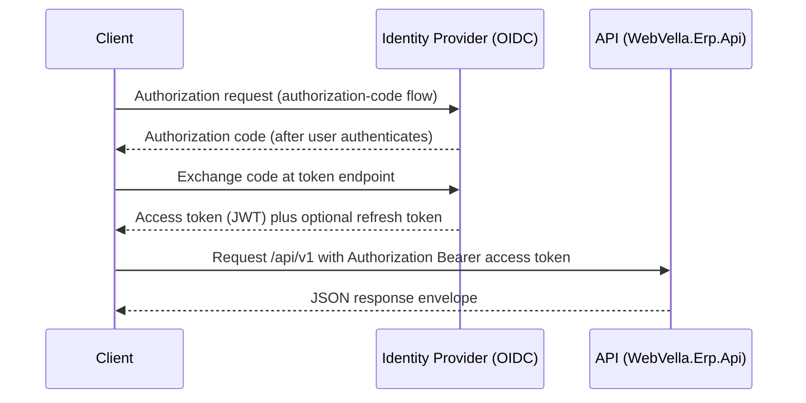

<!--{"sort_order":3, "name": "authentication", "label": "Authentication"}-->
# Authentication

The `/api/v1/` surface authenticates every protected request with an
**OpenID Connect (OIDC)**-issued **JSON Web Token (JWT)** presented as an HTTP
**Bearer** token. This replaces the session **authorization cookie** used by the
legacy RazorPages web application, whose Web API performed authorization through
a browser cookie. All of the guidance below is deliberately provider-neutral;
the concrete identity provider is an open decision (see
[Identity provider](#identity-provider)).

Source: /docs/developer/web-api/overview.md:L31 (legacy cookie authorization), /WebVella.Erp.Site/JWT_README.txt (existing JWT notes, now superseded)

## Obtaining a token

`/api/v1/` is a **resource server**: it *consumes* access tokens but does not
*issue* them. Tokens are obtained from the platform's OIDC identity provider
using the **authorization-code flow**:

1. The client redirects the user to the identity provider's authorization
   endpoint.
2. The user authenticates with the identity provider.
3. The identity provider redirects back to the client with a short-lived
   **authorization code**.
4. The client exchanges that code at the token endpoint for an **access token**
   (a JWT) and, optionally, a **refresh token**.

The exact endpoints and client registration are provider-specific — see the
[Identity provider](#identity-provider) decision point below. The fuller
sequence, including claim-mapping internals, lives in the architecture companion,
[Security](../architecture/security.md).



## Authorizing requests

Every protected `/api/v1/` request must carry the access token in the HTTP
`Authorization` header using the `Bearer` scheme:

```http
GET https://<host>/api/v1/record/... HTTP/1.1
Authorization: Bearer <access_token>
```

This bearer header **replaces** the legacy `erp_auth_base` authorization cookie
that the RazorPages host relied on. The legacy `JWT_OR_COOKIE` policy scheme —
which forwarded to bearer validation only when an `Authorization: Bearer` header
was present and otherwise fell back to the cookie — does **not** apply to
`/api/v1/`. The headless surface is **bearer-JWT-only**: there is no cookie
fallback.

Source: /WebVella.Erp.Site/JWT_README.txt (legacy cookie name `erp_auth_base` and `JWT_OR_COOKIE` policy scheme), /docs/developer/web-api/overview.md:L31 (legacy cookie authorization)

## Token validation

The API validates each presented JWT before honoring a request. Four checks are
enabled — the token's **issuer**, its **audience**, its **lifetime**, and its
**signature** against the configured **issuer signing key** — corresponding to
`ValidateIssuer`, `ValidateAudience`, `ValidateLifetime`, and
`ValidateIssuerSigningKey` in the bearer `TokenValidationParameters`. A token
that fails any check is rejected with `401 Unauthorized` (see [Errors](#errors)).

Source: /WebVella.Erp.Site/JWT_README.txt (TokenValidationParameters: ValidateIssuer, ValidateAudience, ValidateLifetime, ValidateIssuerSigningKey)

| Parameter | Config key | Value | Validation |
|-----------|------------|-------|------------|
| Issuer | `Jwt:Issuer` | `webvella-erp` (default) | `ValidateIssuer` — the token `iss` claim must equal the configured issuer. |
| Audience | `Jwt:Audience` | `webvella-erp` (default) | `ValidateAudience` — the token `aud` claim must equal the configured audience. |
| Signing key | `Jwt:Key` | *Not shown — secret (Rule D).* | `ValidateIssuerSigningKey` — the token signature is verified against this key. |
| Lifetime | token `exp` / `nbf` | validated | `ValidateLifetime` — expired or not-yet-valid tokens are rejected. |

> **Security note (Rule D).** The signing key is referenced only by its
> configuration **key name**, `Jwt:Key`. Its value is a secret and is **never**
> reproduced in documentation, logs, or examples; supply it through an
> environment variable or a Kubernetes Secret. See the
> [Configuration reference](../deployment/configuration-reference.md) for how the
> key, issuer, and audience are provided to the API host.

The issuer and audience **names** default to the non-secret identifier
`webvella-erp`; only the signing-key *value* is sensitive.

## Scopes

Access tokens carry **scopes** (alongside their other claims) that gate which
parts of the API a caller may use. Scope checks apply *in addition* to the token
validation above: a token can be valid yet still lack the scope an endpoint
requires, in which case the request is refused with `403 Forbidden`.

- **The exact scope names and the endpoints they gate: Not available / to be
  confirmed.** Needed: the scope catalog defined by the `WebVella.Erp.Api` host —
  the set of scope strings and the mapping of each `/api/v1/` endpoint to its
  required scope — once the endpoint definitions are finalized.

## Claim to role and permission mapping

After a token is validated, its OIDC claims are mapped onto the platform's
**roles** and **permissions**, which is what the in-process managers behind the
endpoints actually enforce:

- **Metadata / administration operations require the `Administration` role.**
  Entity and field metadata operations (`EntityManager`) and entity-relation
  operations (`EntityRelationManager`) both require the `Administration` role, so
  the mapped principal must hold it to call the corresponding entity and relation
  `/api/v1/` endpoints.
- **Record access is governed by per-entity permissions.** Access to record
  operations (`RecordManager`) depends on the permissions configured on the
  target entity rather than on a single global role.

Source: /docs/developer/server-api/overview.md:L8 (EntityManager requires `Administration` role), /docs/developer/server-api/overview.md:L16 (EntityRelationManager requires `Administration` role), /docs/developer/server-api/overview.md:L24 (RecordManager access depends on per-entity permissions)

The mapping from OIDC token claims to WebVella authorization is summarized below:

| OIDC token claim | WebVella role / permission | Effect |
|------------------|----------------------------|--------|
| Role / groups claim *(exact name to be confirmed)* | `Administration` role | Grants entity and relation metadata operations. |
| Role / groups claim *(exact name to be confirmed)* | Per-entity record permissions | Governs record CRUD; evaluated against the target entity. |

- **The exact claim names and values: Not available / to be confirmed.** Needed:
  which OIDC claim (for example a `role` or `groups` claim) carries the
  authorization data, and the claim values that map to the `Administration` role
  and to each per-entity permission. These are determined once the identity
  provider (below) is chosen and the `WebVella.Erp.Api` host defines its
  claim-mapping policy.

## Token refresh

Access tokens are short-lived. When one expires, the client uses the **refresh
token** obtained during the authorization-code exchange to request a new access
token from the identity provider's token endpoint, without forcing the user to
authenticate interactively again. A request made with an expired access token is
rejected with `401 Unauthorized`; the client should refresh and retry.

- **The refresh-token endpoint, token lifetimes, and rotation policy: Not
  available / to be confirmed.** Needed: the access-token and refresh-token
  lifetimes and the refresh/rotation policy, defined by the identity provider and
  the `WebVella.Erp.Api` host once chosen.

## Errors

Authentication and authorization failures are reported with conventional HTTP
status codes and an `application/problem+json` body:

| Status | Meaning | Typical cause |
|--------|---------|---------------|
| `401 Unauthorized` | The request is not authenticated. | A missing, invalid, malformed, or expired JWT bearer token, or a token that fails issuer, audience, or signature validation. |
| `403 Forbidden` | The caller is authenticated but not authorized. | The mapped principal lacks the required role or permission — for example a non-`Administration` caller invoking an entity/metadata endpoint, or a token missing a required scope. |

See [Errors](errors.md) for the full problem-details model and the complete list
of status codes the API can return.

Source: /docs/developer/server-api/overview.md:L8 (Administration role required for entity/metadata operations)

## Identity provider

> **Decision point — Not available / to be confirmed.** The OIDC identity
> provider for the headless platform is **undecided**: the candidates are
> **Duende IdentityServer** and **Keycloak**. All of the guidance above is
> deliberately **provider-neutral**. The provider-specific details are captured
> in the appendix below and will be completed once the provider is selected.

### Provider-specific configuration (appendix)

> **Not available / to be confirmed.** This appendix is a placeholder pending the
> identity-provider decision. Once **Duende IdentityServer** or **Keycloak** is
> chosen, it will document:
>
> - the OIDC **discovery / issuer URL** (`.well-known/openid-configuration`);
> - **client registration** for the SPA and any confidential clients (client id,
>   redirect URIs, allowed grant types);
> - the concrete **scope and claim names**, resolving the "to be confirmed" items
>   in [Scopes](#scopes) and
>   [Claim to role and permission mapping](#claim-to-role-and-permission-mapping);
> - a sample **token-endpoint** call for the authorization-code exchange — with no
>   real secrets (Rule D).

## Supersession and related pages

This page **supersedes `WebVella.Erp.Site/JWT_README.txt`**, the ad-hoc JWT setup
note from the legacy site host. That file is retained only for historical
reference; its cookie-based `JWT_OR_COOKIE` fallback does not apply to the
`/api/v1/` surface.

**Related pages**

- [Security](../architecture/security.md) — the authentication **architecture**
  companion (auth-flow internals, claim-mapping design, and provider trade-offs).
- [API Reference overview](index.md) — base URL, versioning, and the response
  envelope.
- [Errors](errors.md) — the full problem-details error model behind the `401` and
  `403` responses above.
- [OpenAPI Document](openapi.md) — authorizing calls interactively in the Scalar
  reference UI.
