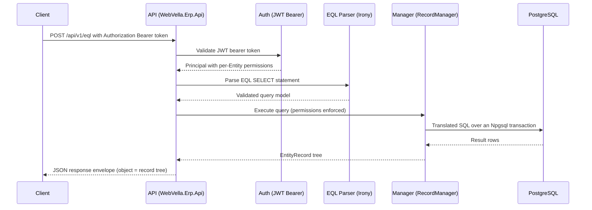

<!--{"sort_order":6, "name": "eql", "label": "EQL Query"}-->
# EQL Query

**EQL (Entity Query Language)** is WebVella's SQL-like `SELECT` language for retrieving data from Entities. The `/api/v1/eql` endpoint executes a single EQL statement and returns the resulting **`EntityRecord` tree** — a list of records in which related records are nested — inside the platform's standard [response envelope](index.md#response-envelope). This page documents the HTTP endpoint only; the complete language reference (the `SELECT`, `WHERE`, `ORDER BY`, `PAGE`/`PAGESIZE` grammar, operators, and relation traversal) lives in the developer guide and is **not duplicated** here — see [EQL Syntax](../developer/data-sources/eql.md).

Source: /docs/developer/data-sources/eql.md:L2-L4 (EQL is a SQL-like SELECT language for retrieving data from Entities)

The engine parses EQL with the **Irony** grammar parser (`Irony.NetCore` 1.1.11) and implements the language in the core engine's `Eql/` folder; the parsed statement is translated to SQL, executed over PostgreSQL through Npgsql, and materialized back into the `EntityRecord` tree returned by this endpoint.

Source: /WebVella.Erp/WebVella.Erp.csproj:L50 (Irony.NetCore 1.1.11)

## Execute an EQL query

Runs an EQL `SELECT` statement and returns the matching records as a JSON tree in the response envelope. Because a query carries a statement (and, potentially, parameters) in its body, the endpoint is a **`POST`** rather than a `GET`.

##### Authorization

This request requires a valid **OIDC-issued JWT** presented as a **bearer token** in the `Authorization` header (`Authorization: Bearer <access_token>`). Query results are further constrained by the caller's authorization: record access is governed by **per-Entity permissions**, so a query only returns records the mapped principal is permitted to read. See [Authentication](authentication.md) for how tokens are obtained, validated, and mapped to roles and permissions.

Source: /docs/developer/server-api/overview.md:L24-L26 (RecordManager access depends on the preferences selected in the corresponding entity)

##### HTTP request

```http
POST https://<host>/api/v1/eql
Content-Type: application/json
Authorization: Bearer <access_token>
```

- **The exact route template and verb: Not available / to be confirmed.** Needed: the final route and HTTP method for the EQL endpoint as defined by the `WebVella.Erp.Api` host. The `/api/v1/` version prefix is authoritative; `POST` is documented here because queries carry a request body.

##### Query parameters

No query-string parameters are required; the EQL statement is supplied in the request body.

##### Request body

A JSON object carrying the EQL statement in an `eql` field:

```json
{
  "eql": "SELECT id, name FROM demo_customer"
}
```

The EQL language itself supports **parameterized** statements — parameters are referenced with an `@` prefix (for example `WHERE contact = @contact`) and are supplied by ERP data sources or the EQL API classes internally.

- **Whether this HTTP endpoint accepts a companion `parameters` map alongside the `eql` string, and its exact shape: Not available / to be confirmed.** Needed: the request-body contract defined by the `WebVella.Erp.Api` host — specifically whether named EQL parameters (`@name`) may be passed over HTTP and, if so, the property name and value encoding.

Source: /docs/developer/data-sources/eql.md:L37-L45 (basic `SELECT field1, field2 FROM entity` and `SELECT * FROM entity` syntax), /docs/developer/data-sources/eql.md:L286-L293 (parameterized statements use an `@` prefix)

##### Request response

On success the response is the standard envelope; the `object` field holds the query result — a **list of `EntityRecord` objects** forming a tree, where each related record set appears as a nested array keyed by its relation name. The result is serialized to JSON and cannot be represented as a flat table. The `id` field is **always** included on every record even if it was not named in the `SELECT` list, because the engine always needs it and adds it automatically.

Source: /docs/developer/data-sources/eql.md:L54-L82 (results are a list of EntityRecord objects forming a tree; `id` is always added automatically)

```json
{
  "success": true,
  "message": "",
  "timestamp": "2014-03-03T23:20:23Z",
  "errors": [],
  "object": [
    { "id": "9e1c2d3c-8ce4-4c8f-a651-e54421baa09c", "name": "Alfreds Futterkiste" },
    { "id": "fc1ca2ea-f3d6-4bf5-8853-bd4a44bf37f9", "name": "Alessandro Moratti" }
  ]
}
```

The envelope fields (`success`, `message`, `timestamp`, `errors`, `object`) are described in the [API Reference overview](index.md#response-envelope).

The request pipeline for an EQL query is:



## Worked example

Select every customer together with its related addresses. EQL has **no SQL `JOIN` syntax**; related records are pulled in by referencing the relation name decorated with a `$` prefix (`$relation_name`), so `$customer_1n_address.*` nests each customer's `demo_address` records under a `$customer_1n_address` array.

Source: /docs/developer/data-sources/eql.md:L83-L90 (relations are referenced by name with a `$` prefix; EQL has no join syntax), /docs/developer/data-sources/eql.md:L123-L200 (customers with nested addresses example)

##### HTTP request

```bash
curl -X POST "https://<host>/api/v1/eql" \
  -H "Authorization: Bearer <access_token>" \
  -H "Content-Type: application/json" \
  -d '{ "eql": "SELECT *, $customer_1n_address.* FROM demo_customer" }'
```

##### Request response

```json
{
  "success": true,
  "message": "",
  "timestamp": "2014-03-03T23:20:23Z",
  "errors": [],
  "object": [
    {
      "id": "9e1c2d3c-8ce4-4c8f-a651-e54421baa09c",
      "name": "Alfreds Futterkiste",
      "contact": "Maria Anders",
      "$customer_1n_address": [
        {
          "id": "2c104d0f-d40f-48ee-8964-33265176a70c",
          "customer_id": "9e1c2d3c-8ce4-4c8f-a651-e54421baa09c",
          "address": "Tauentzienstrasse 98",
          "city": "Berlin",
          "country": "Germany"
        },
        {
          "id": "65349ebd-f6ac-4612-a127-f32ebe4f23fd",
          "customer_id": "9e1c2d3c-8ce4-4c8f-a651-e54421baa09c",
          "address": "Anry Barbuys 12",
          "city": "Plovdiv",
          "country": "Bulgaria"
        }
      ]
    },
    {
      "id": "fc1ca2ea-f3d6-4bf5-8853-bd4a44bf37f9",
      "name": "Alessandro Moratti",
      "contact": "Alessandro Moratti",
      "$customer_1n_address": [
        {
          "id": "86344903-513b-4fb3-a14e-9931083c2bd6",
          "customer_id": "fc1ca2ea-f3d6-4bf5-8853-bd4a44bf37f9",
          "address": "Viale Cassala 1",
          "city": "Milano",
          "country": "Italy"
        }
      ]
    }
  ]
}
```

Each customer record carries a `$customer_1n_address` property whose value is the list of related `demo_address` records. Every record — parent and nested — includes its `id`.

## Relations and multi-hop traversal

- **Forward relation:** `$relation_name` pulls the records related to the current record. The join direction is inferred automatically from the Entity of the parent record.
- **Reversed relation:** for a self-referencing relation (an Entity related to itself) use a double dollar, `$$relation_name`, to switch the generated join direction.
- **Multi-hop:** relations chain, for example `$rel1.$rel2.*`, producing successively nested arrays in the result tree.

Only the language reference enumerates the full rules and limitations (for example, only first-level relations are allowed in a `WHERE` clause). See [EQL Syntax](../developer/data-sources/eql.md).

Source: /docs/developer/data-sources/eql.md:L83-L90 (`$relation_name` traversal), /docs/developer/data-sources/eql.md:L202-L222 (`$$relation_name` reverses direction; multi-hop `$rel1.$rel2.*`)

## Errors and side effects

**Side effects: none.** An EQL `SELECT` is **read-only** — it retrieves data and does not create, update, or delete records, so a query has no side effects on server state.

Failures are reported with conventional HTTP status codes and an `application/problem+json` body, as documented in [Errors](errors.md):

| Status | Meaning | Typical cause for an EQL query |
|--------|---------|--------------------------------|
| `400 Bad Request` | The request was malformed. | The EQL statement failed to parse — a syntax error surfaced by the Irony grammar parser — or the request body was not valid JSON. |
| `401 Unauthorized` | The request is not authenticated. | A missing, invalid, or expired JWT bearer token — see [Authentication](authentication.md). |
| `403 Forbidden` | The caller is authenticated but not authorized. | The mapped principal lacks the per-Entity read permission required for the queried Entity. |
| `404 Not Found` | A referenced object does not exist. | The `FROM` Entity, a selected field, or a referenced relation name is unknown. |

Source: /WebVella.Erp/WebVella.Erp.csproj:L50 (Irony grammar parser used to parse EQL), /docs/developer/server-api/overview.md:L24-L26 (per-Entity permissions govern record access)

## Related pages

- [EQL Syntax](../developer/data-sources/eql.md) — the complete EQL language reference (`SELECT`, `WHERE`, `ORDER BY`, `PAGE`/`PAGESIZE`, operators, and relation traversal).
- [Records](records.md) — Record CRUD endpoints for reading and writing individual records.
- [Entities & Metadata](entities.md) — Entity and field metadata endpoints.
- [Authentication](authentication.md) — obtaining and presenting the JWT bearer token and how claims map to per-Entity permissions.
- [Errors](errors.md) — the full problem-details error model and the complete list of status codes.
