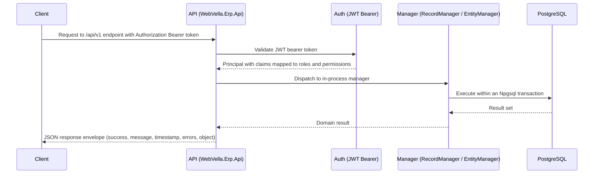

<!--{"sort_order":1, "name": "index", "label": "Overview"}-->
# API Reference

> **Planned target design — Not available in this checkout.** The `/api/v1/` REST surface described here is **proposed design**. There is **no `WebVella.Erp.Api` project and no generated OpenAPI document** in `WebVella.ERP3.sln`, so every route, HTTP method, DTO field, status code, permission, pagination parameter, and example on this page is **Not available / to be confirmed** and must be derived from the target endpoint definitions and the generated OpenAPI document once they exist (AAP §0.9.2). The **current** controllers expose legacy `/api/v3` and `/api/v3.0` routes (for example `Source: /WebVella.Erp.Web/Controllers/WebApiController.cs:L63`), not `/api/v1/`. **The examples below are illustrative design sketches, not runnable.**

The WebVella ERP REST API is planned as a RESTful, JSON-over-HTTP surface that would expose the content-management capabilities of the platform — Entities, Records, EQL queries, and files — to your own applications. In the target design it would be served under the versioned base path `/api/v1/` by the (not-yet-existing) `WebVella.Erp.Api` host as the headless successor to the legacy Web API. This section is intended to supersede the older developer Web API pages (see [In This Section](#in-this-section)).

## Base URL

All requests are made relative to the versioned base path:

```http
https://<host>/api/v1/
```

A secure certificate (HTTPS/TLS) is strongly recommended for every request to the API.

## Versioning

The API version is carried as a single segment of the URL path (`/api/v1/`), so the version is chosen explicitly on every request. Earlier iterations of the Web API embedded **two** values in the path — the version *and* a locale segment (for example `en_US`). The headless surface drops the locale segment from the route; request/response localization is handled outside the path.

- **Localization mechanism in the new surface:** **Not available / to be confirmed.** Needed: the localization strategy (for example an `Accept-Language` request header versus an explicit query parameter) as defined by the `WebVella.Erp.Api` endpoint definitions.

The existing API-change policy is retained: new extensions are added only to the latest supported version, while bug fixes and optimizations are backported to all relevant versions.

Source: /WebVella.Erp.Web/Controllers/WebApiController.cs:L63 (legacy path shape `api/v3/en_US/eql` — version + locale segments)

## Content Types

Requests and responses use `application/json` encoded as UTF-8. File uploads use `multipart/form-data`; see [Files](files.md). All timestamps — both those sent in requests and those returned in responses — are ISO 8601 strings in the UTC time zone (for example `2013-02-04T22:44:30.652Z`). The exact content-type and timestamp conventions of the target surface are **Not available / to be confirmed** until the `WebVella.Erp.Api` endpoints exist.

## Pagination

List endpoints return results in pages so that large result sets can be traversed incrementally. A client requests a specific page and page size, and the response envelope carries the current page of items in its `object` payload.

- **Exact query-parameter names and default page size:** **Not available / to be confirmed.** Needed: the final pagination parameter names (for example `page`/`pageSize` versus `skip`/`take`) and the default page size, taken from the `WebVella.Erp.Api` endpoint definitions once they are finalized.

## Response Envelope

The **target** `/api/v1/` response contract is **Not available / to be confirmed** — it must be derived from the `WebVella.Erp.Api` response DTOs and the generated OpenAPI document once they exist. What can be documented today is the **legacy** envelope produced by the in-process managers, the `ResponseModel : BaseResponseModel` type. Its complete, verified field set is below (labelled **legacy**):

```json
{
  "timestamp": "2014-03-03T23:20:23Z",
  "success": true,
  "message": "",
  "hash": null,
  "errors": [],
  "accessWarnings": [],
  "object": {}
}
```

| Field (legacy) | JSON name | Type | Description |
|----------------|-----------|------|-------------|
| Timestamp | `timestamp` | `DateTime` | When the method executed (ISO 8601, UTC). |
| Success | `success` | `bool` | Whether the method executed successfully. |
| Message | `message` | `string` | Human-readable result message. |
| Hash | `hash` | `string` | Optional content hash; `null` by default. **Present in the legacy model — do not omit.** |
| Errors | `errors` | `List<ErrorModel>` | Validation/execution errors; empty when none. |
| AccessWarnings | `accessWarnings` | `List<AccessWarningModel>` | Access/permission warnings; empty when none. **Present in the legacy model — do not omit.** |
| Object | `object` | `object` | The payload (on `ResponseModel`). |

Source: /WebVella.Erp/Api/Models/BaseModels.cs:L8-L38 (`BaseResponseModel`: `timestamp`, `success`, `message`, `hash`, `errors`, `accessWarnings`; `StatusCode` is `[JsonIgnore]`), L40-L48 (`ResponseModel.object`).

> **Note.** The legacy `BaseResponseModel` carries **`hash`** and **`accessWarnings`** in addition to `success`/`message`/`timestamp`/`errors`. Whether the target `/api/v1/` envelope keeps, renames, or drops these — and whether it adopts an RFC 9457 problem-details shape for errors — is **Not available / to be confirmed** until the target response types and integration tests exist. See [Errors](errors.md).

## Authentication

Requests that require authorization present an OIDC-issued JSON Web Token (JWT) as a bearer token in the `Authorization` header (`Authorization: Bearer <token>`). This replaces the legacy session-based authorization credential used by the older Web API. Token issuance, validation, scopes, and the claim-to-role/permission mapping are covered in full in [Authentication](authentication.md).

## Request Pipeline

In the target design, an authenticated request would first pass JWT bearer validation, then be dispatched to the matching `/api/v1/` endpoint, and finally delegate to the platform's **in-process managers** — the same `EntityManager` and `RecordManager` documented under [Server API](../developer/server-api/overview.md). Those managers are unchanged by the refactor and continue to run in-process today; in the headless target the REST host would be a thin transport layer in front of them. Data access is performed through Npgsql transactions against PostgreSQL. The exact pipeline (middleware order, validation, error mapping) is **Not available / to be confirmed** until the `WebVella.Erp.Api` host exists; the diagram below is an illustrative design sketch.



Source: /WebVella.Erp/Api/RecordManager.cs:L15 (RecordManager), /WebVella.Erp/WebVella.Erp.csproj:L61 (Npgsql 9.0.4, PostgreSQL access)

## In This Section

- [OpenAPI Document](openapi.md) — how the OpenAPI 3.1 document is generated and browsed.
- [Authentication](authentication.md) — OIDC/JWT bearer tokens, scopes, and claim mapping.
- [Records](records.md) — Record CRUD endpoints.
- [Entities & Metadata](entities.md) — Entity and metadata endpoints.
- [EQL Query](eql.md) — the EQL query endpoint and syntax.
- [Files](files.md) — file upload and download endpoints.
- [Errors](errors.md) — the problem-details error model and status codes.

**Related:** the in-process managers behind these endpoints are documented under [Server API](../developer/server-api/overview.md). The legacy [Web API overview](../developer/web-api/overview.md) is superseded by this section.
