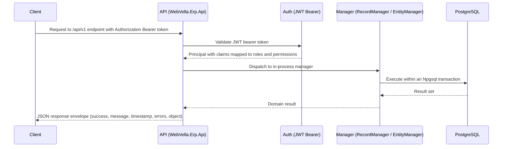

<!--{"sort_order":1, "name": "index", "label": "Overview"}-->
# API Reference

The WebVella ERP REST API is a RESTful, JSON-over-HTTP surface that exposes the content-management capabilities of the platform — Entities, Records, EQL queries, and files — to your own applications. It is served under the versioned base path `/api/v1/` by the `WebVella.Erp.Api` host and is the headless successor to the legacy Web API. This section supersedes the older developer Web API pages (see [In This Section](#in-this-section)).

Source: /docs/developer/web-api/overview.md:L4

## Base URL

All requests are made relative to the versioned base path:

```http
https://<host>/api/v1/
```

A secure certificate (HTTPS/TLS) is strongly recommended for every request to the API.

Source: /docs/developer/web-api/overview.md:L27

## Versioning

The API version is carried as a single segment of the URL path (`/api/v1/`), so the version is chosen explicitly on every request. Earlier iterations of the Web API embedded **two** values in the path — the version *and* a locale segment (for example `en_US`). The headless surface drops the locale segment from the route; request/response localization is handled outside the path.

- **Localization mechanism in the new surface:** **Not available / to be confirmed.** Needed: the localization strategy (for example an `Accept-Language` request header versus an explicit query parameter) as defined by the `WebVella.Erp.Api` endpoint definitions.

The existing API-change policy is retained: new extensions are added only to the latest supported version, while bug fixes and optimizations are backported to all relevant versions.

Source: /docs/developer/web-api/overview.md:L25 (legacy path shape), /docs/developer/web-api/overview.md:L18 (change policy)

## Content Types

Requests and responses use `application/json` encoded as UTF-8. File uploads use `multipart/form-data`; see [Files](files.md). All timestamps — both those sent in requests and those returned in responses — are ISO 8601 strings in the UTC time zone (for example `2013-02-04T22:44:30.652Z`).

Source: /docs/developer/web-api/overview.md:L10

## Pagination

List endpoints return results in pages so that large result sets can be traversed incrementally. A client requests a specific page and page size, and the response envelope carries the current page of items in its `object` payload.

- **Exact query-parameter names and default page size:** **Not available / to be confirmed.** Needed: the final pagination parameter names (for example `page`/`pageSize` versus `skip`/`take`) and the default page size, taken from the `WebVella.Erp.Api` endpoint definitions once they are finalized.

## Response Envelope

Every response is wrapped in the platform's standard envelope, so successful and failed results share a single, predictable shape:

```json
{
  "success": true,
  "message": "",
  "timestamp": "2014-03-03T23:20:23Z",
  "errors": [],
  "object": {}
}
```

| Field | Type | Description |
|-------|------|-------------|
| `success` | `bool` | Whether the method executed successfully. |
| `message` | `string` | Human-readable result message, often surfaced to the end user. |
| `timestamp` | `DateTime` | When the method executed, as an ISO 8601 string in the UTC time zone. |
| `errors` | `List<ErrorModel>` | Validation or execution errors; empty when none are reported. Each entry is `{ key, value, message }`. |
| `object` | `object` | The payload returned by the method — a single object or a list. |

Error responses follow the problem-details model documented in [Errors](errors.md).

Source: /docs/developer/web-api/response.md

## Authentication

Requests that require authorization present an OIDC-issued JSON Web Token (JWT) as a bearer token in the `Authorization` header (`Authorization: Bearer <token>`). This replaces the legacy session-based authorization credential used by the older Web API. Token issuance, validation, scopes, and the claim-to-role/permission mapping are covered in full in [Authentication](authentication.md).

Source: /docs/developer/web-api/overview.md:L31

## Request Pipeline

An authenticated request first passes JWT bearer validation, is then dispatched to the matching `/api/v1/` endpoint, and finally delegates to the platform's **in-process managers** — the same `EntityManager` and `RecordManager` documented under [Server API](../developer/server-api/overview.md). Those managers are unchanged by the refactor and continue to run in-process; the REST host is a thin transport layer in front of them. Data access is performed through Npgsql transactions against PostgreSQL.



Source: /docs/developer/server-api/overview.md:L22 (RecordManager), /WebVella.Erp/WebVella.Erp.csproj:L61 (Npgsql 9.0.4, PostgreSQL access)

## In This Section

- [OpenAPI Document](openapi.md) — how the OpenAPI 3.1 document is generated and browsed.
- [Authentication](authentication.md) — OIDC/JWT bearer tokens, scopes, and claim mapping.
- [Records](records.md) — Record CRUD endpoints.
- [Entities & Metadata](entities.md) — Entity and metadata endpoints.
- [EQL Query](eql.md) — the EQL query endpoint and syntax.
- [Files](files.md) — file upload and download endpoints.
- [Errors](errors.md) — the problem-details error model and status codes.

**Related:** the in-process managers behind these endpoints are documented under [Server API](../developer/server-api/overview.md). The legacy [Web API overview](../developer/web-api/overview.md) is superseded by this section.
