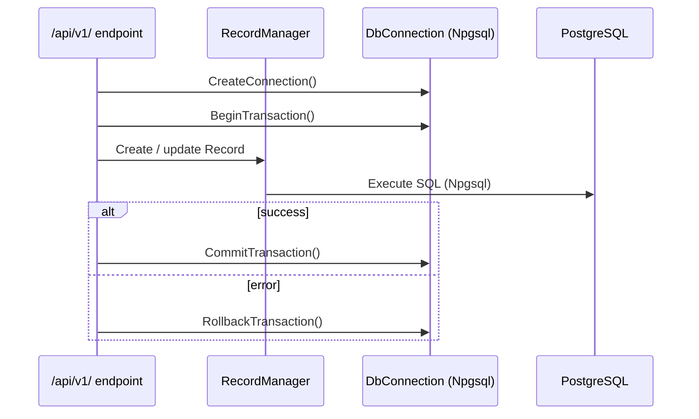

<!--{"sort_order":4, "name": "data-access", "label": "Data Access"}-->

# Data Access

The WebVella ERP core engine persists Entities and Records to PostgreSQL through a thin data-access layer in the core engine's `Database/` folder — the layer the refactor specification calls "WebVella.Database" — which talks to **Npgsql directly, with no ORM** (`Source: /WebVella.Erp/WebVella.Erp.csproj:L61` — `<PackageReference Include="Npgsql" Version="[9.0.4]" />`, Npgsql **9.0.4**). The headless refactor leaves this layer, and the PostgreSQL schema it targets, **unchanged**; only the *hosting* around it changed, so the Minimal API endpoints of `WebVella.Erp.Api` now open the connection and transaction that the retired RazorPages host used to open. See the [Architecture Overview](overview.md) for how this layer sits beneath the API host, the worker, and plugins.

## Connection and transaction scoping

Every unit of work obtains a connection from the engine's connection factory, `DbContext.CreateConnection()` (`Source: /WebVella.Erp/Database/DbContext.cs:L54`), which returns a `DbConnection`. `DbConnection` is a thin wrapper over Npgsql — `using Npgsql;` (`Source: /WebVella.Erp/Database/DbConnection.cs:L2`) — and holds a single `NpgsqlConnection connection;` together with its `NpgsqlTransaction transaction;` (`Source: /WebVella.Erp/Database/DbConnection.cs:L16-L17`).

Transaction boundaries are controlled by three methods on `DbConnection`:

| Method | Purpose | Source |
| --- | --- | --- |
| `BeginTransaction()` | Opens the transaction (or a nested savepoint when one is already open) | `Source: /WebVella.Erp/Database/DbConnection.cs:L115` |
| `CommitTransaction()` | Commits the transaction (or releases the innermost savepoint) | `Source: /WebVella.Erp/Database/DbConnection.cs:L134` |
| `RollbackTransaction()` | Rolls the transaction (or savepoint) back | `Source: /WebVella.Erp/Database/DbConnection.cs:L161` |

A single request — or a single plugin migration — runs **inside one transaction**: everything between `BeginTransaction()` and `CommitTransaction()` is applied **all-or-nothing**, and any failure triggers `RollbackTransaction()` so no partial state is persisted. Nested `BeginTransaction()` calls are mapped to PostgreSQL savepoints, so an inner scope can roll back without discarding the outer unit of work (`Source: /WebVella.Erp/Database/DbConnection.cs:L115`).

```csharp
using var connection = DbContext.CreateConnection();
connection.BeginTransaction();
try
{
    // create / update / delete Records via RecordManager
    connection.CommitTransaction();
}
catch
{
    connection.RollbackTransaction();
    throw;
}
```

*The connection and transaction lifecycle above is defined in `Source: /WebVella.Erp/Database/DbContext.cs:L54` and `Source: /WebVella.Erp/Database/DbConnection.cs:L115,L134,L161`.*

## Records and EQL

Record create/read/update/delete flows through `RecordManager` (`Source: /WebVella.Erp/Api/RecordManager.cs:L15`), the Record CRUD entry point: `CreateRecord` (`Source: /WebVella.Erp/Api/RecordManager.cs:L206`), `UpdateRecord` (`Source: /WebVella.Erp/Api/RecordManager.cs:L904`), `DeleteRecord` (`Source: /WebVella.Erp/Api/RecordManager.cs:L1579`), and `Find(EntityQuery)` for queries (`Source: /WebVella.Erp/Api/RecordManager.cs:L1736`).

`RecordManager` participates in the **ambient** connection/transaction: its constructor accepts an optional `DbContext` and otherwise falls back to `DbContext.Current` (`Source: /WebVella.Erp/Api/RecordManager.cs:L40`). As a result, Record operations and **EQL** queries execute on the *same* connection and transaction the endpoint opened, so an EQL query and the writes around it share one unit of work. The REST surface that exposes these operations — including the Records and EQL endpoint pages — is documented in the [API Reference](../api-reference/index.md).

## Plugin migrations share the transaction

`DbConnection` imports `using System.Data;` (`Source: /WebVella.Erp/Database/DbConnection.cs:L8`) and its transaction field is an `NpgsqlTransaction` (`Source: /WebVella.Erp/Database/DbConnection.cs:L16`). Because `NpgsqlTransaction` implements `System.Data.IDbTransaction` — it is the ADO.NET transaction type of Npgsql **9.0.4** (`Source: /WebVella.Erp/WebVella.Erp.csproj:L61`) — the host can hand its **open** transaction directly to a plugin.

When the host invokes a plugin's `OnMigrateAsync(IDbTransaction)`, the plugin therefore receives the **same host-owned transaction** instead of opening its own. Its schema patches commit or roll back **atomically with the host's unit of work**: if any step fails, `RollbackTransaction()` (`Source: /WebVella.Erp/Database/DbConnection.cs:L161`) discards both the host's changes and the plugin's schema patches together. See [Plugin migrations — OnMigrateAsync](../plugin-sdk/migrations-onmigrateasync.md) for the plugin-side contract, and the [Plugin host](plugin-host.md) for how migrations are sequenced during load.

## Schema is unchanged

This is a documentation-only concern: the headless refactor does **not** alter the PostgreSQL schema or the data-access code in `Database/`, and it does not change the SQL that code issues. The core engine keeps its identity — package version **1.7.7** (`Source: /WebVella.Erp/WebVella.Erp.csproj:L11`) targeting `net10.0` (`Source: /WebVella.Erp/WebVella.Erp.csproj:L4`) — and only the *hosting* changed, with Minimal API endpoints assuming the connection/transaction lifecycle that RazorPages previously owned. The authoritative runtime string is a decision point (".NET 9" versus `net10.0`) and is **Not available / to be confirmed**; see the [Architecture Overview](overview.md).

## Connection configuration

`DbContext` keeps the PostgreSQL connection string in a private field (`Source: /WebVella.Erp/Database/DbContext.cs:L28`) that `CreateConnection()` uses when opening a new connection (`Source: /WebVella.Erp/Database/DbContext.cs:L54`). The connection string is supplied through configuration **by key name only** — this page never prints a literal connection string, host, user, or password. For the environment-variable / Kubernetes Secret key that carries the PostgreSQL connection string, see the [Configuration Reference](../deployment/configuration-reference.md).

## Request/transaction flow



*Request/transaction flow — the transaction boundary calls are defined at `Source: /WebVella.Erp/Database/DbConnection.cs:L115,L134,L161`, and the connection is created by `Source: /WebVella.Erp/Database/DbContext.cs:L54`.*
