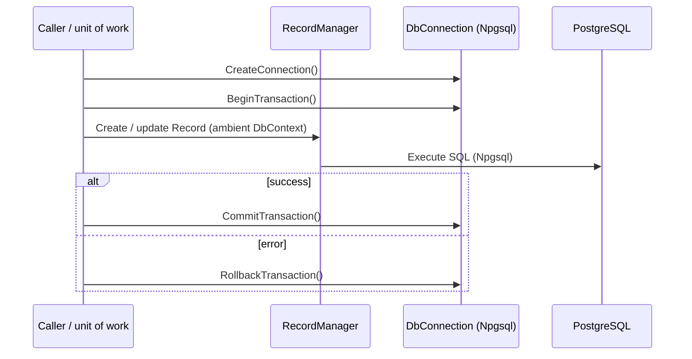

<!--{"sort_order":4, "name": "data-access", "label": "Data Access"}-->

# Data Access

> **Current behavior documented; target request-scoping is planned.** The connection and transaction primitives on this page are **present and verified** in the core engine's `Database/` folder. What is **not** yet present is any `/api/v1/` request that owns a transaction for its duration: `WebVella.Erp.Api` does not exist in this checkout, so the *binding of a transaction to an API request boundary* — and any host-owned, cross-plugin transaction — is **Not available / to be confirmed** and is marked as such below. It requires the API host's DI/middleware code to exist before it can be documented (AAP §0.9.2).

The WebVella ERP core engine persists Entities and Records to PostgreSQL through a thin data-access layer in the core engine's `Database/` folder — the layer the refactor specification calls "WebVella.Database" — which talks to **Npgsql directly, with no ORM** (`Source: /WebVella.Erp/WebVella.Erp.csproj:L61` — `<PackageReference Include="Npgsql" Version="[9.0.4]" />`). The headless refactor leaves this layer, and the PostgreSQL schema it targets, **unchanged**; only the *hosting* around it is planned to change. See the [Architecture Overview](overview.md) for how this layer is intended to sit beneath the planned API host, worker, and plugins.

## Connection and transaction scoping (current)

Every unit of work obtains a connection from the engine's connection factory, `DbContext.CreateConnection()` (`Source: /WebVella.Erp/Database/DbContext.cs:L54`), which returns a `DbConnection`. `DbConnection` is a thin wrapper over Npgsql — `using Npgsql;` (`Source: /WebVella.Erp/Database/DbConnection.cs:L2`) — and holds a single `NpgsqlConnection connection;` and its `NpgsqlTransaction transaction;` (`Source: /WebVella.Erp/Database/DbConnection.cs:L16-L17`).

Transaction boundaries are controlled by three methods on `DbConnection`:

| Method | Purpose | Source |
| --- | --- | --- |
| `BeginTransaction()` | Opens the transaction (or a nested savepoint when one is already open) | `Source: /WebVella.Erp/Database/DbConnection.cs:L115` |
| `CommitTransaction()` | Commits the transaction (or releases the innermost savepoint) | `Source: /WebVella.Erp/Database/DbConnection.cs:L134` |
| `RollbackTransaction()` | Rolls the transaction (or savepoint) back | `Source: /WebVella.Erp/Database/DbConnection.cs:L161` |

A single **unit of work** runs **inside one transaction**: everything between `BeginTransaction()` and `CommitTransaction()` is applied **all-or-nothing**, and any failure triggers `RollbackTransaction()` so no partial state is persisted. Nested `BeginTransaction()` calls are mapped to PostgreSQL savepoints — only the outermost caller (`initialTransactionHolder`) owns the real transaction — so an inner scope can roll back without discarding the outer unit of work (`Source: /WebVella.Erp/Database/DbConnection.cs:L115-L179`).

```csharp
// Current usage pattern (illustrative).
using var connection = DbContext.CreateConnection();
connection.BeginTransaction();
try
{
    // create / update / delete Records via RecordManager
    connection.CommitTransaction();
}
catch
{
    connection.RollbackTransaction();
    throw;
}
```

*The connection and transaction lifecycle above is defined in `Source: /WebVella.Erp/Database/DbContext.cs:L54` and `Source: /WebVella.Erp/Database/DbConnection.cs:L115,L134,L161`.*

Who **opens** and **owns** that unit of work today is the **caller** — for example a RazorPages handler in the legacy host, the console app, or a plugin's `Initialize`. Binding one transaction to the lifetime of an `/api/v1/` request (open on request start, commit or roll back on request end via DI/middleware) is **target design and Not available**: it requires the `WebVella.Erp.Api` request pipeline, which does not exist. Until that code lands, the exact ownership, enlistment, nesting, disposal, and failure semantics of a request-scoped transaction cannot be documented as fact.

## Records and EQL (current ambient binding)

Record create/read/update/delete flows through `RecordManager` (`Source: /WebVella.Erp/Api/RecordManager.cs:L15`): `CreateRecord` (`Source: /WebVella.Erp/Api/RecordManager.cs:L206`), `UpdateRecord` (`Source: /WebVella.Erp/Api/RecordManager.cs:L904`), `DeleteRecord` (`Source: /WebVella.Erp/Api/RecordManager.cs:L1579`), and `Find(EntityQuery)` for queries, including EQL (`Source: /WebVella.Erp/Api/RecordManager.cs:L1736`).

`RecordManager` participates in the **ambient** connection/transaction: its `CurrentContext` property returns a supplied `DbContext` if the constructor received one, and otherwise resolves the ambient `DbContext.Current` (`Source: /WebVella.Erp/Api/RecordManager.cs:L28-L37,L40`; ambient context `Source: /WebVella.Erp/Database/DbContext.cs:L12-L15`). As a result, Record operations and EQL queries execute on **whatever connection/transaction is ambient on the current async context** — so a query and the writes around it share one unit of work **when the caller has opened one**. This is a property of the ambient `DbContext`, **not** proof of an API request boundary: the request-scoped binding under `/api/v1/` is **Not available** (see above). The REST surface that would expose these operations is described — as planned design — in the [API Reference](../api-reference/index.md).

## Plugin migrations — current per-plugin transaction (target host-owned: pending)

**Current:** a plugin manages **its own** transaction during `Initialize`. The SDK plugin opens a connection from `DbContext.Current`, begins a transaction, writes, commits, and rolls back on error — it is **not** enrolled in a shared, host-owned transaction (`Source: /WebVella.Erp.Plugins.SDK/SdkPlugin._.cs:L31,L35,L155,L158-L161`). Because each plugin commits independently, a later plugin failing does **not** roll back an earlier plugin's committed changes.

**Type note (verified):** the transaction field is an `NpgsqlTransaction` (`Source: /WebVella.Erp/Database/DbConnection.cs:L16`), and `NpgsqlTransaction` implements ADO.NET's `System.Data.IDbTransaction` (`using System.Data;` — `Source: /WebVella.Erp/Database/DbConnection.cs:L8`). So a host *could* technically pass an open `IDbTransaction` to a plugin — but no such host exists today.

**Target (Not available):** the planned `OnMigrateAsync(IDbTransaction)` contract — in which the host hands a plugin the **same host-owned transaction** so all plugin patches commit or roll back atomically with the host's unit of work — is **proposed design**. There is no `OnMigrateAsync` method and no host-owned cross-plugin transaction in this checkout. Whether the target host owns one transaction across all plugins, and the exact ownership, ordering, and rollback scope, are **Not available / to be confirmed** until the host code exists. See [Plugin migrations — OnMigrateAsync](../plugin-sdk/migrations-onmigrateasync.md) for the planned plugin-side contract and the [Plugin host](plugin-host.md) for the pending sequencing.

## Schema is unchanged

The headless refactor does **not** alter the PostgreSQL schema or the data-access code in `Database/`, and it does not change the SQL that code issues. The core engine keeps its identity — package version **1.7.7** (`Source: /WebVella.Erp/WebVella.Erp.csproj:L11`) targeting `net10.0` (`Source: /WebVella.Erp/WebVella.Erp.csproj:L4`) — and only the *hosting* is planned to change. The authoritative runtime string is a decision point (".NET 9" versus `net10.0`) and is **Not available / to be confirmed**; see the [Architecture Overview](overview.md).

## Connection configuration

`DbContext` keeps the PostgreSQL connection string in a private static field (`Source: /WebVella.Erp/Database/DbContext.cs:L28`) that `CreateConnection()` uses when opening a new connection (`Source: /WebVella.Erp/Database/DbContext.cs:L54`). The connection string is supplied through configuration **by key name only** — this page never prints a literal connection string, host, user, or password. For the environment-variable / Kubernetes Secret key that would carry the PostgreSQL connection string, see the [Configuration Reference](../deployment/configuration-reference.md).

## Current transaction flow

The diagram shows the **current** transaction-boundary calls, which are real and unchanged. The caller that opens the unit of work is a legacy host handler, the console app, or a plugin today; under the **planned** `/api/v1/` host it would be an API endpoint (that request-boundary binding is **Not available**, per above).



*Current transaction flow — the transaction boundary calls are defined at `Source: /WebVella.Erp/Database/DbConnection.cs:L115,L134,L161`, and the connection is created by `Source: /WebVella.Erp/Database/DbContext.cs:L54`. The caller shown is whichever component opened the unit of work; a request-scoped `/api/v1/` binding is planned and Not available.*

## Key citations

- Connection factory `DbContext.CreateConnection()` — Source: /WebVella.Erp/Database/DbContext.cs:L54
- Ambient `DbContext.Current` — Source: /WebVella.Erp/Database/DbContext.cs:L12-L15
- Connection-string field — Source: /WebVella.Erp/Database/DbContext.cs:L28
- `DbConnection` fields and Npgsql / ADO.NET usings — Source: /WebVella.Erp/Database/DbConnection.cs:L2,L8,L16-L17
- Transaction boundary methods and nested savepoints — Source: /WebVella.Erp/Database/DbConnection.cs:L115,L134,L161,L115-L179
- `RecordManager`, its `CurrentContext` resolver, and CRUD/EQL entry points — Source: /WebVella.Erp/Api/RecordManager.cs:L15,L28-L37,L40,L206,L904,L1579,L1736
- Current per-plugin transaction — Source: /WebVella.Erp.Plugins.SDK/SdkPlugin._.cs:L31,L35,L155,L158-L161
- Request-scoped `/api/v1/` transaction and host-owned `OnMigrateAsync(IDbTransaction)` — **Not available** (requires `WebVella.Erp.Api` and the plugin SDK contract)
