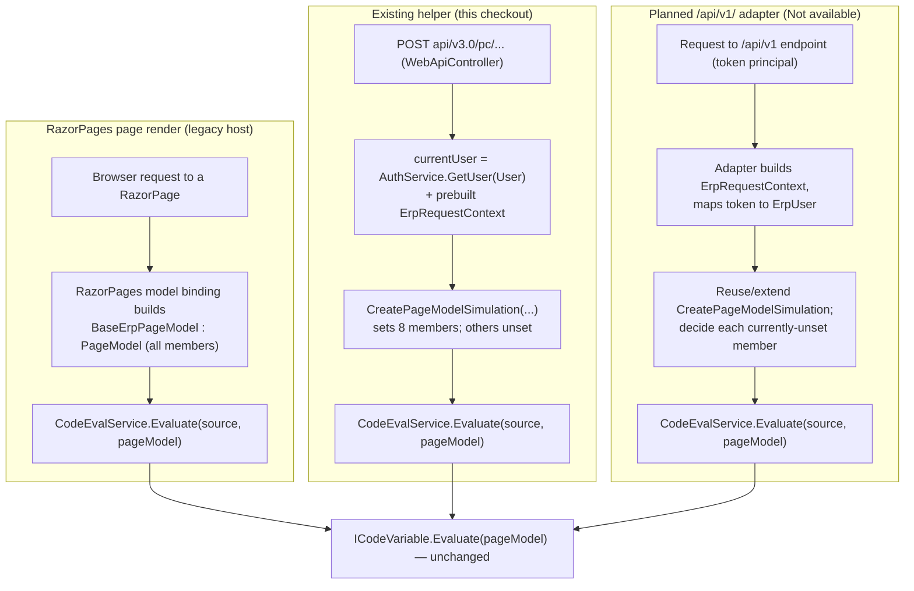

<!--{"sort_order":2, "name": "icodevariable-adapter", "label": "ICodeVariable Adapter"}-->

# The ICodeVariable / BaseErpPageModel Adapter

Code variables are administrator-authored C# snippets that implement `ICodeVariable` and are evaluated with a `BaseErpPageModel` argument to compute a value from the current page/request state. Source: /WebVella.Erp.Web/Models/ICodeVariable.cs:L3-L6. Because `BaseErpPageModel` derives from the RazorPages `PageModel`, it exists naturally inside the RazorPages request lifecycle. Source: /WebVella.Erp.Web/Models/BaseErpPageModel.cs:L18. A compatibility shim that synthesizes a `BaseErpPageModel` **outside** a full page render already exists today: the static helper `BaseErpPageModel.CreatePageModelSimulation(ErpRequestContext, ErpUser)`. Source: /WebVella.Erp.Web/Models/BaseErpPageModel.cs:L403-L418. This page documents that existing helper and its single current caller, states exactly which members it maps and which it leaves unset, and then describes — as **planned, not-yet-built** work — what a `/api/v1/` adapter would additionally have to do. The `/api/v1/` host and any successor adapter are built by the code workstream and are out of scope here (AAP §0.9.2).

> **Status.** The existing `CreatePageModelSimulation` helper and its caller are present in this checkout and are described here as **current** behavior. The headless `/api/v1/` surface, its request pipeline, and any dedicated page-model adapter for that surface **do not exist yet** (`WebVella.Erp.Api` is absent from `WebVella.ERP3.sln`); every `/api/v1/`-specific mapping below is therefore labelled **planned / Not available**.

## Purpose — why BaseErpPageModel is required

`ICodeVariable.Evaluate(BaseErpPageModel pageModel)` is the single extension point that computed data-source and page values run through. Source: /WebVella.Erp.Web/Models/ICodeVariable.cs:L3-L6. It is invoked today through the data-source variable evaluator. Source: /WebVella.Erp.Web/Models/PageDataModel.cs:L433,L437,L454,L472.

The public API being kept alive is documented below (rule B).

- **Purpose** — compute a value (a data-source/page value) from page and request state. Source: /WebVella.Erp.Web/Models/ICodeVariable.cs:L5.
- **Input** — a single `BaseErpPageModel pageModel` carrying the current user, route/record identifiers, and request context. Source: /WebVella.Erp.Web/Models/ICodeVariable.cs:L5.
- **Output** — an `object` (the boxed computed value returned to the caller). Source: /WebVella.Erp.Web/Models/ICodeVariable.cs:L5.
- **Side effects** — author-defined; a well-behaved code variable is read-only and only reads members of `pageModel`. Source: /WebVella.Erp.Web/Snippets/EmptySampleClassSnippet.cs:L9-L22.
- **Error modes** — author code may throw or dereference members the host leaves unset; the evaluator additionally throws `ArgumentException` when the snippet source is empty. Source: /WebVella.Erp.Web/Services/CodeEvalService.cs:L29-L30. See [Failure modes and troubleshooting](#failure-modes-and-troubleshooting).

`BaseErpPageModel` derives from `PageModel`, and several of its members are populated by the RazorPages lifecycle: `AppName`/`AreaName`/`NodeName`/`PageName` and `RecordId`/`RelationId`/`ParentRecordId` are declared with `[BindProperty(SupportsGet = true)]` and arrive through model binding. Source: /WebVella.Erp.Web/Models/BaseErpPageModel.cs:L32-L51. `HookKey` reaches into `PageContext.HttpContext.Request.Query`. Source: /WebVella.Erp.Web/Models/BaseErpPageModel.cs:L78-L87. Because those members depend on the RazorPages request, code that needs a `BaseErpPageModel` outside a page render must obtain one some other way — which is exactly what `CreatePageModelSimulation` provides.

## The existing compatibility shim (current behavior)

`CreatePageModelSimulation` constructs a `BaseErpPageModel` from an already-built `ErpRequestContext` and an `ErpUser`, without a RazorPages page render. Source: /WebVella.Erp.Web/Models/BaseErpPageModel.cs:L403-L418. It is called from exactly one place in this checkout — the web-API component-render endpoint `PageComponentRenderViews` (route `api/v3.0/pc/{fullComponentName}/view/{renderMode}`, `HttpPost`). Source: /WebVella.Erp.Web/Controllers/WebApiController.cs:L822-L824,L952-L960.

At that caller the user is taken from the **current request principal** via `AuthService.GetUser(User)` — i.e. whatever scheme authenticated the request (in the legacy host, cookie or the `JWT_OR_COOKIE` policy), **not** a JWT principal specifically. Source: /WebVella.Erp.Web/Controllers/WebApiController.cs:L952-L955.

```csharp
// Current code, condensed (WebVella.Erp.Web/Controllers/WebApiController.cs:952-960).
var currentUser = AuthService.GetUser(User);              // current request principal
var baseErpPageMode = BaseErpPageModel.CreatePageModelSimulation(
    erpRequestContext: erpRequestContext,                 // built earlier in the action
    currentUser: currentUser);
pageModel = baseErpPageMode.DataModel;                    // used for component rendering
// Code variables ultimately evaluate through the UNCHANGED entry point:
// CodeEvalService.Evaluate(sourceCode, baseErpPageMode).
```

The evaluation entry point does not change: the synthesized model is handed to the same `CodeEvalService.Evaluate(sourceCode, pageModel)` used everywhere else. Source: /WebVella.Erp.Web/Services/CodeEvalService.cs:L51-L54. Snippets are compiled to an `ICodeVariable` via CS-Script and cached, so a given snippet compiles once and then runs identically regardless of how the `pageModel` was produced. The cache is a `static` dictionary keyed on the snippet source string; the first call compiles the snippet and stores it, and every later call with the same source returns the cached `ICodeVariable` without recompiling. Source: /WebVella.Erp.Web/Services/CodeEvalService.cs:L13 (the `scriptObjects` cache), L33-L34 (cache-hit fast path returns the cached instance without recompiling), L45-L46 (first call compiles via `LoadCode` and stores the result).

### What the helper maps, and what it leaves unset

The helper sets **eight** members and leaves everything else at its field default. The table lists the exact current behavior; no behavioral parity is claimed for the members it does not touch.

| BaseErpPageModel member | Set by `CreatePageModelSimulation`? | Detail (Source) |
|-------------------------|-------------------------------------|-----------------|
| `ErpRequestContext` | ✅ set | assigned from the `erpRequestContext` argument. /WebVella.Erp.Web/Models/BaseErpPageModel.cs:L409 |
| `CurrentUser` (backing `currentUser`) | ✅ set | assigned from the `currentUser` argument (the caller passes `AuthService.GetUser(User)`); the lazy `User`-based resolver at L21-L30 is bypassed. /WebVella.Erp.Web/Models/BaseErpPageModel.cs:L410,L20-L30 |
| `AppName` | ✅ set | `erpRequestContext.App?.Name` else `""`. /WebVella.Erp.Web/Models/BaseErpPageModel.cs:L411 |
| `AreaName` | ✅ set | `erpRequestContext.SitemapArea?.Name` else `""`. /WebVella.Erp.Web/Models/BaseErpPageModel.cs:L412 |
| `NodeName` | ✅ set | `erpRequestContext.SitemapNode?.Name` else `""`. /WebVella.Erp.Web/Models/BaseErpPageModel.cs:L413 |
| `PageName` | ✅ set | `erpRequestContext.Page?.Name` else `""`. /WebVella.Erp.Web/Models/BaseErpPageModel.cs:L414 |
| `RecordId` | ✅ set | `erpRequestContext.RecordId`. /WebVella.Erp.Web/Models/BaseErpPageModel.cs:L415 |
| `DataModel` | ✅ set | `new PageDataModel(pageModel)`. /WebVella.Erp.Web/Models/BaseErpPageModel.cs:L416 |
| `RelationId`, `ParentRecordId` | ❌ **unset** (null) | not copied, even though `ErpRequestContext` carries them (/WebVella.Erp.Web/ErpRequestContext.cs:L39,L41). Page-model fields stay null. /WebVella.Erp.Web/Models/BaseErpPageModel.cs:L48,L51 |
| `ErpAppContext` | ❌ **unset** (null) | never assigned by the helper. /WebVella.Erp.Web/Models/BaseErpPageModel.cs:L57 |
| `ToolbarMenu`, `SidebarMenu`, `SiteMenu`, `ApplicationMenu`, `UserMenu` | ❌ **unset** (empty lists) | populated only by page navigation, not by the helper. /WebVella.Erp.Web/Models/BaseErpPageModel.cs:L61-L69 |
| `HookKey` | ❌ **unset** (throws/empty) | computed from `PageContext.HttpContext.Request.Query`; no `PageContext` is assigned by the helper. /WebVella.Erp.Web/Models/BaseErpPageModel.cs:L78-L87 |
| `ReturnUrl`, `CurrentUrl` | ❌ **unset** (`""`) | not assigned by the helper. /WebVella.Erp.Web/Models/BaseErpPageModel.cs:L74,L76 |
| `PageContext` / `HttpContext` (from `PageModel`) | ❌ **unset** | RazorPages base members; not assigned outside a page render. /WebVella.Erp.Web/Models/BaseErpPageModel.cs:L18 |

## Trust boundary — code variables execute as fully trusted in-process code

Code variables are **not** end-user input: they are administrator-authored server-side configuration, compiled and executed **in-process with full host privileges and no sandbox**. `CodeEvalService.GetScriptObject` compiles the snippet with CS-Script — `CSScript.EvaluatorConfig.ReferenceDomainAssemblies = true` and `CSScript.Evaluator.LoadCode<ICodeVariable>(sourceCode)` — and `Evaluate` then runs `script.Evaluate(pageModel)` directly. Source: /WebVella.Erp.Web/Services/CodeEvalService.cs:L44-L47,L51-L54. Because `ReferenceDomainAssemblies` is enabled, the compiled snippet can reach any loaded assembly and perform any operation the host process can.

Consequences that the shim does **not** change and must be governed operationally:

- **No isolation from page-model adaptation.** Synthesizing a `BaseErpPageModel` (by `CreatePageModelSimulation` or any future adapter) provides **no** security boundary; it only changes what data the snippet reads. It does not restrict what the snippet can execute.
- **Authoring is *not* administrator-gated today — a security gap.** Because a code variable is privileged in-process code, only trusted administrators *should* be able to submit or compile one. In this checkout that restriction is **absent**: the compile/test entry point `WebApiController.DataSourceAction` (`POST api/v3.0/datasource/code-compile`) carries only the controller's class-level `[Authorize]` — authentication with **no role requirement** — so **any authenticated user** can POST arbitrary C# to `CodeEvalService.Compile`, which compiles it in-process with `ReferenceDomainAssemblies` enabled. Source: /WebVella.Erp.Web/Controllers/WebApiController.cs:L36 (class-level `[Authorize]`), L494-L509 (`DataSourceAction` → `CodeEvalService.Compile(model.CsCode)`). The `[Authorize(Roles = "administrator")]` attribute in the SDK admin controller gates an **unrelated** surface (sitemap-area management, `CreateSitemapArea`), **not** code-variable authoring, so it must not be cited as the authorization control for this trust boundary. Source: /WebVella.Erp.Plugins.SDK/Controllers/AdminController.cs:L53-L56. **This is a source-side authorization gap owned by the API/host implementation workstream** (restrict the compile/evaluate surface to the administrator role, or remove it from the general authenticated surface); it is recorded here as evidence (rule F) and is out of scope for this documentation-only workstream (AAP §0.9.2).
- **Failure propagation.** A thrown snippet exception either becomes `null` or propagates depending on the caller's `SafeCodeDataVariable` flag — the "safe" path catches and yields `null` (Source: /WebVella.Erp.Web/Models/PageDataModel.cs:L433,L454), the default path propagates (Source: /WebVella.Erp.Web/Models/PageDataModel.cs:L437,L472).
- **Host impact.** Because execution is in-process, a snippet can consume host resources, block, or fault the host; there is no per-snippet resource or permission limit.

## Proposed for `/api/v1/` (Not available — target adapter not built)

The `/api/v1/` host does not exist yet, so the following is **planned design, not implemented behavior**; it must be derived from the adapter/host code and proven by tests once that code lands (AAP §0.9.2). To let existing code variables run under `/api/v1/` unchanged, a target adapter would need to:

- **Build an `ErpRequestContext` for the API request** and reuse `CreatePageModelSimulation` (or a successor helper) so the eight currently-mapped members are populated the same way.
- **Map a validated principal to `ErpUser`.** Under `/api/v1/` the principal is expected to come from a bearer/JWT token; the adapter must resolve an `ErpUser` from it (the equivalent of today's `AuthService.GetUser(User)`), with claim-to-role mapping defined in [Security](security.md). This mapping is **Not available** until the API auth code exists.
- **Decide each currently-unset member explicitly.** For `RelationId`/`ParentRecordId` (available on `ErpRequestContext` but not copied today), `ErpAppContext`, the five navigation menus, `HookKey`, and `ReturnUrl`/`CurrentUrl`, the adapter must either populate them from the API request or document them as unavailable under `/api/v1/`. None of these are populated by the current helper.
- **Provide parity tests.** A test suite that evaluates representative code variables under both the current helper and the `/api/v1/` adapter is required to substantiate any parity claim. Until such tests exist, parity is **Not available / to be confirmed**.

```text
Not available — the /api/v1/ adapter, its method surface, and its request-to-member
mapping do not exist in this checkout (requires WebVella.Erp.Api). Do not design a
second adapter from this page; extend CreatePageModelSimulation or its documented
successor once the API host code exists.
```

## Failure modes and troubleshooting

- **A code variable dereferences a member the helper leaves unset** (for example `RelationId`, `ParentRecordId`, a navigation menu, `ErpAppContext`, or `HookKey`) → it returns `null` or throws. *Remedy:* guard for null — the shipped sample already does `if (pageModel == null) return ""` — and avoid depending on members outside the eight the helper sets. Source: /WebVella.Erp.Web/Snippets/EmptySampleClassSnippet.cs:L13-L14; /WebVella.Erp.Web/Models/BaseErpPageModel.cs:L48,L51,L57,L61-L69,L78-L87.
- **Auth-dependent logic** → `CurrentUser` reflects whatever principal the caller passed (`AuthService.GetUser(User)` today; a token-derived principal under the planned `/api/v1/` adapter). *Remedy:* ensure the resolved user and roles are what the snippet expects. Source: /WebVella.Erp.Web/Controllers/WebApiController.cs:L952-L955; see [Security](security.md).
- **Assuming exceptions are always swallowed** → whether a thrown exception becomes `null` or propagates depends on the caller's `SafeCodeDataVariable` flag. *Remedy:* return a defined value on error inside the snippet, as the sample does. Source: /WebVella.Erp.Web/Models/PageDataModel.cs:L433,L437,L454,L472; /WebVella.Erp.Web/Snippets/EmptySampleClassSnippet.cs:L18-L20.
- **An empty or whitespace snippet body** → `CodeEvalService` throws `ArgumentException("SourceCode is empty")` before evaluation. *Remedy:* ensure the code variable body is non-empty. Source: /WebVella.Erp.Web/Services/CodeEvalService.cs:L29-L30.

## Before / after

The diagram contrasts how a `BaseErpPageModel` reaches `ICodeVariable.Evaluate`: during a full RazorPages page render (before), through the existing `CreatePageModelSimulation` helper on the current web-API component-render path (today), and through a **planned** `/api/v1/` adapter (not built). The final step — `CodeEvalService.Evaluate` → `ICodeVariable.Evaluate(pageModel)` — is identical in every case.



*Diagram: the contract `object Evaluate(BaseErpPageModel pageModel)` (Source: /WebVella.Erp.Web/Models/ICodeVariable.cs:L3-L6) is unchanged; only how the `BaseErpPageModel` is produced differs — RazorPages model binding, the existing `CreatePageModelSimulation` helper, or a planned `/api/v1/` adapter.*

## Key citations

- `ICodeVariable.Evaluate(BaseErpPageModel)` — Source: /WebVella.Erp.Web/Models/ICodeVariable.cs:L3-L6
- `BaseErpPageModel` type and members — Source: /WebVella.Erp.Web/Models/BaseErpPageModel.cs:L18,L32-L87
- `BaseErpPageModel.CreatePageModelSimulation(ErpRequestContext, ErpUser)` — Source: /WebVella.Erp.Web/Models/BaseErpPageModel.cs:L403-L418
- Current caller `WebApiController.PageComponentRenderViews` — Source: /WebVella.Erp.Web/Controllers/WebApiController.cs:L822-L824,L952-L960
- `CodeEvalService` (CS-Script compile + evaluate) — Source: /WebVella.Erp.Web/Services/CodeEvalService.cs:L44-L47,L51-L54
- `/api/v1/` host / dedicated adapter — **Not available** (no `WebVella.Erp.Api` project in `WebVella.ERP3.sln`)

**Related:** [Architecture overview](overview.md) · [Security (OIDC/JWT)](security.md) · [RazorPages to React migration](../migration/razorpages-to-react.md)
