<!--{"sort_order":2, "name": "icodevariable-adapter", "label": "ICodeVariable Adapter"}-->

# The ICodeVariable / BaseErpPageModel Adapter

Code variables are user-authored C# snippets that implement `ICodeVariable` and are evaluated with a `BaseErpPageModel` argument to compute a value from the current page/request state. Source: /WebVella.Erp.Web/Models/ICodeVariable.cs:L3-L6. Because `BaseErpPageModel` is a RazorPages `PageModel`, it only exists naturally inside the RazorPages request lifecycle. Source: /WebVella.Erp.Web/Models/BaseErpPageModel.cs:L18. The headless refactor retires that RazorPages host, so to keep existing code variables working **unchanged** under the new `/api/v1/` surface a **compatibility shim (adapter)** synthesizes a `BaseErpPageModel` from an API request context and hands it to the same evaluation path. This page documents *why* the shim is required and *what* it reproduces; the adapter itself is built by the code workstream and is out of scope here (AAP §0.9.2).

## Purpose — why BaseErpPageModel is required

`ICodeVariable.Evaluate(BaseErpPageModel pageModel)` is the single extension point that computed data-source and page values run through. Source: /WebVella.Erp.Web/Models/ICodeVariable.cs:L3-L6. It is invoked today from the data-source variable evaluator and from the EQL sample page — always with a *live* page model produced by RazorPages. Source: /WebVella.Erp.Web/Models/PageDataModel.cs:L433,L437,L454,L472; Source: /WebVella.Erp.Site/Pages/EQL.cshtml.cs:L54.

The `pageModel` parameter is a `BaseErpPageModel`, and `BaseErpPageModel : PageModel` binds the type to the RazorPages lifecycle: its `AppName`/`AreaName`/`NodeName`/`PageName` and `RecordId`/`RelationId`/`ParentRecordId` values arrive through RazorPages model binding (`[BindProperty(SupportsGet = true)]`). Source: /WebVella.Erp.Web/Models/BaseErpPageModel.cs:L18,L32-L51. Several members reach directly into `PageContext`/`HttpContext` (for example `HookKey`), and the whole type is gated by cookie authentication. Source: /WebVella.Erp.Web/Models/BaseErpPageModel.cs:L78-L87,L17. Because a `BaseErpPageModel` is therefore expensive—if not impossible—to conjure outside RazorPages, and the RazorPages host is retired by the refactor (see [RazorPages to React migration](../migration/razorpages-to-react.md)), nothing naturally produces a `BaseErpPageModel` for an `/api/v1/` request. That gap is exactly what the shim closes.

The public API being kept alive is documented below (rule B).

- **Purpose** — compute a value (a data-source/page value) from page and request state. Source: /WebVella.Erp.Web/Models/ICodeVariable.cs:L5.
- **Input** — a single `BaseErpPageModel pageModel` carrying the current user, route/record identifiers, and request context. Source: /WebVella.Erp.Web/Models/ICodeVariable.cs:L5.
- **Output** — an `object` (the boxed computed value returned to the caller). Source: /WebVella.Erp.Web/Models/ICodeVariable.cs:L5.
- **Side effects** — author-defined; a well-behaved code variable is read-only and only reads members of `pageModel`. Source: /WebVella.Erp.Web/Snippets/EmptySampleClassSnippet.cs:L9-L22.
- **Error modes** — author code may throw or dereference members the host leaves unset; the evaluator additionally throws `ArgumentException` when the snippet source is empty. Source: /WebVella.Erp.Web/Services/CodeEvalService.cs:L29-L30. See [Failure modes and troubleshooting](#failure-modes-and-troubleshooting).

## The compatibility shim

On the `/api/v1/` request path the API-context adapter stands in for the RazorPages lifecycle: it constructs (synthesizes) a `BaseErpPageModel` and populates the members that code variables commonly read. Source: /WebVella.Erp.Web/Models/BaseErpPageModel.cs:L21-L76.

- **`CurrentUser`** is resolved from the JWT-authenticated principal instead of the cookie principal. Today it is computed from `User` via `AuthService.GetUser(User)`; the shim supplies an equivalent principal drawn from the bearer token. Source: /WebVella.Erp.Web/Models/BaseErpPageModel.cs:L21-L30,L17. See [Security](security.md).
- **`RecordId`/`RelationId`/`ParentRecordId`** and **`AppName`/`AreaName`/`NodeName`/`PageName`** are parsed from the API request path, query string, and body instead of RazorPages model binding. Source: /WebVella.Erp.Web/Models/BaseErpPageModel.cs:L32-L51.
- **`ErpRequestContext`**, **`ErpAppContext`**, and **`DataModel`** are populated by the adapter from the request. Source: /WebVella.Erp.Web/Models/BaseErpPageModel.cs:L53-L57.

Crucially, the evaluation entry point does **not** change: the shim hands the synthesized model to the same `CodeEvalService.Evaluate(sourceCode, pageModel)` method used today. Source: /WebVella.Erp.Web/Services/CodeEvalService.cs:L51-L54. Snippets are compiled to an `ICodeVariable` via CS-Script and cached, so a given snippet compiles once and then runs byte-for-byte identically regardless of host. Source: /WebVella.Erp.Web/Services/CodeEvalService.cs:L44-L47. The goal is that existing user code variables — for example the shipped `EmptySampleClassSnippet` — require **no changes**. Source: /WebVella.Erp.Web/Snippets/EmptySampleClassSnippet.cs:L7-L23.

```csharp
// Illustrative only — the real adapter lives in the API host (out of scope, AAP §0.9.2).
// On an /api/v1/ request the adapter synthesizes a BaseErpPageModel, populating the
// members code variables read (CurrentUser from the JWT principal; AppName/RecordId
// from the request; ErpRequestContext), then reuses the UNCHANGED evaluation path.
var pageModel = ApiPageModelAdapter.FromRequest(httpContext, erpRequestContext);
object value = CodeEvalService.Evaluate(sourceCode, pageModel); // same call as today
```

## Behavioral parity and known limitations

The adapter reproduces the members a code variable is likely to read, but it cannot recreate features that only make sense while a RazorPage is being rendered. The table contrasts each `BaseErpPageModel` member/feature before (RazorPages host, retired) and after (API shim).

| BaseErpPageModel member / feature | Under RazorPages (before) | Under the API shim (after) |
|-----------------------------------|---------------------------|----------------------------|
| `CurrentUser` — Source: /WebVella.Erp.Web/Models/BaseErpPageModel.cs:L21-L30 | Resolved from the **cookie** principal via `AuthService.GetUser(User)` (cookie scheme at :L17) | Resolved from the **JWT** principal — faithfully reproduced (see [Security](security.md)) |
| `RecordId` / `RelationId` / `ParentRecordId` — Source: :L44-L51 | RazorPages model binding (`[BindProperty(SupportsGet = true)]`) | Parsed from the API request path/query — reproduced |
| `AppName` / `AreaName` / `NodeName` / `PageName` — Source: :L32-L42 | RazorPages model binding | Parsed from the API request — reproduced |
| `ErpRequestContext` / `ErpAppContext` / `DataModel` — Source: :L53-L57 | Set while the page initializes | Populated by the adapter — reproduced |
| `ToolbarMenu` / `SidebarMenu` / `SiteMenu` / `ApplicationMenu` / `UserMenu` — Source: :L61-L69 | Built from the sitemap by `Init()` navigation during page render — Source: :L183-L228 | **May be empty / stubbed** — there is no page render under an API request |
| `HookKey` — Source: :L78-L87 | Reads `PageContext.HttpContext.Request.Query` | Reproduced only if the adapter maps the API query; otherwise empty |
| `PageContext` / `HttpContext` RazorPages specifics, `ReturnUrl` (Source: :L73), `Init()` redirect results (`LocalRedirectResult`, Source: :L156-L166) | Native to the RazorPages request | **Not applicable / unavailable** under an API request |

In short: `CurrentUser`, the route/record identifiers, and `ErpRequestContext`/`ErpAppContext`/`DataModel` are **faithfully reproduced**; the navigation menus, RazorPages-specific `PageContext`/`HttpContext` details, `ReturnUrl`, and the redirect results produced by `Init()` are **unavailable or stubbed** because no page is being rendered.

## Failure modes and troubleshooting

- **A code variable dereferences a RazorPages-only member the shim leaves null/empty** (for example a navigation menu, or `PageContext`) → it returns `null` or throws. *Remedy:* guard for null — the shipped sample already does `if (pageModel == null) return ""` — and avoid `PageContext`/menu dependencies. Source: /WebVella.Erp.Web/Snippets/EmptySampleClassSnippet.cs:L13-L14.
- **Auth-dependent logic that assumes the cookie identity** → the shim now supplies the JWT principal instead. *Remedy:* ensure the token claims map to the expected user and roles so `CurrentUser` resolves as before. Source: /WebVella.Erp.Web/Models/BaseErpPageModel.cs:L21-L30; see [Security](security.md).
- **Code that expects menu / navigation state** built by `Init()` → treat it as unavailable under the API host. *Remedy:* do not rely on `ToolbarMenu`/`SidebarMenu` (or the other menus) inside a code variable. Source: /WebVella.Erp.Web/Models/BaseErpPageModel.cs:L183-L228.
- **Assuming exceptions are always swallowed** → whether a thrown exception becomes `null` or propagates depends on the caller's `SafeCodeDataVariable` flag: the "safe" path catches and yields `null` (Source: /WebVella.Erp.Web/Models/PageDataModel.cs:L433,L454) while the default path propagates (Source: /WebVella.Erp.Web/Models/PageDataModel.cs:L437,L472). *Remedy:* return a defined value on error inside the snippet, as the sample does. Source: /WebVella.Erp.Web/Snippets/EmptySampleClassSnippet.cs:L18-L20.
- **An empty or whitespace snippet body** → `CodeEvalService` throws `ArgumentException("SourceCode is empty")` before evaluation. *Remedy:* ensure the code variable body is non-empty. Source: /WebVella.Erp.Web/Services/CodeEvalService.cs:L29-L30.

## Before / after

The diagram contrasts how a `BaseErpPageModel` reaches `ICodeVariable.Evaluate` before (RazorPages host, retired) and after (headless API host with the shim). The final step — `ICodeVariable.Evaluate(pageModel)` — is identical in both.

```mermaid
graph TB
    subgraph Before["Before — RazorPages host (retired)"]
        R1["Browser request to a RazorPage"] --> R2["RazorPages lifecycle binds route/query<br/>and builds BaseErpPageModel : PageModel"]
        R2 --> R3["PageContext, HttpContext, cookie User,<br/>AppName/RecordId, ErpRequestContext"]
        R3 --> R4["CodeEvalService.Evaluate(source, pageModel)"]
        R4 --> R5["ICodeVariable.Evaluate(pageModel)"]
    end
    subgraph After["After — Headless API host (/api/v1/)"]
        A1["Request to /api/v1 endpoint (JWT bearer)"] --> A2["API-context adapter (shim)<br/>synthesizes BaseErpPageModel"]
        A2 --> A3["CurrentUser from JWT, RecordId/AppName<br/>from request, ErpRequestContext"]
        A3 --> A4["CodeEvalService.Evaluate(source, pageModel)"]
        A4 --> A5["ICodeVariable.Evaluate(pageModel) — unchanged"]
    end
```



*Diagram: the contract `object Evaluate(BaseErpPageModel pageModel)` (Source: /WebVella.Erp.Web/Models/ICodeVariable.cs:L3-L6) is unchanged; only the origin of the `BaseErpPageModel : PageModel` (Source: /WebVella.Erp.Web/Models/BaseErpPageModel.cs:L18) differs — RazorPages model binding before, the API-context adapter after.*

## Key citations

- `ICodeVariable` — Source: /WebVella.Erp.Web/Models/ICodeVariable.cs:L3-L6
- `BaseErpPageModel` — Source: /WebVella.Erp.Web/Models/BaseErpPageModel.cs:L17-L18
- `CodeEvalService` — Source: /WebVella.Erp.Web/Services/CodeEvalService.cs:L51-L54

**Related:** [Architecture overview](overview.md) · [Security (OIDC/JWT)](security.md) · [RazorPages to React migration](../migration/razorpages-to-react.md)
