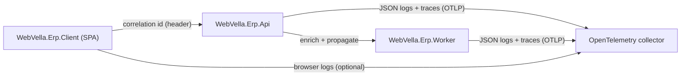

<!--{"sort_order":5, "name": "observability", "label": "Observability"}-->

# Observability

The headless platform is observed through three complementary signals: **structured JSON logging** (Serilog) written to standard output, a **correlation ID** propagated across every tier so a single logical operation is traceable end to end, and **OTLP export** of traces, metrics, and logs to an OpenTelemetry collector. The tiers that participate are the React single-page application (`WebVella.Erp.Client`), the REST API host (`WebVella.Erp.Api`, serving `/api/v1/`), and the background worker (`WebVella.Erp.Worker`); see the [Architecture Overview](overview.md) for the full topology. Source: /docs/architecture/overview.md:L5

> **Greenfield capability — Not available in the current codebase; introduced by the refactor.** No structured-logging or tracing stack is present in the repository today: the core engine manifest declares no Serilog and no OpenTelemetry package references. Source: /WebVella.Erp/WebVella.Erp.csproj:L54-L62 This page therefore specifies the **target** design that the container-native refactor introduces; none of it is implemented yet.

## Structured logging (Serilog)

Each service configures **Serilog** to emit **structured JSON to `stdout`**. In the container-native model a process never writes log files itself; the platform's log collector scrapes `stdout` and forwards it to the aggregation backend, keeping the containers stateless. Source: /docs/architecture/overview.md:L12

Every log event is enriched with a common set of fields so that logs from different tiers can be correlated and filtered:

| Field | Description |
|-------|-------------|
| Correlation ID | The end-to-end identifier shared by the SPA, API, and worker (see [Correlation IDs](#correlation-ids)). |
| Request context | For the API host: HTTP method, `/api/v1/` route, status code, and elapsed time. |
| Job context | For the worker: job name, trigger or schedule, and run identifier. |
| Operation context | The Entity and Record, EQL query, or plugin/hook involved, where applicable. |

The minimum level is controlled by a configuration key (see [Configuration](#configuration)); the concrete log **sink** — the aggregation backend that ingests `stdout` — is a deployment-time choice and is **Not available / to be confirmed**.

## Correlation IDs

A **correlation ID** ties every log line and trace for one logical operation together across the three tiers:

1. **SPA — generate or forward.** `WebVella.Erp.Client` attaches a correlation ID to each API request through a dedicated request header. If an upstream ID is already present it is forwarded; otherwise the SPA generates a new one. The exact header name is **to be confirmed**. Source: /docs/architecture/overview.md:L16
2. **API — read and propagate.** `WebVella.Erp.Api` reads the incoming header (or creates the ID when it is absent), stamps it onto every log event for that request, and carries it onto any background work it enqueues. Source: /docs/architecture/overview.md:L17
3. **Worker — continue.** `WebVella.Erp.Worker` continues the **same** correlation ID when it later processes that work, so a request that fans out into asynchronous processing remains a single traceable thread. Source: /docs/architecture/overview.md:L18

Scheduled jobs that the worker runs on a timer — rather than in response to an API request — must also emit correlated logs, generating a fresh correlation ID per run. The worker's scheduler itself (Quartz.NET vs. Hangfire) is **Not available / to be confirmed**. Source: /docs/architecture/overview.md:L73

## Distributed tracing and metrics (OTLP)

Beyond logs, each service exports **traces and metrics** (and optionally logs) using **OpenTelemetry** over the **OTLP** (OpenTelemetry Protocol) wire format to a collector, which then routes them to the chosen tracing and metrics backends. Traces carry the same correlation context described above, so a distributed trace can be pivoted to the matching JSON logs.

The collector's endpoint is supplied by a configuration key **by name only** (see [Configuration](#configuration)); this page never prints a literal endpoint URL, credential, or token (rule D). The **sampling policy** — for example head- versus tail-based sampling and the sample rate — is a deployment-time decision and is **Not available / to be confirmed**.

## Configuration

All observability sinks and endpoints are referenced by **configuration key name only**; the authoritative table of keys, defaults, and secret handling lives in the [Configuration Reference](../deployment/configuration-reference.md). No literal endpoints, credentials, or tokens appear here (rule D).

| Configuration key | Purpose |
|-------------------|---------|
| `Settings__Serilog__MinimumLevel` | Minimum Serilog log level (for example `Information` or `Warning`). Source: /docs/deployment/configuration-reference.md:L99 |
| `Settings__Otlp__Endpoint` | OTLP exporter endpoint for traces, metrics, and logs; treat as a secret if the endpoint embeds credentials. Source: /docs/deployment/configuration-reference.md:L100 |

See the [Configuration Reference](../deployment/configuration-reference.md) for the environment-variable mapping and Kubernetes Secret wiring of these keys.

## Correlation-ID flow

The diagram below shows how the correlation ID flows across the three tiers and how each tier exports its logs and traces to the collector.

*The correlation ID ties `WebVella.Erp.Client` → `WebVella.Erp.Api` → `WebVella.Erp.Worker` into one traceable operation; see the [Architecture Overview](overview.md) for the tier topology. Source: /docs/architecture/overview.md:L5*
