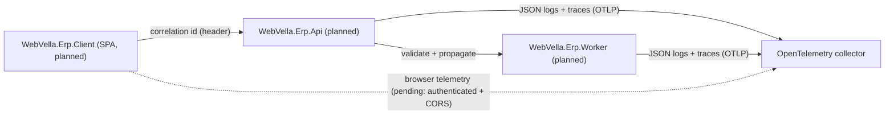

<!--{"sort_order":5, "name": "observability", "label": "Observability"}-->

# Observability

> **Planned target design — Not available in this checkout.** No structured-logging or tracing stack exists in the repository today: **no `Serilog` and no `OpenTelemetry` package reference appears in any project** in `WebVella.ERP3.sln`, and there is no OTLP code. Source: /WebVella.Erp/WebVella.Erp.csproj:L50-L62 (package-reference region — no Serilog/OpenTelemetry). This page specifies the **target** observability design that the container-native refactor is planned to introduce across the (not-yet-existing) `WebVella.Erp.Api`, `WebVella.Erp.Worker`, and `WebVella.Erp.Client`; every element below is **proposed design** pending that code (AAP §0.9.2).

The platform is planned to be observed through three complementary signals: **structured JSON logging** (Serilog) written to standard output, a **correlation ID** propagated across every tier, and **OTLP export** of traces and metrics to an OpenTelemetry collector. The participating tiers would be the React SPA (`WebVella.Erp.Client`), the REST API host (`WebVella.Erp.Api`, serving `/api/v1/`), and the background worker (`WebVella.Erp.Worker`); see the [Architecture Overview](overview.md) for the full topology.

## Data classification and redaction (mandatory)

Before any logging or tracing is enabled, the design **must** enforce that observability signals never carry secrets or personal data. This is a hard requirement of the target design, not an option:

- **Never log** credentials, passwords, API keys, bearer/JWT tokens (or personally identifying claims within them), OIDC client secrets, database connection strings, cookies, or `Authorization` headers. These are **Secret** data and must be redacted at the source and at the sink.
- **Never log** personal data (PII) — names, emails, addresses, and Record field values that may be personal — unless a specific field has been classified as safe. Treat Record/Entity field values as **potentially sensitive** by default.
- **Redact structurally.** Configure Serilog destructuring/enrichers to drop or mask known-sensitive property names (for example `password`, `token`, `secret`, `connectionString`, `authorization`) and to mask values by pattern; do not rely on developers remembering to omit them.
- **Errors are logs too.** Exception messages and stack traces are subject to the same redaction; see [Errors](../api-reference/errors.md) and [Security](security.md) for the rule that public error responses never echo stack traces, internal paths, secrets, or PII.
- **Classification is required per field.** The exact list of loggable vs. redacted fields is **Not available / to be confirmed** until the logging code and a data-classification policy exist.

## Structured logging (Serilog)

Each service **would** configure **Serilog** to emit **structured JSON to `stdout`**, so a container never writes log files itself and the platform's log collector scrapes `stdout`. Every event **would** be enriched with a common field set (always subject to the redaction rules above):

| Field | Description |
|-------|-------------|
| Correlation ID | The **validated** end-to-end identifier shared by the SPA, API, and worker (see [Correlation IDs](#correlation-ids)). |
| Request context | For the API host: HTTP method, `/api/v1/` route **template** (not raw values), status code, and elapsed time. |
| Job context | For the worker: job name, trigger or schedule, and run identifier. |
| Operation context | The Entity/Record identifier, EQL query shape, or plugin/hook involved — **identifiers, not sensitive field values**. |

The minimum level **would** be controlled by a configuration key (see [Configuration](#configuration)); the concrete log **sink** is a deployment choice and is **Not available / to be confirmed**.

## Correlation IDs

A **correlation ID** would tie every log line and trace for one logical operation together across tiers. Because the initial value can arrive from an untrusted browser, it **must be validated before use**:

1. **SPA — generate or forward.** `WebVella.Erp.Client` would attach a correlation ID to each API request via a dedicated header, forwarding an upstream ID when present or generating a new one otherwise. The exact header name is **Not available / to be confirmed**.
2. **API — validate, then propagate.** `WebVella.Erp.Api` would **validate** the incoming header before trusting it: enforce a strict format (for example a UUID/ULID or a bounded `[A-Za-z0-9-]` string), cap its length, and reject or replace any value containing control characters, newlines, or log-injection sequences. If the value is missing or invalid, the API generates a fresh server-side ID. Only the validated ID is stamped onto log events and carried onto enqueued work. **Never** log the raw client-supplied value as a trusted field.
3. **Worker — continue.** `WebVella.Erp.Worker` would continue the **same** validated correlation ID when it processes that work. Scheduled (timer-triggered) jobs would generate a fresh ID per run. The worker's scheduler (Quartz.NET vs. Hangfire) is **Not available / to be confirmed**.

## Distributed tracing and metrics (OTLP)

Each service **would** export **traces and metrics** (and optionally logs) using **OpenTelemetry** over **OTLP** to a collector, which routes them to the chosen backends. Traces would carry the same validated correlation context so a trace can be pivoted to its JSON logs.

**Endpoint vs. credentials are separate concerns (rule D):**

- The collector **endpoint URL** is **non-secret configuration**, referenced by key name only; it must **not** embed credentials in the URL.
- Any **authentication** the collector requires (OTLP headers, tokens, mTLS material) is a **separate secret**, referenced by its own key name and stored as a Kubernetes Secret — never inlined into the endpoint and never logged.

This page prints no literal endpoint, credential, or token. The **sampling policy** is a deployment decision and is **Not available / to be confirmed**.

## Browser (SPA) telemetry — pending

Direct telemetry from the browser (`WebVella.Erp.Client`) to a collector is **deferred / Not available**. If it is adopted later, the design **must** first define: (a) an **authenticated**, browser-facing collector endpoint (never an open, unauthenticated ingest); (b) a strict **CORS allowlist** limited to the SPA origin; and (c) **client-side PII scrubbing** so no personal data or tokens leave the browser. Until those are specified, the SPA is assumed to emit telemetry only **indirectly**, by sending its correlation ID to the API.

## Configuration

All observability endpoints and levels are referenced by **configuration key name only**; the authoritative table of keys, defaults, and secret handling lives in the [Configuration Reference](../deployment/configuration-reference.md). No literal endpoints, credentials, or tokens appear here (rule D). The concrete key names below are **proposed**:

| Configuration key (proposed) | Purpose |
|------------------------------|---------|
| `Settings__Serilog__MinimumLevel` | Minimum Serilog log level (for example `Information` or `Warning`). Non-secret. |
| `Settings__Otlp__Endpoint` | OTLP collector endpoint URL. **Non-secret** — must not embed credentials. |
| `Settings__Otlp__Headers` (or a dedicated Secret) | Any OTLP auth headers/token — **secret**, stored as a Kubernetes Secret, referenced by name. |

See the [Configuration Reference](../deployment/configuration-reference.md) for the environment-variable mapping and Kubernetes Secret wiring; those key names are themselves **Not available / to be confirmed** until the host code exists.

## Correlation-ID flow (planned)

The diagram shows the **planned** correlation-ID flow and export paths. Browser→collector telemetry is shown dashed because it is **pending** (see above).

*Planned observability flow — a **validated** correlation ID ties `WebVella.Erp.Client` → `WebVella.Erp.Api` → `WebVella.Erp.Worker` into one traceable operation; direct browser telemetry is deferred. All three services are proposed and **Not available** in this checkout.*

## Key citations

- No Serilog / OpenTelemetry package reference in the core manifest's package region — Source: /WebVella.Erp/WebVella.Erp.csproj:L50-L62
- No Serilog, OpenTelemetry, or OTLP anywhere in the solution — **Not available** (verified by source search across `*.csproj` and `*.cs`)
- Serilog config, correlation-ID middleware, OTLP exporter, and browser telemetry — **Not available** (require `WebVella.Erp.Api`, `WebVella.Erp.Worker`, and `WebVella.Erp.Client`, none of which exist)
