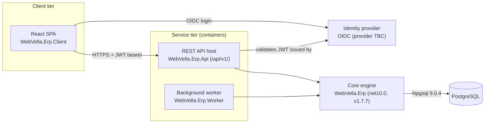

<!--{"sort_order":1, "name": "overview", "label": "Overview"}-->

# Architecture Overview

WebVella ERP is refactored into a **headless, container-native platform**. A React single-page application (`WebVella.Erp.Client`) talks over HTTPS to a REST API host (`WebVella.Erp.Api`) that exposes the versioned `/api/v1/` surface, a background worker (`WebVella.Erp.Worker`) runs scheduled jobs, and all three build on the **unchanged** core engine (`WebVella.Erp`) which persists Entities and Records to PostgreSQL. An external OIDC identity provider issues the JSON Web Tokens (JWTs) that authorize every API call. The core engine keeps the same Entity, Record, EQL, plugin, and hook model it has today, so existing domain logic is preserved while the hosting model becomes container-native.

Source: /WebVella.Erp/WebVella.Erp.csproj:L4 (core engine target framework `net10.0`)
Source: /WebVella.Erp/WebVella.Erp.csproj:L11 (core engine `Version 1.7.7`)

## Components

The platform is composed of the building blocks below. Each service is packaged as its own container; the core engine is referenced **in-process** by both the API host and the worker rather than deployed as a separate service.

| Component | Project | Responsibility |
|-----------|---------|----------------|
| React SPA | `WebVella.Erp.Client` | Browser user interface; calls the `/api/v1/` surface over HTTPS and authenticates the user through the OIDC identity provider. |
| REST API host | `WebVella.Erp.Api` | Hosts the `/api/v1/` Minimal API endpoints, validates JWT bearer tokens, and delegates to the in-process managers. See the [API Reference](../api-reference/index.md). |
| Background worker | `WebVella.Erp.Worker` | Runs scheduled jobs (for example SMTP-queue processing and the daily project task starter). Scheduler: **Not available / to be confirmed** (Quartz.NET vs Hangfire). |
| Core engine | `WebVella.Erp` (`net10.0`, `v1.7.7`) | The Entity / Record / EQL engine and its in-process managers (EntityManager, RecordManager, and related managers). Unchanged by the refactor. |
| Identity provider | external OIDC | Issues the access tokens (JWTs) presented to the API host. Provider: **Not available / to be confirmed** (Duende IdentityServer vs Keycloak). |
| PostgreSQL | database | Stores all Entity metadata and Record data; accessed through Npgsql. |

Source: /docs/developer/server-api/overview.md:L4-L34 (in-process managers: EntityManager, EntityRelationManager, RecordManager, SecurityManager)
Source: /WebVella.Erp/WebVella.Erp.csproj:L61 (`Npgsql [9.0.4]` — PostgreSQL data access)

The REST endpoints are a thin transport layer: they delegate to the same **in-process managers** documented under [Server API](../developer/server-api/overview.md). Those managers are unchanged by the refactor and continue to run in-process, so the domain behavior reached through `/api/v1/` matches the behavior of the core engine.

## Component diagram

The C4-style component diagram below shows how the client, service, and data tiers relate.

*Diagram: headless component topology — client tier, containerized service tier, the in-process core engine, the external identity provider, and the PostgreSQL database.*

Source: /WebVella.Erp/WebVella.Erp.csproj:L4,L61 (core engine `net10.0`; `Npgsql [9.0.4]` PostgreSQL access)

## In this section

- [ICodeVariable adapter](icodevariable-adapter.md) — the `ICodeVariable`/`BaseErpPageModel` compatibility shim; mandatory reading for the hosting-model change.
- [Plugin host](plugin-host.md) — plugin discovery and collectible `AssemblyLoadContext` loading.
- [Data access](data-access.md) — Npgsql data access and `IDbTransaction` transaction scoping.
- [Observability](observability.md) — structured logging, correlation IDs, and OTLP export.
- [Security](security.md) — OIDC/JWT authentication and the claim-to-role mapping.

**Related:** the [API Reference](../api-reference/index.md) documents the `/api/v1/` REST surface in detail, and the [Migration overview](../migration/overview.md) describes the strategy for moving from the previous hosting model to this headless platform.

## Open decisions

Three platform decisions are still open. In keeping with the evidence-based documentation rule, they are recorded here explicitly rather than assumed, and the affected pages must be finalized once each decision is made.

> - **Target runtime — Not available / to be confirmed.** The refactor specification states ".NET 9", while the core engine currently targets `net10.0`. The authoritative target must be confirmed before the runtime is documented as fixed. Source: /WebVella.Erp/WebVella.Erp.csproj:L4 (`net10.0`).
> - **Identity provider — Not available / to be confirmed.** The OIDC provider — Duende IdentityServer vs Keycloak — is undecided; [Security](security.md) is authored provider-neutral until it is chosen.
> - **Worker scheduler — Not available / to be confirmed.** The background-job scheduler — Quartz.NET vs Hangfire — is undecided; the worker configuration (see the [Components](#components) table) is documented as pending until it is chosen.
