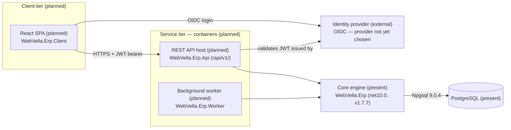

<!--{"sort_order":1, "name": "overview", "label": "Overview"}-->

# Architecture Overview

> **Planned target design — not yet implemented.** This page describes the *target* headless architecture. The new host projects it references — `WebVella.Erp.Api`, `WebVella.Erp.Client`, and `WebVella.Erp.Worker` — **do not exist in this checkout** (`WebVella.ERP3.sln` contains no such projects) and are built by the code workstream (AAP §0.9.2). Components described as *present* or *unchanged* — the `WebVella.Erp` core engine, its in-process managers, and PostgreSQL access — are verified against the current code; everything specific to the new hosts is **proposed design** pending implementation.

WebVella ERP **is planned to be refactored** into a **headless, container-native platform**. In the target design, a React single-page application (`WebVella.Erp.Client`) **will talk** over HTTPS to a REST API host (`WebVella.Erp.Api`) that **will expose** the versioned `/api/v1/` surface, a background worker (`WebVella.Erp.Worker`) **will run** scheduled jobs, and all three **will build on** the **unchanged, already-present** core engine (`WebVella.Erp`, `net10.0`, `v1.7.7`) which persists Entities and Records to PostgreSQL. An external OIDC identity provider **will issue** the JSON Web Tokens (JWTs) that authorize every API call. The core engine keeps the same Entity, Record, EQL, plugin, and hook model it has today, so existing domain logic is preserved while the hosting model becomes container-native. The three new host projects (`WebVella.Erp.Api`, `WebVella.Erp.Client`, `WebVella.Erp.Worker`) **do not exist in this checkout** and are built by the code workstream (AAP §0.9.2).

Source: /WebVella.Erp/WebVella.Erp.csproj:L4 (core engine target framework `net10.0`)
Source: /WebVella.Erp/WebVella.Erp.csproj:L11 (core engine `Version 1.7.7`)

## Components

In the target design the platform is composed of the building blocks below. Each new service **would be** packaged as its own container; the core engine **would be** referenced **in-process** by both the API host and the worker rather than deployed as a separate service.

| Component | Project | Status | Responsibility (target design) |
|-----------|---------|--------|--------------------------------|
| React SPA | `WebVella.Erp.Client` | Proposed — absent from checkout | Browser user interface; will call the `/api/v1/` surface over HTTPS and authenticate the user through the OIDC identity provider. |
| REST API host | `WebVella.Erp.Api` | Proposed — absent from checkout | Will host the `/api/v1/` Minimal API endpoints, validate JWT bearer tokens, and delegate to the in-process managers. See the [API Reference](../api-reference/index.md). |
| Background worker | `WebVella.Erp.Worker` | Proposed — absent from checkout | Will run scheduled jobs (for example SMTP-queue processing and the daily project task starter). Scheduler: **Not available / to be confirmed** (Quartz.NET vs Hangfire). |
| Core engine | `WebVella.Erp` (`net10.0`, `v1.7.7`) | Present — unchanged | The Entity / Record / EQL engine and its in-process managers (EntityManager, RecordManager, and related managers). Unchanged by the refactor. |
| Identity provider | external OIDC | External — provider not yet chosen | Will issue the access tokens (JWTs) presented to the API host. Provider: **Not available / to be confirmed** (Duende IdentityServer vs Keycloak). |
| PostgreSQL | database | Present — unchanged | Stores all Entity metadata and Record data; accessed through Npgsql. |

Source: /WebVella.Erp/Api/EntityManager.cs:L16; /WebVella.Erp/Api/EntityRelationManager.cs:L11; /WebVella.Erp/Api/RecordManager.cs:L15; /WebVella.Erp/Api/SecurityManager.cs:L17 (in-process managers, present in the core engine)
Source: /WebVella.Erp/WebVella.Erp.csproj:L61 (`Npgsql [9.0.4]` — PostgreSQL data access)

In the target design the REST endpoints **would be** a thin transport layer that delegates to these same **in-process managers** (also described under [Server API](../developer/server-api/overview.md)). Those managers are unchanged by the refactor and continue to run in-process, so the domain behavior reached through `/api/v1/` is intended to match the behavior of the core engine. The `/api/v1/` host that would perform this delegation is **Not available** in this checkout (requires `WebVella.Erp.Api`).

## Component diagram

The C4-style component diagram below shows how the client, service, and data tiers relate.

*Diagram: **planned** headless component topology — the client tier and containerized service tier are proposed (absent from this checkout), while the in-process core engine and the PostgreSQL database are present and unchanged; the identity provider is an external OIDC service whose product is not yet chosen.*

Source: /WebVella.Erp/WebVella.Erp.csproj:L4,L61 (core engine `net10.0`; `Npgsql [9.0.4]` PostgreSQL access)

## In this section

- [ICodeVariable adapter](icodevariable-adapter.md) — the `ICodeVariable`/`BaseErpPageModel` compatibility shim; mandatory reading for the hosting-model change.
- [Plugin host](plugin-host.md) — plugin discovery and collectible `AssemblyLoadContext` loading.
- [Data access](data-access.md) — Npgsql data access and `IDbTransaction` transaction scoping.
- [Observability](observability.md) — structured logging, correlation IDs, and OTLP export.
- [Security](security.md) — OIDC/JWT authentication and the claim-to-role mapping.

**Related:** the [API Reference](../api-reference/index.md) documents the `/api/v1/` REST surface in detail, and the [Migration overview](../migration/overview.md) describes the strategy for moving from the previous hosting model to this headless platform.

## Open decisions

Three platform decisions are still open. In keeping with the evidence-based documentation rule, they are recorded here explicitly rather than assumed, and the affected pages must be finalized once each decision is made.

> - **Target runtime — Not available / to be confirmed.** Decision owner: the refactor specification authors. The specification states ".NET 9", while the core engine currently targets `net10.0`; the authoritative target must be confirmed before the runtime is documented as fixed. Required source to resolve: the confirmed `<TargetFramework>` across the project files. Source (current): /WebVella.Erp/WebVella.Erp.csproj:L4 (`net10.0`).
> - **Identity provider — Not available / to be confirmed.** Decision owner: platform architecture. The OIDC provider — Duende IdentityServer vs Keycloak — has not been chosen, so no provider artifact exists in this checkout; [Security](security.md) is authored provider-neutral until it is chosen. Required source to resolve: the selected provider's configuration once it is added.
> - **Worker scheduler — Not available / to be confirmed.** Decision owner: the worker implementation workstream. The background-job scheduler — Quartz.NET vs Hangfire — has not been chosen, and the `WebVella.Erp.Worker` project is absent, so no scheduler artifact exists yet; the worker configuration (see the [Components](#components) table) remains open until it is chosen. Required source to resolve: the scheduler dependency and configuration in `WebVella.Erp.Worker` once it is added.
