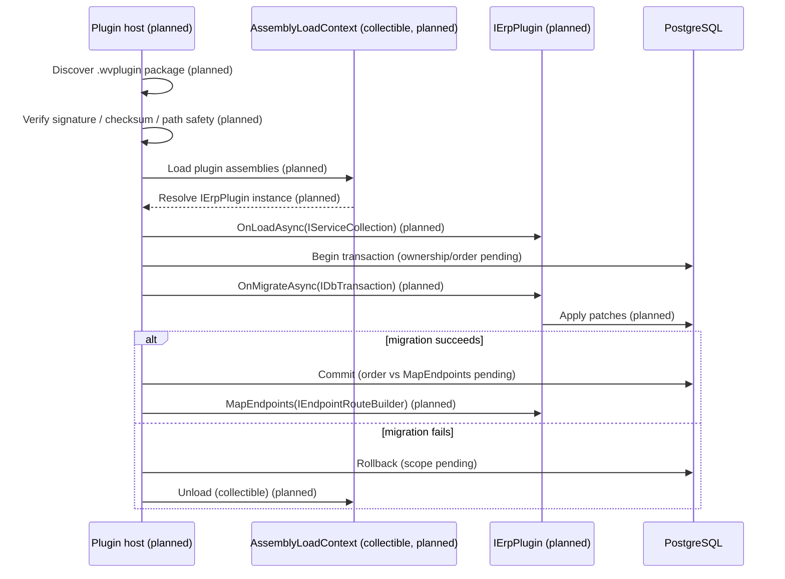

<!--{"sort_order":3, "name": "plugin-host", "label": "Plugin Host"}-->

# Plugin Host

> **Planned target design — not yet implemented.** The plugin host described here is **proposed design**. None of its building blocks exist in this checkout: there is **no `IErpPlugin` interface, no `PluginManifest` type, no `.wvplugin` package format, and no `AssemblyLoadContext`-based loader anywhere in the solution** (verified by source search). Today, plugins are compile-time project references that derive from the abstract class `ErpPlugin` and implement `Initialize(IServiceProvider)`. Source: /WebVella.Erp/ErpPlugin.cs:L12,L57. This page first documents that **current** model, then describes the **planned** host in design tense; every planned element is marked **Not available** and names the contract/host source that must exist before it can be documented as fact.

The plugin host is intended to become the part of the headless platform that turns a packaged plugin on disk into a running extension of the application, building on the **unchanged** core engine described in the [Architecture Overview](overview.md). The design below must be derived from — and proven by tests against — the SDK contract and host code once that code lands (AAP §0.9.2).

## Current plugin model (what exists today)

In this checkout a plugin is an ordinary .NET project referenced at compile time (a Razor Class Library in the legacy host), not a package discovered at runtime. Each plugin type derives from the abstract base class `ErpPlugin` and overrides `Initialize(IServiceProvider)`, which the host calls once during application startup. Source: /WebVella.Erp/ErpPlugin.cs:L12,L57; /WebVella.Erp.Plugins.SDK/SdkPlugin.cs:L15. There is no collectible load context, no per-plugin assembly isolation, and no unload/hot-swap path: all plugins load into the single default context for the process lifetime.

### Current initialization and transactions (per plugin)

During its own `Initialize`, a plugin that needs to persist setup data opens **its own** database connection and manages **its own** transaction — it is **not** enrolled in a host-owned, cross-plugin transaction. The SDK plugin illustrates the pattern: it creates a connection from the ambient `DbContext.Current`, begins a transaction, writes its plugin data, commits, and on any exception rolls back and rethrows. Source: /WebVella.Erp.Plugins.SDK/SdkPlugin._.cs:L31,L35,L155,L158-L161.

```csharp
// Current per-plugin pattern (WebVella.Erp.Plugins.SDK/SdkPlugin._.cs:31-161, condensed).
using (var connection = DbContext.Current.CreateConnection())   // L31 — ambient DbContext
{
    try
    {
        connection.BeginTransaction();                          // L35
        // ... apply this plugin's setup/patches ...
        connection.CommitTransaction();                         // L155
    }
    catch (Exception)
    {
        connection.RollbackTransaction();                       // L160
        throw;                                                  // L161
    }
}
```

`DbConnection.BeginTransaction` supports **nested savepoints** — only the outermost caller (`initialTransactionHolder`) owns the real transaction, and an inner rollback started from a different connection throws. Source: /WebVella.Erp/Database/DbConnection.cs:L115-L179. `DbContext.Current` is an `AsyncLocal` ambient context. Source: /WebVella.Erp/Database/DbContext.cs:L12-L15. **Important:** savepoint support does **not** by itself establish cross-plugin atomicity; today each plugin's `Initialize` commits independently, so a later plugin failing does **not** roll back an earlier plugin's committed changes.

## Planned plugin host (target design — Not available)

The following describes the **intended** host. It is **Not available** in this checkout and requires the plugin SDK contract (`IErpPlugin`) and the host loader project to exist before any of it can be documented as implemented behavior (AAP §0.9.2).

### Planned discovery

At startup the host **would** scan a configured plugin directory and treat every `.wvplugin` package it finds as a candidate. The directory **would** be supplied by a configuration key rather than a hard-coded path (proposed `Settings__PluginDirectory`; see the [configuration reference](../deployment/configuration-reference.md), where it is likewise marked proposed). The `.wvplugin` package format and its manifest are **Not available** (no `PluginManifest` type or `.wvplugin` reader exists in the solution); the planned layout is described in [packaging a plugin](../plugin-sdk/packaging-wvplugin.md).

### Planned loading and isolation

Each discovered plugin **would** be loaded into its own **collectible** `AssemblyLoadContext` (ALC) so that a plugin's private dependencies resolve inside that plugin's context and the host can unload or hot-swap it without a process restart. The shared contract type `IErpPlugin` **would** be provided by the host's default context so host and plugins agree on one interface type. This is a departure from the current model (Razor Class Libraries in a single context with no unload path). All of this is **Not available**: there is no `AssemblyLoadContext` usage in the code today. The intended runtime mechanics are described in [AssemblyLoadContext hosting](../plugin-sdk/assemblyloadcontext-hosting.md).

> **Trust boundary — a collectible `AssemblyLoadContext` is NOT a security sandbox.** An ALC provides *dependency* isolation (separate assembly resolution and an unload path); it does **not** confine what a loaded plugin can do. A plugin's code runs **in-process with full host privileges** — it can read host memory, open sockets, touch the file system, and call any loaded assembly. Loading a plugin is therefore equivalent to deploying trusted server code, and the host **must** enforce a supply-chain trust model that does not exist yet. The planned controls (all **Not available** until the host is built) are:
>
> - **Package integrity & provenance** — verify a cryptographic signature and/or checksum and an allowed publisher before load; reject unsigned or tampered packages.
> - **Safe extraction & path handling** — canonicalize every archive entry path and reject traversal (`..`, absolute, or symlinked entries) to prevent zip-slip; extract only into the plugin's own quarantined subdirectory.
> - **Locked plugin directory** — the plugin directory is operator-controlled with restrictive filesystem ACLs; the host service account cannot write to it, so a compromised process cannot self-install plugins.
> - **Dependency & version policy** — an allowlist (or deny policy) for plugin dependencies and versions, so a plugin cannot smuggle a vulnerable or unexpected library.
> - **Least privilege** — run the host with the minimum OS and database permissions the platform needs; do not grant plugins ambient elevated rights.
> - **Quarantine & rollback** — a failed, unsigned, or revoked plugin is quarantined (moved out of the load path) and the operator follows a documented rollback procedure (planned; see the [Rollback plan](../migration/rollback-plan.md)).

### Planned lifecycle wiring

Once a plugin's `IErpPlugin` implementation is resolved, the host **would** drive the contract methods; the method-by-method reference is the [IErpPlugin contract](../plugin-sdk/ierplugin-contract.md) (itself planned/design). The intended methods replace the legacy `Initialize(IServiceProvider)` entry point. Source: /WebVella.Erp/ErpPlugin.cs:L57.

1. **`OnLoadAsync(IServiceCollection)`** (planned) — register services into DI before the service provider is built.
2. **`OnMigrateAsync(IDbTransaction)`** (planned) — apply Entity/Record schema and data patches. This would replace the legacy versioned initialization run inside `Initialize`. Source: /WebVella.Erp.Plugins.SDK/SdkPlugin._.cs:L31-L161 (current per-plugin transaction).
3. **`MapEndpoints(IEndpointRouteBuilder)`** (planned) — map Minimal API endpoints onto the host router.

### Transaction ownership and lifecycle order (target — pending)

Whether the target host owns a **single cross-plugin** transaction or preserves today's **per-plugin** transactions is **Not available / to be confirmed** — it cannot be documented until the host code exists. Each point below must be specified by that code and its tests, and is **open** today:

- **Migration transaction ownership** — host-owned (one transaction spanning all plugins) vs per-plugin (today's behavior). **Not available.**
- **Endpoint-mapping order** — whether `MapEndpoints` runs **before or after** the migration commit, and whether a mapping failure after commit is compensated or left committed. **Not available.**
- **Compensation** — how an already-committed plugin migration is reversed if a later plugin fails (today it is **not** reversed). **Not available.**
- **Ambient manager binding** — how `RecordManager`/`EntityManager` bind to the migration transaction (today they use the ambient `DbContext.Current`). **Not available.**
- **Idempotency** — whether re-running a plugin's migration is safe / a no-op. **Not available.**
- **Exact rollback scope** — one plugin, or all plugins, on failure. **Not available.**

## Failure handling and rollback

**Current:** a plugin failure during `Initialize` rolls back only **that plugin's own** transaction and rethrows; earlier plugins that already committed are unaffected. Source: /WebVella.Erp.Plugins.SDK/SdkPlugin._.cs:L158-L161.

**Planned:** the host **would** contain a plugin failure to that plugin's collectible context — rolling back its migration (per the pending rules above) and unloading its ALC so the host process stays available. This is **Not available** (no collectible-context loader exists). The operator-facing recovery procedure is documented in the [Rollback plan](../migration/rollback-plan.md).

## Planned load sequence

The sequence below is the **planned** end-to-end path for a single plugin. It is design intent, not current behavior (today a plugin's `Initialize` simply runs in-process at startup with no discovery, ALC, or unload step).



*Planned plugin load sequence — discovery, integrity verification, collectible `AssemblyLoadContext` load, and the `IErpPlugin` lifecycle with a commit/rollback branch. **All steps are proposed design and Not available in this checkout**; the transaction ownership, the commit-vs-mapping order, and the rollback scope are pending the host implementation. See [AssemblyLoadContext hosting](../plugin-sdk/assemblyloadcontext-hosting.md) for the intended load-context mechanics.*

## Key citations

- Current plugin base class `ErpPlugin` (abstract) and `Initialize(IServiceProvider)` — Source: /WebVella.Erp/ErpPlugin.cs:L12,L57
- Current override — Source: /WebVella.Erp.Plugins.SDK/SdkPlugin.cs:L15
- Current per-plugin transaction (begin / commit / catch-rollback / rethrow) — Source: /WebVella.Erp.Plugins.SDK/SdkPlugin._.cs:L31,L35,L155,L158-L161
- Nested savepoint semantics — Source: /WebVella.Erp/Database/DbConnection.cs:L115-L179
- Ambient `DbContext.Current` — Source: /WebVella.Erp/Database/DbContext.cs:L12-L15
- `IErpPlugin`, `PluginManifest`, `.wvplugin`, collectible `AssemblyLoadContext` host — **Not available** (no such interface, type, package format, or ALC loader in `WebVella.ERP3.sln`; requires the plugin SDK contract and host loader)
