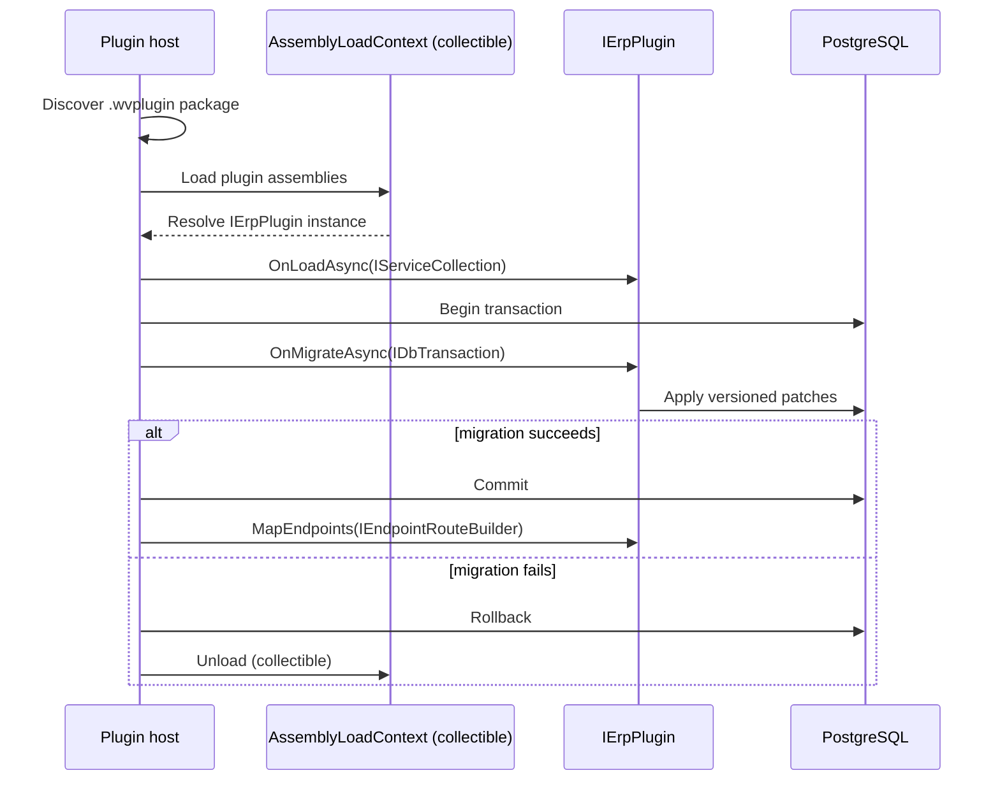

<!--{"sort_order":3, "name": "plugin-host", "label": "Plugin Host"}-->

# Plugin Host

The plugin host is the part of the headless platform that turns a packaged plugin on disk into a running extension of the application. It discovers each `.wvplugin` package, loads its assemblies into an isolated, collectible `AssemblyLoadContext`, resolves the plugin's `IErpPlugin` implementation, and drives that contract's lifecycle to wire the plugin's services, migrations, and HTTP endpoints into the running process. Because every plugin lives in its own collectible load context, the host isolates each plugin's dependencies and can unload or hot-swap a plugin without restarting the process — all on top of the **unchanged** core engine described in the [Architecture Overview](overview.md). Source: /WebVella.Erp.Plugins.SDK

## Plugin discovery

At startup the host scans a single configured plugin directory and treats every `.wvplugin` package it finds there as a candidate plugin. The directory is supplied by the `Settings__PluginDirectory` configuration key rather than a hard-coded path, so operators point the host at the location appropriate to their deployment. Source: /docs/deployment/configuration-reference.md:L108 The concrete value is deployment-specific and is documented in the [configuration reference](../deployment/configuration-reference.md); the internal layout of a `.wvplugin` package — its manifest and bundled assemblies — is documented in [packaging a plugin](../plugin-sdk/packaging-wvplugin.md).

## Loading and isolation

Each discovered plugin is loaded into its **own** collectible `AssemblyLoadContext` (ALC), which is the mechanism that keeps plugins isolated from one another and from the host. A plugin's private dependencies resolve inside that plugin's ALC, so two plugins can depend on different versions of the same library without clashing. The shared contract type `IErpPlugin` is deliberately **not** loaded per plugin: it is provided by the host's default load context so that the host and every plugin agree on the exact same interface type. Because the context is *collectible*, the host can unload a plugin's assemblies at runtime, and that unload capability is what enables hot-swapping a plugin without a process restart. This isolation is a departure from the legacy model, in which plugins were ordinary Razor Class Libraries loaded into the single application domain with no isolation and no unload path. Source: /docs/developer/plugins/overview.md:L4 The deep runtime mechanics of the collectible context — load, resolve, and unload — are documented in [AssemblyLoadContext hosting](../plugin-sdk/assemblyloadcontext-hosting.md).

## Lifecycle wiring

Once a plugin's `IErpPlugin` implementation is resolved, the host drives the three contract methods in a fixed runtime order; the method-by-method reference lives in the [IErpPlugin contract](../plugin-sdk/ierplugin-contract.md).

1. **`OnLoadAsync(IServiceCollection)`** — the plugin registers its services into the dependency-injection container before the application's service provider is built. This replaces the legacy `Initialize(IServiceProvider ServiceProvider)` entry point. Source: /WebVella.Erp/ErpPlugin.cs:L57
2. **`OnMigrateAsync(IDbTransaction)`** — the host begins a database transaction and asks the plugin to apply its Entity and Record schema/data patches on that host-owned transaction. This replaces the legacy versioned initialization that began at `WEBVELLA_SDK_INIT_VERSION = 20181001` and ran inside `Initialize`. Source: /WebVella.Erp.Plugins.SDK/SdkPlugin._.cs:L12
3. **`MapEndpoints(IEndpointRouteBuilder)`** — after the migration transaction commits, the plugin maps its Minimal API HTTP endpoints onto the host's router.

The contract itself replaces the legacy base class: plugins were previously abstract-class subclasses — `public abstract class ErpPlugin` — that the SDK plugin extended and whose `Initialize` method it overrode. Source: /WebVella.Erp/ErpPlugin.cs:L12 Source: /WebVella.Erp.Plugins.SDK/SdkPlugin.cs:L15

## Failure handling and rollback

Loading a plugin is all-or-nothing. If resolving the `IErpPlugin` implementation, `OnLoadAsync`, or `OnMigrateAsync` throws, the host aborts that one plugin: it rolls back the plugin's migration transaction so no partial schema change is committed, then unloads the plugin's collectible `AssemblyLoadContext` to release its assemblies. This transactional rollback mirrors the legacy `catch { connection.RollbackTransaction(); throw; }` behavior. Source: /WebVella.Erp.Plugins.SDK/SdkPlugin._.cs:L156-L160 Because the failure is contained to the one plugin's context, the host process stays available and the other plugins are unaffected. The operator-facing procedure for recovering from a plugin that cannot be loaded is documented in the [rollback plan](../migration/rollback-plan.md).

## Load sequence

The sequence below shows the end-to-end path for a single plugin: discovery, load into the collectible context, then the `OnLoadAsync` → `OnMigrateAsync` (inside a transaction) → `MapEndpoints` lifecycle, with the commit and rollback branches made explicit.

*Plugin load sequence — discovery, collectible `AssemblyLoadContext` load, and the `IErpPlugin` lifecycle with the commit/rollback branch. Source: /WebVella.Erp.Plugins.SDK — see [AssemblyLoadContext hosting](../plugin-sdk/assemblyloadcontext-hosting.md) for the load-context mechanics.*
