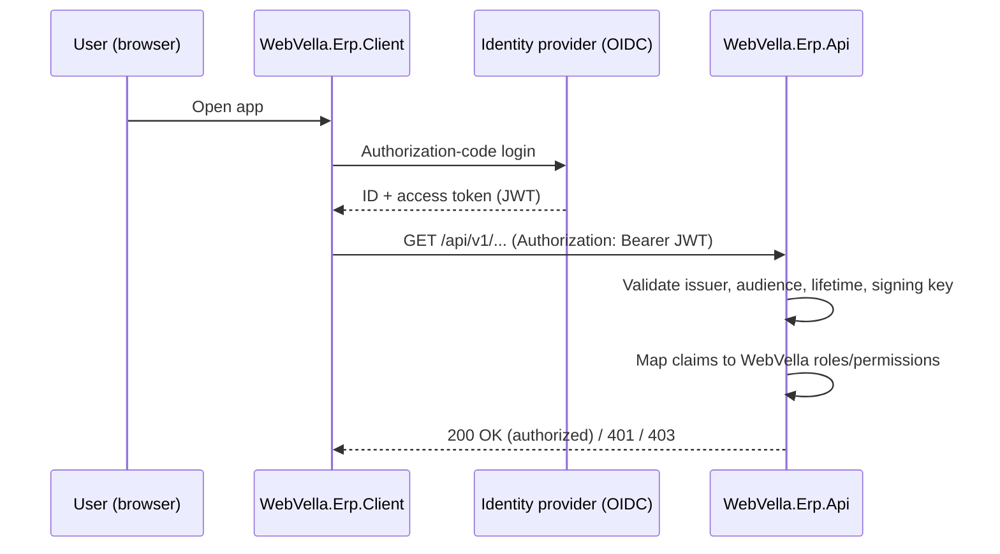

<!--{"sort_order":6, "name": "security", "label": "Security"}-->

# Security

The headless platform authenticates users through **OpenID Connect (OIDC)** authorization-code login at an external identity provider, authorizes every `/api/v1/` request with a **stateless JSON Web Token (JWT) bearer token**, and maps the token's OIDC claims onto the **unchanged** WebVella role and permission model that the in-process managers already enforce. Because authorization state travels inside the token, the API keeps no server-side session.

Source: /docs/architecture/overview.md:L5,L17 (an external OIDC identity provider issues the JWTs that authorize every API call; the API host validates JWT bearer tokens)

For obtaining and using tokens — the request/response detail, token refresh, and error codes — see the canonical [Authentication reference](../api-reference/authentication.md). This page is the architecture companion: it describes the authentication **design** and the **claim-to-role mapping**, and links that reference rather than duplicating it.

## Authentication flow (OIDC + JWT)

Authentication is delegated to the identity provider; `WebVella.Erp.Api` acts as a pure **resource server** that only validates the tokens it receives.

1. The user opens the SPA (`WebVella.Erp.Client`).
2. The SPA starts an OIDC **authorization-code** login at the identity provider.
3. The identity provider authenticates the user and issues an ID token and an **access token** (a JWT).
4. The SPA calls the `/api/v1/` surface, presenting the access token in an `Authorization: Bearer <token>` header.
5. `WebVella.Erp.Api` validates the JWT, maps its claims to WebVella roles and permissions, and then delegates to the in-process managers.

Source: /docs/architecture/overview.md:L16-L20 (the SPA authenticates through the OIDC provider, the API host validates JWT bearer tokens, and the provider issues the access tokens)

**Legacy contrast.** The retired site host used a `JWT_OR_COOKIE` policy scheme that forwarded to JWT bearer only when an `Authorization: Bearer ` header was present and otherwise fell back to the `erp_auth_base` cookie, whereas the headless API is bearer-JWT-only. Source: /WebVella.Erp.Site/JWT_README.txt:L30,L49-L58 (the `JWT_OR_COOKIE` policy scheme and its `erp_auth_base` cookie fallback)

## Token validation

`WebVella.Erp.Api` validates every presented bearer JWT before honoring a request. Four checks are enabled — the token's **issuer**, **audience**, **lifetime**, and **signature** against the configured issuer signing key — corresponding to `ValidateIssuer`, `ValidateAudience`, `ValidateLifetime`, and `ValidateIssuerSigningKey`. A token that fails any check is rejected with `401 Unauthorized`; the request-level error contract lives in the [Authentication reference](../api-reference/authentication.md).

Source: /WebVella.Erp.Site/JWT_README.txt:L40-L43 (`ValidateIssuer`, `ValidateAudience`, `ValidateLifetime`, `ValidateIssuerSigningKey`)

| Validated element | Config key | Default value |
|-------------------|------------|---------------|
| Issuer (`iss`) | `Jwt:Issuer` | `webvella-erp` |
| Audience (`aud`) | `Jwt:Audience` | `webvella-erp` |
| Signature | `Jwt:Key` | *secret — not shown (Rule D)* |
| Lifetime (`exp` / `nbf`) | token claims | validated |

Source: /WebVella.Erp.Site/JWT_README.txt:L11-L15 (the `Jwt` issuer and audience default to `webvella-erp`; the signing key is supplied under `Jwt:Key`)

> **Rule D — no secrets.** The signing key is referenced only by its configuration **key name**, `Jwt:Key`; its value is a secret and is never reproduced in documentation, logs, or examples. Supply it through an environment variable or a Kubernetes Secret — see the [Configuration reference](../deployment/configuration-reference.md). The issuer and audience **name** `webvella-erp` is a non-secret identifier and may be shown.

## Claim → role / permission mapping

After a token is validated, its OIDC claims (typically a role or group claim) are mapped onto the platform's existing **roles** and **permissions** — the same model the in-process managers already enforce, unchanged by the refactor. Two anchors define that model: administrative **metadata** operations require the `Administration` role, while **Record**-level access is governed by the permissions configured on the target Entity.

| OIDC token claim | WebVella role / permission | Capability granted | Source |
|------------------|----------------------------|--------------------|--------|
| Role / group claim *(name to be confirmed)* | `Administration` role | Entity and field metadata operations (`EntityManager`) | Source: /docs/developer/server-api/overview.md:L8 |
| Role / group claim *(name to be confirmed)* | `Administration` role | Entity-Relation operations (`EntityRelationManager`) | Source: /docs/developer/server-api/overview.md:L16 |
| Role / group claim *(name to be confirmed)* | Per-Entity Record permissions | Record operations (`RecordManager`), evaluated against the target Entity | Source: /docs/developer/server-api/overview.md:L24 |

The concrete claim name(s) and the values that map to each WebVella role are **Not available / to be confirmed** — they are fixed once the identity provider (below) is chosen and `WebVella.Erp.Api` defines its claim-mapping policy. The request-level `401`/`403` behavior is documented in the [Authentication reference](../api-reference/authentication.md).

## Identity provider options

> **Decision point — Not available / to be confirmed.** The OIDC identity provider for the headless platform is undecided; the candidates are **Duende IdentityServer** and **Keycloak**. All guidance on this page is deliberately **provider-neutral**. A provider-specific appendix — the OIDC discovery / issuer URL, SPA and confidential-client registration, and the concrete scope and claim names that resolve the mapping above — will be added once the provider is selected.

Source: /docs/architecture/overview.md:L72 (identity provider — Duende IdentityServer vs Keycloak — recorded as an open decision)

## Authentication flow diagram

The sequence below traces an OIDC login through JWT issuance, bearer validation, and claim mapping to the authorization outcome.

*Diagram: OIDC authorization-code login, JWT issuance, bearer validation at `WebVella.Erp.Api`, and claim-to-role mapping. The JWT settings shown (issuer / audience `webvella-erp`; signing key referenced by name `Jwt:Key`) come from Source: /WebVella.Erp.Site/JWT_README.txt:L11-L15; for obtaining and using tokens, see the [Authentication reference](../api-reference/authentication.md).*

## Related pages

- [Authentication reference](../api-reference/authentication.md) — the canonical token request/response, refresh, and error contract this page complements.
- [Architecture overview](overview.md) — where authentication fits in the headless topology.
- [Configuration reference](../deployment/configuration-reference.md) — how `Jwt:Key`, `Jwt:Issuer`, and `Jwt:Audience` are supplied as environment variables or Kubernetes Secrets.
