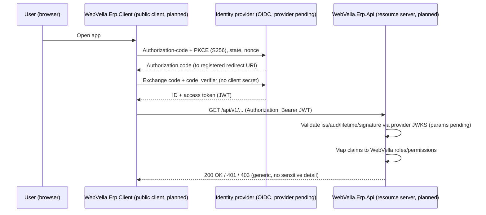

<!--{"sort_order":6, "name": "security", "label": "Security"}-->

# Security

> **Planned target design — not yet implemented; provider-neutral.** The headless authentication model on this page is **proposed design**. The `/api/v1/` resource server (`WebVella.Erp.Api`) and the React SPA (`WebVella.Erp.Client`) **do not exist in this checkout**, and no OIDC identity provider has been chosen. What *does* exist is the **legacy** `WebVella.Erp.Site` host's JWT/cookie configuration, documented separately below as the **current** state. Every target element — the OIDC provider, the SPA client registration, and the API's token-validation parameters — is **Not available / to be confirmed** until the provider and host code exist (AAP §0.9.2). The **role/permission model** the API would map onto is real and unchanged (see [Claim → role / permission mapping](#claim-role-permission-mapping)).

The target design authenticates users through **OpenID Connect (OIDC)** at an external identity provider, authorizes each `/api/v1/` request with a **stateless JWT bearer token**, and maps the token's claims onto the **unchanged** WebVella role and permission model that the in-process managers already enforce. For obtaining and using tokens, see the [Authentication reference](../api-reference/authentication.md); this page is the architecture companion.

## Current state — legacy `WebVella.Erp.Site` host (verified)

The retired site host configures a `JWT_OR_COOKIE` policy scheme that forwards to JWT bearer **only when an `Authorization: Bearer ` header is present**, and otherwise falls back to the `erp_auth_base` cookie. Source: /WebVella.Erp.Site/Startup.cs:L90-L91,L96,L115-L125. Its JWT bearer validation enables issuer, audience, lifetime, and signing-key checks and — critically — validates the signature with a **symmetric** key read from `Settings:Jwt:Key`:

| Legacy validated element | Legacy config key | Note |
|--------------------------|-------------------|------|
| Issuer (`iss`) | `Settings:Jwt:Issuer` | Source: /WebVella.Erp.Site/Startup.cs:L110 |
| Audience (`aud`) | `Settings:Jwt:Audience` | Source: /WebVella.Erp.Site/Startup.cs:L111 |
| Signature | `Settings:Jwt:Key` (**symmetric** `SymmetricSecurityKey`) | Source: /WebVella.Erp.Site/Startup.cs:L112 — secret, never shown (rule D) |
| Lifetime (`exp`/`nbf`) | token claims | Source: /WebVella.Erp.Site/Startup.cs:L108 |

Source: /WebVella.Erp.Site/Startup.cs:L102-L114 (`AddJwtBearer` with `ValidateIssuer` / `ValidateAudience` / `ValidateLifetime` / `ValidateIssuerSigningKey = true`).

> **Rule D — no secrets.** The signing key is referenced only by its configuration **key name**, `Settings:Jwt:Key`; its value is a secret and is never reproduced in documentation, logs, or examples (the sample value in `WebVella.Erp.Site/JWT_README.txt` is illustrative only and must never be used in any real deployment). Supply it through an environment variable or a Kubernetes Secret — see the [Configuration reference](../deployment/configuration-reference.md).

> **Why the legacy JWT settings do NOT define the target model.** The legacy host validates tokens it **issues itself** with a **symmetric** key (`Settings:Jwt:Key`) and its own `webvella-erp` issuer/audience. An external OIDC provider signs tokens with its **own asymmetric keys** (published via JWKS) and its **own** issuer and audience. The target `/api/v1/` validation parameters are therefore **Not available / to be confirmed** and must be derived from the chosen provider — they are **not** the legacy symmetric-key settings above.

## Target authentication flow (OIDC + JWT) — planned

In the target design, `WebVella.Erp.Api` would act as a pure **resource server** that only validates the tokens it receives; login is delegated to the identity provider. The SPA is a **public client** (a browser app that **cannot keep a secret**):

1. The user opens the SPA (`WebVella.Erp.Client`).
2. The SPA starts an OIDC **authorization-code** flow **with PKCE (`S256`)**, a random **`state`** (CSRF defense), and a **`nonce`** (ID-token replay defense), redirecting only to a **pre-registered redirect URI**.
3. The identity provider authenticates the user and returns an **authorization code** to the redirect URI.
4. The SPA **exchanges the code** (with its PKCE `code_verifier`) at the provider's token endpoint for an ID token and an **access token** (a JWT). **No client secret is sent** — the SPA ships and stores no client secret.
5. The SPA calls `/api/v1/` with `Authorization: Bearer <access token>`.
6. `WebVella.Erp.Api` validates the JWT (issuer / audience / lifetime / signature via the provider's JWKS), maps its claims to WebVella roles/permissions, and delegates to the in-process managers.

**Browser token handling (planned).** Prefer short-lived access tokens kept **in memory**; avoid persisting tokens in `localStorage`. Use **refresh-token rotation** (one-time-use refresh tokens) where the provider supports it, alongside the `state` / `nonce` / registered-redirect-URI controls above. The concrete token lifetimes, storage mechanism, and refresh strategy are **Not available / to be confirmed** until the SPA and provider are chosen.

## Token validation (target — Not available)

The exact target validation parameters — issuer, audience, and the **asymmetric** signing-key source (the provider's JWKS / discovery document) — are **Not available / to be confirmed**. They are **not** the legacy symmetric `Settings:Jwt:*` values (see the current-state note above) and will be documented once the provider is chosen and `WebVella.Erp.Api` defines its `AddJwtBearer` / authority configuration. A token that fails validation must be rejected with `401 Unauthorized`; the request-level contract is in the [Authentication reference](../api-reference/authentication.md).

**Error safety (rule D).** Authentication and authorization failures must return only a generic `401` / `403` problem response. They must **never** echo the token, its claims, validation internals, signing-key material, stack traces, or internal paths, and must not log the raw token — see [Observability](observability.md) and [Errors](../api-reference/errors.md).

## Claim → role / permission mapping

After a token is validated, its OIDC claims (typically a role or group claim) would be mapped onto the platform's existing **roles** and **permissions** — the same model the in-process managers already enforce, unchanged by the refactor. The privileged role is the exact lowercase **`administrator`** role: administrative **metadata** operations require it, while **Record**-level access is governed by the permissions configured on the target Entity. Source: /WebVella.Erp/Api/SecurityContext.cs:L26 (`Name = "administrator"`); /WebVella.Erp/Api/Definitions.cs:L15 (`AdministratorRoleId`); /WebVella.Erp/Api/SecurityContext.cs:L109-L118 (`HasMetaPermission` checks the `administrator` role).

| OIDC token claim | WebVella role / permission | Capability | Source |
|------------------|----------------------------|------------|--------|
| Role / group claim *(claim name pending)* | `administrator` role | Entity/field metadata operations (`EntityManager`) | Source: /WebVella.Erp/Api/SecurityContext.cs:L109-L118; /WebVella.Erp/Api/EntityManager.cs:L16 |
| Role / group claim *(claim name pending)* | `administrator` role | Entity-Relation operations (`EntityRelationManager`) | Source: /WebVella.Erp/Api/SecurityContext.cs:L109-L118; /WebVella.Erp/Api/EntityRelationManager.cs:L11 |
| Role / group claim *(claim name pending)* | Per-Entity Record permissions | Record operations (`RecordManager`), evaluated against the target Entity | Source: /WebVella.Erp/Api/RecordManager.cs:L15 |

The concrete claim name(s) and the values that map to each WebVella role are **Not available / to be confirmed** — they are fixed once the identity provider is chosen and `WebVella.Erp.Api` defines its claim-mapping policy. Any **target** claim-to-role vocabulary is therefore pending; only the current `administrator` role name is authoritative today. The request-level `401` / `403` behavior is documented in the [Authentication reference](../api-reference/authentication.md).

## Identity provider options

> **Decision point — Not available / to be confirmed.** Decision owner: platform architecture. The OIDC identity provider is undecided; the candidates are **Duende IdentityServer** and **Keycloak**. All guidance here is deliberately **provider-neutral**. A provider-specific appendix — the OIDC discovery / issuer URL, the SPA (public-client + PKCE) and any confidential-client registration, the JWKS location, and the concrete scope and claim names that resolve the mapping above — will be added once the provider is selected. Required source to resolve: the chosen provider's discovery document and the `WebVella.Erp.Api` auth configuration, neither of which exists yet.

## Target authentication flow diagram (planned)

The sequence traces the planned OIDC authorization-code + PKCE login, code exchange, bearer validation, and claim mapping. Every participant except the user's browser is **proposed and Not available**.

*Diagram: planned OIDC authorization-code + PKCE login, code exchange without a client secret, bearer validation via the provider's JWKS (parameters pending), and claim-to-`administrator`/permission mapping. The SPA and API are proposed and Not available in this checkout.*

## Related pages

- [Authentication reference](../api-reference/authentication.md) — the planned token request/response, refresh, and error contract this page complements.
- [Architecture overview](overview.md) — where authentication fits in the headless topology.
- [Observability](observability.md) — redaction rules that keep tokens and PII out of logs and errors.
- [Configuration reference](../deployment/configuration-reference.md) — how JWT/OIDC settings would be supplied as environment variables or Kubernetes Secrets (key names only).
