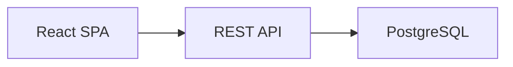

<!--{"sort_order":2, "name": "documentation", "label": "Documentation"}-->
# Documentation

This guide explains how to **author and preview the WebVella ERP documentation site**. The site is built with MkDocs wrapped by Backstage TechDocs — the `techdocs-core` and `mermaid2` plugins are enabled, so Markdown pages and inline Mermaid diagrams render at build time. `Source: /mkdocs.yml:L11-L13`.

Everything below follows the repository's existing conventions; this page intentionally **describes the very conventions it itself follows** — page frontmatter, `folder.json`, Mermaid, and `doc-images/`. For prose tone and structure, use the [component authoring guide](../developer/components/create-your-own.md) as the style exemplar. `Source: /docs/developer/components/create-your-own.md`.

## Page frontmatter

Every documentation page **except the top-level `docs/index.md`** begins on **line 1** with an HTML-comment "frontmatter" that carries three fields. The Home page `docs/index.md` is the one exception — it has no frontmatter because `mkdocs.yml` maps it directly as `Home: index.md`. `Source: /docs/index.md:L1`; `Source: /mkdocs.yml:L3`.

| Field | Type | Purpose |
|-------|------|---------|
| `sort_order` | number | Orders the page within its section (ascending). |
| `name` | string | Machine-readable slug for the page. |
| `label` | string | Human-readable title shown in section listings. |

Because it is an HTML comment it renders as nothing visible on the page. Author it exactly like the example below, then follow it immediately with the page's single H1 heading:

```markdown
<!--{"sort_order":1, "name": "overview", "label": "Overview"}-->
# Overview
```

`Source: /docs/developer/introduction/overview.md:L1`.

## Folder manifest (folder.json)

Each documentation subfolder carries a `folder.json` that describes the section using the same three fields as page frontmatter (`name`, `label`, `sort_order`), **tab-indented**:

```json
{
	"name": "contributing",
	"label": "Contributing",
	"sort_order": 7
}
```

`Source: /docs/contributing/folder.json`; `Source: /docs/developer/introduction/folder.json`.

> **`folder.json` is a legacy section-manifest convention that the current MkDocs stack does NOT read.** Site navigation is driven entirely by `mkdocs.yml` (see the next section), not by `folder.json`. `Source: /mkdocs.yml`. The manifests are retained for consistency across sections (rule C), so add one to every new folder to match the existing structure.

## Navigation (mkdocs.yml)

The site's navigation and plugin set live in `mkdocs.yml` at the repository root. New **top-level sections** are registered under the `nav:` key, and the `techdocs-core` and `mermaid2` plugins must remain enabled for the site — and its diagrams — to build. `Source: /mkdocs.yml:L2-L3`; `Source: /mkdocs.yml:L11-L13`. Its essential keys are:

```yaml
site_name: 'blitzy-WebVella-ERP'
nav:
  - Home: index.md
plugins:
  - techdocs-core
  - mermaid2
```

Placement in the navigation comes from `nav:` in `mkdocs.yml`; the `sort_order` in a page's frontmatter or its folder's `folder.json` does not by itself add a page to the MkDocs navigation. This page describes that mechanism only — registering a specific section is done as part of the change that introduces it.

## Diagrams (Mermaid)

Author diagrams inline as fenced `mermaid` code blocks; the `mermaid2` plugin renders them at build time. The Mermaid runtime is pinned to **11.16.0** and served from a locally bundled copy at `docs/assets/mermaid/mermaid.min.js` (loaded via `mermaid2`'s `javascript:` option and copied verbatim into the built site), so diagrams render with no runtime CDN dependency — including in offline / air-gapped environments. `Source: /mkdocs.yml:L242-L251`. A minimal example:



Prefer Mermaid over screenshots for architecture and flow diagrams (AAP §0.5.3); the developer docs contained no diagrams before the headless-refactor documentation introduced them.

To produce a **standalone** static image of a diagram (for example, to embed in an external document or README), you can optionally pre-render a `.mmd` file to SVG/PNG with the Mermaid CLI `mmdc` from `@mermaid-js/mermaid-cli` **11.16.0**, then store the output under `doc-images/` (AAP §0.7.1):

```bash
mmdc -i diagram.mmd -o diagram.svg
```

## Images & screenshots

Screenshots and any pre-rendered diagrams live under `doc-images/` at the repository root — for example the `sdk-*.png` admin-console captures. `Source: /doc-images/`. Reference an image from a page by its path, and prefer an inline Mermaid diagram over a raster screenshot wherever a diagram can express the same information (AAP §0.5.3).

## Build & preview

Build the static site **non-interactively**. This is the command used in CI and automation:

```bash
mkdocs build
```

`Source: /mkdocs.yml`. The TechDocs-equivalent non-interactive build is `techdocs-cli generate --no-docker`.

For a local, live-reloading preview while writing, run the development server:

```bash
mkdocs serve
```

> **Warning — local / human use only.** `mkdocs serve` (and any `--watch` mode) starts a long-running server and must **never** be run in CI or automation; use `mkdocs build` there instead (AAP §0.10.1).

## Optional: generated API docs

The hand-authored pages under `docs/developer/server-api/**` already document the in-process managers, so generated API references are **optional supplements**, not replacements (AAP §0.7.1):

- **React / TypeScript client** — `typedoc` **0.28.20** together with `typedoc-plugin-markdown` **4.12.0** emits Markdown from TSDoc comments that integrates directly into MkDocs (AAP §0.7.1).
- **.NET API reference** — **DocFX 2.78.5** generates a static reference from C# XML-doc comments (AAP §0.7.1).

## Style

Follow the existing documentation style; do not introduce a competing one (rule C). The [component authoring guide](../developer/components/create-your-own.md) is the tone-and-structure exemplar: a single H1, `##`/`###` section headings, an instructional voice, fenced code blocks tagged with their language, and simple pipe tables. `Source: /docs/developer/components/create-your-own.md`.

Keep terminology aligned with the project glossary — **Entity**, **Record**, **EQL**, **plugin**, and **hook** — so that new pages read consistently with the rest of the developer documentation.
