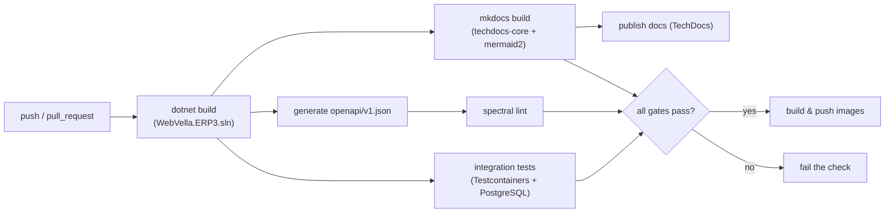

<!--{"sort_order":3, "name": "ci-cd", "label": "CI/CD"}-->

# CI/CD

Continuous integration for the headless **WebVella ERP** platform is a set of GitHub Actions workflows that build the solution, run integration tests, generate and lint the OpenAPI document, and — the concern of this workstream — **build and publish the documentation site**. The documentation build is a non-interactive gate that keeps this docs set from drifting out of sync with the code again (AAP §0.2.1).

## Current state

The **documentation CI workflow is committed** and is the realized scope of this workstream: `.github/workflows/docs.yml` builds the MkDocs/TechDocs site and runs the documentation-quality gates on every `push` and `pull_request` to `master` (filtered to documentation inputs). Source: /.github/workflows/docs.yml **Application CI does not exist yet** — there is no solution-build, integration-test, OpenAPI-generation, or image-build/publish workflow, because the projects, test projects, and container images they depend on are not in the checkout (AAP §0.9.2). This section states which pieces are realized and which remain missing (rule F).

| Item | State |
|------|-------|
| `.github/workflows/docs.yml` | **Committed** — four jobs: documentation build, OpenAPI lint (guarded), Markdown lint (blocking), and link check (non-blocking). Source: /.github/workflows/docs.yml |
| Application CI (`build` / `test` / image) workflows | **Not available** — no such workflow files exist; pending the refactor's projects and container images (AAP §0.9.2). |
| Test projects | **Not available / to be confirmed** — none in the checkout today (AAP §0.9.2). |
| Docs build gate | Realized by the `docs-build` job; runs `mkdocs build --strict` against the MkDocs/TechDocs site. Source: /mkdocs.yml |

## Pipeline

> **Only the documentation CI is realized at this milestone — the application-build stages are pending.** This page describes three tiers: **(1) committed documentation CI (available now)** — the four-job `.github/workflows/docs.yml` (site build plus the OpenAPI-lint, Markdown-lint, and link-check gates) over the existing MkDocs/TechDocs site; **(2) documentation publish** — a future docs *publish* step (publish target **Not available / to be confirmed**); and **(3) future application CI** — the solution build, integration tests, OpenAPI generation, and image build/publish, all of which depend on the headless refactor's projects, test projects, and container images that **do not exist in the checkout yet** (AAP §0.9.2). The diagram below is the **target** superset pipeline; treat every non-documentation stage as **pending** until its code, tests, and images exist.

The **target** pipeline (diagram below) runs on every `push` and `pull_request`: the solution build fans out into the integration-test, OpenAPI, and documentation jobs, and every gate must pass before container images are built and pushed. The **committed** documentation workflow implements only the documentation portion of this superset — it runs independently on `push` / `pull_request` to `master`, filtered to documentation inputs, and does **not** depend on a solution build.



## Jobs

Each job below is mapped to one of the three tiers from the callout above. The **committed** `docs.yml` supplies four jobs — `docs-build`, `openapi-lint` (guarded), `markdown-lint` (blocking), and `link-check` (non-blocking); the shared **Build** and everything downstream of it belong to the **future application CI** tier and are **pending** until the refactor's projects, test projects, OpenAPI host, and container images exist (AAP §0.9.2). The documentation build is the drift guardrail and never starts a server (see [Documentation build](#documentation-build)).

| Job | Tier | Tool | Command | Notes |
|-----|------|------|---------|-------|
| `docs-build` | **Committed docs CI — available now** | MkDocs / TechDocs | `mkdocs build --strict` | Non-interactive; **never** `mkdocs serve`. Installs the exact, hash-pinned toolchain from `requirements-docs.txt` (`pip install --require-hashes`). Alternative: `techdocs-cli generate --no-docker`. Source: /.github/workflows/docs.yml |
| `openapi-lint` | **Committed docs CI (guarded)** | Spectral (`@stoplight/spectral-cli@6.16.2`) | `spectral lint openapi/v1.json --ruleset .spectral.yaml` | Runs only when `openapi/v1.json` exists; otherwise emits a `::notice::` and skips gracefully (rule F). The document is produced later by `WebVella.Erp.Api`. Spectral 6.x requires an explicit ruleset; the committed `.spectral.yaml` extends `spectral:oas`. Source: /.github/workflows/docs.yml and /.spectral.yaml |
| `markdown-lint` | **Committed docs CI (blocking)** | `markdownlint-cli@0.49.1` | `markdownlint-cli "**/*.md"` | **Blocking** style gate; honors the repository `.markdownlint.json` policy and `.markdownlintignore` scope. A newly introduced diagnostic fails CI (P8-1). Source: /.markdownlint.json |
| `link-check` | **Committed docs CI (non-blocking)** | `markdown-link-check@3.14.2` | `find docs -type f -name '*.md' -print0 \| xargs -0 -r -n1 markdown-link-check --quiet` | **Non-blocking** (`continue-on-error`): external-link flakiness must not block merges. Scans every Markdown file under `docs/`. Source: /.github/workflows/docs.yml |
| Build | Future application CI — **pending** | .NET SDK | `dotnet build WebVella.ERP3.sln -c Release` | Restores and compiles the solution. Source: /WebVella.ERP3.sln |
| Integration tests | Future application CI — **pending** | Testcontainers | `dotnet test WebVella.ERP3.sln` | Spins an ephemeral PostgreSQL container per run. No test projects exist yet — **Not available / to be confirmed** (AAP §0.9.2). |
| OpenAPI generate | Future application CI — **pending** | `Microsoft.AspNetCore.OpenApi` | run the API host to emit `/openapi/v1.json` | Requires `WebVella.Erp.Api`, which does not exist yet. Once produced and committed under `openapi/`, it activates the committed `openapi-lint` job above. |
| Docs publish | Documentation publish — **pending** | Backstage TechDocs | publish step | Publish target **Not available / to be confirmed**. |
| Image build & push | Future application CI — **pending** | Docker / registry | `docker build` + `docker push` | Gated on all checks passing; registry **Not available / to be confirmed**. |

## Documentation build

The documentation job is fully **non-interactive**: it installs the exact, hash-pinned toolchain from `requirements-docs.txt` (which resolves the `techdocs-core` and `mermaid2` plugins the site declares) and runs `mkdocs build --strict`. Source: /.github/workflows/docs.yml Strict mode fails the build on MkDocs **WARNING**-level problems — for example a nav entry or cross-reference pointing at a document that does not exist. Note, however, that MkDocs logs some link problems only at **INFO** level (for example the legacy `docs/developer/**` relative links that resolve to non-documentation targets): those do **not** fail `--strict`. Broken-link coverage for such links is the separate, non-blocking `link-check` job — not `mkdocs build --strict`.

The **committed** workflow is **security-hardened** per GitHub's guidance: every action is pinned to a full-length commit SHA (the only immutable action reference) with a `# vX.Y.Z` comment for Dependabot; the Python minor is pinned and the documentation toolchain is installed from the fully hash-pinned `requirements-docs.txt` via `pip install --require-hashes` (generated from `requirements-docs.in` by `pip-compile --generate-hashes`); every `npx` tool is pinned to an exact version and run non-interactively (`CI=true`, `--yes`); and the workflow grants least-privilege `permissions: contents: read`, with any future publish job granting its narrower permission locally rather than at the workflow level. The excerpt below reproduces the committed `docs-build` job; see `.github/workflows/docs.yml` for the full four-job file.

```yaml
# .github/workflows/docs.yml  (committed — excerpt: the docs-build job)
# The full file also defines: openapi-lint (guarded), markdown-lint (blocking),
# and link-check (non-blocking). See the committed file for those three jobs.
name: Documentation CI

on:
  push:
    branches: [master]
    paths: ['docs/**', 'doc-images/**', 'mkdocs.yml', 'catalog-info.yaml',
            '**/*.md', 'openapi/**', 'requirements-docs.txt', 'requirements-docs.in',
            '.markdownlint.json', '.markdownlintignore', '.github/workflows/docs.yml']
  pull_request:
    branches: [master]
    paths: ['docs/**', 'doc-images/**', 'mkdocs.yml', 'catalog-info.yaml',
            '**/*.md', 'openapi/**', 'requirements-docs.txt', 'requirements-docs.in',
            '.markdownlint.json', '.markdownlintignore', '.github/workflows/docs.yml']

# Least privilege: the docs build only needs to read the repository.
permissions:
  contents: read

env:
  CI: "true"          # non-interactive npx / npm

jobs:
  docs-build:
    name: Docs build (MkDocs + TechDocs)
    runs-on: ubuntu-latest
    steps:
      - uses: actions/checkout@11bd71901bbe5b1630ceea73d27597364c9af683      # v4.2.2
      - uses: actions/setup-python@a26af69be951a213d495a4c3e4e4022e16d87065  # v5.6.0
        with:
          python-version: '3.13'                                            # pinned — never '3.x'
      # Exact + fully hash-pinned toolchain (pip-compile --generate-hashes):
      - run: python -m pip install --require-hashes -r requirements-docs.txt
      - run: mkdocs build --strict          # non-interactive gate
      # Alternative: techdocs-cli generate --no-docker

  # A future publish job (target: Not available / to be confirmed) would add
  # ONLY its required permission here — never at the workflow level. Example:
  #   publish-docs:
  #     needs: docs-build
  #     permissions:
  #       pages: write          # or id-token: write for TechDocs/OIDC publishing
  #       contents: read
```

> **Never run `mkdocs serve` (or any `--watch` mode) in CI.** `serve` starts a long-running development server that never exits and hangs the job; automation always uses `mkdocs build` (AAP §0.10.1).

## Secrets

The **committed** documentation workflow uses **no secrets** — it runs with least-privilege `permissions: contents: read` only. The secrets below belong to the **pending** future stages (image push and documentation publish) and are referenced **by name only** as GitHub Actions secrets — never as literal values (rule D):

| Secret | Purpose |
|--------|---------|
| `${{ secrets.REGISTRY_TOKEN }}` | Authenticate to the container registry for the `build & push images` step. |
| `${{ secrets.DOCS_PUBLISH_TOKEN }}` | Authenticate the documentation publish step. |

The secret names above are illustrative; provision the actual names in the repository's Actions secrets. No token, password, or connection string is ever written into a workflow file, a build log, or this page (rule D).

## Decision points

The following are unresolved and recorded as **Not available / to be confirmed** (rule F) rather than assumed:

> - **Documentation publish target** — where the built site is hosted (Backstage TechDocs storage, GitHub Pages, or another target) is undecided.
> - **Container registry** — the registry for the `build & push images` step is undecided.
> - **Test projects** — none exist in the checkout today (AAP §0.9.2); the integration-test job activates once the first test project is added to `WebVella.ERP3.sln`. Source: /WebVella.ERP3.sln

## See also

- [Build & Test](../contributing/build-and-test.md) — the local build, run, and test workflow this pipeline automates.
- [Docker Compose](docker-compose.md) — the container topology the `build & push images` step targets.
- [Kubernetes & Helm](kubernetes-helm.md) — the production Kubernetes / Helm deployment layout.
