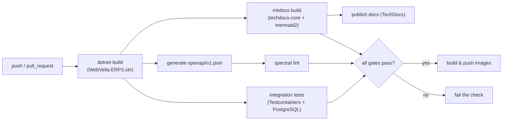

<!--{"sort_order":3, "name": "ci-cd", "label": "CI/CD"}-->

# CI/CD

Continuous integration for the headless **WebVella ERP** platform is a set of GitHub Actions workflows that build the solution, run integration tests, generate and lint the OpenAPI document, and — the concern of this workstream — **build and publish the documentation site**. The documentation build is a non-interactive gate that keeps this docs set from drifting out of sync with the code again (AAP §0.2.1).

## Current state

There is **no CI today**. The `.github/` directory contains a single file, `FUNDING.yml`; **no GitHub Actions workflows exist yet**. Source: /.github/FUNDING.yml The workflows under `.github/workflows/` described below are **to be created** by this effort — this section states what is missing (rule F) so the gap is explicit rather than implied.

| Item | State |
|------|-------|
| `.github/workflows/**` | **Not available** — no workflow files exist yet; to be created. Source: /.github/FUNDING.yml |
| Test projects | **Not available / to be confirmed** — none in the checkout today (AAP §0.9.2). |
| Docs build gate | Target of this page; runs `mkdocs build` against the existing MkDocs/TechDocs site. Source: /mkdocs.yml |

## Pipeline

> **Only the documentation build is realizable at this milestone — every other stage is pending.** This page describes three tiers: **(1) baseline (available now)** — the `mkdocs build` documentation gate over the existing MkDocs/TechDocs site; **(2) final documentation workflow** — adding the docs *publish* step (publish target **Not available / to be confirmed**); and **(3) future application CI** — the solution build, integration tests, OpenAPI generation/lint, and image build/publish, all of which depend on the headless refactor's projects, test projects, and container images that **do not exist in the checkout yet** (AAP §0.9.2). The diagram and job table below are the **target** pipeline; treat every non-documentation stage as **pending** until its code, tests, and images exist.

The target pipeline runs on every `push` and `pull_request`. The solution build fans out into the integration-test, OpenAPI, and documentation jobs; every gate must pass before container images are built and pushed.



## Jobs

Each job below is mapped to one of the three tiers from the callout above. Only **Docs build** (with the optional Markdown/link gates) is realizable today; the shared **Build** and everything downstream of it belong to the **future application CI** tier and are **pending** until the refactor's projects, test projects, OpenAPI host, and container images exist (AAP §0.9.2). The documentation job is the drift guardrail and never starts a server (see [Documentation build](#documentation-build)).

| Job | Tier | Tool | Command | Notes |
|-----|------|------|---------|-------|
| Build | Future application CI — **pending** | .NET SDK | `dotnet build WebVella.ERP3.sln -c Release` | Restores and compiles the solution. Source: /WebVella.ERP3.sln |
| Integration tests | Future application CI — **pending** | Testcontainers | `dotnet test WebVella.ERP3.sln` | Spins an ephemeral PostgreSQL container per run. No test projects exist yet — **Not available / to be confirmed** (AAP §0.9.2). |
| OpenAPI generate | Future application CI — **pending** | `Microsoft.AspNetCore.OpenApi` | run the API host to emit `/openapi/v1.json` | Requires `WebVella.Erp.Api`, which does not exist yet. Document is served at `/openapi/v1.json`; export it to a local file (conventionally `openapi.json`) as a build artifact for the lint step. |
| OpenAPI lint | Future application CI — **pending** | Spectral (`@stoplight/spectral-cli`) | `spectral lint openapi.json` | Depends on the generated document above (the exported `openapi.json`). Fails the check on ruleset violations (AAP §0.7). |
| Docs build | **Baseline — available now** | MkDocs / TechDocs | `mkdocs build --strict` | Non-interactive; **never** `mkdocs serve`. Optional: `techdocs-cli generate --no-docker`. Source: /mkdocs.yml |
| Docs publish | Final documentation workflow — **pending** | Backstage TechDocs | publish step | Publish target **Not available / to be confirmed**. |
| Markdown lint *(optional)* | Baseline *(optional)* | `markdownlint-cli` | `markdownlint-cli "**/*.md"` | Style gate; version **to be pinned at adoption** (AAP §0.7.1). |
| Link check *(optional)* | Baseline *(optional)* | `lychee` / `markdown-link-check` | `lychee docs/` | Broken-link gate; version **to be pinned at adoption** (AAP §0.7.1). |

## Documentation build

The documentation job is fully **non-interactive**: it installs the plugins the site already declares (`techdocs-core` and `mermaid2`) and runs `mkdocs build --strict`. Source: /mkdocs.yml Strict mode promotes warnings (such as a broken cross-link) to errors — exactly the mechanism that stops documentation drift from merging.

The example below is **security-hardened** per GitHub's guidance: every action is pinned to a full-length commit SHA (the only immutable action reference) with a `# vX.Y.Z` comment for Dependabot; the Python version and the two documentation plugins are pinned (prefer a hash-pinned `requirements.txt` with `pip install --require-hashes`); and the workflow grants least-privilege `permissions: contents: read`, with any future publish job granting its narrower publish permission locally rather than at the workflow level.

```yaml
# .github/workflows/docs.yml (to be created)
# Hardening (see GitHub's "Security hardening for GitHub Actions"):
#  - pin every action to a full-length commit SHA (the only immutable ref),
#    with a trailing "# vX.Y.Z" comment kept current by Dependabot;
#  - pin the Python version and install docs deps from pinned/hashed versions;
#  - grant least-privilege permissions at the workflow level, adding publish
#    permissions ONLY inside a dedicated publish job.
name: docs
on: [push, pull_request]

# Least privilege: the docs *build* only needs to read the repository.
permissions:
  contents: read

jobs:
  build-docs:
    runs-on: ubuntu-latest
    steps:
      - uses: actions/checkout@11bd71901bbe5b1630ceea73d27597364c9af683   # v4.2.2 (audited SHA)
      # Resolve the audited SHA for your chosen version, e.g.:
      #   git ls-remote https://github.com/actions/setup-python refs/tags/v5.3.0
      - uses: actions/setup-python@PIN_TO_AUDITED_SHA                     # v5.x (replace with the resolved SHA)
        with:
          python-version: '3.12'                                         # pinned — never '3.x'
      # Prefer a hash-pinned requirements file for full supply-chain integrity:
      #   pip install --require-hashes -r docs/requirements.txt
      # (requirements.txt pins exact versions + sha256 hashes). Minimum bar: pin exact versions.
      - run: pip install "mkdocs-techdocs-core==1.7.0" "mkdocs-mermaid2-plugin==1.2.3"
      - run: mkdocs build --strict          # non-interactive gate
      # Alternative: techdocs-cli generate --no-docker

  # A separate publish job (target: Not available / to be confirmed) would add
  # ONLY its required permission here — never at the workflow level. Example:
  #   publish-docs:
  #     needs: build-docs
  #     permissions:
  #       pages: write          # or id-token: write for TechDocs/OIDC publishing
  #       contents: read
```

> **Never run `mkdocs serve` (or any `--watch` mode) in CI.** `serve` starts a long-running development server that never exits and hangs the job; automation always uses `mkdocs build` (AAP §0.10.1).

## Secrets

Secrets are referenced **by name only** as GitHub Actions secrets — never as literal values (rule D):

| Secret | Purpose |
|--------|---------|
| `${{ secrets.REGISTRY_TOKEN }}` | Authenticate to the container registry for the `build & push images` step. |
| `${{ secrets.DOCS_PUBLISH_TOKEN }}` | Authenticate the documentation publish step. |

The secret names above are illustrative; provision the actual names in the repository's Actions secrets. No token, password, or connection string is ever written into a workflow file, a build log, or this page (rule D).

## Decision points

The following are unresolved and recorded as **Not available / to be confirmed** (rule F) rather than assumed:

> - **Documentation publish target** — where the built site is hosted (Backstage TechDocs storage, GitHub Pages, or another target) is undecided.
> - **Container registry** — the registry for the `build & push images` step is undecided.
> - **Test projects** — none exist in the checkout today (AAP §0.9.2); the integration-test job activates once the first test project is added to `WebVella.ERP3.sln`. Source: /WebVella.ERP3.sln

## See also

- [Build & Test](../contributing/build-and-test.md) — the local build, run, and test workflow this pipeline automates.
- [Docker Compose](docker-compose.md) — the container topology the `build & push images` step targets.
- [Kubernetes & Helm](kubernetes-helm.md) — the production Kubernetes / Helm deployment layout.
