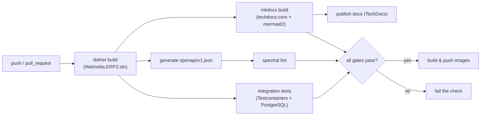

<!--{"sort_order":3, "name": "ci-cd", "label": "CI/CD"}-->

# CI/CD

Continuous integration for the headless **WebVella ERP** platform is a set of GitHub Actions workflows that build the solution, run integration tests, generate and lint the OpenAPI document, and — the concern of this workstream — **build and publish the documentation site**. The documentation build is a non-interactive gate that keeps this docs set from drifting out of sync with the code again (AAP §0.2.1).

## Current state

There is **no CI today**. The `.github/` directory contains a single file, `FUNDING.yml`; **no GitHub Actions workflows exist yet**. Source: /.github/FUNDING.yml The workflows under `.github/workflows/` described below are **to be created** by this effort — this section states what is missing (rule F) so the gap is explicit rather than implied.

| Item | State |
|------|-------|
| `.github/workflows/**` | **Not available** — no workflow files exist yet; to be created. Source: /.github/FUNDING.yml |
| Test projects | **Not available / to be confirmed** — none in the checkout today (AAP §0.9.2). |
| Docs build gate | Target of this page; runs `mkdocs build` against the existing MkDocs/TechDocs site. Source: /mkdocs.yml |

## Pipeline

The target pipeline runs on every `push` and `pull_request`. The solution build fans out into the integration-test, OpenAPI, and documentation jobs; every gate must pass before container images are built and pushed.



## Jobs

Each job runs after the shared build; the documentation job is the drift guardrail and never starts a server (see [Documentation build](#documentation-build)).

| Job | Tool | Command | Notes |
|-----|------|---------|-------|
| Build | .NET SDK | `dotnet build WebVella.ERP3.sln -c Release` | Restores and compiles the solution. Source: /WebVella.ERP3.sln |
| Integration tests | Testcontainers | `dotnet test WebVella.ERP3.sln` | Spins an ephemeral PostgreSQL container per run. No test projects exist yet — **to be confirmed** (AAP §0.9.2). |
| OpenAPI generate | `Microsoft.AspNetCore.OpenApi` | run the API host to emit `openapi/v1.json` | Document is served at `/openapi/v1.json`; export it as a build artifact for the lint step. |
| OpenAPI lint | Spectral (`@stoplight/spectral-cli`) | `spectral lint openapi/v1.json` | Fails the check on ruleset violations (AAP §0.7). |
| Docs build | MkDocs / TechDocs | `mkdocs build --strict` | Non-interactive; **never** `mkdocs serve`. Optional: `techdocs-cli generate --no-docker`. Source: /mkdocs.yml |
| Docs publish | Backstage TechDocs | publish step | Publish target **Not available / to be confirmed**. |
| Markdown lint *(optional)* | `markdownlint-cli` | `markdownlint-cli "**/*.md"` | Style gate; version **to be pinned at adoption** (AAP §0.7.1). |
| Link check *(optional)* | `lychee` / `markdown-link-check` | `lychee docs/` | Broken-link gate; version **to be pinned at adoption** (AAP §0.7.1). |

## Documentation build

The documentation job is fully **non-interactive**: it installs the plugins the site already declares (`techdocs-core` and `mermaid2`) and runs `mkdocs build --strict`. Source: /mkdocs.yml Strict mode promotes warnings (such as a broken cross-link) to errors — exactly the mechanism that stops documentation drift from merging.

```yaml
# .github/workflows/docs.yml (to be created)
name: docs
on: [push, pull_request]
jobs:
  build-docs:
    runs-on: ubuntu-latest
    steps:
      - uses: actions/checkout@v4
      - uses: actions/setup-python@v5
        with:
          python-version: '3.x'
      - run: pip install mkdocs-techdocs-core mkdocs-mermaid2-plugin
      - run: mkdocs build --strict          # non-interactive gate
      # Alternative: techdocs-cli generate --no-docker
```

> **Never run `mkdocs serve` (or any `--watch` mode) in CI.** `serve` starts a long-running development server that never exits and hangs the job; automation always uses `mkdocs build` (AAP §0.10.1).

## Secrets

Secrets are referenced **by name only** as GitHub Actions secrets — never as literal values (rule D):

| Secret | Purpose |
|--------|---------|
| `${{ secrets.REGISTRY_TOKEN }}` | Authenticate to the container registry for the `build & push images` step. |
| `${{ secrets.DOCS_PUBLISH_TOKEN }}` | Authenticate the documentation publish step. |

The secret names above are illustrative; provision the actual names in the repository's Actions secrets. No token, password, or connection string is ever written into a workflow file, a build log, or this page (rule D).

## Decision points

The following are unresolved and recorded as **Not available / to be confirmed** (rule F) rather than assumed:

> - **Documentation publish target** — where the built site is hosted (Backstage TechDocs storage, GitHub Pages, or another target) is undecided.
> - **Container registry** — the registry for the `build & push images` step is undecided.
> - **Test projects** — none exist in the checkout today (AAP §0.9.2); the integration-test job activates once the first test project is added to `WebVella.ERP3.sln`. Source: /WebVella.ERP3.sln

## See also

- [Build & Test](../contributing/build-and-test.md) — the local build, run, and test workflow this pipeline automates.
- [Docker Compose](docker-compose.md) — the container topology the `build & push images` step targets.
- [Kubernetes & Helm](kubernetes-helm.md) — the production Kubernetes / Helm deployment layout.
