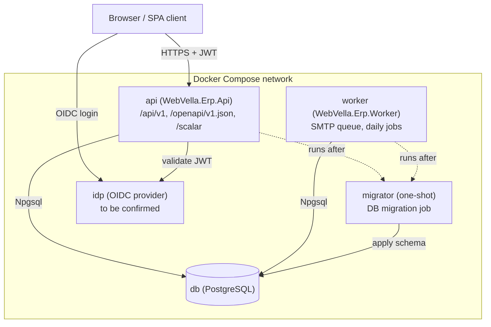

<!--{"sort_order":1, "name": "docker-compose", "label": "Docker Compose"}-->

# Docker Compose

Docker Compose is the single-host way to run the headless WebVella ERP platform locally: the REST **api**, the background **worker**, a one-shot **migrator**, the **db** (PostgreSQL), and an **idp** (OIDC/JWT issuer). It is the first stop for "how do I run this?" before moving to Kubernetes for production (see [See also](#see-also)).

> **Container assets are greenfield — Not available / to be confirmed (rule F).** No `Dockerfile`s or `docker-compose.yml` exist in the repository today; the core engine targets `net10.0`. Source: /WebVella.Erp/WebVella.Erp.csproj:L4 The per-service Dockerfiles and the Compose file described below are produced by the code/build workstream and are documented here as the intended target topology.

## Topology

The Compose project **will wire** five services on one network — this is the intended target topology (see the greenfield note above), not a runnable configuration in this checkout. The browser (React SPA client) logs in against the identity provider and calls the API with a JWT; the `api` and `worker` share the database through Npgsql; the one-shot `migrator` applies the schema before the long-running services start.



## Quick start

> **These commands are the intended target workflow — they do not run yet.** No `Dockerfile`s, `docker-compose.yml`, or service images exist in this checkout (see the greenfield note above), so `docker compose` has nothing to build or start today. The sequence below documents the **order** the code/build workstream will realize; it is not a runnable quick start at this milestone.

Once the assets exist, bring up the datastore and identity provider first, apply the database schema with the one-shot `migrator`, then start the `api` and `worker`. All commands are non-interactive:

```bash
# from the repository root (intended target workflow — see the note above)
docker compose up -d db idp
docker compose run --rm migrator      # apply database schema, then exit
docker compose up -d api worker
```

When the `api` service is running, it is intended to serve the OpenAPI 3.1 document at `/openapi/v1.json` (generated in every environment) and — **in the Development environment only** — an interactive Scalar API reference (`Scalar.AspNetCore`, AAP §0.7) at `/scalar`. Source: /WebVella.Erp/WebVella.Erp.csproj:L4 (target runtime for the API host).

### Environment and secrets

Configuration is supplied to each service by **key name only** — through an `.env` file or a secret store — and never by literal value. See the [configuration reference](configuration-reference.md) for the full key list. The database connection string and the encryption key are **secrets**: they are injected from a secret store or an untracked file and are **never committed to source control** (rule D).

**Authentication (target).** In the headless model the `api` is a pure **resource server** — it does **not** hold a JWT signing key. It validates incoming bearer tokens against the `idp`'s published keys (the provider's **JWKS / OIDC discovery** document), so the target validation parameters (authority/issuer, audience, and JWKS source) are derived from the chosen provider and are **Not available / to be confirmed**. They are **not** the legacy self-issued symmetric `Settings:Jwt:*` settings — the symmetric `Settings:Jwt:Key` model belongs only to the legacy `WebVella.Erp.Site` host. See [Security architecture](../architecture/security.md) and the [Authentication reference](../api-reference/authentication.md).

Inject every setting the same way — as an environment variable by key name (ASP.NET Core binds `Settings__*` environment variables into configuration natively) — so the wiring is uniform and actually reaches the app:

```yaml
# Illustrative only — placeholders by key name, never real values (rule D).
services:
  api:
    environment:
      # Secret values come from an untracked .env file or an external secret
      # manager; only key names appear here.
      - Settings__ConnectionString=${SETTINGS__CONNECTIONSTRING}   # secret (DB)
      - Settings__EncryptionKey=${SETTINGS__ENCRYPTIONKEY}         # secret
      # OIDC/JWT bearer validation is configured against the idp (authority /
      # audience / JWKS); the exact keys are Not available / to be confirmed and
      # are NOT a local symmetric signing key. See ../architecture/security.md.
```

If you prefer Docker Compose `secrets:` (secret **files** rather than env values), mount each file and have the service entrypoint resolve a `_FILE`-suffixed variable into the matching `Settings__*` key at startup — for example `Settings__ConnectionString__FILE=/run/secrets/db_connection` — because ASP.NET Core does not read `/run/secrets/*` into configuration on its own. Whichever mechanism you choose, apply it **consistently** to every secret so no key is silently left unset.

## Services

| Service | Image / build | Role |
|---------|---------------|------|
| `api` | `WebVella.Erp.Api` | Headless REST host serving `/api/v1/**`; exposes the OpenAPI document at `/openapi/v1.json` and the Scalar UI at `/scalar` (Development only). |
| `worker` | `WebVella.Erp.Worker` | Background job host: SMTP email-queue processing every ~10 minutes (Source: /WebVella.Erp.Plugins.Mail/MailPlugin.cs:L48,L69) and a daily project task starter at 00:10 UTC (Source: /WebVella.Erp.Plugins.Project/ProjectPlugin.cs:L47). Scheduler = **Not available / to be confirmed**. |
| `migrator` | `WebVella.Erp.Api` / console migration entrypoint | One-shot database-migration job; runs to completion before `api`/`worker` become ready. See [Database Migration Job](../migration/database-migration-job.md). |
| `db` | PostgreSQL | Relational datastore accessed through the Npgsql client `9.0.4`. Source: /WebVella.Erp/WebVella.Erp.csproj:L61 The target PostgreSQL major version is **Not available / to be confirmed**. |
| `idp` | identity provider | OIDC/JWT issuer for browser login and API token validation. Provider = **Not available / to be confirmed**. |

Legacy bootstrap for reference (the pre-refactor RazorPages host): Source: /WebVella.Erp.Site/Program.cs.

> **Startup ordering (target design).** In the intended topology the `migrator` is a one-shot service: it applies the schema and exits, and both `api` and `worker` wait for it to finish (a successful, committed migration) before serving traffic or processing jobs. This ordering is the behavior the compose/orchestration wiring **will** enforce — no `migrator` service or compose wiring exists yet. The migration and rollback flow is documented in [Database Migration Job](../migration/database-migration-job.md).

## Decision points

The following are unresolved and are documented as **Not available / to be confirmed** (rule F) rather than assumed:

> - **Identity provider (`idp`)** — Duende IdentityServer vs. Keycloak: **Not available / to be confirmed**. The topology and quick start are written provider-neutral. *Needed to resolve:* the selected provider's image, its OIDC discovery/authority URL, and the API's audience — recorded here once chosen.
> - **Worker scheduler** — Quartz.NET vs. Hangfire: **Not available / to be confirmed**. The `worker` runs the same jobs regardless of choice. *Needed to resolve:* the selected scheduler and its `worker` configuration keys.
> - **Target runtime** — `.NET 9` vs. `net10.0`: **Not available / to be confirmed**. The core project currently declares `net10.0`. Source: /WebVella.Erp/WebVella.Erp.csproj:L4 *Needed to resolve:* the authoritative platform target framework, confirmed before release.
> - **Container assets** — the per-service `Dockerfile`s and `docker-compose.yml` do not exist in the repository yet: **Not available / to be confirmed**. This page documents the intended topology the code/build workstream will realize. *Needed to resolve:* the committed Dockerfiles and `docker-compose.yml`.

## See also

- [configuration-reference.md](configuration-reference.md) — every environment variable / secret key consumed by these services, by key name only.
- [Kubernetes / Helm](kubernetes-helm.md) — the production Kubernetes / Helm layout for the same services.
- [../migration/database-migration-job.md](../migration/database-migration-job.md) — the one-shot `migrator` job, its startup gate, and rollback.
