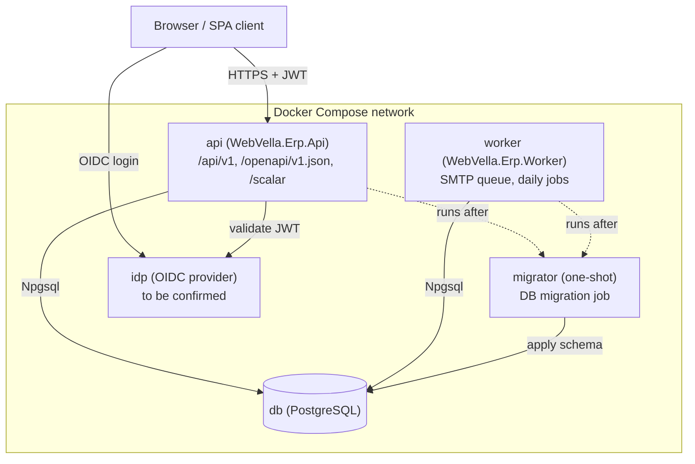

<!--{"sort_order":1, "name": "docker-compose", "label": "Docker Compose"}-->

# Docker Compose

Docker Compose is the single-host way to run the headless WebVella ERP platform locally: the REST **api**, the background **worker**, a one-shot **migrator**, the **db** (PostgreSQL), and an **idp** (OIDC/JWT issuer). It is the first stop for "how do I run this?" before moving to Kubernetes for production (see [See also](#see-also)).

> **Container assets are greenfield — Not available / to be confirmed (rule F).** No `Dockerfile`s or `docker-compose.yml` exist in the repository today; the core engine targets `net10.0`. Source: /WebVella.Erp/WebVella.Erp.csproj:L4 The per-service Dockerfiles and the Compose file described below are produced by the code/build workstream and are documented here as the intended target topology.

## Topology

The Compose project wires five services on one network. The browser (React SPA client) logs in against the identity provider and calls the API with a JWT; the `api` and `worker` share the database through Npgsql; the one-shot `migrator` applies the schema before the long-running services start.



## Quick start

Bring up the datastore and identity provider first, apply the database schema with the one-shot `migrator`, then start the `api` and `worker`. All commands are non-interactive.

```bash
# from the repository root
docker compose up -d db idp
docker compose run --rm migrator      # apply database schema, then exit
docker compose up -d api worker
```

Once the `api` service is up, the OpenAPI 3.1 document is served at `/openapi/v1.json` and — **in the Development environment only** — an interactive Scalar API reference (`Scalar.AspNetCore`, AAP §0.7) is served at `/scalar`. Source: /WebVella.Erp/WebVella.Erp.csproj:L4 (target runtime for the API host).

### Environment and secrets

Configuration is supplied to each service by **key name only** — through an `.env` file or Compose `secrets:` — and never by literal value. See the [configuration reference](configuration-reference.md) for the full key list. Secrets (the database connection string, the JWT signing key, the encryption key) are injected from a secret store or an untracked file and are **never committed to source control** (rule D).

```yaml
# Illustrative only — placeholders, never real values.
services:
  api:
    environment:
      - Settings__ConnectionString=<DB_CONNECTION_STRING>   # provide via secret
      - Settings__Jwt__Issuer=webvella-erp
      - Settings__Jwt__Audience=webvella-erp
    secrets:
      - jwt_signing_key
      - encryption_key
secrets:
  jwt_signing_key:
    file: ./secrets/jwt_signing_key       # untracked; value never committed
  encryption_key:
    file: ./secrets/encryption_key        # untracked; value never committed
```

## Services

| Service | Image / build | Role |
|---------|---------------|------|
| `api` | `WebVella.Erp.Api` | Headless REST host serving `/api/v1/**`; exposes the OpenAPI document at `/openapi/v1.json` and the Scalar UI at `/scalar` (Development only). |
| `worker` | `WebVella.Erp.Worker` | Background job host: SMTP email-queue processing every ~10 minutes (Source: /WebVella.Erp.Plugins.Mail/MailPlugin.cs:L48) and a daily project task starter at 00:10 UTC (Source: /WebVella.Erp.Plugins.Project/ProjectPlugin.cs:L47). Scheduler = **Not available / to be confirmed**. |
| `migrator` | `WebVella.Erp.Api` / console migration entrypoint | One-shot database-migration job; runs to completion before `api`/`worker` become ready. See [Database Migration Job](../migration/database-migration-job.md). |
| `db` | PostgreSQL | Relational datastore accessed through the Npgsql client `9.0.4`. Source: /WebVella.Erp/WebVella.Erp.csproj:L61 The root README references PostgreSQL 16 (Source: /README.md); confirm the target version. |
| `idp` | identity provider | OIDC/JWT issuer for browser login and API token validation. Provider = **Not available / to be confirmed**. |

Legacy bootstrap for reference (the pre-refactor RazorPages host): Source: /WebVella.Erp.Site/Program.cs.

> **Startup ordering.** The `migrator` is a one-shot service: it applies the schema and exits, and both `api` and `worker` must wait for it to finish (a successful, committed migration) before serving traffic or processing jobs. The migration and rollback flow is documented in [Database Migration Job](../migration/database-migration-job.md).

## Decision points

The following are unresolved and are documented as **Not available / to be confirmed** (rule F) rather than assumed:

> - **Identity provider (`idp`)** — Duende IdentityServer vs. Keycloak. The topology and quick start are written provider-neutral; the concrete image and issuer settings will be recorded once chosen.
> - **Worker scheduler** — Quartz.NET vs. Hangfire. The `worker` runs the same jobs regardless; the scheduler-specific configuration is pending.
> - **Target runtime** — `.NET 9` vs. `net10.0`. The core project currently declares `net10.0`. Source: /WebVella.Erp/WebVella.Erp.csproj:L4 The authoritative target framework must be confirmed before release.
> - **Container assets** — the per-service `Dockerfile`s and `docker-compose.yml` do not exist in the repository yet; this page documents the intended topology that the code/build workstream will realize.

## See also

- [configuration-reference.md](configuration-reference.md) — every environment variable / secret key consumed by these services, by key name only.
- **kubernetes-helm.md** *(planned page — not yet available)* — the production Kubernetes / Helm layout for the same services.
- [../migration/database-migration-job.md](../migration/database-migration-job.md) — the one-shot `migrator` job, its startup gate, and rollback.
