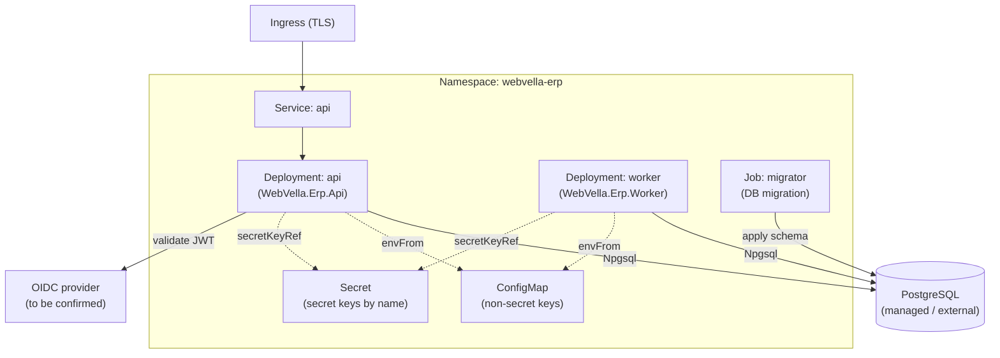

<!--{"sort_order":2, "name": "kubernetes-helm", "label": "Kubernetes & Helm"}-->

# Kubernetes & Helm

Kubernetes is the production/cluster deployment target for the headless WebVella ERP platform: the REST **api** and the background **worker** run as Deployments, a one-shot **migrator** Job applies the database schema before they roll out, and configuration is split across a ConfigMap (non-secret keys) and a Kubernetes Secret (secret keys, referenced by name only). Deployment is packaged as a Helm chart at `/deploy/helm/webvella-erp` (AAP §0.6.1).

> **Chart is greenfield — Not available / to be confirmed (rule F).** The Helm chart at `/deploy/helm/webvella-erp` does **not** exist in the repository today; it is authored by the deployment/build workstream. This page documents the intended chart layout, values, and Secret wiring as the target topology, and mirrors the [Docker Compose](docker-compose.md) service set (api / worker / migrator / db / idp) 1:1 so a local Compose stack maps to the cluster.

## Cluster layout

The `api` Service is exposed through a TLS Ingress; both the `api` and `worker` Deployments reach an external/managed PostgreSQL through the Npgsql client (Source: /WebVella.Erp/WebVella.Erp.csproj:L61) and draw non-secret configuration from a ConfigMap and secret keys from a Secret (by name). The one-shot `migrator` Job applies the schema before the Deployments become ready.



## Chart layout

The chart at `/deploy/helm/webvella-erp` (AAP §0.6.1) is organized as below. It is **Not available / to be confirmed** in the checkout — the tree is the intended layout that the deployment workstream will realize.

```text
deploy/helm/webvella-erp/
├── Chart.yaml                  # chart metadata (name, version, appVersion)
├── values.yaml                 # default values (images, replicas, ingress, resources)
└── templates/
    ├── deployment-api.yaml      # api Deployment (WebVella.Erp.Api)
    ├── deployment-worker.yaml   # worker Deployment (WebVella.Erp.Worker)
    ├── job-migrator.yaml        # one-shot migrator Job (runs before api/worker)
    ├── service.yaml             # ClusterIP Service for api
    ├── ingress.yaml             # TLS Ingress routing to the api Service
    ├── configmap.yaml           # non-secret Settings__* keys
    └── externalsecret.yaml      # reference to the Kubernetes Secret (by name; see below)
```

## Values

Key `values.yaml` knobs. Defaults are generic and marked **to be confirmed** where the deployment workstream has not fixed a value. No secret values appear here (rule D).

| Value | Purpose | Default |
|-------|---------|---------|
| `image.api.repository` / `image.api.tag` | Container image for the `api` Deployment (`WebVella.Erp.Api`). | to be confirmed |
| `image.worker.repository` / `image.worker.tag` | Container image for the `worker` Deployment (`WebVella.Erp.Worker`). | to be confirmed |
| `image.migrator.repository` / `image.migrator.tag` | Container image for the one-shot `migrator` Job. | to be confirmed |
| `api.replicaCount` | Number of `api` pod replicas. | `2` |
| `worker.replicaCount` | Number of `worker` pod replicas (typically `1` unless the scheduler supports clustering). | `1` |
| `ingress.host` | External host name routed to the `api` Service. | to be confirmed |
| `ingress.tls.enabled` | Toggle TLS termination at the Ingress. | `true` |
| `resources.requests` / `resources.limits` | CPU/memory requests and limits per pod. | to be confirmed |
| `config.configMapName` | Name of the ConfigMap holding non-secret `Settings__*` keys. | `webvella-erp-config` |
| `config.secretName` | Name of the Kubernetes Secret holding secret keys (contents provisioned out-of-band). | `webvella-erp-secrets` |

## Secrets and configuration

Configuration follows the ASP.NET Core `Settings__...` environment-variable convention (the `:` key separator becomes `__`); see the [configuration reference](configuration-reference.md) for the full key list and the `:` → `__` mapping.

- **Non-secret keys** (for example `Settings__Jwt__Issuer`, `Settings__Jwt__Audience`) are delivered from a **ConfigMap** via `envFrom`/`configMapKeyRef`.
- **Secret keys** (the database connection string, the JWT signing key, the encryption key) are delivered from a **Kubernetes Secret** referenced **by name and key only** via `valueFrom.secretKeyRef`.

The Secret's **contents are provisioned out-of-band** — with `kubectl create secret`, Sealed Secrets, or an External Secrets operator — and are **never committed to source control** (rule D). This page shows only the Secret **name** (`webvella-erp-secrets`) and the **key names**; it never reproduces a literal value from `WebVella.Erp.Site/Config.json`.

```yaml
# Illustrative pod env wiring — placeholders only; NEVER real values.
env:
  - name: Settings__Jwt__Issuer
    valueFrom:
      configMapKeyRef:
        name: webvella-erp-config            # ConfigMap name
        key: Settings__Jwt__Issuer           # non-secret; sample value webvella-erp
  - name: Settings__ConnectionString
    valueFrom:
      secretKeyRef:
        name: webvella-erp-secrets           # Secret name only
        key: Settings__ConnectionString      # key name only; value provisioned out-of-band
  - name: Settings__EncryptionKey
    valueFrom:
      secretKeyRef:
        name: webvella-erp-secrets
        key: Settings__EncryptionKey         # value never committed (rule D)
  - name: Settings__Jwt__Key
    valueFrom:
      secretKeyRef:
        name: webvella-erp-secrets
        key: Settings__Jwt__Key              # symmetric JWT signing key; value never committed
```

## Database migration Job

The `migrator` is a **one-shot Job** that runs to completion and exits **before** the `api` and `worker` Deployments roll out — a failed migration blocks the rollout rather than leaving the platform partially migrated. In Helm this is wired with a `pre-install`/`pre-upgrade` hook (or an ordered apply); the Job's success is the startup gate for the Deployments. See [Database Migration Job](../migration/database-migration-job.md) for the migration and rollback flow.

## Install

Install or upgrade the release non-interactively:

```bash
helm upgrade --install webvella-erp ./deploy/helm/webvella-erp \
  -n webvella-erp --create-namespace \
  -f values.yaml
```

The Secret named by `config.secretName` (default `webvella-erp-secrets`) must already exist in the `webvella-erp` namespace **before** install; provision it out-of-band (rule D) and never commit its contents.

## Decision points

The following are unresolved and are documented as **Not available / to be confirmed** (rule F) rather than assumed:

> - **Identity provider (`idp`)** — Duende IdentityServer vs. Keycloak. The Ingress, Service, and JWT-validation wiring are written provider-neutral; the concrete image, issuer, and JWKS settings will be recorded once chosen.
> - **Worker scheduler** — Quartz.NET vs. Hangfire. This governs whether `worker.replicaCount` can safely exceed `1`; the scheduler-specific values are pending.
> - **Target runtime** — `.NET 9` vs. `net10.0`. The core project currently declares `net10.0`. Source: /WebVella.Erp/WebVella.Erp.csproj:L4 The authoritative target framework (and therefore the base container image) must be confirmed before release.

## See also

- [docker-compose.md](docker-compose.md) — the single-host Compose topology for the same api / worker / migrator / db / idp service set.
- [configuration-reference.md](configuration-reference.md) — every environment variable / Secret key consumed by these workloads, by key name only.
- **troubleshooting.md** *(planned page — not yet available)* — common deployment failure modes and remedies.
- [../migration/database-migration-job.md](../migration/database-migration-job.md) — the one-shot `migrator` Job, its startup gate, and rollback.
