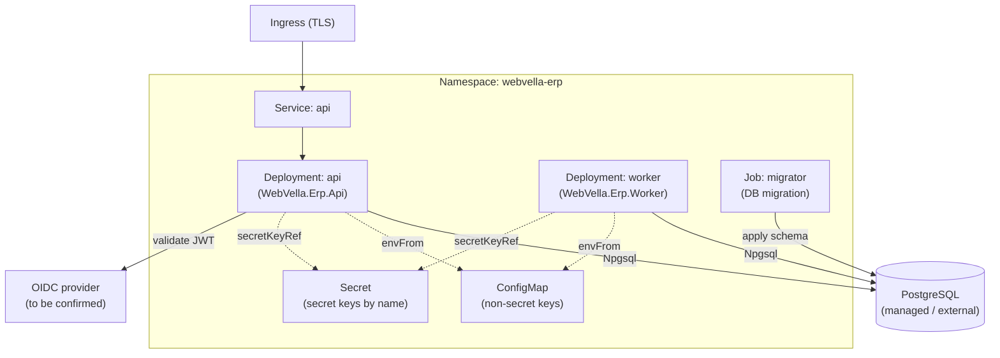

<!--{"sort_order":2, "name": "kubernetes-helm", "label": "Kubernetes & Helm"}-->

# Kubernetes & Helm

Kubernetes is the production/cluster deployment target for the headless WebVella ERP platform: the REST **api** and the background **worker** run as Deployments, a one-shot **migrator** Job applies the database schema before they roll out, and configuration is split across a ConfigMap (non-secret keys) and a Kubernetes Secret (secret keys, referenced by name only). Deployment is packaged as a Helm chart at `/deploy/helm/webvella-erp` (AAP §0.6.1).

> **Chart is greenfield — Not available / to be confirmed (rule F).** The Helm chart at `/deploy/helm/webvella-erp` does **not** exist in the repository today; it is authored by the deployment/build workstream. This page documents the intended chart layout, values, and Secret wiring as the target topology. It covers the same five-service set as [Docker Compose](docker-compose.md) (api / worker / migrator / db / idp), but the mapping is **not** 1:1 in-chart: the chart packages the `api` and `worker` Deployments and the one-shot `migrator` Job, while **`db` and `idp` are external/managed dependencies** that the workloads reference — they are **not** Deployments or other resources in this chart.

## Cluster layout

The `api` Service is exposed through a TLS Ingress; both the `api` and `worker` Deployments reach an external/managed PostgreSQL through the Npgsql client (Source: /WebVella.Erp/WebVella.Erp.csproj:L61) and draw non-secret configuration from a ConfigMap and secret keys from a Secret (by name). The one-shot `migrator` Job applies the schema before the Deployments become ready.



## Chart layout

The chart at `/deploy/helm/webvella-erp` (AAP §0.6.1) is organized as below. It is **Not available / to be confirmed** in the checkout — the tree is the intended layout that the deployment workstream will realize.

```text
deploy/helm/webvella-erp/
├── Chart.yaml                  # chart metadata (name, version, appVersion)
├── values.yaml                 # default values (images, replicas, ingress, resources)
└── templates/
    ├── deployment-api.yaml      # api Deployment (WebVella.Erp.Api)
    ├── deployment-worker.yaml   # worker Deployment (WebVella.Erp.Worker)
    ├── job-migrator.yaml        # one-shot migrator Job (runs before api/worker)
    ├── service.yaml             # ClusterIP Service for api
    ├── ingress.yaml             # TLS Ingress routing to the api Service
    ├── configmap.yaml           # non-secret Settings__* keys
    └── externalsecret.yaml      # reference to the Kubernetes Secret (by name; see below)
```

## Values

Key `values.yaml` knobs. **The chart does not exist in the checkout yet, so every entry below is a *proposed* default (Not available / to be confirmed) that the deployment workstream will finalize — the numbers and names shown are illustrative, not authoritative.** No secret values appear here (rule D).

| Value | Purpose | Proposed default (chart pending) |
|-------|---------|----------------------------------|
| `image.api.repository` / `image.api.tag` | Container image for the `api` Deployment (`WebVella.Erp.Api`). | Not available / to be confirmed |
| `image.worker.repository` / `image.worker.tag` | Container image for the `worker` Deployment (`WebVella.Erp.Worker`). | Not available / to be confirmed |
| `image.migrator.repository` / `image.migrator.tag` | Container image for the one-shot `migrator` Job. | Not available / to be confirmed |
| `api.replicaCount` | Number of `api` pod replicas. | `2` *(proposed)* |
| `worker.replicaCount` | Number of `worker` pod replicas (typically `1` unless the scheduler supports clustering). | `1` *(proposed; depends on scheduler)* |
| `ingress.host` | External host name routed to the `api` Service. | Not available / to be confirmed |
| `ingress.tls.enabled` | Toggle TLS termination at the Ingress. | `true` *(proposed)* |
| `resources.requests` / `resources.limits` | CPU/memory requests and limits per pod. | Not available / to be confirmed |
| `config.configMapName` | Name of the ConfigMap holding non-secret `Settings__*` keys. | `webvella-erp-config` *(proposed)* |
| `config.secretName` | Name of the Kubernetes Secret holding secret keys (contents provisioned out-of-band). | `webvella-erp-secrets` *(proposed)* |

## Secrets and configuration

Configuration follows the ASP.NET Core `Settings__...` environment-variable convention (the `:` key separator becomes `__`); see the [configuration reference](configuration-reference.md) for the full key list and the `:` → `__` mapping.

- **Non-secret keys** are delivered from a **ConfigMap** via `envFrom`/`configMapKeyRef`. In the target model these include the OIDC/JWT bearer **validation** settings (authority/issuer, audience, and the provider's JWKS/discovery location); their exact key names are **Not available / to be confirmed** until the identity provider is chosen (see [Security architecture](../architecture/security.md)).
- **Secret keys** (the database connection string and the encryption key) are delivered from a **Kubernetes Secret** referenced **by name and key only** via `valueFrom.secretKeyRef`.

> **No symmetric JWT signing key in the target Secret.** The `api` is a pure **resource server**: it validates bearer tokens against the identity provider's **asymmetric** keys (JWKS), so there is **no** `Settings:Jwt:Key` secret in the target wiring. The symmetric `Settings:Jwt:Key` model belongs only to the **legacy** `WebVella.Erp.Site` host — if that legacy host is deployed, its signing key would live in its own Secret, not the headless `api` Secret. See [Security architecture](../architecture/security.md).

The Secret's **contents are provisioned out-of-band** — with `kubectl create secret`, Sealed Secrets, or an External Secrets operator — and are **never committed to source control** (rule D). This page shows only the Secret **name** (`webvella-erp-secrets`, proposed) and the **key names**; it never reproduces a literal value from `WebVella.Erp.Site/Config.json`.

```yaml
# Illustrative pod env wiring — placeholders only; NEVER real values (rule D).
env:
  # OIDC/JWT bearer validation config (authority / audience / JWKS location) is
  # non-secret and comes from the ConfigMap; the exact key names are
  # Not available / to be confirmed until the provider is chosen
  # (see ../architecture/security.md). The target api holds NO symmetric signing key.
  - name: Settings__ConnectionString
    valueFrom:
      secretKeyRef:
        name: webvella-erp-secrets           # Secret name only
        key: Settings__ConnectionString      # key name only; value provisioned out-of-band
  - name: Settings__EncryptionKey
    valueFrom:
      secretKeyRef:
        name: webvella-erp-secrets
        key: Settings__EncryptionKey         # value never committed (rule D)
# Note: Settings__Jwt__Key (a symmetric signing key) is a LEGACY WebVella.Erp.Site
# key only — it does not appear in the headless api's Secret.
```

## Database migration Job

In the target design the `migrator` is a **one-shot Job** that runs to completion and exits **before** the `api` and `worker` Deployments roll out, so a failed migration blocks the rollout rather than leaving the platform partially migrated. The intended wiring is a Helm `pre-install`/`pre-upgrade` hook (or an ordered apply) whose success gates the Deployments — **this hook and gate do not exist yet (the chart is greenfield) and are documented as the proposed behavior**. See [Database Migration Job](../migration/database-migration-job.md) for the migration and rollback flow.

## Install

> **This command is the intended target workflow — it does not run yet.** The Helm chart at `./deploy/helm/webvella-erp` does not exist in this checkout, so `helm upgrade --install` has nothing to deploy today. The command below documents the intended install once the chart is authored.

Once the chart exists, install or upgrade the release non-interactively:

```bash
helm upgrade --install webvella-erp ./deploy/helm/webvella-erp \
  -n webvella-erp --create-namespace \
  -f values.yaml
```

The Secret named by `config.secretName` (proposed `webvella-erp-secrets`) must already exist in the `webvella-erp` namespace **before** install; provision it out-of-band (rule D) and never commit its contents.

## Decision points

The following are unresolved and are documented as **Not available / to be confirmed** (rule F) rather than assumed:

> - **Identity provider (`idp`)** — Duende IdentityServer vs. Keycloak: **Not available / to be confirmed**. The Ingress, Service, and JWT-validation wiring are written provider-neutral. *Needed to resolve:* the selected provider's image, its OIDC discovery/authority URL, the API audience, and the JWKS location — recorded once chosen.
> - **Worker scheduler** — Quartz.NET vs. Hangfire: **Not available / to be confirmed**. This governs whether `worker.replicaCount` can safely exceed `1`. *Needed to resolve:* the selected scheduler and its `worker` configuration values.
> - **Target runtime** — `.NET 9` vs. `net10.0`: **Not available / to be confirmed**. The core project currently declares `net10.0`. Source: /WebVella.Erp/WebVella.Erp.csproj:L4 *Needed to resolve:* the authoritative platform target framework (and therefore the base container image), confirmed before release.

## See also

- [docker-compose.md](docker-compose.md) — the single-host Compose topology for the same api / worker / migrator / db / idp service set.
- [configuration-reference.md](configuration-reference.md) — every environment variable / Secret key consumed by these workloads, by key name only.
- [troubleshooting.md](troubleshooting.md) — common deployment failure modes and remedies.
- [../migration/database-migration-job.md](../migration/database-migration-job.md) — the one-shot `migrator` Job, its startup gate, and rollback.
