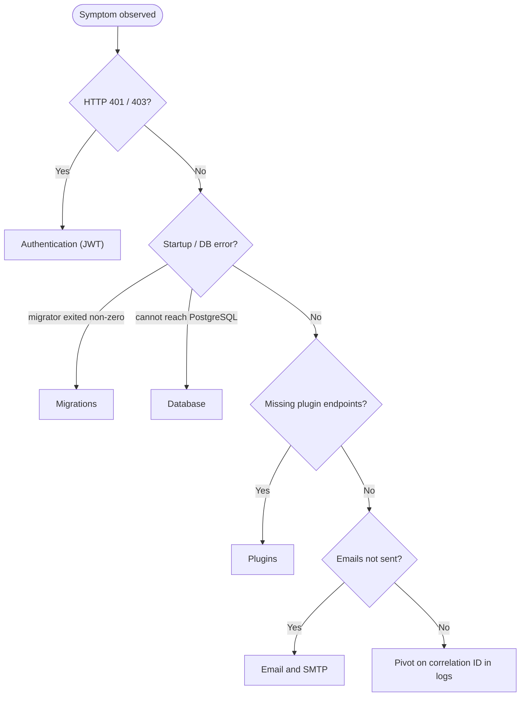

<!--{"sort_order":5, "name": "troubleshooting", "label": "Troubleshooting"}-->

# Troubleshooting

> **Planned target — not yet implemented.** The container-native platform this page troubleshoots — the `api`, `worker`, one-shot `migrator`, `db`, and identity-provider services, environment-variable / Kubernetes-Secret configuration, and the `.wvplugin` plugin host — is the **proposed target** of the headless refactor and **does not exist in the checkout yet** (AAP §0.9.2). The remedies below are the planned operator playbook, not current behaviour. Configuration keys are shown in their container-native environment-variable form (for example `Settings__ConnectionString`, the `Settings:ConnectionString` key of the legacy `config.json`). Source: /WebVella.Erp.Site/Config.json:L2

This is the operator's first stop during an incident. Match the observed **symptom** in the table below, then read the matching detail section. For diagnosis, always start from the **structured logs and correlation IDs** described in [Observability](../architecture/observability.md): one validated correlation ID ties a single operation across the SPA, API, and worker so a failure can be traced end to end.

> **No secrets in remedies (rule D).** Every remedy references configuration by **key name only** — it never prints a connection string, signing key, encryption key, or SMTP credential. Secrets are supplied via a Kubernetes Secret (or environment variable) and must never be committed, logged, or pasted where they would be captured. The authoritative key table is the [Configuration Reference](configuration-reference.md).

## Common failure modes

| Symptom | Likely cause | Remedy |
|---------|--------------|--------|
| `api`, `worker`, or `migrator` cannot reach PostgreSQL; Npgsql connection or timeout errors on startup or first query | Bad or missing connection-string key; the `db` service is not ready or not reachable; the `migrator` has not run yet | Verify `Settings__ConnectionString` is present and injected from a Secret; confirm the `db` service is healthy and network-reachable; confirm the `migrator` completed. See [Database](#database). |
| Valid-looking requests are rejected with `401 Unauthorized` or `403 Forbidden` | **Target (OIDC):** issuer/audience mismatch against the provider, or the API cannot fetch/validate against the provider's JWKS/authority. **Legacy (`WebVella.Erp.Site`):** symmetric-key or self-issued issuer/audience mismatch. Either: client/server clock skew | **Target:** confirm the API's OIDC authority and audience and that it can reach the provider's JWKS (exact keys pending). **Legacy:** align `Settings__Jwt__Issuer` / `Settings__Jwt__Audience` (default `webvella-erp`) and the symmetric `Settings__Jwt__Key`. Check clock skew. See [Authentication (JWT)](#authentication-jwt). |
| A `.wvplugin` package fails to load; the `api` starts but the plugin's endpoints are missing | Bad package layout; target-framework / ABI mismatch; `AssemblyLoadContext` load error; wrong plugin-directory path | Verify the plugin-directory key and package layout and rebuild against the correct target framework. *(Target design — pending: a collectible `AssemblyLoadContext` host would isolate the fault and keep serving; no such loader exists yet.)* Follow the planned rollback path. See [Plugins](#plugins). |
| The `migrator` Job exits non-zero; schema is not applied; `api` / `worker` refuse to start | *(Target design — pending):* an `OnMigrateAsync` transaction rolled back on error; database connectivity; a partial or failed version patch | Inspect the `migrator` logs, fix the cause, and re-run the idempotent job; if a bad patch shipped, restore the prior version and roll back. See [Migrations](#migrations). |
| Outbound emails are not sent / the SMTP queue backs up | The queue's SMTP service is disabled (`smtp_service.is_enabled = false`) or its schedule plan is not running; background jobs disabled; bad SMTP host, port, or credentials. **Note:** `Settings__EmailEnabled` gates the separate `MailService` direct-send path, **not** the queue. | Confirm the queue's `smtp_service.is_enabled` is `true` and that the *"Start tasks to process SMTP email queue"* schedule plan is enabled and running (every ~10 min); verify the SMTP host/port keys and provide the credential Secrets by name. See [Email and SMTP](#email-and-smtp). |

## Triage

*Route a symptom to its detail section below; when nothing matches, pivot on the correlation ID through the structured logs described in [Observability](../architecture/observability.md).*

## Failure modes in detail

### Database

**Symptom:** the `api`, `worker`, or `migrator` cannot open a PostgreSQL connection — Npgsql raises a connection or timeout error at startup or on the first query. The data-access layer talks to PostgreSQL through Npgsql. Source: /WebVella.Erp/WebVella.Erp.csproj:L61 (`Npgsql 9.0.4`).

**Remedy:** confirm the connection-string key `Settings__ConnectionString` (the `Settings:ConnectionString` key of the legacy `config.json`) is set and injected from a Secret — never inline the value. Source: /WebVella.Erp.Site/Config.json:L4. Verify the `db` service is healthy and reachable on the network, and that the one-shot `migrator` has already applied the schema (the `api` and `worker` gate on it). The authoritative key table is in the [Configuration Reference](configuration-reference.md); if the failure is a migration rather than connectivity, see [Migrations](#migrations).

### Authentication (JWT)

**Symptom:** requests that look valid are rejected with `401` or `403`. Diagnose the **target** and **legacy** models separately — they validate tokens differently.

**Remedy — target (headless `api`, planned).** The `api` is a pure **resource server**: it validates tokens against the identity provider's **asymmetric** keys (JWKS) — there is **no** local symmetric signing key. Confirm the API's configured OIDC **authority** and **audience** match the token's `iss`/`aud`, and that the API can reach the provider's JWKS/discovery endpoint to validate the signature. The exact authority/audience/JWKS key names are **Not available / to be confirmed** until the provider is chosen. See [Security](../architecture/security.md).

**Remedy — legacy (`WebVella.Erp.Site`, verified current).** The legacy host self-issues tokens and validates them with a **symmetric** key on issuer, audience, lifetime, and signing key. Source: /WebVella.Erp.Site/JWT_README.txt. Ensure `Settings__Jwt__Issuer` and `Settings__Jwt__Audience` match the token — both default to `webvella-erp` unless reconfigured. Source: /WebVella.Erp.Site/Config.json:L26 (issuer); Source: /WebVella.Erp.Site/Config.json:L27 (audience). Confirm the symmetric signing-key Secret `Settings__Jwt__Key` is present and matches the issuer's key. Source: /WebVella.Erp.Site/Config.json:L25.

For either model, check client/server clock skew — a token that is expired or whose `nbf` is in the future fails lifetime validation. The authentication architecture and claim-to-role/permission mapping live in [Security](../architecture/security.md); key handling is in the [Configuration Reference](configuration-reference.md).

### Plugins

**Symptom:** a `.wvplugin` package fails to load and the `api` starts **without** that plugin's endpoints. **In the target design** each plugin would load into its own collectible `AssemblyLoadContext`, so a faulty plugin is isolated and can be unloaded without restarting the host — this collectible-context loader **does not exist yet** and is documented as proposed behavior (see [Plugin host](../architecture/plugin-host.md)).

**Remedy:** verify the plugin-directory configuration key and the package layout, then rebuild the plugin against the correct target framework — an ABI or target-framework mismatch is a common cause. In the target design the host would contain the fault and keep serving healthy plugins *(pending)*; follow the planned plugin-load rollback path in the [Rollback Plan](../migration/rollback-plan.md). Package layout (and the note that the loader is **not** a security sandbox) is documented in [Packaging plugins](../plugin-sdk/packaging-wvplugin.md).

### Migrations

**Symptom:** the one-shot `migrator` Job exits non-zero, the schema is not applied, and the `api` / `worker` refuse to start against an un-migrated database.

**Remedy:** **in the target design** the `migrator` would apply patches inside a single transaction via `OnMigrateAsync(IDbTransaction)` and roll the transaction back on any error, so the schema is never left partially patched — the one-shot `migrator` service and `OnMigrateAsync` **do not exist yet** and are documented as proposed behavior. The transaction primitives this builds on already exist today: `BeginTransaction` / `CommitTransaction` / `RollbackTransaction`. Source: /WebVella.Erp.ConsoleApp/Program.cs:L75,L79,L83. Inspect the `migrator` logs, fix the cause — connectivity or a failing version patch — and re-run the idempotent job; if a bad patch shipped, restore the prior `migrator` version. The full job flow is in the [Database migration job](../migration/database-migration-job.md) guide and the fail-safe procedure in the [Rollback Plan](../migration/rollback-plan.md).

### Email and SMTP

**Symptom:** outbound emails are not delivered or the SMTP queue grows without draining. The queue is drained by a scheduled job — *"Start tasks to process SMTP email queue"* — that runs at a fixed interval (every ~10 minutes). Source: /WebVella.Erp.Plugins.Mail/MailPlugin.cs:L48; the interval is `IntervalInMinutes = 10`, Source: /WebVella.Erp.Plugins.Mail/MailPlugin.cs:L69.

**Remedy:** the queue's send step is gated by the SMTP service record's own switch — confirm `smtp_service.is_enabled` is `true`; when it is `false` the queue processor aborts with *"SMTP service is not enabled"* and nothing drains. Source: /WebVella.Erp.Plugins.Mail/Services/SmtpInternalService.cs:L700. Note that `Settings__EmailEnabled` (default `false`, Source: /WebVella.Erp.Site/Config.json:L14) gates the **separate** `MailService` direct-send path (Source: /WebVella.Erp.Web/Services/MailService.cs:L24), **not** the queue. Verify the SMTP host and port keys `Settings__EmailSMTPServerName` and `Settings__EmailSMTPPort` (port defaults to `25`), and provide the credential Secrets `Settings__EmailSMTPUsername` and `Settings__EmailSMTPPassword` by name — never inline them. Source: /WebVella.Erp.Site/Config.json:L15-L18. Finally, confirm the schedule plan that drains the queue is actually running: today it runs **in-process** on whatever host loads the Mail plugin (registered by `MailPlugin.SetSchedulePlans()`), and background-job processing must be enabled (`Settings__EnableBackgroundJobs`). Under the headless refactor this job moves to `WebVella.Erp.Worker` *(target — pending)*; there, also confirm the worker is up. See [Email and SMTP configuration](configuration-reference.md#email-and-smtp).

## Decision points

Some remedies depend on platform decisions that are still open; per the evidence-based rule they are recorded here as unresolved rather than assumed.

> - **Worker scheduler — Not available / to be confirmed.** Whether the SMTP-queue and migration remedies involve pausing, draining, or re-triggering in-flight jobs depends on the scheduler chosen for `WebVella.Erp.Worker` (Quartz.NET vs. Hangfire).
> - **Authentication provider — Not available / to be confirmed.** The exact OIDC-authority remedy for `401` / `403` depends on the identity provider (Duende IdentityServer vs. Keycloak); the JWT issuer/audience/signing-key remedies above are provider-neutral.
> - **Target runtime — Not available / to be confirmed.** The specification states ".NET 9" while the core project targets `net10.0`; the authoritative runtime must be confirmed before any remedy pins a container image or SDK version. Source: /WebVella.Erp/WebVella.Erp.csproj:L4.

## See also

- [Rollback Plan](../migration/rollback-plan.md) — fail-safe rollback for a plugin that will not load and for a failed database migration.
- [Observability](../architecture/observability.md) — structured JSON logs and validated correlation IDs to pivot on during diagnosis.
- [Configuration Reference](configuration-reference.md) — authoritative table of configuration keys, defaults, and Secret handling.
- [Docker Compose](docker-compose.md) — Compose topology of the `api`, `worker`, `migrator`, `db`, and identity-provider services.
- [Security](../architecture/security.md) — authentication architecture, JWT/OIDC validation, and claim mapping.
- [Database migration job](../migration/database-migration-job.md) — the one-shot `migrator` service and its transaction/rollback flow.
- [Packaging plugins](../plugin-sdk/packaging-wvplugin.md) — `.wvplugin` package layout and the plugin directory.
- [Kubernetes & Helm](kubernetes-helm.md) — Helm values and Kubernetes Secret wiring for these configuration keys (the target cluster deployment topology).
