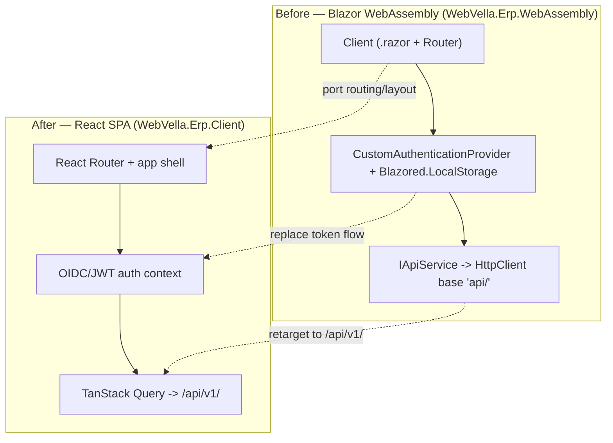

<!--{"sort_order":3, "name": "blazor-retirement", "label": "Blazor Retirement"}-->

# Blazor Retirement

The legacy **Blazor WebAssembly** client (`WebVella.Erp.WebAssembly`) is **retired** and replaced by the React single-page application (`WebVella.Erp.Client`). The legacy client is a Blazor WebAssembly project whose entry SDK is `Microsoft.NET.Sdk.BlazorWebAssembly`, targeting `net10.0`. Source: /WebVella.Erp.WebAssembly/Client/WebVella.Erp.WebAssembly.csproj:L1,L4 (Blazor WebAssembly client, before). The HTTP API it consumed was reached through an `HttpClient` whose base address was `serverUrl + "api/"` (**before**); that surface is now the versioned `/api/v1/` REST surface exposed by `WebVella.Erp.Api`. Source: /WebVella.Erp.WebAssembly/Client/Program.cs:L15 (legacy base `serverUrl + "api/"`, before); Source: /docs/migration/overview.md:L5 (headless target: a React SPA over `/api/v1/`).

This page is the companion to the UI cutover in [RazorPages to React](razorpages-to-react.md): both guides converge on the same React SPA target — React with Vite, TanStack Query, and Radix/Tailwind. Source: /docs/migration/razorpages-to-react.md:L5 (React SPA over `/api/v1/`); Source: AAP §0.6.1 (client stack — React + Vite + TanStack Query + Radix/Tailwind; see the forthcoming `WebVella.Erp.Client/README.md`). It records what to **port** from the Blazor client and what to **drop** with the Blazor host.

> All Blazor, `Blazored.LocalStorage`, and other legacy references on this page describe the **"before"** state — the client being retired — except where a row or bullet names the "after" React equivalent.

## What to port

The capabilities to re-express are enumerated from the Blazor bootstrap (the dependency-injection service list) and the app root (routing and layout); the table maps each to its React SPA equivalent. Source: /WebVella.Erp.WebAssembly/Client/Program.cs:L20-L27 (service registrations); Source: /WebVella.Erp.WebAssembly/Client/App.razor:L1-L11 (routing and layout).

| Capability | Before — Blazor (`WebVella.Erp.WebAssembly`) | After — React SPA (`WebVella.Erp.Client`) |
|-----------|-----------------------------------------------|---------------------------------------------|
| Routing & layout | `<Router>` with a `MainLayout` default layout and `<FocusOnNavigate>`. Source: /WebVella.Erp.WebAssembly/Client/App.razor:L1-L4 | React Router with an app-shell layout component. Source: /docs/migration/overview.md:L5 |
| Data / API access | `IApiService` over an `HttpClient` whose base is `serverUrl + "api/"`. Source: /WebVella.Erp.WebAssembly/Client/Program.cs:L15,L20,L27 | Typed `fetch` / TanStack Query hooks calling `/api/v1/`. Source: /docs/migration/overview.md:L5 |
| Authentication & tokens | `CustomAuthenticationProvider` + `ITokenManagerService` + `IAuthenticationService`. Source: /WebVella.Erp.WebAssembly/Client/Program.cs:L21,L25,L26 | An OIDC/JWT auth context that holds the bearer token and refresh flow. Source: /docs/migration/razorpages-to-react.md:L18 (OIDC / JWT bearer) |
| Runtime configuration | `IConfigurationService`, which reads `serverUrl` and app settings. Source: /WebVella.Erp.WebAssembly/Client/Program.cs:L24 | Env-driven SPA runtime config — keys and defaults only, no secret values (Rule D). Source: /docs/migration/overview.md:L5 |

Porting re-expresses these capabilities on the React stack; it is a re-hosting of the presentation tier, not a rewrite — the same routes, data operations, and authenticated calls are reproduced against `/api/v1/`. Source: /docs/migration/razorpages-to-react.md:L7 (re-hosting, not a rewrite of business logic).

## What to drop

The following are **removed** with the Blazor host and have **no** carry-over into the React SPA:

- **The Blazor hosting split.** The Client / Server / Shared project layout of the legacy `WebVella.Erp.WebAssembly` client is decommissioned in favour of the single `WebVella.Erp.Client` SPA. Source: /WebVella.Erp.WebAssembly (Blazor WebAssembly client, before).
- **All `.razor` components.** The component tree rooted at `App.razor` (the `<Router>`, `MainLayout`, and page components) is not ported; React components replace it. Source: /WebVella.Erp.WebAssembly/Client/App.razor:L1-L12 (before).
- **`Blazored.LocalStorage`.** The browser-storage package used for token persistence (**before**) is dropped; the SPA handles token storage through its OIDC/JWT auth context instead. Source: /WebVella.Erp.WebAssembly/Client/WebVella.Erp.WebAssembly.csproj:L20 (`Blazored.LocalStorage` 4.5.0, before).
- **Blazor-specific DI wiring.** `AddBlazoredLocalStorage()`, `AddAuthorizationCore()`, and the `AuthenticationStateProvider` registration are Blazor-runtime constructs with no React equivalent. Source: /WebVella.Erp.WebAssembly/Client/Program.cs:L21-L23 (before).
- **The `Microsoft.NET.Sdk.BlazorWebAssembly` project itself.** The WebAssembly SDK project is retired once the React SPA reaches parity. Source: /WebVella.Erp.WebAssembly/Client/WebVella.Erp.WebAssembly.csproj:L1 (SDK `Microsoft.NET.Sdk.BlazorWebAssembly`, before).

## Data & auth continuity

Retiring the Blazor client changes the **transport and host**, not the data contract. The core engine and its Entity, Record, and EQL model are **unchanged**, so the shape of the data the client exchanges (records, entities, EQL results) is the same before and after. Source: /docs/migration/overview.md:L5 (the Entity / Record / EQL / hook model is unchanged); Source: /docs/migration/razorpages-to-react.md:L7 (re-hosting, not a rewrite). Two things move:

- **Base path.** The client no longer targets `serverUrl + "api/"` (**before**); it targets the versioned `/api/v1/` surface. Source: /WebVella.Erp.WebAssembly/Client/Program.cs:L15 (legacy base, before); Source: /docs/migration/overview.md:L5 (`/api/v1/`, after).
- **Token handling.** The legacy local-storage token flow (`Blazored.LocalStorage` + `ITokenManagerService`, **before**) is replaced by **OIDC / JWT bearer** authentication carried on each request. The flow is described by mechanism only — no token, key, or secret value appears in configuration or documentation (Rule D). Source: /WebVella.Erp.WebAssembly/Client/Program.cs:L23,L25 (legacy token storage, before); Source: /docs/migration/razorpages-to-react.md:L18 (OIDC / JWT bearer, after).

The **OIDC identity provider is Not available / to be confirmed** (Duende IdentityServer vs Keycloak); the SPA auth context stays provider-neutral until the decision is made. Source: /docs/migration/overview.md:L74 (identity provider — Not available / to be confirmed).

## Retirement flow

The diagram contrasts the Blazor WebAssembly client (**before**) with the React SPA (**after**). The dotted edges are the porting actions: routing/layout is ported, the token flow is replaced, and the API calls are retargeted to `/api/v1/`.

*Diagram: the Blazor WebAssembly client (before) retired in favour of the React SPA (after); the dotted edges are the porting actions.* Source: /WebVella.Erp.WebAssembly/Client/Program.cs:L15,L20-L27 (Blazor bootstrap, HTTP base, and DI service list).

**Related:** [Migration overview](overview.md) · [RazorPages to React](razorpages-to-react.md) · [ICodeVariable / BaseErpPageModel adapter](../architecture/icodevariable-adapter.md)
