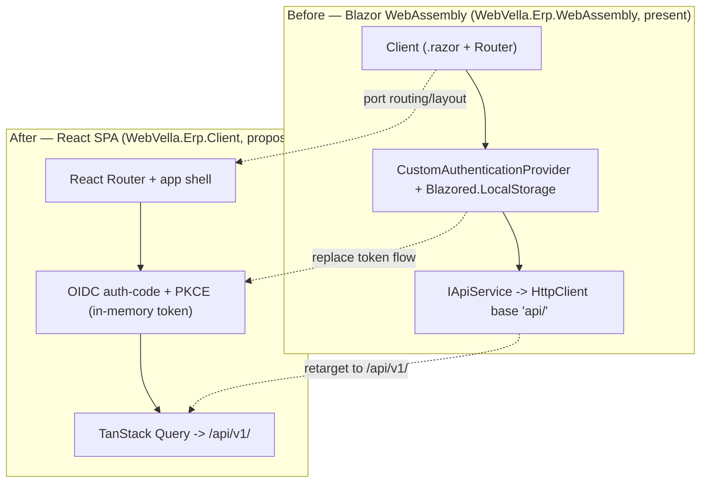

<!--{"sort_order":3, "name": "blazor-retirement", "label": "Blazor Retirement"}-->

# Blazor Retirement

> **Planned target — not yet implemented.** This page describes the *planned* retirement of the Blazor WebAssembly client. The legacy client (`WebVella.Erp.WebAssembly`) is **still present in the repository and has not been retired**, and its React replacement (`WebVella.Erp.Client`) **does not exist yet**. Content describing the **"before"** state cites real code; **"after"/target** content is design intent, and undecided values are marked **Not available / to be confirmed**.

The legacy **Blazor WebAssembly** client (`WebVella.Erp.WebAssembly`) is **planned to be retired** and replaced by a React single-page application (`WebVella.Erp.Client`); neither the retirement nor the React project has happened yet. The legacy client is a Blazor WebAssembly project whose entry SDK is `Microsoft.NET.Sdk.BlazorWebAssembly`, targeting `net10.0`. Source: /WebVella.Erp.WebAssembly/Client/WebVella.Erp.WebAssembly.csproj:L1,L4 (Blazor WebAssembly client, before). The HTTP API it consumes today is reached through an `HttpClient` whose base address is `serverUrl + "api/"` (**before**); the target surface **would be** the versioned `/api/v1/` REST surface exposed by the (not-yet-existing) `WebVella.Erp.Api` host. Source: /WebVella.Erp.WebAssembly/Client/Program.cs:L15 (legacy base `serverUrl + "api/"`, before). The `/api/v1/` target and its host are **Not available / to be confirmed** (no `WebVella.Erp.Api` project exists yet).

This page is the companion to the UI cutover in [RazorPages to React](razorpages-to-react.md): both guides converge on the same planned React SPA target — React with Vite, TanStack Query, and Radix/Tailwind (design intent per AAP §0.6.1; the `WebVella.Erp.Client` project does not exist yet). It records what to **port** from the Blazor client and what to **drop** with the Blazor host.

> All Blazor, `Blazored.LocalStorage`, and other legacy references on this page describe the **"before"** state — the client planned for retirement — except where a row or bullet names the proposed "after" React equivalent. The React equivalents are target design and are not yet implemented.

## What to port

The capabilities to re-express are enumerated from the Blazor bootstrap (the dependency-injection service list) and the app root (routing and layout); the table maps each to its proposed React SPA equivalent. Source: /WebVella.Erp.WebAssembly/Client/Program.cs:L20-L27 (service registrations, before); Source: /WebVella.Erp.WebAssembly/Client/App.razor:L1-L11 (routing and layout, before).

| Capability | Before — Blazor (`WebVella.Erp.WebAssembly`) | After — React SPA (`WebVella.Erp.Client`, proposed) |
|-----------|-----------------------------------------------|---------------------------------------------|
| Routing & layout | `<Router>` with a `MainLayout` default layout and `<FocusOnNavigate>`. Source: /WebVella.Erp.WebAssembly/Client/App.razor:L1-L4 | React Router with an app-shell layout component. *Proposed target — Not available / to be confirmed.* |
| Data / API access | `IApiService` over an `HttpClient` whose base is `serverUrl + "api/"`. Source: /WebVella.Erp.WebAssembly/Client/Program.cs:L15,L20,L27 | Typed `fetch` / TanStack Query hooks calling `/api/v1/`. *Proposed target — Not available / to be confirmed.* |
| Authentication & tokens | `CustomAuthenticationProvider` + `ITokenManagerService` + `IAuthenticationService`. Source: /WebVella.Erp.WebAssembly/Client/Program.cs:L21,L25,L26 | A provider-neutral OIDC auth context using the authorization-code flow with PKCE (see *Data & auth continuity* below). *Proposed target — Not available / to be confirmed.* |
| Runtime configuration | `IConfigurationService`, which reads `serverUrl` and app settings. Source: /WebVella.Erp.WebAssembly/Client/Program.cs:L24 | Env-driven SPA runtime config — keys and defaults only, no secret values (Rule D). *Proposed target — Not available / to be confirmed.* |

Porting would re-express these capabilities on the React stack; it is a re-hosting of the presentation tier, not a rewrite — the same routes, data operations, and authenticated calls would be reproduced against `/api/v1/`. The core engine below is unchanged. Source: /WebVella.Erp/WebVella.Erp.csproj:L4 (core engine `net10.0`, unchanged).

## What to drop

The following **would be removed** with the Blazor host and have **no** carry-over into the React SPA (all describe the current "before" state):

- **The Blazor hosting split.** The Client / Server / Shared project layout of the legacy `WebVella.Erp.WebAssembly` client would be decommissioned in favour of the single `WebVella.Erp.Client` SPA. Source: /WebVella.Erp.WebAssembly (Blazor WebAssembly client, before).
- **All `.razor` components.** The component tree rooted at `App.razor` (the `<Router>`, `MainLayout`, and page components) would not be ported; React components would replace it. Source: /WebVella.Erp.WebAssembly/Client/App.razor:L1-L12 (before).
- **`Blazored.LocalStorage`.** The browser-storage package used for token persistence (**before**) would be dropped; the SPA should **not** persist tokens in `localStorage` (see *Data & auth continuity*). Source: /WebVella.Erp.WebAssembly/Client/WebVella.Erp.WebAssembly.csproj:L20 (`Blazored.LocalStorage` 4.5.0, before).
- **Blazor-specific DI wiring.** `AddBlazoredLocalStorage()`, `AddAuthorizationCore()`, and the `AuthenticationStateProvider` registration are Blazor-runtime constructs with no React equivalent. Source: /WebVella.Erp.WebAssembly/Client/Program.cs:L21-L23 (before).
- **The `Microsoft.NET.Sdk.BlazorWebAssembly` project itself.** The WebAssembly SDK project would be retired **once** the React SPA reaches parity; it is still present today. Source: /WebVella.Erp.WebAssembly/Client/WebVella.Erp.WebAssembly.csproj:L1 (SDK `Microsoft.NET.Sdk.BlazorWebAssembly`, before).

## Data & auth continuity

Retiring the Blazor client would change the **transport and host**, not the data contract. The core engine and its Entity, Record, and EQL model are **unchanged**, so the shape of the data the client exchanges (records, entities, EQL results) is the same before and after. Source: /WebVella.Erp/Api/EntityManager.cs (in-process EntityManager, unchanged); Source: /WebVella.Erp/Api/RecordManager.cs (in-process RecordManager, unchanged). Two things move:

- **Base path.** The client today targets `serverUrl + "api/"` (**before**); the target would be the versioned `/api/v1/` surface. Source: /WebVella.Erp.WebAssembly/Client/Program.cs:L15 (legacy base, before). The `/api/v1/` surface is **Not available / to be confirmed** (no `WebVella.Erp.Api` project exists yet).
- **Token handling.** The legacy local-storage token flow (`Blazored.LocalStorage` + `ITokenManagerService`, **before**) would be replaced by a **provider-neutral OIDC** login. Source: /WebVella.Erp.WebAssembly/Client/Program.cs:L23,L25 (legacy token storage, before). The target model is described **by mechanism only** and is otherwise **Not available / to be confirmed** until the identity provider and the `WebVella.Erp.Api` host exist:
  - The SPA is a **public client** and **must not be issued or configured with a client secret** — a browser-delivered secret cannot be kept confidential.
  - Login uses the **OAuth 2.0 / OIDC authorization-code flow with PKCE** (code challenge method **S256**), never the implicit flow and never a password/direct-token grant from the browser.
  - The SPA must validate the OIDC **`state`** and **`nonce`** parameters and use an **exact, pre-registered redirect URI**; tokens must not be accepted from an unexpected origin.
  - Access tokens should be held **in memory** (not in `localStorage`/`sessionStorage`) for the session; refresh should rely on **rotating refresh tokens** (or a silent-renew mechanism), with the previous refresh token invalidated on each use.
  - Token **issuer, audience, signing algorithm/keys (JWKS), lifetimes, and storage specifics are Not available / to be confirmed** and must be finalized against the chosen identity provider and the `WebVella.Erp.Api` validation configuration; no token, key, or secret value appears in configuration or documentation (Rule D).

The **OIDC identity provider is Not available / to be confirmed** (Duende IdentityServer vs Keycloak); the SPA auth context stays provider-neutral until the decision is made.

## Retirement flow

The diagram contrasts the Blazor WebAssembly client (**before**, still present) with the proposed React SPA (**after**, not yet built). The dotted edges are the planned porting actions: routing/layout is ported, the token flow is replaced, and the API calls are retargeted to `/api/v1/`.

*Diagram: the Blazor WebAssembly client (before, still present) planned for retirement in favour of the React SPA (after, proposed); the dotted edges are the planned porting actions.* Source: /WebVella.Erp.WebAssembly/Client/Program.cs:L15,L20-L27 (Blazor bootstrap, HTTP base, and DI service list).

**Related:** [Migration overview](overview.md) · [RazorPages to React](razorpages-to-react.md) · [ICodeVariable / BaseErpPageModel adapter](../architecture/icodevariable-adapter.md)
