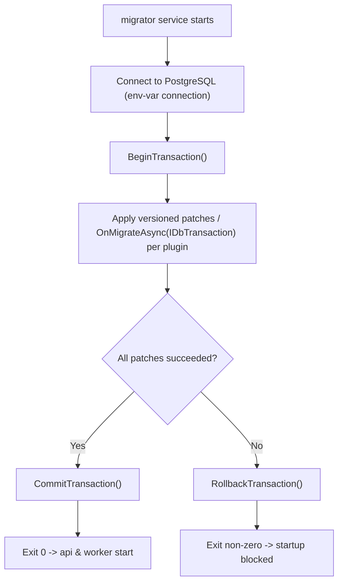

<!--{"sort_order":5, "name": "database-migration-job", "label": "Database Migration Job"}-->

# Database Migration Job

Schema and data patches are applied by a dedicated, **one-shot `migrator` service** — not by the API or the worker at startup. The `migrator` opens a single database transaction, runs every plugin's `OnMigrateAsync(IDbTransaction)` inside that transaction, and then either **commits all patches together or rolls the whole transaction back**. It must finish successfully **before** the `api` and `worker` services start, so a failed migration *blocks* the platform from starting rather than leaving it partially migrated. `Source: tech spec §2.4` (per-plugin versioned init patches — `WEBVELLA_*_INIT_VERSION` — applied with transactional rollback).

The per-plugin contract this job drives — `OnMigrateAsync(IDbTransaction)`, the host-owned transaction, and the all-or-nothing rollback — is defined in [Plugin migrations — OnMigrateAsync](../plugin-sdk/migrations-onmigrateasync.md). The connection and transaction scoping the job relies on is described in [Data Access](../architecture/data-access.md).

## Bootstrap harness

The `migrator` service reuses — headlessly — the engine bootstrap sequence that the legacy `WebVella.Erp.ConsoleApp` console application uses as its startup harness. That console app is the **"before" bootstrap harness**: it is not the target `migrator` service, but it demonstrates the exact initialization and transaction pattern the headless job follows.

Its `InitErpEngine()` method performs the engine bootstrap in this order:

1. **`ErpSettings.Initialize(...)`** — bind configuration (including the PostgreSQL connection string, by key name). `Source: /WebVella.Erp.ConsoleApp/Program.cs:L41`
2. **`DbContext.CreateContext(ErpSettings.ConnectionString)`** — open the data-access context from the configured connection string, referenced by the `ErpSettings.ConnectionString` key (never a literal value). `Source: /WebVella.Erp.ConsoleApp/Program.cs:L42`
3. **`service.InitializeSystemEntities()`** — ensure the core system Entities exist. `Source: /WebVella.Erp.ConsoleApp/Program.cs:L49`
4. **`HookManager.RegisterHooks(service)`** — register hooks so that any migration-time Record operations fire their hooks. `Source: /WebVella.Erp.ConsoleApp/Program.cs:L53`

The console app is built as an executable that references the core engine (`OutputType` `Exe`, `TargetFramework` `net10.0`, project reference to `WebVella.Erp`). `Source: /WebVella.Erp.ConsoleApp/WebVella.Erp.ConsoleApp.csproj:L4-L5,L22`

The same source shows the **transaction boundary** the migration runs inside: open with `connection.BeginTransaction()`, do the work, then `connection.CommitTransaction()`; on any exception `connection.RollbackTransaction()` and rethrow. `Source: /WebVella.Erp.ConsoleApp/Program.cs:L75,L79,L81-L85` This is the identical boundary the host owns when it hands its open transaction to each plugin's `OnMigrateAsync(IDbTransaction)` — see [Plugin migrations — OnMigrateAsync](../plugin-sdk/migrations-onmigrateasync.md) and the transaction-scoping detail in [Data Access](../architecture/data-access.md).

## Job execution flow

Running headlessly, the `migrator` service executes these steps:

1. **Connect.** Bind configuration and open the data-access context from the configured connection string, following the bootstrap harness above. The connection string is supplied **by configuration key / environment variable name only** — never a literal connection string, host, user, or password (Rule D). `Source: tech spec §1.2.2.3` (`ErpSettings` binds the connection string); `Source: /WebVella.Erp.ConsoleApp/Program.cs:L42`. For the exact env-var / Kubernetes Secret key, see the [Configuration Reference](../deployment/configuration-reference.md).
2. **Begin one transaction.** Open a single host-owned transaction with `BeginTransaction()`. `Source: /WebVella.Erp.ConsoleApp/Program.cs:L75`
3. **Apply patches per plugin.** For each plugin, in dependency order, invoke `OnMigrateAsync(IDbTransaction)`, which applies only the versioned patches newer than the plugin's persisted version, in ascending order, on the shared transaction. `Source: tech spec §2.4`; see [Plugin migrations — OnMigrateAsync](../plugin-sdk/migrations-onmigrateasync.md).
4. **Commit or roll back.** If every plugin migration succeeds, `CommitTransaction()` commits all patches together and the job exits `0`. `Source: /WebVella.Erp.ConsoleApp/Program.cs:L79` If any patch throws, `RollbackTransaction()` discards **every** pending change atomically and the job exits non-zero, blocking startup (fail fast). `Source: /WebVella.Erp.ConsoleApp/Program.cs:L81-L85`

Because all writes share one transaction, the job is **all-or-nothing**: the database is never left partially migrated. The versioned-init checks also make the job **idempotent** — re-running it against an already-current database applies nothing. `Source: tech spec §2.4`

## Ordering & startup gate

The `migrator` is a **one-shot** service: it runs to completion, exits, and acts as a **startup gate** for the rest of the platform. The `api` and `worker` services must not start until the `migrator` has exited `0`, so that no request or background job ever runs against a partially migrated database. `Source: tech spec §2.4` In the container-native model this ordering is expressed as a dependency on the `migrator` service completing successfully, with the connection string injected into the `migrator` as an environment variable / Kubernetes Secret **by name only** (Rule D). See the [Docker Compose deployment](../deployment/docker-compose.md) for the `migrator` service definition and the `api`/`worker` start ordering.

## Failure modes & troubleshooting

| Failure | What happens | Remedy |
| --- | --- | --- |
| **A patch throws (partial patch)** | The whole transaction is rolled back with `RollbackTransaction()` and the job exits non-zero; nothing is committed, so the database is never partially migrated. `Source: /WebVella.Erp.ConsoleApp/Program.cs:L81-L85` | Fix the failing patch, then re-run the `migrator`; the versioned-init checks resume from the last persisted version. See [Plugin migrations — OnMigrateAsync](../plugin-sdk/migrations-onmigrateasync.md). |
| **Connectivity failure** | `DbContext.CreateContext(...)` cannot open a connection, so the job fails before any transaction begins and exits non-zero — the startup gate keeps `api`/`worker` down. `Source: /WebVella.Erp.ConsoleApp/Program.cs:L42` | Verify the connection string is configured by key / env-var name and that PostgreSQL is reachable; never place a literal value in docs, logs, or config (Rule D). See [Data Access](../architecture/data-access.md). |
| **Version-constant mismatch** | A plugin's persisted installed version is ahead of the patches its assembly ships, so a version gate never matches and patches are skipped. `Source: tech spec §2.4` | Ship patches whose version constants are strictly greater than the installed version; never lower a `WEBVELLA_*_INIT_VERSION` number. |

When a migration cannot be completed, treat it as a blocked cutover and follow the [Rollback plan](rollback-plan.md) rather than starting `api`/`worker` against an un-migrated or partially patched database.

## Migration + rollback flow

*The one-shot migrator opens a single transaction, applies each plugin's versioned patches through `OnMigrateAsync(IDbTransaction)`, then commits on success (exit 0, platform starts) or rolls back on any error (exit non-zero, startup blocked). Source: /WebVella.Erp.ConsoleApp/Program.cs:L75,L79,L81-L85*

## Related

- [Plugin migrations — OnMigrateAsync](../plugin-sdk/migrations-onmigrateasync.md) — the per-plugin `OnMigrateAsync(IDbTransaction)` contract and versioned-init pattern this job drives.
- [Data Access](../architecture/data-access.md) — how the engine scopes the Npgsql connection and `IDbTransaction` the migration runs inside.
- [Docker Compose deployment](../deployment/docker-compose.md) — the `migrator` service definition and the `api`/`worker` startup ordering.
- [Rollback plan](rollback-plan.md) — what to do when a plugin migration cannot be completed.
