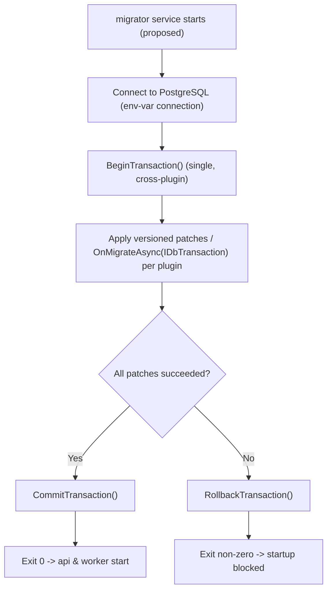

<!--{"sort_order":5, "name": "database-migration-job", "label": "Database Migration Job"}-->

# Database Migration Job

> **Planned target — not yet implemented.** This page describes a *proposed* one-shot database-migration service. The `migrator` service, the `IErpPlugin.OnMigrateAsync(IDbTransaction)` contract, the single host-owned cross-plugin transaction, the plugin dependency-ordering, the process exit-code contract, and the startup gate it relies on **do not exist in the repository yet** — no migrator/orchestrator project and no `OnMigrateAsync` member are present. Everything describing that service is **Not available / to be confirmed**. Content describing the **current ("before")** migration model cites real code.

## Proposed target (Not available / to be confirmed)

The *target* design is a dedicated, **one-shot `migrator` service** — separate from the API and the worker — that would open a single database transaction, run every plugin's proposed `OnMigrateAsync(IDbTransaction)` inside that one transaction, and then **commit all patches together or roll the whole transaction back**. It would run to completion and exit **before** the `api` and `worker` services start, acting as a startup gate so a failed migration blocks the platform rather than leaving it partially migrated.

None of that exists yet. Delivering it requires the following artifacts, each **Not available / to be confirmed**:

- A **migrator host project** (a one-shot console/host that reuses the engine bootstrap). No `*migrator*` project exists in the solution.
- The **`IErpPlugin` contract** with an **`OnMigrateAsync(IDbTransaction)`** member. Neither `interface IErpPlugin` nor `OnMigrateAsync` exists in the codebase.
- A **host-owned single-transaction orchestrator** that shares one `IDbTransaction` across **all** plugins (today each plugin owns its own transaction — see below).
- A **plugin dependency-ordering** mechanism to fix the order in which plugin migrations run.
- A **process exit-code contract** (`0` = success → start `api`/`worker`; non-zero = fail → block startup) and the container-level **startup gate** that enforces it. See [Docker Compose deployment](../deployment/docker-compose.md) for the intended `migrator` service definition and `api`/`worker` start ordering.

The proposed per-plugin contract this job would drive — `OnMigrateAsync(IDbTransaction)`, the host-owned transaction, and the all-or-nothing rollback — is described in [Plugin migrations — OnMigrateAsync](../plugin-sdk/migrations-onmigrateasync.md). The connection and transaction scoping it would rely on is described in [Data Access](../architecture/data-access.md).

## Current model (before)

Today there is **no** single cross-plugin migration transaction and **no** `OnMigrateAsync`. Instead, **each plugin applies its own versioned patches inside its own transaction** during its `Initialize(IServiceProvider)` call. For the SDK plugin, `Initialize` opens its own connection and transaction, checks a persisted version against a compile-time version constant, applies newer patches, then commits — or rolls back on any exception:

- Version constant gate: `WEBVELLA_SDK_INIT_VERSION = 20181001`, compared against the plugin's persisted `PluginSettings.Version`. Source: /WebVella.Erp.Plugins.SDK/SdkPlugin._.cs:L12,L68
- Own connection + transaction: `DbContext.Current.CreateConnection()` then `connection.BeginTransaction()`. Source: /WebVella.Erp.Plugins.SDK/SdkPlugin._.cs:L31,L35
- Commit on success / rollback on exception: `connection.CommitTransaction()` else `connection.RollbackTransaction()`. Source: /WebVella.Erp.Plugins.SDK/SdkPlugin._.cs:L153,L158
- The plugin base type is `ErpPlugin` with the synchronous `Initialize(IServiceProvider)` entry point. Source: /WebVella.Erp/ErpPlugin.cs:L12,L57

Because each plugin commits independently, the current model is **per-plugin all-or-nothing**, **not** cross-plugin all-or-nothing: one plugin can commit while a later plugin fails. Making the migration atomic **across** plugins, and ordering plugins deterministically, is exactly what the proposed `migrator` (above) would add — and is **Not available / to be confirmed**.

## Bootstrap harness (before)

A headless `migrator` would need to bootstrap the engine before applying any patches. The existing `WebVella.Erp.ConsoleApp` console application demonstrates that bootstrap harness today (it is **not** the target `migrator` service and it does **not** run plugin migrations in one transaction). Its `InitErpEngine()` performs the engine bootstrap in this order:

1. **`ErpSettings.Initialize(...)`** — bind configuration (including the PostgreSQL connection string, by key name). Source: /WebVella.Erp.ConsoleApp/Program.cs:L41
2. **`DbContext.CreateContext(ErpSettings.ConnectionString)`** — open the data-access context from the configured connection string, referenced by the `ErpSettings.ConnectionString` key (never a literal value). Source: /WebVella.Erp.ConsoleApp/Program.cs:L42
3. **`service.InitializeSystemEntities()`** — ensure the core system Entities exist. Source: /WebVella.Erp.ConsoleApp/Program.cs:L49
4. **`HookManager.RegisterHooks(service)`** — register hooks so that any migration-time Record operations fire their hooks. Source: /WebVella.Erp.ConsoleApp/Program.cs:L53

The console app is built as an executable that references the core engine (`OutputType` `Exe`, `TargetFramework` `net10.0`, project reference to `WebVella.Erp`). Source: /WebVella.Erp.ConsoleApp/WebVella.Erp.ConsoleApp.csproj:L4-L5,L22

The same codebase shows the low-level **transaction primitive** the migration would use — `connection.BeginTransaction()`, do the work, `connection.CommitTransaction()`, and on any exception `connection.RollbackTransaction()` then rethrow. In `Program.cs` this appears in a small sample query method (not the bootstrap and not a plugin-migration orchestrator), and it is the same primitive each plugin uses today. Source: /WebVella.Erp.ConsoleApp/Program.cs:L75,L79,L81-L85 (sample transaction primitive); Source: /WebVella.Erp.Plugins.SDK/SdkPlugin._.cs:L35,L153,L158 (per-plugin use today). The proposed cross-plugin, host-owned transaction that would hand one open transaction to each plugin's `OnMigrateAsync(IDbTransaction)` is described in [Plugin migrations — OnMigrateAsync](../plugin-sdk/migrations-onmigrateasync.md) and the transaction-scoping detail in [Data Access](../architecture/data-access.md), and is **Not available / to be confirmed**.

## Proposed job execution flow (Not available / to be confirmed)

If the `migrator` service is built to the target design, it would run headlessly with these steps. This flow is **proposed**; no such service exists yet:

1. **Connect.** Bind configuration and open the data-access context from the configured connection string, reusing the bootstrap harness above. The connection string would be supplied **by configuration key / environment variable name only** — never a literal connection string, host, user, or password (Rule D). Source: /WebVella.Erp.ConsoleApp/Program.cs:L42 (context creation from `ErpSettings.ConnectionString`). For the intended env-var / Kubernetes Secret key, see the [Configuration Reference](../deployment/configuration-reference.md).
2. **Begin one transaction.** Open a single host-owned transaction with `BeginTransaction()`. Source: /WebVella.Erp.ConsoleApp/Program.cs:L75 (transaction primitive). *Cross-plugin single transaction — Not available / to be confirmed.*
3. **Apply patches per plugin (in dependency order).** For each plugin, invoke the proposed `OnMigrateAsync(IDbTransaction)`, applying only the versioned patches newer than the plugin's persisted version, in ascending order, on the shared transaction. *The `OnMigrateAsync` contract and the dependency ordering do not exist yet — Not available / to be confirmed.* See [Plugin migrations — OnMigrateAsync](../plugin-sdk/migrations-onmigrateasync.md).
4. **Commit or roll back.** If every plugin migration succeeds, `CommitTransaction()` would commit all patches together and the job would exit `0`; if any patch throws, `RollbackTransaction()` would discard **every** pending change atomically and the job would exit non-zero, blocking startup (fail fast). Source: /WebVella.Erp.ConsoleApp/Program.cs:L79,L81-L85 (commit/rollback primitives). *The exit-code contract and startup gate — Not available / to be confirmed.*

Under this proposed design, because all writes would share one transaction, the job would be **all-or-nothing** across plugins, and the versioned-init checks would keep it **idempotent** — re-running against an already-current database would apply nothing. The version-check idempotency already holds per plugin today. Source: /WebVella.Erp.Plugins.SDK/SdkPlugin._.cs:L68,L79 (persisted-version gate).

## Ordering & startup gate (Not available / to be confirmed)

In the target design the `migrator` would be a **one-shot** service that runs to completion, exits, and acts as a **startup gate**: the `api` and `worker` services would not start until the `migrator` exits `0`, so no request or background job ever runs against a partially migrated database. In a container-native model this ordering would be expressed as a dependency on the `migrator` completing successfully, with the connection string injected **by name only** (Rule D). No migrator service, and no compose/orchestration wiring, exists yet. See [Docker Compose deployment](../deployment/docker-compose.md).

## Failure modes & troubleshooting

These are the **proposed** behaviors of the target `migrator`; they are not yet implemented.

| Failure | Proposed behavior | Remedy |
| --- | --- | --- |
| **A patch throws (partial patch)** | The whole (cross-plugin) transaction would be rolled back with `RollbackTransaction()` and the job would exit non-zero; nothing is committed. *Cross-plugin atomicity — Not available / to be confirmed.* Source: /WebVella.Erp.ConsoleApp/Program.cs:L81-L85 (rollback primitive) | Fix the failing patch, then re-run the `migrator`; versioned-init checks resume from the last persisted version. See [Plugin migrations — OnMigrateAsync](../plugin-sdk/migrations-onmigrateasync.md). |
| **Connectivity failure** | `DbContext.CreateContext(...)` cannot open a connection, so the job fails before any transaction begins and exits non-zero — the startup gate would keep `api`/`worker` down. Source: /WebVella.Erp.ConsoleApp/Program.cs:L42 | Verify the connection string is configured by key / env-var name and that PostgreSQL is reachable; never place a literal value in docs, logs, or config (Rule D). See [Data Access](../architecture/data-access.md). |
| **Version-constant mismatch** | A plugin's persisted installed version is ahead of the patches its assembly ships, so a version gate never matches and patches are skipped. Source: /WebVella.Erp.Plugins.SDK/SdkPlugin._.cs:L68,L79 | Ship patches whose version constants are strictly greater than the installed version; never lower a `WEBVELLA_*_INIT_VERSION` number. |

When a migration cannot be completed, treat it as a blocked cutover and follow the [Rollback plan](rollback-plan.md) rather than starting `api`/`worker` against an un-migrated or partially patched database.

## Proposed migration + rollback flow (Not available / to be confirmed)

The diagram is the **proposed** flow for the not-yet-built `migrator` service:

*Proposed flow: a one-shot migrator would open a single transaction, apply each plugin's versioned patches through `OnMigrateAsync(IDbTransaction)`, then commit on success (exit 0, platform starts) or roll back on any error (exit non-zero, startup blocked). This service and the `OnMigrateAsync` contract do not exist yet.* Source: /WebVella.Erp.ConsoleApp/Program.cs:L75,L79,L81-L85 (transaction primitives the flow would reuse).

## Related

- [Plugin migrations — OnMigrateAsync](../plugin-sdk/migrations-onmigrateasync.md) — the proposed per-plugin `OnMigrateAsync(IDbTransaction)` contract and the current versioned-init pattern this job would drive.
- [Data Access](../architecture/data-access.md) — how the engine scopes the Npgsql connection and `IDbTransaction`.
- [Docker Compose deployment](../deployment/docker-compose.md) — the intended `migrator` service definition and the `api`/`worker` startup ordering.
- [Rollback plan](rollback-plan.md) — what to do when a plugin migration cannot be completed.
