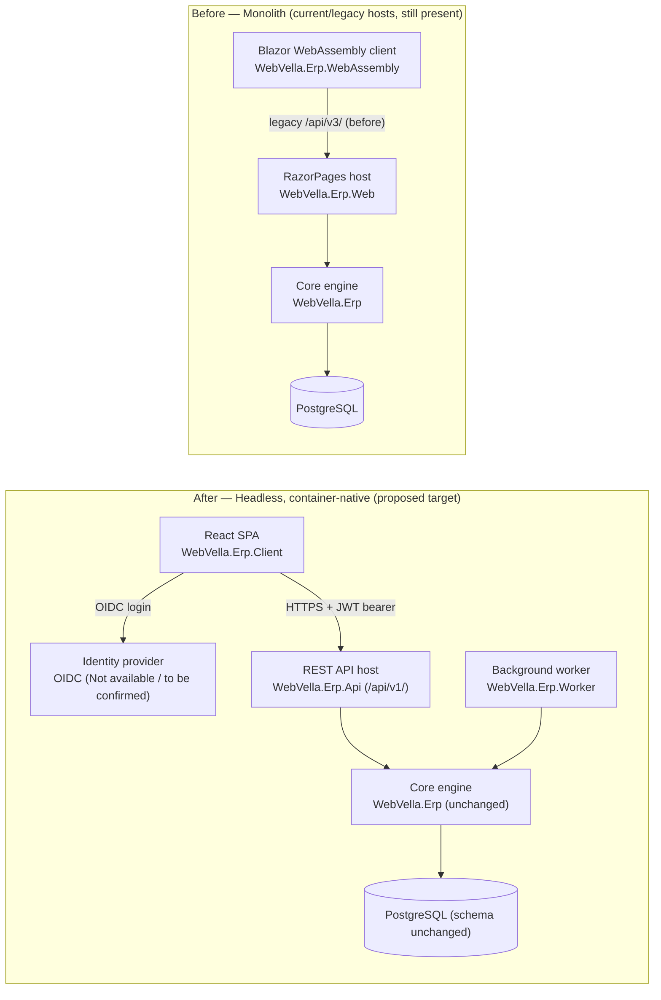

<!--{"sort_order":1, "name": "overview", "label": "Overview"}-->

# Migration Overview

> **Planned target — not yet implemented.** This guide describes the *target* headless migration. The target projects it references — `WebVella.Erp.Api`, `WebVella.Erp.Client`, `WebVella.Erp.Worker`, the `IErpPlugin` plugin host, and the one-shot `migrator` service — **do not exist in the repository yet**. The legacy hosts (`WebVella.Erp.Web`, `WebVella.Erp.WebAssembly`, and the `WebVella.Erp.Site.*` projects) are **still present and have not been retired**. Content describing the **"before"** state cites real code; **"after"/target** content is design intent, and undecided values are marked **Not available / to be confirmed**.

WebVella ERP is **planned to be** re-hosted from a **monolithic host** into a **headless, container-native platform**. The current ("before") host is a RazorPages web application (`WebVella.Erp.Web`) paired with a Blazor WebAssembly client (`WebVella.Erp.WebAssembly`). The target ("after") platform **would split** that host into three independently deployable services: a REST API host (`WebVella.Erp.Api`) that exposes the versioned `/api/v1/` surface, a React single-page application (`WebVella.Erp.Client`), and a background worker (`WebVella.Erp.Worker`) — all built on the **unchanged** core engine (`WebVella.Erp`) and PostgreSQL, with an external OIDC identity provider issuing the JSON Web Tokens (JWTs) that authorize each API call. Crucially, the underlying **Entity, Record, EQL, and hook model is unchanged**: only the hosting model changes, so this is a re-hosting effort rather than a rewrite of business logic. None of the three target services exists in the checkout yet; each is created by a separate implementation workstream.

Source: /WebVella.Erp.Web/WebVella.Erp.Web.csproj:L1 (RazorPages host, before — SDK `Microsoft.NET.Sdk.Razor`)
Source: /WebVella.Erp.WebAssembly/Client/WebVella.Erp.WebAssembly.csproj:L1 (Blazor WebAssembly client, before — SDK `Microsoft.NET.Sdk.BlazorWebAssembly`)
Source: /WebVella.Erp/WebVella.Erp.csproj:L4 (core engine target `net10.0`, unchanged)

## Strategy

The migration is planned to be **incremental and documentation-first**: each capability is documented in its target ("after") shape before the matching host is cut over, so integrators always have a stable reference to follow. Because the core engine and the PostgreSQL schema are **unchanged** by the refactor, the work is about **re-hosting** the existing Entity, Record, EQL, and hook model behind new transports — not rewriting business logic. Every step therefore preserves the domain behavior that the core engine already provides and focuses purely on the hosting-model change.

Source: AAP §0.9.2 (application source, database schema, and legacy-host retirement are out of scope for the documentation workstream; the PostgreSQL schema is unchanged by the refactor)

## Sequencing

The **recommended (target) order of work** below is the *proposed* migration plan — it is design intent, not an executable sequence, because the target hosts, the `IErpPlugin` contract, and the `migrator` service it references do not exist yet. It moves from the data and service tiers outward to the user interface, while keeping a rollback path available throughout:

1. **Stand up the headless API and run the database-migration job (planned).** Once the `WebVella.Erp.Api` host exists, it would run against the existing database, and a database-migration job would apply any schema patches before a client depends on it. The one-shot `migrator` service and its transaction/ordering model are **Not available / to be confirmed** (no such project exists yet). See [Database migration job](database-migration-job.md).
2. **Migrate plugins to the `IErpPlugin` contract (planned).** Each bundled plugin would be ported from the current `ErpPlugin.Initialize(IServiceProvider)` model to the proposed asynchronous `IErpPlugin` lifecycle so it loads under the headless host. The `IErpPlugin` interface does not exist yet. See [Plugin migration](plugin-migration.md).
3. **Cut the user interface over from RazorPages to the React SPA (planned).** The server-rendered RazorPages UI would be replaced with the `WebVella.Erp.Client` single-page application, which would talk to `/api/v1/`. See [RazorPages to React](razorpages-to-react.md).
4. **Retire the Blazor WebAssembly client (planned).** The `WebVella.Erp.WebAssembly` client would be decommissioned **once** the React SPA reaches parity; it is still present today. See [Blazor retirement](blazor-retirement.md).
5. **Keep a rollback path at every step (planned).** Each stage should be reversible if a plugin or a migration fails. See [Rollback plan](rollback-plan.md).

## Before / after topology

The diagram below contrasts the monolithic "before" hosting model with the proposed headless "after" platform. Legacy elements (RazorPages, Blazor WebAssembly, and the legacy `/api/v3/` surface) appear only inside the clearly labelled **Before** group; they describe the current state being migrated away from and are still present in the repository. Everything in the **After** group is the *proposed target* and does not exist yet.

*Diagram: the monolithic "before" topology (the current RazorPages and Blazor WebAssembly hosts, still present) versus the proposed headless "after" topology (REST API host, React SPA, and worker on the unchanged core engine). The "after" services do not exist yet.* Source: /WebVella.Erp.Web/WebVella.Erp.Web.csproj:L1 (RazorPages host, before); Source: /WebVella.Erp.WebAssembly/Client/WebVella.Erp.WebAssembly.csproj:L1 (Blazor WebAssembly client, before).

## In this section

- [RazorPages to React](razorpages-to-react.md) — planned cutover from the RazorPages UI to the React SPA.
- [Blazor retirement](blazor-retirement.md) — planned retirement of the Blazor WebAssembly client.
- [Plugin migration](plugin-migration.md) — porting the five bundled plugins to the proposed `IErpPlugin` contract.
- [Database migration job](database-migration-job.md) — the proposed `migrator` service and the `OnMigrateAsync` flow.
- [Rollback plan](rollback-plan.md) — rollback when a plugin or a migration fails.

**Related:** the [Architecture overview](../architecture/overview.md) describes the proposed headless target design in detail.

## Open decisions

Three platform decisions are still open. In keeping with the evidence-based documentation rule, they are recorded here explicitly rather than assumed, and the affected guides in this section must be finalized once each decision is made.

> - **Target runtime — Not available / to be confirmed.** The refactor specification states ".NET 9", while the code currently targets `net10.0`; the authoritative target must be confirmed before it is documented as fixed. Source: /WebVella.Erp/WebVella.Erp.csproj:L4 (`net10.0`).
> - **Identity provider — Not available / to be confirmed.** The OIDC provider — Duende IdentityServer vs Keycloak — is undecided; migration guidance stays provider-neutral until it is chosen.
> - **Worker scheduler — Not available / to be confirmed.** The background-job scheduler — Quartz.NET vs Hangfire — is undecided; the worker (`WebVella.Erp.Worker`) migration notes remain pending until it is chosen.
