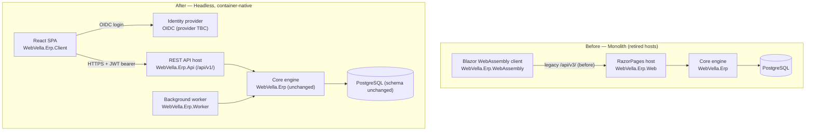

<!--{"sort_order":1, "name": "overview", "label": "Overview"}-->

# Migration Overview

WebVella ERP is being re-hosted from a **monolithic host** into a **headless, container-native platform**. The previous ("before") host is a RazorPages web application (`WebVella.Erp.Web`) paired with a Blazor WebAssembly client (`WebVella.Erp.WebAssembly`). The target ("after") platform splits that host into three independently deployable services: a REST API host (`WebVella.Erp.Api`) that exposes the versioned `/api/v1/` surface, a React single-page application (`WebVella.Erp.Client`), and a background worker (`WebVella.Erp.Worker`) — all built on the **unchanged** core engine (`WebVella.Erp`) and PostgreSQL, with an external OIDC identity provider issuing the JSON Web Tokens (JWTs) that authorize each API call. Crucially, the underlying **Entity, Record, EQL, and hook model is unchanged**: only the hosting model changes, so this is a re-hosting effort rather than a rewrite of business logic.

Source: /WebVella.Erp.Web/WebVella.Erp.Web.csproj:L1 (RazorPages host, before — SDK `Microsoft.NET.Sdk.Razor`)
Source: /WebVella.Erp.WebAssembly/Client/WebVella.Erp.WebAssembly.csproj:L1 (Blazor WebAssembly client, before — SDK `Microsoft.NET.Sdk.BlazorWebAssembly`)
Source: /WebVella.Erp/WebVella.Erp.csproj:L4 (core engine target `net10.0`, unchanged)

## Strategy

The migration is **incremental and documentation-first**: each capability is documented in its target ("after") shape before the matching host is cut over, so integrators always have a stable reference to follow. Because the core engine and the PostgreSQL schema are **unchanged** by the refactor, the work is about **re-hosting** the existing Entity, Record, EQL, and hook model behind new transports — not rewriting business logic. Every step therefore preserves the domain behavior that the core engine already provides and focuses purely on the hosting-model change.

Source: AAP §0.9.2 (application source, database schema, and legacy-host retirement are out of scope for the documentation workstream; the PostgreSQL schema is unchanged by the refactor)

## Sequencing

The recommended order of work moves from the data and service tiers outward to the user interface, while keeping a rollback path available throughout:

1. **Stand up the headless API and run the database-migration job.** Bring up the `WebVella.Erp.Api` host against the existing database and apply any schema patches through the migration job before a client depends on it. See [Database migration job](database-migration-job.md).
2. **Migrate plugins to the `IErpPlugin` contract.** Port each bundled plugin to the new asynchronous plugin lifecycle so it loads under the headless host. See [Plugin migration](plugin-migration.md).
3. **Cut the user interface over from RazorPages to the React SPA.** Replace the server-rendered RazorPages UI with the `WebVella.Erp.Client` single-page application, which talks to `/api/v1/`. See [RazorPages to React](razorpages-to-react.md).
4. **Retire the Blazor WebAssembly client.** Decommission the `WebVella.Erp.WebAssembly` client once the React SPA reaches parity. See [Blazor retirement](blazor-retirement.md).
5. **Keep a rollback path at every step.** Ensure each stage can be reversed if a plugin or a migration fails. See [Rollback plan](rollback-plan.md).

## Before / after topology

The diagram below contrasts the monolithic "before" hosting model with the headless "after" platform. Legacy elements (RazorPages, Blazor WebAssembly, and the legacy `/api/v3/` surface) appear only inside the clearly labelled **Before** group; they describe the state being migrated away from.

*Diagram: the monolithic "before" topology (retired RazorPages and Blazor WebAssembly hosts) versus the headless "after" topology (REST API host, React SPA, and worker on the unchanged core engine).* Source: /WebVella.Erp.Web/WebVella.Erp.Web.csproj:L1 (RazorPages host, before); Source: /WebVella.Erp.WebAssembly/Client/WebVella.Erp.WebAssembly.csproj:L1 (Blazor WebAssembly client, before).

## In this section

- [RazorPages to React](razorpages-to-react.md) — cutover from the RazorPages UI to the React SPA.
- [Blazor retirement](blazor-retirement.md) — retiring the Blazor WebAssembly client.
- [Plugin migration](plugin-migration.md) — porting the five bundled plugins to `IErpPlugin`.
- [Database migration job](database-migration-job.md) — the `migrator` service and the `OnMigrateAsync` flow.
- [Rollback plan](rollback-plan.md) — rollback when a plugin or a migration fails.

**Related:** the [Architecture overview](../architecture/overview.md) describes the headless target design in detail.

## Open decisions

Three platform decisions are still open. In keeping with the evidence-based documentation rule, they are recorded here explicitly rather than assumed, and the affected guides in this section must be finalized once each decision is made.

> - **Target runtime — Not available / to be confirmed.** The refactor specification states ".NET 9", while the code currently targets `net10.0`; the authoritative target must be confirmed before it is documented as fixed. Source: /WebVella.Erp/WebVella.Erp.csproj:L4 (`net10.0`).
> - **Identity provider — Not available / to be confirmed.** The OIDC provider — Duende IdentityServer vs Keycloak — is undecided; migration guidance stays provider-neutral until it is chosen.
> - **Worker scheduler — Not available / to be confirmed.** The background-job scheduler — Quartz.NET vs Hangfire — is undecided; the worker (`WebVella.Erp.Worker`) migration notes remain pending until it is chosen.
