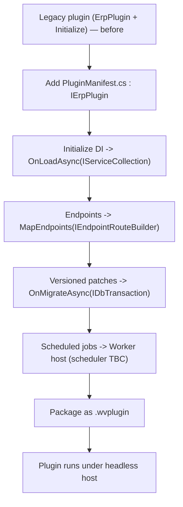

<!--{"sort_order":4, "name": "plugin-migration", "label": "Plugin Migration"}-->

# Plugin Migration

> **Planned target — not yet implemented.** This guide describes the *planned* migration of the five bundled plugins and any third-party plugins to the new `IErpPlugin` contract. The `IErpPlugin` interface, the `PluginManifest` class, the `.wvplugin` package, and the collectible-`AssemblyLoadContext` plugin host this guide ports *to* **do not exist in this repository yet** — each is delivered by a separate implementation workstream. Content describing the **"before"** state cites real, current code; **"after"/target** content is design intent, and undecided values are marked **Not available / to be confirmed**.

Today each bundled plugin is a legacy `ErpPlugin` subclass: it overrides the `Name` property and implements `Initialize(IServiceProvider serviceProvider)`, and it ships as a "Razor Class Library" (`Microsoft.NET.Sdk.Razor`, `net10.0`). Under the headless platform, each plugin instead implements the `IErpPlugin` contract from a small `PluginManifest.cs` and is packaged as a `.wvplugin`. Source: /WebVella.Erp.Plugins.Mail/MailPlugin.cs:L14 (`public partial class MailPlugin : ErpPlugin`, before); Source: /WebVella.Erp.Plugins.Mail/WebVella.Erp.Plugins.Mail.csproj:L1 (Razor Class Library SDK, before). The `IErpPlugin` contract and the `.wvplugin` format are **Not available / to be confirmed**.

This page is the **program-level** guide: it sequences the work across all five bundled plugins — **Crm, Mail, MicrosoftCDM, Next, Project** — plus any third-party plugins, and it focuses on the **per-plugin specifics**. The canonical, mechanical **per-plugin code port** — the step-by-step `Initialize(IServiceProvider)` → `IErpPlugin` conversion — is documented once in [Migrating from ErpPlugin](../plugin-sdk/migrating-from-erpplugin.md); this page links to it rather than repeating it.

Terminology follows the platform glossary: an **Entity** is a metadata-defined type, a **Record** is a row of an Entity, **EQL** is the query language, a **plugin** is an `IErpPlugin` implementation, and a **hook** is a business-logic extension point.

## Migration checklist (per plugin)

Apply these steps to each plugin in turn. Every step **defers to the SDK guide** for the mechanics — the list below is the per-plugin work order, not a duplicate of the code port. Perform the canonical port from [Migrating from ErpPlugin](../plugin-sdk/migrating-from-erpplugin.md) first, then confirm the plugin-specific items in [Per-plugin notes](#per-plugin-notes) below.

1. **Add a `PluginManifest.cs` that implements `IErpPlugin`.** Replace the legacy `ErpPlugin` base class (before) with the interface. See [IErpPlugin contract](../plugin-sdk/ierplugin-contract.md).
2. **Move the `Initialize` dependency wiring into `OnLoadAsync(IServiceCollection)`.** The legacy `Initialize(IServiceProvider)` (before) *resolves* services from an already-built provider; `OnLoadAsync` *registers* them before the root provider is built. See [Migrating from ErpPlugin — Step 3](../plugin-sdk/migrating-from-erpplugin.md).
3. **Expose any plugin endpoints via `MapEndpoints(IEndpointRouteBuilder)`.** Port MVC controllers to Minimal API endpoints and reproduce every legacy `[Authorize]` requirement with `.RequireAuthorization(...)`, namespaced under `/api/v1/plugins/{name}/…`. See [Migrating from ErpPlugin — Step 4](../plugin-sdk/migrating-from-erpplugin.md).
4. **Move versioned init patches into `OnMigrateAsync(IDbTransaction)`.** The legacy `WEBVELLA_*_INIT_VERSION` patches run inside `ProcessPatches()` on the plugin's own transaction (before); keep them ascending and idempotent on the host-supplied transaction. See [Migrations: OnMigrateAsync](../plugin-sdk/migrations-onmigrateasync.md).
5. **Move scheduled jobs to the worker host.** Jobs that legacy plugins register through schedule plans — for example Mail's SMTP-queue job and Project's start-tasks job — run under `WebVella.Erp.Worker`. The worker scheduler (Quartz.NET vs Hangfire) is **Not available / to be confirmed**.
6. **Package the plugin as a `.wvplugin`.** Replace Razor Class Library packaging (before) with the `.wvplugin` bundle the host discovers and loads into its own `AssemblyLoadContext`. See [Packaging .wvplugin](../plugin-sdk/packaging-wvplugin.md).

## Per-plugin notes

The five bundled plugins share the same legacy shape — each is a `public partial class … : ErpPlugin` that overrides `Name` and implements `Initialize(IServiceProvider)` (the **before** state). Source: /docs/developer/plugins/overview.md (legacy `ErpPlugin` model); Source: /docs/developer/plugins/create-your-own.md (legacy plugin authoring). The table records each plugin's verified legacy `Name`, its notable jobs/hooks, and the plugin-specific migration note. All `IErpPlugin` / `OnMigrateAsync` / worker targets referenced below are proposed and **Not available / to be confirmed**.

| Plugin | Legacy `Name` (before) | Notable jobs / hooks | Migration notes |
|---|---|---|---|
| **Crm** | `crm` — Source: /WebVella.Erp.Plugins.Crm/CrmPlugin.cs:L13 | None beyond `Initialize` → `ProcessPatches()`. Source: /WebVella.Erp.Plugins.Crm/CrmPlugin.cs:L15-L21 | Straight port: move `ProcessPatches()` into `OnMigrateAsync(IDbTransaction)`; no scheduled jobs to relocate. |
| **Mail** | `mail` — Source: /WebVella.Erp.Plugins.Mail/MailPlugin.cs:L17 | `ProcessSmtpQueueJob` — `[Job("9b301dca-6c81-40dd-887c-efd31c23bd77", "Process SMTP queue", …)]`, runs **every 10 minutes**. Source: /WebVella.Erp.Plugins.Mail/Jobs/ProcessSmtpQueueJob.cs:L7-L8; interval Source: /WebVella.Erp.Plugins.Mail/MailPlugin.cs:L69; tech spec §2.4. Uses **MailKit 4.14.1**. Source: /WebVella.Erp.Plugins.Mail/WebVella.Erp.Plugins.Mail.csproj:L28 | `Initialize` runs `ProcessPatches()` + `SetSchedulePlans()`. Source: /WebVella.Erp.Plugins.Mail/MailPlugin.cs:L19-L26. Move the dated `WEBVELLA_MAIL_INIT_VERSION` patches to `OnMigrateAsync`; relocate the SMTP-queue job to the worker. Reference SMTP service settings **by key name only** — never a host/user/password value. |
| **MicrosoftCDM** | `MicrosoftCDMPlugin` — Source: /WebVella.Erp.Plugins.MicrosoftCDM/MicrosoftCDMPlugin.cs:L12 | None beyond `Initialize` → `ProcessPatches()`. Source: /WebVella.Erp.Plugins.MicrosoftCDM/MicrosoftCDMPlugin.cs:L14-L20 | Straight port; no scheduled jobs. The legacy `Name` is the long form `MicrosoftCDMPlugin` (not a short slug) — carry it onto the manifest unchanged. |
| **Next** | `next` — Source: /WebVella.Erp.Plugins.Next/NextPlugin.cs:L11 | None beyond `Initialize` → `ProcessPatches()`. Source: /WebVella.Erp.Plugins.Next/NextPlugin.cs:L13-L19 | Straight port; no scheduled jobs. |
| **Project** | `project` — Source: /WebVella.Erp.Plugins.Project/ProjectPlugin.cs:L13 | `StartTasksOnStartDate` — `[Job("3D18B8D8-74B8-45B1-B121-9582F7B8A4F4", "Start tasks on start_date", …)]`, runs **daily at 00:10 UTC**. Source: /WebVella.Erp.Plugins.Project/Jobs/StartTasksOnStartDate.cs:L11-L12; schedule Source: /WebVella.Erp.Plugins.Project/ProjectPlugin.cs:L46-L47. **`Timelog` data-integrity hook** — `[HookAttachment("timelog")]`, `IErpPreCreateRecordHook, IErpPreDeleteRecordHook`, delegating to `TimeLogService.PreCreateApiHookLogic` / `PreDeleteApiHookLogic` on record create/delete (data integrity, **not** reporting). Source: /WebVella.Erp.Plugins.Project/Hooks/Api/Timelog.cs:L13-L24. **Billable/non-billable reporting is a separate concern:** `ReportService.GetTimelogData(int year, int month, Guid? accountId)` runs EQL over the `timelog` entity and aggregates `billable_minutes` vs `non_billable_minutes` by the `is_billable` flag, surfaced by the in-process `PcReportAccountMonthlyTimelogs` admin component. Source: /WebVella.Erp.Plugins.Project/Services/ReportService.cs:L13,L125-L128; /WebVella.Erp.Plugins.Project/Components/PcReportAccountMonthlyTimelogs/PcReportAccountMonthlyTimelogs.cs:L104; tech spec §2.4 | `Initialize` runs `ProcessPatches()` + `SetSchedulePlans()`. Source: /WebVella.Erp.Plugins.Project/ProjectPlugin.cs:L15-L22. Relocate the daily start-tasks job to the worker; the `Timelog` data-integrity hook and the billable/non-billable reporting component (`PcReportAccountMonthlyTimelogs` → `ReportService`) are engine-level/in-process and carry over unchanged (the reporting is not a scheduled job). |

Legacy references in the table above (`ErpPlugin`, `Initialize(IServiceProvider)`, `Name` overrides, schedule plans) describe the **before** state only; they are the current code the migration moves away from and are still present in the repository.

## Third-party plugins

Third-party plugins follow the **same contract** as the bundled ones: implement `IErpPlugin` from a `PluginManifest.cs`, register services in `OnLoadAsync(IServiceCollection)`, expose routes in `MapEndpoints(IEndpointRouteBuilder)` (namespaced under `/api/v1/plugins/{name}/…` and authorized with `.RequireAuthorization(...)`), apply schema changes in `OnMigrateAsync(IDbTransaction)`, and ship a `.wvplugin`. Point third-party authors to the [IErpPlugin contract](../plugin-sdk/ierplugin-contract.md) for the lifecycle and to [Packaging .wvplugin](../plugin-sdk/packaging-wvplugin.md) for the package layout; the full per-plugin code port is in [Migrating from ErpPlugin](../plugin-sdk/migrating-from-erpplugin.md). All three targets are **Not available / to be confirmed** until the SDK contract and host exist.

## Per-plugin migration flow

The flow below is applied to **each** plugin — bundled or third-party — in order. It maps the legacy `ErpPlugin`/`Initialize` shape (before) onto the three `IErpPlugin` lifecycle methods — `OnLoadAsync(IServiceCollection)`, `MapEndpoints(IEndpointRouteBuilder)`, `OnMigrateAsync(IDbTransaction)` — relocates scheduled jobs to the worker host, and finishes by packaging the result as a `.wvplugin`.

*Diagram: the per-plugin migration flow from the legacy `ErpPlugin`/`Initialize(IServiceProvider)` model (before) to an `IErpPlugin` plugin packaged as a `.wvplugin` (proposed target).* Source: /docs/developer/plugins/overview.md (legacy `ErpPlugin` model, before); Source: /WebVella.Erp.Plugins.Mail/MailPlugin.cs:L14-L26 (representative legacy plugin — `ErpPlugin` + `Initialize` → `ProcessPatches()` + `SetSchedulePlans()`). The `IErpPlugin` lifecycle, worker scheduler, and `.wvplugin` format are **Not available / to be confirmed**. Mermaid renders via the `mermaid2` plugin. Source: /mkdocs.yml:L11-L13.

## Related

- [Migration overview](overview.md) — the overall re-hosting strategy and sequencing.
- [Migrating from ErpPlugin](../plugin-sdk/migrating-from-erpplugin.md) — the canonical per-plugin code port (linked from every checklist step above).
- [IErpPlugin contract](../plugin-sdk/ierplugin-contract.md) · [Packaging .wvplugin](../plugin-sdk/packaging-wvplugin.md) · [Migrations: OnMigrateAsync](../plugin-sdk/migrations-onmigrateasync.md)
