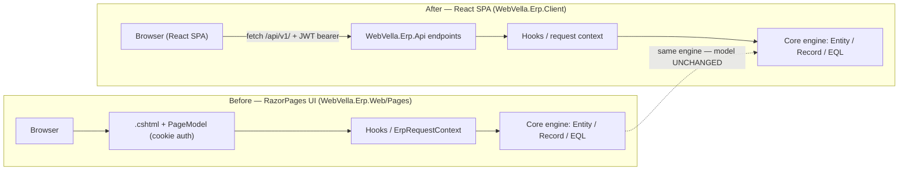

<!--{"sort_order":2, "name": "razorpages-to-react", "label": "RazorPages to React"}-->

# RazorPages to React

The legacy server-rendered RazorPages host (`WebVella.Erp.Web`) is retired, and its user interface is re-implemented as a React single-page application (`WebVella.Erp.Client`) that consumes the versioned `/api/v1/` REST surface. Source: /WebVella.Erp.Web (RazorPages host — the "before" state); Source: /docs/migration/overview.md:L5 (headless target: a React SPA over `/api/v1/`).

**The Entity, Record, EQL, and hook model is unchanged — only the host/UI layer changes.** The same in-process engine managers (EntityManager, RecordManager, EQL) keep serving requests, so this is a re-hosting of the presentation tier, not a rewrite of business logic. Source: /docs/developer/server-api/overview.md (in-process EntityManager / RecordManager / EQL, unchanged). Keep this front of mind: existing Entities, Records, EQL queries, plugins, and hooks continue to work as they do today.

## What changes vs. what stays

The table contrasts each concern before (RazorPages, retired) and after (React SPA). Only the host/UI concerns change; the business-logic and hook row is identical in both columns because the engine is untouched.

| Concern | Before — RazorPages (`WebVella.Erp.Web`) | After — React SPA (`WebVella.Erp.Client`) |
|---------|-------------------------------------------|--------------------------------------------|
| Rendering | Server-rendered `.cshtml` + PageModel, e.g. `RecordListPageModel`. Source: /WebVella.Erp.Web/Pages/RecordList.cshtml.cs:L12 | Client-rendered React components. Source: /docs/migration/overview.md:L5 |
| Routing | RazorPages routes per the routing convention. Source: /docs/developer/pages/routing.md | SPA client-side routes reproducing the same URL shapes. Source: /docs/developer/pages/routing.md |
| Data access | PageModel `OnGet` / `OnPost` call the engine in-process. Source: /WebVella.Erp.Web/Pages/RecordList.cshtml.cs:L16,L55 | `fetch` / data hooks call the `/api/v1/` REST surface. Source: /docs/migration/overview.md:L5 |
| Authentication | Cookie authentication (the legacy `erp_auth_base` cookie), via the `[AllowAnonymous]` login PageModel. Source: /WebVella.Erp.Web/Pages/login.cshtml.cs:L12-L13; Source: AAP §0.2.2 (`erp_auth_base` cookie) | OIDC / JWT bearer. Source: /docs/migration/overview.md:L5 |
| Layout | Master layouts `_AppMaster.cshtml` / `_SystemMaster.cshtml`. Source: /WebVella.Erp.Web/Pages | React app shell / layout. Source: /docs/migration/overview.md:L5 |
| Business logic & hooks | Runs against the core engine (Entity / Record / EQL, hooks). Source: /docs/developer/server-api/overview.md | **Unchanged** — the same engine and hooks. Source: /docs/developer/server-api/overview.md |

Legacy references above (RazorPages, the `erp_auth_base` cookie, `.cshtml` rendering) describe the **before** state only; they are what the migration moves away from.

## Page/route inventory to port

The SPA should reproduce the screens and routes served today by the RazorPages `Pages/` folder so that existing bookmarks and integrations keep working. The verified page set is below, with the canonical route for each; the route shapes are unchanged by the migration. Source: /WebVella.Erp.Web/Pages (directory listing — the "before" page set); Source: /docs/developer/pages/routing.md (canonical routing convention).

- **ApplicationHome** — `/{AppName}/a/{PageName?}`
- **ApplicationNode** (application page) — `/{AppName}/{AreaName}/{NodeName}/a/{PageName?}`
- **RecordList** — `/{AppName}/{AreaName}/{NodeName}/l/{PageName?}`
- **RecordCreate** — `/{AppName}/{AreaName}/{NodeName}/c/{PageName?}`
- **RecordDetails** — `/{AppName}/{AreaName}/{NodeName}/r/{RecordId}/{PageName?}`
- **RecordManage** — `/{AppName}/{AreaName}/{NodeName}/m/{RecordId}/{PageName?}`
- **RecordRelatedRecordsList** — `/{AppName}/{AreaName}/{NodeName}/r/{RecordId}/rl/{RelationId}/l/{PageName?}`
- **RecordRelatedRecordCreate** — `/{AppName}/{AreaName}/{NodeName}/r/{RecordId}/rl/{RelationId}/c/{PageName?}`
- **RecordRelatedRecordDetails** — `/{AppName}/{AreaName}/{NodeName}/r/{RecordId}/rl/{RelationId}/r/{RelatedRecordId}/{PageName?}`
- **RecordRelatedRecordManage** — `/{AppName}/{AreaName}/{NodeName}/r/{RecordId}/rl/{RelationId}/m/{RelatedRecordId}/{PageName?}`
- **Site** — `/s/{PageName?}`
- **login** — `/login` (the only anonymous route). Source: /WebVella.Erp.Web/Pages/login.cshtml.cs:L12
- **logout** — `/logout`
- **error**

## Hooks, code variables, and the compatibility shim

Hooks and `ICodeVariable` code variables continue to run against the **unchanged** engine. In the RazorPages host, each PageModel resolves its hooks through the `HookManager` — for example `RecordListPageModel` invokes `IPageHook` and `IRecordListPageHook`, and the login page invokes `ILoginPageHook`. Source: /WebVella.Erp.Web/Pages/RecordList.cshtml.cs:L29-L41; Source: /WebVella.Erp.Web/Pages/login.cshtml.cs:L76. That hook contract is not part of the UI layer, so it carries over to the headless host without change.

Code variables are the one place where the hosting model leaks into the contract. The legacy base page model is `WVPageModel`, a RazorPages `PageModel`. Source: /WebVella.Erp.Web/WVPageModel.cs:L6. Code variables expect a `BaseErpPageModel` (also a RazorPages `PageModel`), which only exists naturally inside the RazorPages request lifecycle. Because the RazorPages host is retired, an API-context adapter **synthesizes** a `BaseErpPageModel` from an API request so existing code variables run **unchanged** under the new host.

This hosting-model dependency, its behavioral parity, and its failure modes are documented separately — read the mandatory companion page: **[ICodeVariable / BaseErpPageModel adapter](../architecture/icodevariable-adapter.md)**. That detail is not duplicated here; only how a `BaseErpPageModel` is produced changes (RazorPages model binding before, the API-context adapter after) — the evaluation path and the engine below it are the same.

## Deprecation banners

This page is the migration target for the deprecation/migration banners added to the legacy UI documentation: the RazorPages page docs (`../developer/pages/`), the page-component docs (`../developer/components/`), and the tag-helper docs (`../developer/tag-helpers/`). Those pages remain published for their migration value; only the RazorPages host is retired, while the underlying Entity / hook / EQL model they describe is unchanged. Source: /WebVella.Erp.Web (retired RazorPages host); Source: /docs/developer/server-api/overview.md (engine unchanged). See the [Pages overview](../developer/pages/overview.md) and the [Page Components overview](../developer/components/overview.md).

## Cutover flow

The diagram contrasts the request path before (RazorPages UI, cookie auth) and after (React SPA calling `/api/v1/` with a JWT bearer). The final tier — the core engine (Entity / Record / EQL) — is the same in both; only the host and transport differ.

*Diagram: the RazorPages UI (before) and the React SPA (after) sit over the same, unchanged core engine.* Source: /WebVella.Erp.Web/Pages (the "before" RazorPages UI); Source: /docs/developer/server-api/overview.md (the unchanged in-process engine managers).

**Related:** [Migration overview](overview.md) · [ICodeVariable / BaseErpPageModel adapter](../architecture/icodevariable-adapter.md)
