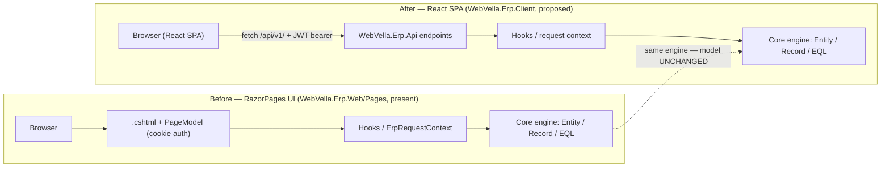

<!--{"sort_order":2, "name": "razorpages-to-react", "label": "RazorPages to React"}-->

# RazorPages to React

> **Planned target — not yet implemented.** This guide describes the *planned* cutover from the RazorPages UI to a React SPA. The legacy RazorPages host (`WebVella.Erp.Web`) is **still present and has not been retired**, and its React replacement (`WebVella.Erp.Client`) and the `/api/v1/` REST surface it would consume **do not exist yet**. Content describing the **"before"** state cites real code; **"after"/target** content is design intent, and undecided values are marked **Not available / to be confirmed**. The route mapping and parity checks below are **acceptance criteria** for the future cutover, not achieved facts.

The legacy server-rendered RazorPages host (`WebVella.Erp.Web`) is **planned to be retired**, and its user interface **re-implemented** as a React single-page application (`WebVella.Erp.Client`) that would consume the versioned `/api/v1/` REST surface. Neither the React project nor the `/api/v1/` host exists yet. Source: /WebVella.Erp.Web/WebVella.Erp.Web.csproj:L1 (RazorPages host — the "before" state, still present). The React SPA and `/api/v1/` targets are **Not available / to be confirmed**.

**The Entity, Record, EQL, and hook model is unchanged — only the host/UI layer changes.** The same in-process engine managers (EntityManager, RecordManager, EQL) keep serving requests, so this is a re-hosting of the presentation tier, not a rewrite of business logic. Source: /WebVella.Erp/Api/EntityManager.cs (in-process EntityManager, unchanged); Source: /WebVella.Erp/Api/RecordManager.cs (in-process RecordManager, unchanged). Keep this front of mind: existing Entities, Records, EQL queries, plugins, and hooks would continue to work as they do today. See the [Server API overview](../developer/server-api/overview.md) for the in-process managers.

## What changes vs. what stays

The table contrasts each concern before (RazorPages, present today) and after (the proposed React SPA). Only the host/UI concerns change; the business-logic and hook row is identical in both columns because the engine is untouched. All "after" entries are proposed target design and are not yet implemented.

| Concern | Before — RazorPages (`WebVella.Erp.Web`) | After — React SPA (`WebVella.Erp.Client`, proposed) |
|---------|-------------------------------------------|--------------------------------------------|
| Rendering | Server-rendered `.cshtml` + PageModel, e.g. `RecordListPageModel`. Source: /WebVella.Erp.Web/Pages/RecordList.cshtml.cs:L12 | Client-rendered React components. *Not available / to be confirmed.* |
| Routing | RazorPages routes per the routing convention (see [Pages routing](../developer/pages/routing.md)). Source: /WebVella.Erp.Web/Pages/RecordList.cshtml.cs:L12 | SPA client-side routes reproducing the same URL shapes. *Not available / to be confirmed.* |
| Data access | PageModel `OnGet` / `OnPost` call the engine in-process. Source: /WebVella.Erp.Web/Pages/RecordList.cshtml.cs:L16,L55 | `fetch` / data hooks call the `/api/v1/` REST surface. *Not available / to be confirmed.* |
| Authentication | Cookie authentication (the legacy `erp_auth_base` cookie), via the `[AllowAnonymous]` login PageModel. Source: /WebVella.Erp.Site/Startup.cs:L96 (`erp_auth_base` cookie); Source: /WebVella.Erp.Web/Pages/login.cshtml.cs:L12-L13 (`[AllowAnonymous]` login) | OIDC / JWT bearer (provider-neutral; authorization-code + PKCE, public client — see [Blazor retirement › Data & auth continuity](blazor-retirement.md#data-auth-continuity)). *Not available / to be confirmed.* |
| Layout | Master layouts `_AppMaster.cshtml` / `_SystemMaster.cshtml`. Source: /WebVella.Erp.Web/Pages | React app shell / layout. *Not available / to be confirmed.* |
| Business logic & hooks | Runs against the core engine (Entity / Record / EQL, hooks). Source: /WebVella.Erp/Api/RecordManager.cs | **Unchanged** — the same engine and hooks. Source: /WebVella.Erp/Api/RecordManager.cs |

Legacy references above (RazorPages, the `erp_auth_base` cookie, `.cshtml` rendering) describe the **before** state only; they are what the migration would move away from and are still present in the repository.

## Page/route inventory to port

The SPA **should** reproduce the screens and routes served today by the RazorPages `Pages/` folder so that existing bookmarks and integrations keep working — this is an acceptance criterion for the cutover, not a completed mapping. The verified page set is below, with the canonical route for each; the route shapes would be unchanged by the migration. Source: /WebVella.Erp.Web/Pages (directory listing — the "before" page set); see the [Pages routing](../developer/pages/routing.md) convention.

- **ApplicationHome** — `/{AppName}/a/{PageName?}`
- **ApplicationNode** (application page) — `/{AppName}/{AreaName}/{NodeName}/a/{PageName?}`
- **RecordList** — `/{AppName}/{AreaName}/{NodeName}/l/{PageName?}`
- **RecordCreate** — `/{AppName}/{AreaName}/{NodeName}/c/{PageName?}`
- **RecordDetails** — `/{AppName}/{AreaName}/{NodeName}/r/{RecordId}/{PageName?}`
- **RecordManage** — `/{AppName}/{AreaName}/{NodeName}/m/{RecordId}/{PageName?}`
- **RecordRelatedRecordsList** — `/{AppName}/{AreaName}/{NodeName}/r/{RecordId}/rl/{RelationId}/l/{PageName?}`
- **RecordRelatedRecordCreate** — `/{AppName}/{AreaName}/{NodeName}/r/{RecordId}/rl/{RelationId}/c/{PageName?}`
- **RecordRelatedRecordDetails** — `/{AppName}/{AreaName}/{NodeName}/r/{RecordId}/rl/{RelationId}/r/{RelatedRecordId}/{PageName?}`
- **RecordRelatedRecordManage** — `/{AppName}/{AreaName}/{NodeName}/r/{RecordId}/rl/{RelationId}/m/{RelatedRecordId}/{PageName?}`
- **Site** — `/s/{PageName?}`
- **login** — `/login` (the only anonymous route). Source: /WebVella.Erp.Web/Pages/login.cshtml.cs:L12
- **logout** — `/logout`
- **error**

Delivering this inventory as SPA routes, and proving each screen reaches parity, requires the `WebVella.Erp.Client` project and its route/component set plus a test suite that exercises each route against `/api/v1/` — all **Not available / to be confirmed**.

## Hooks, code variables, and the compatibility shim

Hooks and `ICodeVariable` code variables continue to run against the **unchanged** engine. In the RazorPages host, each PageModel resolves its hooks through the `HookManager` — for example `RecordListPageModel` invokes `IPageHook` and `IRecordListPageHook`, and the login page invokes `ILoginPageHook`. Source: /WebVella.Erp.Web/Pages/RecordList.cshtml.cs:L29-L41; Source: /WebVella.Erp.Web/Pages/login.cshtml.cs:L76. That hook contract is not part of the UI layer, so it would carry over to the headless host without change.

Code variables are the one place where the hosting model leaks into the contract. The legacy base page model is `WVPageModel`, a RazorPages `PageModel`. Source: /WebVella.Erp.Web/WVPageModel.cs:L6. Code variables expect a `BaseErpPageModel` (also a RazorPages `PageModel`), which only exists naturally inside the RazorPages request lifecycle. Because the RazorPages host is planned for retirement, a proposed API-context adapter **would synthesize** a `BaseErpPageModel` from an API request so existing code variables run **unchanged** under the new host. That adapter does not exist yet.

This hosting-model dependency, its behavioral parity, and its failure modes are documented separately — read the mandatory companion page: **[ICodeVariable / BaseErpPageModel adapter](../architecture/icodevariable-adapter.md)**. That detail is not duplicated here; only how a `BaseErpPageModel` is produced would change (RazorPages model binding before, the proposed API-context adapter after) — the evaluation path and the engine below it are the same.

## Deprecation banners

This page is the migration target for the deprecation/migration banners added to the legacy UI documentation: the RazorPages page docs (`../developer/pages/`), the page-component docs (`../developer/components/`), and the tag-helper docs (`../developer/tag-helpers/`). Those pages remain published for their migration value; only the RazorPages host is planned for retirement, while the underlying Entity / hook / EQL model they describe is unchanged. Source: /WebVella.Erp.Web/WebVella.Erp.Web.csproj:L1 (RazorPages host, present today); Source: /WebVella.Erp/Api/RecordManager.cs (engine unchanged). See the [Pages overview](../developer/pages/overview.md) and the [Page Components overview](../developer/components/overview.md).

## Cutover flow

The diagram contrasts the request path before (RazorPages UI, cookie auth) and after (the proposed React SPA calling `/api/v1/` with a JWT bearer). The final tier — the core engine (Entity / Record / EQL) — is the same in both; only the host and transport would differ. The "after" path is proposed and not yet implemented.

*Diagram: the RazorPages UI (before, present) and the proposed React SPA (after) sit over the same, unchanged core engine.* Source: /WebVella.Erp.Web/Pages (the "before" RazorPages UI); Source: /WebVella.Erp/Api/RecordManager.cs (the unchanged in-process engine manager).

**Related:** [Migration overview](overview.md) · [ICodeVariable / BaseErpPageModel adapter](../architecture/icodevariable-adapter.md)
