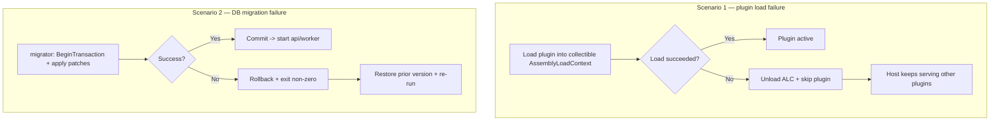

<!--{"sort_order":6, "name": "rollback-plan", "label": "Rollback Plan"}-->

# Rollback Plan

This page is the consolidated **rollback playbook** for the proposed headless platform. It covers two independent failure paths, each designed to **fail safe** — without corrupting the running platform or leaving the database in a partially migrated state:

1. **A plugin cannot be loaded** — a fault while loading a plugin into its collectible `AssemblyLoadContext`.
2. **A database migration fails** — an error while the `migrator` applies schema patches.

The two paths are independent: a plugin-load failure never mutates the database schema, and a migration failure never depends on any plugin having loaded. Both the collectible plugin host and the one-shot `migrator` service are **proposed design and Not available in the current checkout** (see the [Migration overview](overview.md)), so the procedures below are the planned operator playbook, not current behaviour.

This page deliberately does **not** repeat the plugin-host or migration internals. For the mechanics it references, follow the cross-links in each scenario and the **Related** section below.

## Scenario 1 — plugin fails to load

Under the proposed host, each plugin is loaded into its **own collectible `AssemblyLoadContext` (ALC)** for per-plugin assembly isolation — the design is documented in [Plugin Host](../architecture/plugin-host.md) and [AssemblyLoadContext hosting](../plugin-sdk/assemblyloadcontext-hosting.md) (proposed; Not available in code today). **Live, no-restart unload/hot-swap of an already-running plugin is itself Not available / to be confirmed**, because it depends on an unregister/dispose/request-draining cleanup contract that does not yet exist (see [Hot-swap and reload](../plugin-sdk/assemblyloadcontext-hosting.md#hot-swap-and-reload)); the steps below apply to a plugin that **fails during a load attempt** (so it never began serving) and to activation/replacement performed by a **process restart**. This differs from the legacy model (**before**): today a plugin is a Razor Class Library that derives from `ErpPlugin` and is initialised through `Initialize(IServiceProvider)` at startup, with every plugin sharing the single default load context and **no unload path**. Source: /docs/developer/plugins/overview.md:L4,L6.

Planned rollback steps when a plugin fails to load (a bad `.wvplugin`, a missing dependency, an integrity/signature failure, or a throwing load lifecycle method). **Each step below is a target acceptance criterion the plugin host must satisfy — not current behaviour: the collectible-ALC host does not exist in this checkout, and the "Design intent:" links point to the proposed design docs, not to shipped code.**

1. **Contain the fault.** The failure **must** be confined to that plugin's collectible ALC so the host does not abort. Design intent: /docs/architecture/plugin-host.md:L77-L81.
2. **Discard the failed context.** For a plugin that **failed during load** (before it began serving), the host **must** release that plugin's collectible ALC and its assemblies. Reclaiming a context that had already started serving requires the cleanup/unregister/dispose/drain contract that is **Not available / to be confirmed**. Design intent: /docs/plugin-sdk/assemblyloadcontext-hosting.md#collectible-load-and-unload-proposed.
3. **Skip and quarantine.** The plugin **must** be skipped and quarantined (moved out of the load path) so it is not retried on every start. Design intent: /docs/architecture/plugin-host.md:L56.
4. **Keep serving.** The host process **must** stay available and continue serving the other, healthy plugins. Design intent: /docs/architecture/plugin-host.md:L77-L81.
5. **Upgrade safety (restart-based).** Because live hot-swap is **Not available / to be confirmed**, an upgrade is staged and applied by a **process restart**: if the new `.wvplugin` fails to load on restart, the host **should** skip it (leaving the service running without that plugin) rather than crash, and the operator redeploys the last-good package. Design intent: /docs/plugin-sdk/assemblyloadcontext-hosting.md#hot-swap-and-reload.
6. **Operator remediation.** After the operator fixes the cause, repackages the `.wvplugin`, and redeploys, the host **should** load the corrected package into a fresh collectible ALC on the next discovery pass. Design intent: /docs/architecture/plugin-host.md:L41-L47.

> **Trust note.** A collectible ALC provides *dependency* isolation and an unload path — it is **not** a security sandbox; plugin code runs in-process with full host privileges. Source: /docs/plugin-sdk/assemblyloadcontext-hosting.md:L30-L31.

## Scenario 2 — database migration fails

The proposed one-shot `migrator` service would apply migrations inside a **single transaction**, reusing the engine's **existing, verified** transaction primitives — `BeginTransaction()`, then `CommitTransaction()` on success or `RollbackTransaction()` on any error. Source: /WebVella.Erp.ConsoleApp/Program.cs:L75,L79,L83 (current code — the only element of this scenario that exists today). The `migrator` service that would call them and the dependent-startup gate are proposed; the full job flow lives in the [Database migration job](database-migration-job.md) guide (proposed; Not available in code today) and is **not repeated here**.

Planned rollback steps when a migration fails. **Only step 1 (the transaction rollback) is backed by existing code; the exit code and the dependent-startup gate are target acceptance criteria whose "Design intent:" links point to the proposed migration-job design doc, not shipped code:**

1. **Roll back the transaction.** The single migration transaction is rolled back via the existing `RollbackTransaction()` primitive, so the schema is never left partially patched. Source: /WebVella.Erp.ConsoleApp/Program.cs:L83 (current code).
2. **Exit non-zero.** The `migrator` process **must** exit with a non-zero status. Design intent: /docs/migration/database-migration-job.md:L72-L88.
3. **Block dependent startup.** The `api` and `worker` services **must not** start against an un-migrated or partially patched database. Design intent: /docs/migration/database-migration-job.md:L56-L59.
4. **Restore the prior version.** The operator restores/rolls back to the prior image or version of the `migrator` (and its patch set). Design intent: /docs/migration/database-migration-job.md:L60-L70.
5. **Re-run.** Once the cause is fixed, re-running the `migrator` **should** commit on success and open the `api`/`worker` startup gate. Design intent: /docs/migration/database-migration-job.md:L45-L58.

## Decision points

Some operational specifics of both rollback paths depend on platform decisions that are still open; per the evidence-based rule they are recorded here rather than assumed.

> - **Worker scheduler — Not available / to be confirmed.** Whether a failed migration or a quarantined plugin also requires pausing in-flight background jobs depends on the scheduler chosen for `WebVella.Erp.Worker` (Quartz.NET vs Hangfire).
> - **Identity provider — Not available / to be confirmed.** Whether tokens/sessions must be invalidated during a rollback depends on the OIDC provider (Duende IdentityServer vs Keycloak).
> - **Target runtime — Not available / to be confirmed.** The specification states ".NET 9" while the code targets `net10.0`; the authoritative target must be confirmed before any rollback command is pinned to a runtime image. Source: /WebVella.Erp/WebVella.Erp.csproj:L4.

## Rollback flows

*The two independent, fail-safe rollback paths, shown as **proposed acceptance criteria**: a failed plugin load is expected to unload its collectible ALC while the host keeps serving other plugins (design intent: /docs/architecture/plugin-host.md:L77-L81), and a failed migration rolls back its single transaction — the one element backed by existing code (Source: /WebVella.Erp.ConsoleApp/Program.cs:L83) — and is expected to exit non-zero.*

## Related

- [Plugin Host](../architecture/plugin-host.md) — the proposed collectible-`AssemblyLoadContext` plugin host and its failure-handling design.
- [AssemblyLoadContext hosting](../plugin-sdk/assemblyloadcontext-hosting.md) — collectible load/unload, hot-swap, and per-plugin isolation mechanics.
- [Database migration job](database-migration-job.md) — the proposed one-shot `migrator` service and the `OnMigrateAsync(IDbTransaction)` transaction/rollback flow.
- [Migration overview](overview.md) — the overall migration strategy and the open platform decisions.
