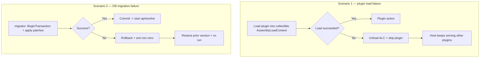

<!--{"sort_order":6, "name": "rollback-plan", "label": "Rollback Plan"}-->

# Rollback Plan

This page is the consolidated **rollback playbook** for the proposed headless platform. It covers two independent failure paths, each designed to **fail safe** — without corrupting the running platform or leaving the database in a partially migrated state:

1. **A plugin cannot be loaded** — a fault while loading a plugin into its collectible `AssemblyLoadContext`.
2. **A database migration fails** — an error while the `migrator` applies schema patches.

The two paths are independent: a plugin-load failure never mutates the database schema, and a migration failure never depends on any plugin having loaded. Both the collectible plugin host and the one-shot `migrator` service are **proposed design and Not available in the current checkout** (see the [Migration overview](overview.md)), so the procedures below are the planned operator playbook, not current behaviour.

This page deliberately does **not** repeat the plugin-host or migration internals. For the mechanics it references, follow the cross-links in each scenario and the **Related** section below.

## Scenario 1 — plugin fails to load

Under the proposed host, each plugin is loaded into its **own collectible `AssemblyLoadContext` (ALC)** so a faulty plugin can be unloaded without restarting the host — the design is documented in [Plugin Host](../architecture/plugin-host.md) and [AssemblyLoadContext hosting](../plugin-sdk/assemblyloadcontext-hosting.md) (proposed; Not available in code today). This differs from the legacy model (**before**): today a plugin is a Razor Class Library that derives from `ErpPlugin` and is initialised through `Initialize(IServiceProvider)` at startup, with every plugin sharing the single default load context and **no unload path**. Source: /docs/developer/plugins/overview.md:L4,L6.

Planned rollback steps when a plugin fails to load (a bad `.wvplugin`, a missing dependency, an integrity/signature failure, or a throwing load lifecycle method):

1. **Contain the fault.** The failure is confined to that plugin's collectible ALC; the host does not abort. Source: /docs/architecture/plugin-host.md:L77-L81.
2. **Unload the context.** The host unloads the faulty plugin's collectible ALC, releasing its assemblies. Source: /docs/plugin-sdk/assemblyloadcontext-hosting.md:L74-L92.
3. **Skip and quarantine.** The plugin is skipped and quarantined (moved out of the load path) so it is not retried on every start. Source: /docs/architecture/plugin-host.md:L56.
4. **Keep serving.** The host process stays available and continues serving the other, healthy plugins. Source: /docs/architecture/plugin-host.md:L77-L81.
5. **Hot-swap safety.** When an *upgrade* fails to load, the previously loaded plugin version can remain active — the host only swaps in the new context once it loads cleanly. Source: /docs/plugin-sdk/assemblyloadcontext-hosting.md:L158.
6. **Operator remediation.** Fix the cause, repackage the `.wvplugin`, and redeploy; the host loads the corrected package into a fresh collectible ALC on the next discovery pass. Source: /docs/architecture/plugin-host.md:L41-L47.

> **Trust note.** A collectible ALC provides *dependency* isolation and an unload path — it is **not** a security sandbox; plugin code runs in-process with full host privileges. Source: /docs/plugin-sdk/assemblyloadcontext-hosting.md:L30-L31.

## Scenario 2 — database migration fails

Database migrations are applied by the proposed one-shot `migrator` service inside a **single transaction**, reusing the engine's existing primitives: `BeginTransaction()`, then `CommitTransaction()` on success or `RollbackTransaction()` on any error. Source: /WebVella.Erp.ConsoleApp/Program.cs:L75,L79,L83. The full proposed job flow lives in the [Database migration job](database-migration-job.md) guide (proposed; Not available in code today) and is **not repeated here**.

Planned rollback steps when a migration fails:

1. **Roll back the transaction.** The single migration transaction is rolled back, so the schema is never left partially patched. Source: /WebVella.Erp.ConsoleApp/Program.cs:L83.
2. **Exit non-zero.** The `migrator` process exits with a non-zero status. Source: /docs/migration/database-migration-job.md:L72-L88.
3. **Block dependent startup.** The `api` and `worker` services do not start against an un-migrated or partially patched database. Source: /docs/migration/database-migration-job.md:L56-L59.
4. **Restore the prior version.** The operator restores/rolls back to the prior image or version of the `migrator` (and its patch set). Source: /docs/migration/database-migration-job.md:L60-L70.
5. **Re-run.** Once the cause is fixed, re-run the `migrator`; on success it commits and the `api`/`worker` startup gate opens. Source: /docs/migration/database-migration-job.md:L45-L58.

## Decision points

Some operational specifics of both rollback paths depend on platform decisions that are still open; per the evidence-based rule they are recorded here rather than assumed.

> - **Worker scheduler — Not available / to be confirmed.** Whether a failed migration or a quarantined plugin also requires pausing in-flight background jobs depends on the scheduler chosen for `WebVella.Erp.Worker` (Quartz.NET vs Hangfire).
> - **Identity provider — Not available / to be confirmed.** Whether tokens/sessions must be invalidated during a rollback depends on the OIDC provider (Duende IdentityServer vs Keycloak).
> - **Target runtime — Not available / to be confirmed.** The specification states ".NET 9" while the code targets `net10.0`; the authoritative target must be confirmed before any rollback command is pinned to a runtime image. Source: /WebVella.Erp/WebVella.Erp.csproj:L4.

## Rollback flows

*The two independent, fail-safe rollback paths: a failed plugin load unloads its collectible ALC while the host keeps serving other plugins (Source: /docs/architecture/plugin-host.md:L77-L81), and a failed migration rolls back its single transaction and exits non-zero (Source: /WebVella.Erp.ConsoleApp/Program.cs:L83).*

## Related

- [Plugin Host](../architecture/plugin-host.md) — the proposed collectible-`AssemblyLoadContext` plugin host and its failure-handling design.
- [AssemblyLoadContext hosting](../plugin-sdk/assemblyloadcontext-hosting.md) — collectible load/unload, hot-swap, and per-plugin isolation mechanics.
- [Database migration job](database-migration-job.md) — the proposed one-shot `migrator` service and the `OnMigrateAsync(IDbTransaction)` transaction/rollback flow.
- [Migration overview](overview.md) — the overall migration strategy and the open platform decisions.
