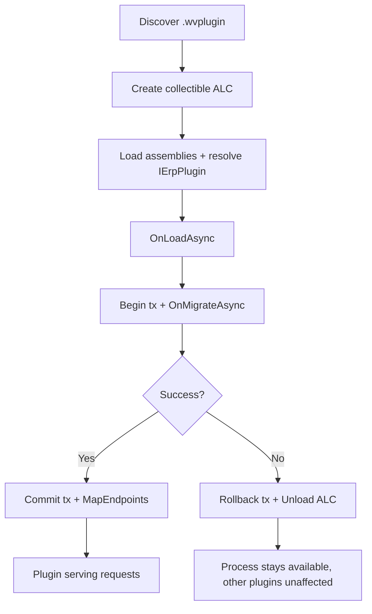

<!--{"sort_order":4, "name": "assemblyloadcontext-hosting", "label": "AssemblyLoadContext Hosting"}-->
# Plugin Hosting with AssemblyLoadContext

> **Planned target design — Not available in this checkout.** There is **no plugin
> host, no `IErpPlugin` interface, and no `AssemblyLoadContext` usage anywhere in
> this repository** (verified: 0 matches in the solution's source). Everything on
> this page — collectible load/unload, per-plugin isolation, hot-swap, and failure
> handling — is **proposed design** and **Not available / to be confirmed** until the
> host is implemented. The C# snippets are **illustrative uses of the standard .NET
> `System.Runtime.Loader.AssemblyLoadContext` API**, not host code that exists in
> this repository. What is **verified today** is the legacy model: plugins are
> ordinary Razor Class Libraries loaded into the single application domain and
> initialized through `Initialize(IServiceProvider)`, with no isolation and no
> unload path.
>
> Source (verified legacy): /WebVella.Erp/ErpPlugin.cs:L12, L57; /WebVella.Erp.Plugins.SDK/SdkPlugin.cs:L15 (`override void Initialize(IServiceProvider serviceProvider)`). Missing target artifacts: plugin host, `IErpPlugin`, collectible `AssemblyLoadContext` usage.

The proposed plugin host would be the part of the headless platform that turns a
packaged plugin on disk into a running extension of the process. It would load each
plugin's assemblies into their **own collectible** `AssemblyLoadContext` (ALC) so
that a plugin could be **assembly-isolated**, **unloaded**, and
**hot-swapped/reloaded** without restarting the host. This page documents those
proposed runtime mechanics. The full (proposed) host design lives in
[../architecture/plugin-host.md](../architecture/plugin-host.md), and the
method-by-method (proposed) contract lives in
[ierplugin-contract.md](ierplugin-contract.md).

> ## `AssemblyLoadContext` is NOT a security sandbox (Rule D / H-09)
>
> A collectible `AssemblyLoadContext` provides **assembly and dependency isolation
> and unloadability** — it does **not** create a security or trust boundary. Plugin
> code loaded into an ALC runs **in-process, in full trust, with the host's
> privileges**: it can read the host's memory, open files and network connections,
> and call any API the host process can. "Isolation" on this page always means
> *assembly/type-identity isolation*, never *security isolation*. Consequently,
> every plugin package must be treated as **fully trusted code** and gated by the
> supply-chain controls in [Trust boundary and supply-chain controls](#trust-boundary-and-supply-chain-controls-required)
> before it is loaded. Do not rely on the ALC to contain a malicious or buggy
> plugin.

## Trust boundary and supply-chain controls (required)

Because loading a plugin grants it host privileges, the following controls are
**requirements** on the (proposed) host and deployment pipeline. Their exact
mechanisms are Not available / to be confirmed until the host exists, but the
controls themselves are non-negotiable:

- **Package integrity & provenance.** Verify a signature and/or checksum bound to a
  **trusted publisher**; reject any package that fails verification.
- **Safe extraction & path validation.** Reject archive entries with traversal
  (`..`), absolute paths, or symlinks (zip-slip); extract only into the package's
  own directory.
- **Locked plugin directory.** The scanned directory must be ACL-restricted so the
  runtime account cannot be tricked into loading an attacker-dropped package.
- **Dependency allowlist / version policy.** Constrain and vulnerability-scan
  bundled dependencies before deployment.
- **Least privilege.** Run the host (and any plugin execution) with the minimum OS
  privileges required, and document what a plugin can and cannot reach.
- **Quarantine & rollback.** Quarantine a package that fails verification, load, or
  migration, and restore the previous known-good version — see the operator-facing
  [plugin rollback plan](../migration/rollback-plan.md).

## Related pages

- [IErpPlugin contract](ierplugin-contract.md) — the three proposed lifecycle
  methods (`OnLoadAsync`, `OnMigrateAsync`, `MapEndpoints`).
- [Plugin host](../architecture/plugin-host.md) — the full proposed host design.
- [Plugin migrations (OnMigrateAsync)](migrations-onmigrateasync.md) — the proposed
  versioned, idempotent, transactional patch pattern re-run on reload.
- [Plugin rollback plan](../migration/rollback-plan.md) — the operator-facing procedure when a plugin cannot be loaded.

## Collectible load and unload (proposed)

A **collectible** `AssemblyLoadContext` is one created with `isCollectible: true`.
Unlike the default context — which lives for the lifetime of the process and can
never release its assemblies — a collectible context can be **unloaded**, after
which the runtime reclaims its assemblies and metadata once no managed references
into the context remain. This unloadability is what would let the host replace or
remove a plugin at runtime. (Illustrative standard-.NET API usage; no such host code
exists in this repository — Not available / to be confirmed.)

```csharp
// One collectible context per plugin: it can later be unloaded.
var context = new AssemblyLoadContext(name: pluginName, isCollectible: true);

// Load the plugin's entry assembly into that context.
Assembly entry = context.LoadFromAssemblyPath(entryAssemblyPath);
```

The proposed **per-plugin context lifecycle** is: **create → load → use → unload →
GC**.

1. **Create** — a new collectible context is created for the plugin.
2. **Load** — the plugin's entry assembly and its private dependencies are loaded
   into the context, and the `IErpPlugin` implementation is resolved.
3. **Use** — the host drives the contract lifecycle: `OnLoadAsync` →
   `OnMigrateAsync` (inside a database transaction) → `MapEndpoints`. The exact
   order (and the commit boundary) is Not available / to be confirmed; see
   [ierplugin-contract.md](ierplugin-contract.md#transaction-behavior-current-vs-target).
4. **Unload** — when the plugin is removed or replaced, the host calls
   `context.Unload()`.
5. **GC** — the runtime releases the context's assemblies on a subsequent garbage
   collection, once no references remain.

```csharp
// Remove or replace a plugin: request unload, then let the GC reclaim it.
context.Unload();
GC.Collect();
GC.WaitForPendingFinalizers();
```

> A common pitfall is holding a strong reference to a plugin type, delegate, or
> instance after unload — any such reference keeps the whole context alive and
> prevents reclamation. The host would therefore drop all references to a plugin's
> types before unloading its context.

## Assembly isolation (type identity, not security)

Because every plugin would have its **own** context, each plugin's private
dependencies would resolve **inside that plugin's context**. Two plugins could
therefore depend on **different versions of the same library** without clashing, and
a plugin's dependencies could not collide with the host's. This is **type-identity
and dependency isolation only** — it is **not** a security boundary (see the warning
above). The host would wire up per-plugin resolution with an
`AssemblyDependencyResolver` built from the plugin's package path (illustrative
standard-.NET usage; Not available / to be confirmed):

```csharp
public sealed class PluginLoadContext : AssemblyLoadContext
{
    private readonly AssemblyDependencyResolver _resolver;

    public PluginLoadContext(string pluginEntryPath)
        : base(name: Path.GetFileNameWithoutExtension(pluginEntryPath), isCollectible: true)
        => _resolver = new AssemblyDependencyResolver(pluginEntryPath);

    protected override Assembly? Load(AssemblyName name)
    {
        // Resolve the plugin's private dependencies from its own package folder.
        string? path = _resolver.ResolveAssemblyToPath(name);
        return path is null ? null : LoadFromAssemblyPath(path);
        // Returning null lets shared contracts fall back to the host context.
    }
}
```

The **shared contract assembly must not be loaded per plugin.** The `IErpPlugin`
interface — and the other SDK contract types — would be provided by the host's
**default (host) context**, so the host and every plugin agree on **one** interface
type identity. If a plugin loaded its own copy of the contract assembly, the runtime
would treat the host's `IErpPlugin` and the plugin's `IErpPlugin` as **different
types**, and the cast that resolves the plugin instance would fail with an
`InvalidCastException`. Returning `null` from the context's `Load` override for
shared assemblies is what preserves the single, shared type identity.

## Hot-swap and reload (proposed)

Because each plugin's context would be collectible, the host could **hot-swap** a
plugin — replace its `.wvplugin` on disk and reload it — without restarting the
process:

1. **Unload the old context.** The host drops references to the plugin's types and
   calls `Unload()`; the GC then reclaims the old assemblies.
2. **Load the new context.** The host creates a fresh collectible context for the
   replacement package and repeats the load order (resolve → `OnLoadAsync` →
   `OnMigrateAsync` → `MapEndpoints`).
3. **Re-run migrations idempotently.** On reload, `OnMigrateAsync` would run again;
   migrations would be written to be **idempotent** and **version-guarded**, so
   already-applied patches are skipped. See
   [migrations-onmigrateasync.md](migrations-onmigrateasync.md).

Because the swap would be scoped to a single plugin's context, the host process and
every other plugin would keep running throughout (subject to the transaction-scope
questions in [migrations-onmigrateasync.md](migrations-onmigrateasync.md#transaction-scoping-current-vs-target)).

## Failure handling (proposed)

Loading a plugin is proposed to be **all-or-nothing for that one plugin**. The host
would guard every step, and if any throws it would **abort that one plugin**: roll
back the plugin's migration transaction so no partial Entity/Record schema change is
committed, then unload the plugin's collectible context. Whether one failing plugin
can affect others depends on the still-undecided transaction ownership model
(Not available / to be confirmed — see
[ierplugin-contract.md](ierplugin-contract.md#transaction-behavior-current-vs-target)).

The proposed failure points and host responses:

| Failure point | Cause | Proposed host response |
|---------------|-------|------------------------|
| Assembly resolution | A dependency cannot be found or loaded inside the plugin's context | Abort the plugin and unload its context. No transaction opened yet. |
| `OnLoadAsync` | The plugin's service registration throws | Abort the plugin and unload its context. |
| `OnMigrateAsync` | A schema or data patch throws inside the transaction | Roll back the migration transaction (scope pending), then unload the context. |
| `MapEndpoints` | A route collision or mapping error | Abort the plugin and unload its context. |

The operator-facing recovery procedure — how to diagnose, replace, or disable a
plugin that cannot be loaded — will be documented in the [plugin rollback plan](../migration/rollback-plan.md).

## Load and failure flow (proposed)

The flow below shows the proposed success path (commit the transaction and map
endpoints) and the failure path (roll back the transaction and unload the
collectible context):



*Proposed per-plugin load with success and failure branches. The full (proposed)
sequence diagram is in [../architecture/plugin-host.md](../architecture/plugin-host.md).*

## Troubleshooting (proposed)

- **A plugin's context will not unload (memory is not reclaimed).** Something still
  references a type, delegate, or instance from the plugin's context. Ensure the
  host has dropped all such references before calling `Unload()`. See
  [Collectible load and unload](#collectible-load-and-unload-proposed).
- **`InvalidCastException` when resolving `IErpPlugin`.** The plugin shipped its own
  copy of the contract assembly, producing two distinct type identities. The
  contract assembly must come from the host's default context; do not bundle it
  inside the `.wvplugin`. See [Assembly isolation](#assembly-isolation-type-identity-not-security).
- **A reload leaves the schema in an unexpected state.** `OnMigrateAsync` must be
  idempotent and version-guarded so it is safe to re-run on every reload. See
  [migrations-onmigrateasync.md](migrations-onmigrateasync.md).
- **A plugin fails to load at startup.** The host would abort that plugin, roll back
  its migration, and unload its context; follow the [plugin rollback plan](../migration/rollback-plan.md) to recover.
