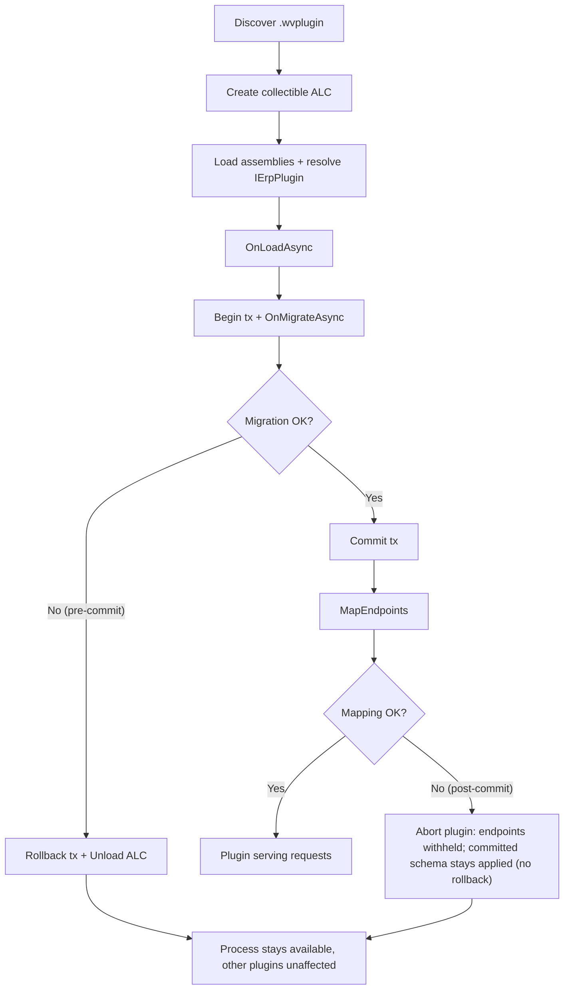

<!--{"sort_order":4, "name": "assemblyloadcontext-hosting", "label": "AssemblyLoadContext Hosting"}-->
# Plugin Hosting with AssemblyLoadContext

> **Planned target design — Not available in this checkout.** There is **no plugin
> host, no `IErpPlugin` interface, and no `AssemblyLoadContext` usage anywhere in
> this repository** (verified: 0 matches in the solution's source). Everything on
> this page — collectible load/unload, per-plugin isolation, hot-swap, and failure
> handling — is **proposed design** and **Not available / to be confirmed** until the
> host is implemented. The C# snippets are **illustrative uses of the standard .NET
> `System.Runtime.Loader.AssemblyLoadContext` API**, not host code that exists in
> this repository. What is **verified today** is the legacy model: plugins are
> ordinary Razor Class Libraries loaded into the single application domain and
> initialized through `Initialize(IServiceProvider)`, with no isolation and no
> unload path.
>
> Source (verified legacy): /WebVella.Erp/ErpPlugin.cs:L12, L57; /WebVella.Erp.Plugins.SDK/SdkPlugin.cs:L15 (`override void Initialize(IServiceProvider serviceProvider)`). Missing target artifacts: plugin host, `IErpPlugin`, collectible `AssemblyLoadContext` usage.

The proposed plugin host would be the part of the headless platform that turns a
packaged plugin on disk into a running extension of the process. It would load each
plugin's assemblies into their **own collectible** `AssemblyLoadContext` (ALC) for
**assembly/type-identity isolation**. Collectibility is a *necessary* precondition
for unloading a plugin, but it is **not sufficient**: **live (no-restart) unload and
hot-swap are Not available / to be confirmed**, because the host also registers a
plugin's service descriptors, endpoint delegates/data sources, hooks, and jobs into
**host-owned** structures (the DI container, the endpoint routing table, the hook
registries, and the job scheduler), and those references keep the plugin's context
alive and its routes/services live. Reclaiming a context therefore requires a
cleanup/unregister/dispose/request-draining contract that **does not exist** in this
repository and has not been designed. **Until that contract is defined and tested,
this page documents plugin activation and removal as a process restart**, and treats
the collectible-ALC unload/hot-swap mechanics below as illustrative, proposed
building blocks only. This page documents those proposed runtime mechanics. The full (proposed) host design lives in
[../architecture/plugin-host.md](../architecture/plugin-host.md), and the
method-by-method (proposed) contract lives in
[ierplugin-contract.md](ierplugin-contract.md).

> ## `AssemblyLoadContext` is NOT a security sandbox (Rule D / H-09)
>
> A collectible `AssemblyLoadContext` provides **assembly and dependency isolation
> and unloadability** — it does **not** create a security or trust boundary. Plugin
> code loaded into an ALC runs **in-process, in full trust, with the host's
> privileges**: it can read the host's memory, open files and network connections,
> and call any API the host process can. "Isolation" on this page always means
> *assembly/type-identity isolation*, never *security isolation*. Consequently,
> every plugin package must be treated as **fully trusted code** and gated by the
> supply-chain controls in [Trust boundary and supply-chain controls](#trust-boundary-and-supply-chain-controls-required)
> before it is loaded. Do not rely on the ALC to contain a malicious or buggy
> plugin.

## Trust boundary and supply-chain controls (required)

Because loading a plugin grants it host privileges, the following controls are
**requirements** on the (proposed) host and deployment pipeline. Their exact
mechanisms are Not available / to be confirmed until the host exists, but the
controls themselves are non-negotiable:

- **Package integrity & provenance.** Verify a signature and/or checksum bound to a
  **trusted publisher**; reject any package that fails verification.
- **Safe extraction & path validation.** Reject archive entries with traversal
  (`..`), absolute paths, or symlinks (zip-slip); extract only into the package's
  own directory.
- **Locked plugin directory.** The scanned directory must be ACL-restricted so the
  runtime account cannot be tricked into loading an attacker-dropped package.
- **Dependency allowlist / version policy.** Constrain and vulnerability-scan
  bundled dependencies before deployment.
- **Least privilege.** Run the host (and any plugin execution) with the minimum OS
  privileges required, and document what a plugin can and cannot reach.
- **Quarantine & rollback.** Quarantine a package that fails verification, load, or
  migration, and restore the previous known-good version — see the operator-facing
  [plugin rollback plan](../migration/rollback-plan.md).

## Related pages

- [IErpPlugin contract](ierplugin-contract.md) — the three proposed lifecycle
  methods (`OnLoadAsync`, `OnMigrateAsync`, `MapEndpoints`).
- [Migrating from ErpPlugin](migrating-from-erpplugin.md) — the step-by-step port
  from the legacy `Initialize(IServiceProvider)` model to the proposed `IErpPlugin`
  lifecycle that this host would load.
- [Plugin host](../architecture/plugin-host.md) — the full proposed host design.
- [Plugin migrations (OnMigrateAsync)](migrations-onmigrateasync.md) — the proposed
  versioned, idempotent, transactional patch pattern re-run on reload.
- [Plugin rollback plan](../migration/rollback-plan.md) — the operator-facing procedure when a plugin cannot be loaded.

## Collectible load and unload (proposed)

A **collectible** `AssemblyLoadContext` is one created with `isCollectible: true`.
Unlike the default context — which lives for the lifetime of the process and can
never release its assemblies — a collectible context can be **unloaded**, after
which the runtime reclaims its assemblies and metadata once no managed references
into the context remain. This unloadability is what would let the host replace or
remove a plugin at runtime. (Illustrative standard-.NET API usage; no such host code
exists in this repository — Not available / to be confirmed.)

```csharp
// One collectible context per plugin: it can later be unloaded.
var context = new AssemblyLoadContext(name: pluginName, isCollectible: true);

// Load the plugin's entry assembly into that context.
Assembly entry = context.LoadFromAssemblyPath(entryAssemblyPath);
```

The proposed **per-plugin context lifecycle** is: **create → load → use → unload →
GC**.

1. **Create** — a new collectible context is created for the plugin.
2. **Load** — the plugin's entry assembly and its private dependencies are loaded
   into the context, and the `IErpPlugin` implementation is resolved.
3. **Use** — the host drives the contract lifecycle: `OnLoadAsync` →
   `OnMigrateAsync` (inside a database transaction) → `MapEndpoints`. The exact
   order (and the commit boundary) is Not available / to be confirmed; see
   [ierplugin-contract.md](ierplugin-contract.md#transaction-behavior-current-vs-target).
4. **Unload** — when the plugin is removed or replaced, the host calls
   `context.Unload()`.
5. **GC** — the runtime releases the context's assemblies on a subsequent garbage
   collection, once no references remain.

```csharp
// Remove or replace a plugin: request unload, then let the GC reclaim it.
context.Unload();
GC.Collect();
GC.WaitForPendingFinalizers();
```

> A common pitfall is holding a strong reference to a plugin type, delegate, or
> instance after unload — any such reference keeps the whole context alive and
> prevents reclamation. In this system the host itself holds exactly such
> references: the plugin's DI service descriptors and any resolved singletons, the
> endpoint delegates/data sources in the routing table, the registered hooks, and
> the scheduled jobs all point into the plugin's context. Dropping them requires a
> defined unregister/dispose/drain step for **each** of those registries, which is
> **Not available / to be confirmed**. Because of this, a plugin's context is **not**
> expected to be reclaimable at runtime today, and removal is performed by a process
> restart (see [Hot-swap and reload](#hot-swap-and-reload)).

## Assembly isolation (type identity, not security)

Because every plugin would have its **own** context, each plugin's private
dependencies would resolve **inside that plugin's context**. Two plugins could
therefore depend on **different versions of the same library** without clashing, and
a plugin's dependencies could not collide with the host's. This is **type-identity
and dependency isolation only** — it is **not** a security boundary (see the warning
above). The host would wire up per-plugin resolution with an
`AssemblyDependencyResolver` built from the plugin's package path (illustrative
standard-.NET usage; Not available / to be confirmed):

```csharp
public sealed class PluginLoadContext : AssemblyLoadContext
{
    private readonly AssemblyDependencyResolver _resolver;

    public PluginLoadContext(string pluginEntryPath)
        : base(name: Path.GetFileNameWithoutExtension(pluginEntryPath), isCollectible: true)
        => _resolver = new AssemblyDependencyResolver(pluginEntryPath);

    protected override Assembly? Load(AssemblyName name)
    {
        // Resolve the plugin's private dependencies from its own package folder.
        string? path = _resolver.ResolveAssemblyToPath(name);
        return path is null ? null : LoadFromAssemblyPath(path);
        // Returning null lets shared contracts fall back to the host context.
    }
}
```

The **shared contract assembly must not be loaded per plugin.** The `IErpPlugin`
interface — and the other SDK contract types — would be provided by the host's
**default (host) context**, so the host and every plugin agree on **one** interface
type identity. If a plugin loaded its own copy of the contract assembly, the runtime
would treat the host's `IErpPlugin` and the plugin's `IErpPlugin` as **different
types**, and the cast that resolves the plugin instance would fail with an
`InvalidCastException`. Returning `null` from the context's `Load` override for
shared assemblies is what preserves the single, shared type identity.

## Hot-swap and reload

**Live, no-restart hot-swap is Not available / to be confirmed.** Collectibility
alone does not let the host replace a running plugin, because the host-owned
registrations listed under [Collectible load and unload](#collectible-load-and-unload-proposed)
(DI descriptors, endpoint delegates/data sources, hooks, and jobs) pin the old
context and keep its routes and services live. A correct no-restart swap would
additionally require **all** of the following, none of which is designed or present
in this repository:

- **atomic dynamic endpoint removal/swap**, so the old routes stop serving and the
  new ones publish without a window of missing or duplicated routes;
- **hook and job unregistration**, so the old plugin's hooks and scheduled jobs are
  removed before the replacement's register;
- **service/DI unregistration and disposal** of the old plugin's descriptors and any
  resolved singletons;
- **in-flight request draining**, so requests already executing old plugin code
  finish before its context is unloaded;
- **a verified unload step**, proving the old context is actually collectible once
  the references above are gone.

**What is needed** before this section can describe a no-restart swap: the host must
define and test each of those steps — including a test that proves the old ALC is
collectible and that stale route/service/hook/job registrations are gone.

**Until then, replace a plugin by a process restart.** Stage the new `.wvplugin` on
disk, then restart the host so the replacement package is loaded fresh. On startup,
`OnMigrateAsync` runs again and must be **idempotent** and **version-guarded** so
already-applied patches are skipped. See
[migrations-onmigrateasync.md](migrations-onmigrateasync.md). A restart keeps the
schema-migration questions in
[migrations-onmigrateasync.md](migrations-onmigrateasync.md#transaction-scoping-current-vs-target)
unchanged.

## Failure handling (proposed)

Failure behavior depends on **whether the migration transaction has already
committed**, and this page makes **no** all-or-nothing guarantee across that
boundary. The exact commit boundary is Not available / to be confirmed (see
[ierplugin-contract.md](ierplugin-contract.md#transaction-behavior-current-vs-target)),
but the proposed order runs `OnMigrateAsync` inside a transaction, **commits**, and
only **then** calls `MapEndpoints` — so `MapEndpoints` runs **after** the schema is
committed.

- **Pre-commit failures** — assembly resolution, `OnLoadAsync`, or `OnMigrateAsync`
  throwing before commit — can be undone: the migration transaction is rolled back so
  **no** Entity/Record schema change is committed, and the plugin's collectible
  context is unloaded. Nothing durable remains.
- **Post-commit failures** — a failure in `MapEndpoints`, or anywhere after the
  transaction commits — **cannot** be rolled back: the schema change is **already
  committed and stays applied**. The host can only withhold that plugin's endpoints
  and abort the plugin; it **cannot** automatically reverse the committed migration.
  Recovering from a committed-but-unmapped plugin requires **forward compensation** (a
  corrective migration) or operator recovery, not an automatic rollback.

Whether one failing plugin can affect others depends on the still-undecided
transaction ownership model (Not available / to be confirmed — same reference).

The proposed failure points and host responses:

| Failure point | Relative to commit | Cause | Proposed host response |
|---------------|--------------------|-------|------------------------|
| Assembly resolution | pre-commit | A dependency cannot be found or loaded inside the plugin's context | Abort the plugin and unload its context. No transaction opened yet. |
| `OnLoadAsync` | pre-commit | The plugin's service registration throws | Abort the plugin and unload its context. No transaction opened yet. |
| `OnMigrateAsync` | pre-commit | A schema or data patch throws inside the transaction | Roll back the migration transaction (scope pending), then unload the context. No schema change is committed. |
| `MapEndpoints` | **post-commit** | A route collision or mapping error, **after** the migration has committed | Withhold the plugin's endpoints and abort the plugin. **The committed schema is NOT rolled back**; recover by forward compensation or operator action. |

An alternative that *would* restore all-or-nothing behavior — validating and mapping
endpoints into an unpublished, atomic endpoint set **before** the transaction
commits, and publishing only after both succeed — is a possible host design but is
**Not available / to be confirmed**.

The operator-facing recovery procedure — how to diagnose, replace, or disable a
plugin that cannot be loaded — will be documented in the [plugin rollback plan](../migration/rollback-plan.md).

## Load and failure flow (proposed)

The flow below separates **pre-commit** failures (which roll back with nothing
durable left) from **post-commit** failures (the schema is already committed and
`MapEndpoints` runs afterward, so a mapping failure cannot be rolled back):



*Proposed per-plugin load. Pre-commit failures roll back; a post-commit
`MapEndpoints` failure leaves the committed schema in place and only withholds the
plugin's endpoints. The full (proposed) sequence diagram is in
[../architecture/plugin-host.md](../architecture/plugin-host.md).*

## Troubleshooting (proposed)

- **A plugin's context will not unload at runtime (memory is not reclaimed).** This
  is expected today: the host's own DI descriptors, endpoint delegates/data sources,
  hooks, and jobs reference the plugin's context and keep it alive, and there is no
  unregister/dispose/drain contract to remove them (Not available / to be confirmed).
  Runtime unload is therefore not supported; remove or replace a plugin by a process
  restart. See [Collectible load and unload](#collectible-load-and-unload-proposed)
  and [Hot-swap and reload](#hot-swap-and-reload).
- **`InvalidCastException` when resolving `IErpPlugin`.** The plugin shipped its own
  copy of the contract assembly, producing two distinct type identities. The
  contract assembly must come from the host's default context; do not bundle it
  inside the `.wvplugin`. See [Assembly isolation](#assembly-isolation-type-identity-not-security).
- **A restart leaves the schema in an unexpected state.** `OnMigrateAsync` must be
  idempotent and version-guarded so it is safe to re-run on every startup. See
  [migrations-onmigrateasync.md](migrations-onmigrateasync.md).
- **A plugin fails to load at startup.** If it fails **before** its migration commits
  (assembly resolution, `OnLoadAsync`, or `OnMigrateAsync`), the host rolls back the
  migration and unloads its context, and nothing durable remains. If it fails
  **after** commit (for example in `MapEndpoints`), the schema change **stays
  applied** and only the plugin's endpoints are withheld; follow the
  [plugin rollback plan](../migration/rollback-plan.md) to recover.
