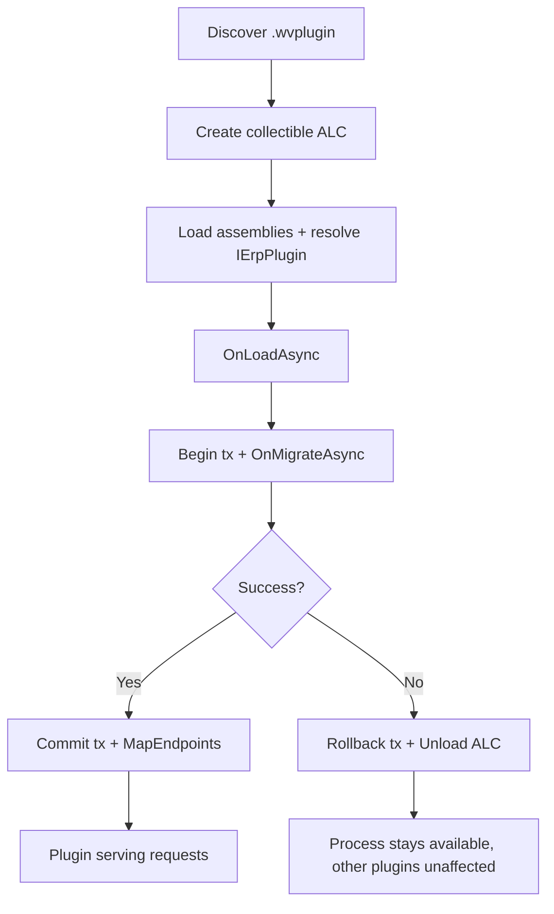

<!--{"sort_order":4, "name": "assemblyloadcontext-hosting", "label": "AssemblyLoadContext Hosting"}-->
# Plugin Hosting with AssemblyLoadContext

The plugin host is the part of the headless platform that turns a packaged plugin on disk into a running extension of the process. It loads each plugin's assemblies into their **own collectible** `AssemblyLoadContext` (ALC) so that a plugin can be **isolated**, **unloaded**, and **hot-swapped / reloaded** without restarting the host. This page documents those runtime mechanics — collectible load and unload, assembly isolation, hot-swap, and failure handling. The full host design (discovery, lifecycle wiring, and rollback) lives in [../architecture/plugin-host.md](../architecture/plugin-host.md), and the method-by-method contract the host drives lives in [ierplugin-contract.md](ierplugin-contract.md). Source: /WebVella.Erp.Plugins.SDK

Terminology on this page follows the platform glossary: a **plugin** is an `IErpPlugin` implementation, an **Entity** is a metadata-defined type, a **Record** is a row of an Entity, **EQL** is the query language, and a **hook** is a business-logic extension point.

> **Contrast with the legacy model.** Legacy plugins were ordinary Razor Class Libraries loaded into the single application domain and initialized through `Initialize(IServiceProvider)`, with no isolation and no unload path. Source: /docs/developer/plugins/overview.md:L4, Source: /WebVella.Erp.Plugins.SDK/SdkPlugin.cs:L15

## Related pages

- [IErpPlugin contract](ierplugin-contract.md) — the three lifecycle methods (`OnLoadAsync`, `OnMigrateAsync`, `MapEndpoints`) the host invokes.
- [Plugin host](../architecture/plugin-host.md) — the full host design: discovery, lifecycle wiring, and rollback.
- [Plugin migrations (OnMigrateAsync)](migrations-onmigrateasync.md) — the versioned, idempotent, transactional patch pattern re-run on reload.
- [Rollback plan](../migration/rollback-plan.md) — the operator-facing procedure when a plugin cannot be loaded.

## Collectible load and unload

A **collectible** `AssemblyLoadContext` is one created with `isCollectible: true`. Unlike the default context — which lives for the lifetime of the process and can never release its assemblies — a collectible context can be **unloaded**, after which the runtime reclaims its assemblies and metadata once no managed references into the context remain. This unloadability is exactly what lets the host replace or remove a plugin at runtime. Source: /WebVella.Erp.Plugins.SDK — see Source: /docs/architecture/plugin-host.md:L13

The host creates one collectible context per plugin:

```csharp
// One collectible context per plugin: it can later be unloaded.
var context = new AssemblyLoadContext(name: pluginName, isCollectible: true);

// Load the plugin's entry assembly into that context.
Assembly entry = context.LoadFromAssemblyPath(entryAssemblyPath);
```

The **per-plugin context lifecycle** is: **create → load → use → unload → GC**.

1. **Create** — a new collectible context is created for the plugin.
2. **Load** — the plugin's entry assembly and its private dependencies are loaded into the context, and the `IErpPlugin` implementation is resolved from the entry assembly.
3. **Use** — the host drives the contract lifecycle: `OnLoadAsync` → `OnMigrateAsync` (inside a database transaction) → `MapEndpoints`. This ordering is identical to the runtime order documented in [ierplugin-contract.md](ierplugin-contract.md). Source: /docs/architecture/plugin-host.md:L17
4. **Unload** — when the plugin is removed or replaced, the host calls `context.Unload()`.
5. **GC** — the runtime releases the context's assemblies on a subsequent garbage collection, once no references remain.

```csharp
// Remove or replace a plugin: request unload, then let the GC reclaim it.
context.Unload();
GC.Collect();
GC.WaitForPendingFinalizers();
```

> A common pitfall is holding a strong reference to a plugin type, delegate, or instance after unload — any such reference keeps the whole context alive and prevents reclamation. The host therefore drops all references to a plugin's types before unloading its context.

The complete per-plugin **load order** is: discover the `.wvplugin` package → create the collectible context → load assemblies and resolve `IErpPlugin` → `OnLoadAsync` → `OnMigrateAsync` (in a database transaction) → `MapEndpoints`. The internal layout of a `.wvplugin` package is documented in [packaging-wvplugin.md](packaging-wvplugin.md). Source: /WebVella.Erp.Plugins.SDK

## Assembly isolation

Because every plugin has its **own** context, each plugin's private dependencies resolve **inside that plugin's context**. Two plugins can therefore depend on **different versions of the same library** without clashing, and a plugin's dependencies cannot collide with the host's. The host wires up this per-plugin resolution with an `AssemblyDependencyResolver` built from the plugin's package path:

```csharp
public sealed class PluginLoadContext : AssemblyLoadContext
{
    private readonly AssemblyDependencyResolver _resolver;

    public PluginLoadContext(string pluginEntryPath)
        : base(name: Path.GetFileNameWithoutExtension(pluginEntryPath), isCollectible: true)
        => _resolver = new AssemblyDependencyResolver(pluginEntryPath);

    protected override Assembly? Load(AssemblyName name)
    {
        // Resolve the plugin's private dependencies from its own package folder.
        string? path = _resolver.ResolveAssemblyToPath(name);
        return path is null ? null : LoadFromAssemblyPath(path);
        // Returning null lets shared contracts fall back to the host context.
    }
}
```

The **shared contract assembly is deliberately not loaded per plugin.** The `IErpPlugin` interface — and the other SDK contract types — is provided by the host's **default (host) context**, so the host and every plugin agree on **one** interface type identity. If a plugin were allowed to load its own copy of the contract assembly, the runtime would treat the host's `IErpPlugin` and the plugin's `IErpPlugin` as **different types**, and the cast that resolves the plugin instance would fail with a type-identity (`InvalidCastException`) error. Returning `null` from the context's `Load` override for shared assemblies is what preserves that single, shared type identity. Source: /WebVella.Erp.Plugins.SDK — see Source: /docs/architecture/plugin-host.md:L13

## Hot-swap and reload

Because each plugin's context is collectible, the host can **hot-swap** a plugin — replace its `.wvplugin` on disk and reload it — without restarting the process:

1. **Unload the old context.** The host drops references to the plugin's types and calls `Unload()` on the old context; the GC then reclaims the old assemblies.
2. **Load the new context.** The host creates a fresh collectible context for the replacement package and repeats the load order (resolve → `OnLoadAsync` → `OnMigrateAsync` → `MapEndpoints`).
3. **Re-run migrations idempotently.** On reload, `OnMigrateAsync` runs again; migrations are written to be **idempotent** and **version-guarded**, so already-applied Entity and Record schema patches are skipped and re-application is safe. The versioned-patch pattern and its guards are documented in [migrations-onmigrateasync.md](migrations-onmigrateasync.md). Source: /WebVella.Erp.Plugins.SDK

Because the swap is scoped to a single plugin's context, the host process and every other plugin keep running throughout.

## Failure handling

Loading a plugin is **all-or-nothing**. The host guards every step, and if any of them throws it **aborts that one plugin**: it rolls back the plugin's migration transaction so no partial Entity/Record schema change is committed, then unloads the plugin's collectible context to release its assemblies. Because the failure is contained to that one context, **the host process stays available and the other plugins are unaffected.** Source: /WebVella.Erp.Plugins.SDK — see Source: /docs/architecture/plugin-host.md:L27

The failure points and the host's response:

| Failure point | Cause | Host response |
|---------------|-------|---------------|
| Assembly resolution | A dependency cannot be found or loaded inside the plugin's context | Abort the plugin and unload its context. No transaction has been opened yet. |
| `OnLoadAsync` | The plugin's service registration throws | Abort the plugin and unload its context. |
| `OnMigrateAsync` | A schema or data patch throws inside the transaction | Roll back the host-owned transaction, then unload the context. |
| `MapEndpoints` | A route collision or mapping error | Abort the plugin and unload its context. |

In every case the host **remains available** and continues serving the plugins that loaded successfully. The operator-facing recovery procedure — how to diagnose, replace, or disable a plugin that cannot be loaded — is documented in the [rollback plan](../migration/rollback-plan.md). Source: /WebVella.Erp.Plugins.SDK

## Load and failure flow

The flow below shows the success path (commit the transaction and map endpoints) and the failure path (roll back the transaction and unload the collectible context), with the host process remaining available on either branch:



*Per-plugin load with explicit success and failure branches. The full sequence diagram, including the database interactions, is in [../architecture/plugin-host.md](../architecture/plugin-host.md). Source: /WebVella.Erp.Plugins.SDK*

## Troubleshooting

- **A plugin's context will not unload (memory is not reclaimed).** Something still references a type, delegate, or instance from the plugin's context. Ensure the host has dropped all such references before calling `Unload()`; only then will the GC reclaim the assemblies. See [Collectible load and unload](#collectible-load-and-unload).
- **`InvalidCastException` when resolving `IErpPlugin`.** The plugin shipped its own copy of the contract assembly, producing two distinct type identities. The contract assembly must come from the host's default context; do not bundle it inside the `.wvplugin`. See [Assembly isolation](#assembly-isolation) and [packaging-wvplugin.md](packaging-wvplugin.md).
- **A reload leaves the schema in an unexpected state.** `OnMigrateAsync` must be idempotent and version-guarded so it is safe to re-run on every reload. See [migrations-onmigrateasync.md](migrations-onmigrateasync.md).
- **A plugin fails to load at startup.** The host aborts that plugin, rolls back its migration, and unloads its context while continuing to serve the rest; follow the [rollback plan](../migration/rollback-plan.md) to recover.
