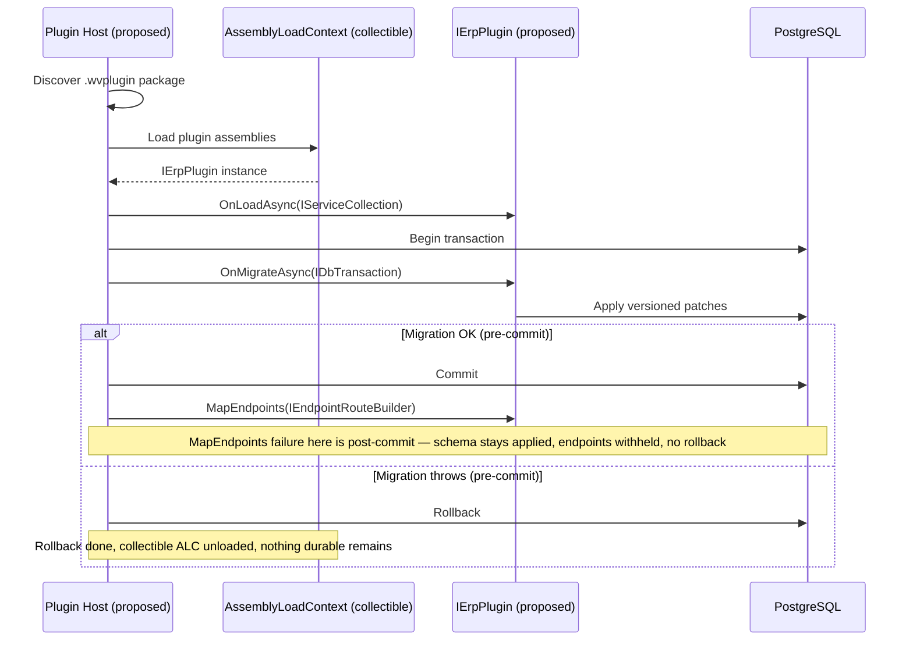

<!--{"sort_order":1, "name": "ierplugin-contract", "label": "IErpPlugin Contract"}-->
# The IErpPlugin Contract

> **Planned target design — Not available in this checkout.** The `IErpPlugin`
> interface, the `.wvplugin` package format, the `PluginManifest` entry class, and
> the collectible-`AssemblyLoadContext` plugin host described on this page **do not
> exist in this repository yet** — there is no `IErpPlugin` interface, no
> `PluginManifest`, and no `AssemblyLoadContext` usage anywhere in the solution.
> Everything below is **proposed design** for the headless refactor and is **Not
> available / to be confirmed** until the SDK contract and plugin host are
> implemented; the exact method signatures, invocation order, cleanup, and failure
> behavior must be derived from the SDK/host source and its tests once they exist.
> What is **verified today** is the **legacy** plugin model: plugins inherit the
> abstract `ErpPlugin` base class and override `Initialize(IServiceProvider)`.
>
> Source: /WebVella.Erp/ErpPlugin.cs:L12 (abstract `ErpPlugin`), L57 (`virtual void Initialize(IServiceProvider)`); /WebVella.Erp.Plugins.SDK/SdkPlugin.cs:L10 (`SdkPlugin : ErpPlugin`), L15 (`override void Initialize`). Missing target artifacts (Not available / to be confirmed): `IErpPlugin` interface, `PluginManifest`, plugin host, `.wvplugin` format.

In the proposed headless model, a **plugin** would be a class that implements an
`IErpPlugin` interface owned by the `WebVella.Erp.Plugins.SDK` project. The plugin
host would discover each plugin from a packaged `.wvplugin` artifact and load it
into a collectible `AssemblyLoadContext`. Collectibility is intended to enable
per-plugin assembly isolation; **live, no-restart reload/hot-swap is Not available /
to be confirmed** and depends on an unregister/dispose/request-draining contract that
does not yet exist, so plugin activation and removal are documented as a **process
restart** (see
[assemblyloadcontext-hosting.md](assemblyloadcontext-hosting.md#hot-swap-and-reload)).
The proposed contract exposes **three lifecycle methods** — `OnLoadAsync`,
`OnMigrateAsync`, and `MapEndpoints`. Their exact signatures and the host's
invocation order are **Not available / to be confirmed** until the interface and host
exist.

This composition-based contract is proposed to **replace** the legacy plugin model,
in which a plugin inherits the `ErpPlugin` base class (`public partial class
SdkPlugin : ErpPlugin`) and overrides `Initialize(IServiceProvider)`. A
step-by-step port of an existing plugin is documented in
[migrating-from-erpplugin.md](migrating-from-erpplugin.md).

Source: /WebVella.Erp/ErpPlugin.cs:L12, L57; /WebVella.Erp.Plugins.SDK/SdkPlugin.cs:L10 (`SdkPlugin : ErpPlugin`), L15 (`override void Initialize(IServiceProvider serviceProvider)`).

## Overview

A plugin is intended to extend the platform with the same capability set the legacy
model offers — tag helpers, page components, pages, business logic via hooks, HTTP
endpoints, code-based data sources, and background jobs. Under the headless
platform, HTTP API extension is proposed to be performed by mapping **Minimal API**
endpoints through `MapEndpoints` rather than by registering MVC controllers as the
legacy SDK plugin does today.

Source (legacy controller model, verified): /WebVella.Erp.Plugins.SDK/Controllers/AdminController.cs:L17 (`class AdminController : Controller`), L39 (`[Route("api/v3.0/p/sdk/datasource/list")]`). The `IErpPlugin`/`MapEndpoints` replacement is Not available / to be confirmed.

Terminology in this document is consistent with the platform glossary: an
**Entity** is a metadata-defined type, a **Record** is a row of an Entity, **EQL**
is the query language, a **plugin** is an `IErpPlugin` implementation, and a
**hook** is a business-logic extension point.

## The plugin lifecycle

The proposed design drives every plugin through the same ordered lifecycle at load
time:

1. **`OnLoadAsync(IServiceCollection services)`** — the plugin would register its
   services into the dependency-injection container *before* the application's
   service provider is built.
2. **`OnMigrateAsync(IDbTransaction transaction)`** — the plugin would apply
   transactional schema/data patches on a database transaction.
3. **`MapEndpoints(IEndpointRouteBuilder endpoints)`** — the plugin would map its
   Minimal API HTTP endpoints onto the host's router.

> The three methods are **documented below in the order** `OnLoadAsync` →
> `MapEndpoints` → `OnMigrateAsync`. The proposed **runtime invocation order** is
> `OnLoadAsync` → `OnMigrateAsync` → `MapEndpoints`, but the exact order — and in
> particular whether endpoint mapping runs **before or after** the migration
> transaction is committed — is **Not available / to be confirmed** until the host
> defines it (see [Transaction behavior](#transaction-behavior-current-vs-target)).
> Because the proposed order maps endpoints **after** the migration commits, a
> failure in `MapEndpoints` would be **post-commit** and could **not** roll back the
> committed schema; this contract therefore makes **no** all-or-nothing guarantee
> across the commit boundary.

## Lifecycle methods

### OnLoadAsync(IServiceCollection services)

**Purpose.** Register the plugin's services and dependency-injection bindings at
load time, adding them to the `IServiceCollection` **before** the application's
root service provider is built. This is proposed to **replace** the legacy
`Initialize(IServiceProvider serviceProvider)` method: the legacy method receives an
*already-built* `IServiceProvider` from which to *resolve* services, whereas
`OnLoadAsync` would receive an `IServiceCollection` into which to *register* them.

Source (legacy): /WebVella.Erp.Plugins.SDK/SdkPlugin.cs:L15 (`override void Initialize(IServiceProvider serviceProvider)`). Target `OnLoadAsync` signature: Not available / to be confirmed.

**Inputs.** `IServiceCollection services` — proposed to be the application's service
collection, supplied by the host.

**Outputs / return.** `Task` (proposed) — awaited by the host before it proceeds.

**Side effects.** Service registrations (singletons, scoped/transient services,
options, hooks, and job types) would be added to the container. No HTTP requests
are handled and no endpoints are live at this point.

**Error modes (proposed).** If `OnLoadAsync` throws, the plugin would not be loaded:
the host would abort loading this plugin and unload its collectible
`AssemblyLoadContext`. See [assemblyloadcontext-hosting.md](assemblyloadcontext-hosting.md)
and [../architecture/plugin-host.md](../architecture/plugin-host.md) — both proposed
design.

### MapEndpoints(IEndpointRouteBuilder endpoints)

**Purpose.** Map the plugin's Minimal API HTTP endpoints onto the host's routing.
This is proposed to **replace** the legacy plugin **MVC controllers** — for example,
the SDK plugin's `AdminController`, which the legacy host exposes under
`api/v3.0/p/sdk/...`.

Source (legacy, verified): /WebVella.Erp.Plugins.SDK/Controllers/AdminController.cs:L39 (`[Route("api/v3.0/p/sdk/datasource/list")]`), L53 (`[AcceptVerbs("POST", Route = "api/v3.0/p/sdk/sitemap/area")]`).

**Inputs.** `IEndpointRouteBuilder endpoints` (proposed) — the host's endpoint route
builder.

**Outputs / return.** `void` (proposed) — the method would map routes synchronously.

**Side effects.** Routes and endpoints would be registered on the builder. To avoid
collisions, every endpoint should be namespaced under a plugin-specific prefix such
as `/api/v1/plugins/{name}/...` (target route shape — Not available / to be
confirmed).

> **Authorization is mandatory on every protected endpoint (Rule D / H-08).** The
> legacy `AdminController` enforces authorization on the server: the controller
> carries a class-level `[Authorize(...)]` so **all** its actions require an
> authenticated principal, and sensitive actions add `[Authorize(Roles =
> "administrator")]`. When a controller action is ported to a mapped Minimal API
> endpoint, that server-side authorization **must be reproduced** by calling
> `.RequireAuthorization(...)` (with the equivalent policy or roles) on the mapped
> endpoint. Omitting it would expose a privileged operation anonymously. **UI
> visibility is never a substitute for endpoint authorization** — hiding a menu item
> does not protect the route.
>
> Source: /WebVella.Erp.Plugins.SDK/Controllers/AdminController.cs:L16 (class-level `[Authorize(AuthenticationSchemes = Cookie)]`), L52 (`[Authorize(Roles = "administrator")]` on `CreateSitemapArea`); role name `administrator` per /WebVella.Erp/Api/SecurityContext.cs:L26.

**Error modes (proposed).** A route conflict (two endpoints claiming the same HTTP
method and path) or an exception during mapping would fail the plugin load.

### OnMigrateAsync(IDbTransaction transaction)

**Purpose.** Apply transactional schema and data patches when the plugin loads — the
plugin's **migration**. This is proposed to **replace** the legacy versioned
`WEBVELLA_*_INIT_VERSION` initialization that runs inside `Initialize`, where each
patch is guarded by a version check such as `if (currentPluginSettings.Version <
20181215)` and applied in sequence.

Source (legacy, verified): /WebVella.Erp.Plugins.SDK/SdkPlugin._.cs:L12 (`WEBVELLA_SDK_INIT_VERSION = 20181001`), L79 (`if (currentPluginSettings.Version < 20181215)`).

**Inputs.** `IDbTransaction transaction` (proposed) — see
[Transaction behavior](#transaction-behavior-current-vs-target) for the important
distinction between the **current** per-plugin transaction and the **proposed**
host-owned transaction, which is Not available / to be confirmed.

**Outputs / return.** `Task` (proposed) — awaited by the host.

**Error modes (proposed).** Throwing from `OnMigrateAsync` is proposed to roll back
the transaction and rethrow — mirroring the legacy `catch { connection.RollbackTransaction(); throw; }`
behavior. See [migrations-onmigrateasync.md](migrations-onmigrateasync.md).

Source (legacy, verified): /WebVella.Erp.Plugins.SDK/SdkPlugin._.cs:L156 (`catch`), L158 (`connection.RollbackTransaction()`).

## Transaction behavior (current vs target)

The transaction ownership model is the single most important thing this contract
must pin down, and it is **not yet decided**.

**Current (verified).** Each legacy plugin opens and owns **its own** transaction.
The SDK plugin's `ProcessPatches()` opens a connection, begins a transaction, runs
its version-gated patches, and commits — rolling back on error — all by itself:

Source: /WebVella.Erp.Plugins.SDK/SdkPlugin._.cs:L31 (`DbContext.Current.CreateConnection()`), L35 (`connection.BeginTransaction()`), L153 (`connection.CommitTransaction()`), L156-L158 (`catch { connection.RollbackTransaction(); }`). The engine's `DbConnection.BeginTransaction` implements **nested savepoints** (`transaction.Save(...)`), not a cross-plugin unit of work — Source: /WebVella.Erp/Database/DbConnection.cs:L115, L126 (`transaction.Save`).

**Target (Not available / to be confirmed).** Whether the host will instead open
**one** transaction and hand the same `IDbTransaction` to every plugin — making all
plugin migrations commit or roll back together — is a design decision the host has
not yet made. There is no evidence in the current codebase of cross-plugin
atomicity. **What is needed** before this section can assert host-owned semantics:
the plugin-host source that (1) shows whether one transaction spans all plugins or
each plugin migrates independently, (2) fixes whether `MapEndpoints` runs before or
after the migration commit, (3) defines the compensation/rollback scope when one
plugin among many fails, and (4) specifies how the ambient `EntityManager`/
`RecordManager` bind to the supplied transaction.

## Minimal plugin example (proposed)

The illustrative implementation below is a `PluginManifest`-style class — the
proposed per-plugin manifest naming that each bundled plugin (Crm, Mail,
MicrosoftCDM, Next, Project) would adopt under the headless model. It is **design
pseudocode against a contract that does not exist yet** (Not available / to be
confirmed):

```csharp
using System.Data;
using System.Threading.Tasks;
using Microsoft.AspNetCore.Routing;
using Microsoft.AspNetCore.Builder; // for RequireAuthorization
using Microsoft.Extensions.DependencyInjection;

public sealed class CrmPluginManifest : IErpPlugin
{
    public string Name => "crm";

    public Task OnLoadAsync(IServiceCollection services)
    {
        // register plugin services (would replace Initialize(IServiceProvider))
        return Task.CompletedTask;
    }

    public Task OnMigrateAsync(IDbTransaction transaction)
    {
        // apply versioned, transactional schema/data patches (transaction ownership: see above)
        return Task.CompletedTask;
    }

    public void MapEndpoints(IEndpointRouteBuilder endpoints)
    {
        // Public/health endpoint (no privileged data) may be anonymous:
        endpoints.MapGet("/api/v1/plugins/crm/ping", () => Results.Ok());

        // PROTECTED endpoint — MUST enforce server-side authorization.
        // This replaces a legacy [Authorize(Roles = "administrator")] controller action;
        // the role/policy requirement is reproduced with RequireAuthorization.
        endpoints.MapPost("/api/v1/plugins/crm/admin/task", CreateTask)
                 .RequireAuthorization(policy => policy.RequireRole("administrator"));
    }
}
```

The `Name` property identifies the plugin, mirroring the legacy `Name` override
(`Name { get; protected set; } = "sdk";`).

Source (legacy): /WebVella.Erp.Plugins.SDK/SdkPlugin.cs:L13 (`Name ... = "sdk"`). The `administrator` role in `.RequireRole("administrator")` mirrors the legacy `[Authorize(Roles = "administrator")]` — Source: /WebVella.Erp.Plugins.SDK/Controllers/AdminController.cs:L52; /WebVella.Erp/Api/SecurityContext.cs:L26.

## Error modes and troubleshooting (proposed)

- **Plugin fails to load** — `OnLoadAsync` threw; the host would unload the plugin's
  collectible `AssemblyLoadContext`. See [assemblyloadcontext-hosting.md](assemblyloadcontext-hosting.md).
- **Migration fails** — `OnMigrateAsync` threw; the host would roll back the
  transaction (scope per [Transaction behavior](#transaction-behavior-current-vs-target)).
  See [migrations-onmigrateasync.md](migrations-onmigrateasync.md).
- **Endpoint route collision** — two endpoints share the same HTTP method and path;
  prefix routes with `/api/v1/plugins/{name}/...` to keep them unique.
- **Protected endpoint exposed anonymously** — a ported endpoint omitted
  `.RequireAuthorization(...)`; add the policy/roles that the legacy controller
  action enforced.
- **Assembly load failure** — a dependency could not be resolved inside the
  collectible `AssemblyLoadContext`; the operator recovery procedure will be
  documented in the [plugin rollback plan](../migration/rollback-plan.md).

## Plugin load sequence (proposed)

The proposed host would load each plugin into a collectible `AssemblyLoadContext`,
then drive the three lifecycle methods. The diagram below is an **illustrative
design sketch**; the commit/mapping order is Not available / to be confirmed. Note
that in this sketch the migration transaction **commits before** `MapEndpoints`
runs, so a `MapEndpoints` failure is **post-commit** and **cannot** roll back the
committed schema — there is **no** all-or-nothing guarantee across the commit
boundary (see [Transaction behavior](#transaction-behavior-current-vs-target) and the
[failure handling](assemblyloadcontext-hosting.md#failure-handling-proposed) table):



*Proposed plugin load sequence via a collectible `AssemblyLoadContext`. Pre-commit
failures roll back; a post-commit `MapEndpoints` failure leaves the committed schema
in place. See [../architecture/plugin-host.md](../architecture/plugin-host.md) for the
full (proposed) host design.*
