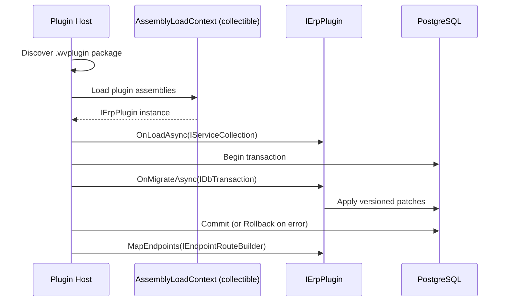

<!--{"sort_order":1, "name": "ierplugin-contract", "label": "IErpPlugin Contract"}-->
# The IErpPlugin Contract

A **plugin** is a class that implements the `IErpPlugin` interface owned by the `WebVella.Erp.Plugins.SDK` project. The plugin host discovers each plugin from its packaged `.wvplugin` artifact, loads it into an isolated, collectible `AssemblyLoadContext` at application startup, and can hot-reload it without restarting the process. The contract exposes **exactly three lifecycle methods** — `OnLoadAsync`, `OnMigrateAsync`, and `MapEndpoints` — which the host invokes, in that order, while wiring the plugin into the running platform. Source: /WebVella.Erp.Plugins.SDK

This composition-based contract **replaces** the legacy "Razor Class Library" plugin model, in which a plugin inherited from the `ErpPlugin` base class (`public partial class SdkPlugin : ErpPlugin`) and implemented `Initialize(IServiceProvider)`. Source: /docs/developer/plugins/overview.md:L4, Source: /docs/developer/plugins/create-your-own.md:L37, Source: /WebVella.Erp.Plugins.SDK/SdkPlugin.cs:L10 A step-by-step port of an existing plugin is documented separately in [migrating-from-erpplugin.md](migrating-from-erpplugin.md).

## Overview

A plugin extends the platform with the same capability set the legacy model offered — tag helpers, page components, pages and page-routing overrides, business logic via hooks, HTTP endpoints, code-based data sources, and background jobs. Source: /docs/developer/plugins/overview.md:L6-L15 Under the headless platform, HTTP API extension is now performed by mapping **Minimal API** endpoints through `MapEndpoints` rather than by registering MVC controllers. Source: /WebVella.Erp.Plugins.SDK

Terminology in this document is consistent with the platform glossary: an **Entity** is a metadata-defined type, a **Record** is a row of an Entity, **EQL** is the query language, a **plugin** is an `IErpPlugin` implementation, and a **hook** is a business-logic extension point.

## The plugin lifecycle

The host drives every plugin through the same ordered lifecycle at load time:

1. **`OnLoadAsync(IServiceCollection services)`** — the plugin registers its services into the dependency-injection container *before* the application's service provider is built.
2. **`OnMigrateAsync(IDbTransaction transaction)`** — the plugin applies transactional schema/data patches on a host-owned database transaction.
3. **`MapEndpoints(IEndpointRouteBuilder endpoints)`** — the plugin maps its Minimal API HTTP endpoints onto the host's router.

> The three methods are **documented below in the order** `OnLoadAsync` → `MapEndpoints` → `OnMigrateAsync`, but the **runtime invocation order** is `OnLoadAsync` → `OnMigrateAsync` (inside the database transaction) → `MapEndpoints`, as shown in the [plugin load sequence](#plugin-load-sequence) diagram. Source: /WebVella.Erp.Plugins.SDK

## Lifecycle methods

#### OnLoadAsync(IServiceCollection services)

**Purpose.** Register the plugin's services and dependency-injection bindings at load time, adding them to the `IServiceCollection` **before** the application's root service provider is built. This **replaces** the legacy `Initialize(IServiceProvider serviceProvider)` method: the legacy method received an *already-built* `IServiceProvider` from which to *resolve* services, whereas `OnLoadAsync` receives an `IServiceCollection` into which to *register* them. Source: /docs/developer/plugins/create-your-own.md:L52, Source: /WebVella.Erp.Plugins.SDK/SdkPlugin.cs:L15

**Inputs.** `IServiceCollection services` — the application's service collection, supplied by the host.

**Outputs / return.** `Task` — the method is asynchronous and is awaited by the host before it proceeds to the next lifecycle step.

**Side effects.** Service registrations (singletons, scoped and transient services, options, hooks, and job types) are added to the container. No HTTP requests are handled and no endpoints are live at this point.

**Error modes.** If `OnLoadAsync` throws, the plugin is **not** loaded: the host aborts loading this plugin and unloads its collectible `AssemblyLoadContext` so the failed assemblies are released. Source: /WebVella.Erp.Plugins.SDK See [assemblyloadcontext-hosting.md](assemblyloadcontext-hosting.md) and [../architecture/plugin-host.md](../architecture/plugin-host.md) for host behavior.

#### MapEndpoints(IEndpointRouteBuilder endpoints)

**Purpose.** Map the plugin's Minimal API HTTP endpoints onto the host's routing. This **replaces** the legacy plugin **MVC controllers** — for example, the SDK plugin's `AdminController`, which the legacy host exposed under `api/v3.0/p/sdk/...`. Source: /docs/developer/plugins/overview.md:L12, Source: /WebVella.Erp.Plugins.SDK

**Inputs.** `IEndpointRouteBuilder endpoints` — the host's endpoint route builder.

**Outputs / return.** `void`. The method maps routes **synchronously** by calling `endpoints.MapGet`, `MapPost`, and related builder methods on the supplied builder; it does not perform asynchronous work.

**Side effects.** Routes and endpoints are registered on the builder. They become live once the host finishes wiring all plugins and begins serving requests.

**Error modes.** A route conflict (two endpoints claiming the same HTTP method and path) or any exception thrown during mapping fails the plugin load. To avoid collisions, namespace every endpoint under a plugin-specific prefix such as `/api/v1/plugins/{name}/...`. Source: /WebVella.Erp.Plugins.SDK

#### OnMigrateAsync(IDbTransaction transaction)

**Purpose.** Apply transactional schema and data patches when the plugin loads — the plugin's **migration**. This **replaces** the legacy versioned `WEBVELLA_*_INIT_VERSION` initialization logic that ran inside `Initialize`, where each patch, guarded by a version check such as `if (currentPluginSettings.Version < 20181215)`, was applied in sequence. Source: /WebVella.Erp.Plugins.SDK/SdkPlugin._.cs:L12, Source: /WebVella.Erp.Plugins.SDK/SdkPlugin._.cs:L79-L145

**Inputs.** `IDbTransaction transaction` — a database transaction **supplied and owned by the host**. The plugin performs its writes on this transaction and **does not** open its own connection. This contrasts with the legacy pattern, in which the plugin itself called `DbContext.Current.CreateConnection()` and `BeginTransaction()`. Source: /WebVella.Erp.Plugins.SDK/SdkPlugin._.cs:L31-L35

**Outputs / return.** `Task` — the method is asynchronous and is awaited by the host.

**Side effects.** Database writes (Entity and Record schema changes, seed data) are performed on the shared host transaction. The host **commits** only if every plugin migrates successfully.

**Error modes.** Throwing from `OnMigrateAsync` causes the host to **roll back** the shared transaction and rethrow — mirroring the legacy `catch { connection.RollbackTransaction(); throw; }` behavior. Source: /WebVella.Erp.Plugins.SDK/SdkPlugin._.cs:L156-L160 See [migrations-onmigrateasync.md](migrations-onmigrateasync.md) for the versioned-patch pattern and rollback semantics.

## Minimal plugin example

The minimal implementation below is a `PluginManifest.cs`-style class — the per-plugin manifest naming that each bundled plugin (Crm, Mail, MicrosoftCDM, Next, Project) adopts under the headless model. Source: /WebVella.Erp.Plugins.SDK It implements all three lifecycle methods with placeholder bodies:

```csharp
using System.Data;
using System.Threading.Tasks;
using Microsoft.AspNetCore.Routing;
using Microsoft.Extensions.DependencyInjection;

public sealed class CrmPluginManifest : IErpPlugin
{
    public string Name => "crm";

    public Task OnLoadAsync(IServiceCollection services)
    {
        // register plugin services (replaces Initialize(IServiceProvider))
        return Task.CompletedTask;
    }

    public Task OnMigrateAsync(IDbTransaction transaction)
    {
        // apply versioned, transactional schema/data patches on the host transaction
        return Task.CompletedTask;
    }

    public void MapEndpoints(IEndpointRouteBuilder endpoints)
    {
        // endpoints.MapGet("/api/v1/plugins/crm/ping", () => Results.Ok());
    }
}
```

The `Name` property identifies the plugin, mirroring the legacy `Name` override (for example, `Name { get; protected set; } = "sdk";`). Source: /WebVella.Erp.Plugins.SDK/SdkPlugin.cs:L13

## Error modes and troubleshooting

- **Plugin fails to load** — `OnLoadAsync` threw. The host unloads the plugin's collectible `AssemblyLoadContext`; check the plugin's DI registrations and the startup logs, then reload. See [assemblyloadcontext-hosting.md](assemblyloadcontext-hosting.md).
- **Migration fails** — `OnMigrateAsync` threw; the host rolls back the shared transaction, so no partial schema change is committed. Fix the patch and reload. See [migrations-onmigrateasync.md](migrations-onmigrateasync.md).
- **Endpoint route collision** — two endpoints share the same HTTP method and path. Prefix your routes with `/api/v1/plugins/{name}/...` to keep them unique.
- **Assembly load failure** — a dependency could not be resolved inside the collectible `AssemblyLoadContext`. Verify the `.wvplugin` package bundles its dependencies, then follow the [rollback plan](../migration/rollback-plan.md).

Source: /WebVella.Erp.Plugins.SDK

## Plugin load sequence

The host loads each plugin into a **collectible** `AssemblyLoadContext`, then drives the three lifecycle methods in runtime order — `OnLoadAsync`, then `OnMigrateAsync` within a database transaction, then `MapEndpoints`:



*Plugin load sequence via the collectible `AssemblyLoadContext`. Source: /WebVella.Erp.Plugins.SDK — see [../architecture/plugin-host.md](../architecture/plugin-host.md) for the full host design.*
