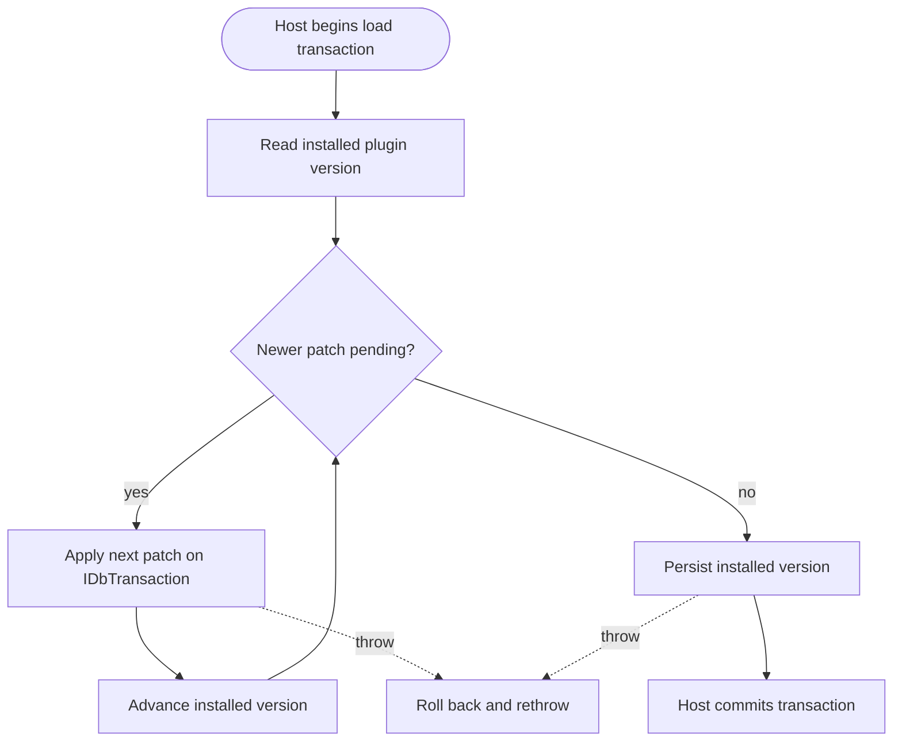

<!--{"sort_order":5, "name": "migrations-onmigrateasync", "label": "Migrations (OnMigrateAsync)"}-->
# Plugin Migrations with OnMigrateAsync

> **Planned target design — Not available in this checkout.** The `IErpPlugin`
> contract, its `OnMigrateAsync(IDbTransaction)` method, and the plugin host that
> would drive it **do not exist in this repository yet**. Everything on this page
> about `OnMigrateAsync` and host-owned transactions is **proposed design** and
> **Not available / to be confirmed** until the SDK contract and host are
> implemented. What is **verified today** is the **legacy** migration model: each
> plugin's `ProcessPatches()` opens and owns **its own** connection and transaction.
>
> Source (verified legacy): /WebVella.Erp.Plugins.SDK/SdkPlugin._.cs:L31 (`DbContext.Current.CreateConnection()`), L35 (`connection.BeginTransaction()`), L153 (`connection.CommitTransaction()`), L156-L158 (`catch { connection.RollbackTransaction(); }`).

A **plugin migration** is the set of transactional schema and Record changes a
plugin applies to bring the database up to the version that plugin expects. Under
the proposed headless platform, the host would run each plugin's migration by
calling `OnMigrateAsync(IDbTransaction transaction)` during plugin load. This page
is the detailed companion to the `OnMigrateAsync` section of the
[IErpPlugin contract](ierplugin-contract.md); it documents the **verified** legacy
versioned-init pattern and the **proposed** target transaction model, and it is
explicit about which is which.

## Method signature & parameters (proposed)

```csharp
Task OnMigrateAsync(IDbTransaction transaction);
```

The proposed migration method is documented here — purpose, inputs, outputs, side
effects, and error modes. The exact signature is Not available / to be confirmed.

**Purpose.** Apply the plugin's versioned schema and data patches so that, after the
method returns, the database reflects the plugin's current expected version. This is
the proposed replacement for the legacy versioned initialization that runs inside
`Initialize`, where the plugin calls `ProcessPatches()`.

Source (verified legacy): /WebVella.Erp.Plugins.SDK/SdkPlugin.cs:L20 (`ProcessPatches()` called from `Initialize`).

**Inputs.** `IDbTransaction transaction` (proposed) — see
[Transaction scoping (current vs target)](#transaction-scoping-current-vs-target)
for the important distinction between the **verified current** per-plugin
transaction and the **proposed** host-supplied transaction.

**Outputs / return.** `Task` (proposed) — awaited by the host before it proceeds.

**Side effects.** Database writes: Entity and Record schema changes, seed Records,
and the plugin's persisted version. In the legacy model the plugin's version and
settings are stored as stringified JSON in the `plugin_data` Entity's `data` text
field; the same "persist the installed version" step would carry into
`OnMigrateAsync`.

Source (verified legacy): /WebVella.Erp.Plugins.SDK/SdkPlugin._.cs:L38 (`plugin_data` Entity / `data` text field comment), L68 (`PluginSettings { Version = WEBVELLA_SDK_INIT_VERSION }`).

**Error modes.** Throwing from `OnMigrateAsync` is proposed to signal a failed
migration: the host would roll back the transaction and rethrow, so no partial
schema change is committed — mirroring the legacy `catch { connection.RollbackTransaction(); throw; }`
wrapper.

Source (verified legacy): /WebVella.Erp.Plugins.SDK/SdkPlugin._.cs:L156 (`catch`), L158 (`connection.RollbackTransaction()`).

## The versioned-init pattern (verified legacy)

A migration tracks an **installed version** for the plugin and applies only the
patches **newer** than that version, in **ascending** order. Because each patch is
guarded by a version check and the installed version is persisted after the patches
run, re-running the migration against an already-up-to-date database applies nothing
— migrations are **idempotent across restarts**.

The legacy SDK plugin encodes this with a monotonically increasing integer version.
Its initial version constant is `WEBVELLA_SDK_INIT_VERSION = 20181001`. Each patch is
gated by an ascending check — for example:

Source (verified legacy): /WebVella.Erp.Plugins.SDK/SdkPlugin._.cs:L12 (`WEBVELLA_SDK_INIT_VERSION = 20181001`), L79 (version gate below).

```csharp
if (currentPluginSettings.Version < 20181215)
{
    currentPluginSettings.Version = 20181215;
    Patch20181215(entMan, relMan, recMan);
}
```

Each patch is an ordered, dated method — for example `private static void
Patch20181215(EntityManager entMan, EntityRelationManager relMan, RecordManager
recMan)`.

Source (verified legacy): /WebVella.Erp.Plugins.SDK/SdkPlugin._.cs:L79-L90 (patch gate); /WebVella.Erp.Plugins.SDK/SdkPlugin.20181215.cs:L12 (`Patch20181215` signature).

In the **proposed** target state, the same version-gated, ascending pattern would
run inside `OnMigrateAsync`, but every write would go to the **passed-in**
`transaction` rather than to a connection the plugin opens itself (proposed —
`IDbTransaction`/`OnMigrateAsync` Not available / to be confirmed):

```csharp
public async Task OnMigrateAsync(IDbTransaction transaction)
{
    // Read the version previously persisted for this plugin (e.g. the plugin_data Entity).
    var installed = ReadInstalledVersion(transaction);

    // Apply only newer patches, in ascending order, on the supplied transaction.
    if (installed < 20181215)
    {
        await Patch20181215Async(transaction);
        installed = 20181215;
    }
    if (installed < 20190227)
    {
        await Patch20190227Async(transaction);
        installed = 20190227;
    }

    // Persist the new version on the SAME transaction — no new connection is opened.
    SaveInstalledVersion(transaction, installed);
}
```

The "run-once, then persist" mindset matches the legacy behavior: once a patch runs
and the version is persisted to `plugin_data`, the change stays applied across
restarts.

Source (verified legacy): /WebVella.Erp.Plugins.SDK/SdkPlugin._.cs:L38 (`plugin_data` persistence), L68 (`Version = WEBVELLA_SDK_INIT_VERSION`).

## Transaction scoping (current vs target)

This is the section most affected by the fact that the host does not exist yet, so
it separates the **verified current** behavior from the **proposed** target.

**Current (verified).** Each legacy plugin opens and owns **its own** transaction.
The SDK plugin's `ProcessPatches()` calls `DbContext.Current.CreateConnection()`,
then `connection.BeginTransaction()`, runs the ordered patches, then
`connection.CommitTransaction()`, all inside a surrounding `catch {
connection.RollbackTransaction(); throw; }`. There is **no** cross-plugin
transaction: one plugin committing or rolling back does not affect another. The
engine's `DbConnection.BeginTransaction` also implements **nested savepoints**
(`transaction.Save(...)`), which is savepoint nesting within a single connection —
**not** evidence of a unit of work spanning multiple plugins.

Source (verified legacy): /WebVella.Erp.Plugins.SDK/SdkPlugin._.cs:L31, L35, L153, L156-L158; /WebVella.Erp/Database/DbConnection.cs:L115 (`BeginTransaction`), L126 (`transaction.Save(savePointName)`), L161-L173 (`RollbackTransaction` — savepoint vs full).

**Target (Not available / to be confirmed).** Whether the host will open **one**
transaction for the whole load and hand that same `IDbTransaction` to every plugin —
making all plugin migrations commit or roll back **together** (cross-plugin
atomicity) — is **undecided**. The current codebase contains no such orchestrator,
so this page does **not** assert cross-plugin atomicity. **What is needed** before
this section can state target semantics:

- the plugin-host source showing whether one transaction spans all plugins or each
  plugin migrates independently;
- whether `MapEndpoints` runs **before or after** the migration commit;
- the compensation/rollback scope when one plugin among many fails (does a later
  plugin's failure undo an earlier plugin's committed migration?);
- how the ambient `EntityManager`/`RecordManager` bind to the supplied transaction;
- the idempotency and ordering guarantees across the full plugin set.

For how the engine scopes connections and transactions today, see
[Data Access](../architecture/data-access.md). For the (proposed) end-to-end
database-migration job flow, see the
[database migration job](../migration/database-migration-job.md).

## Error modes & troubleshooting

The table separates the **verified** per-patch behavior from the **proposed**
cross-plugin behavior.

| Failure | What happens | Remedy |
| --- | --- | --- |
| **A patch throws (verified)** | The plugin's own transaction is rolled back and the exception rethrown; nothing that plugin wrote is committed. Source: /WebVella.Erp.Plugins.SDK/SdkPlugin._.cs:L156-L158 | Fix the failing patch, then reload so the migration re-runs from the last persisted version. |
| **Partial patch within one plugin (verified)** | Cannot be committed: all of that plugin's writes are on one transaction, so a mid-patch failure discards its pending changes atomically. | None needed for that plugin; re-run after fixing the fault. |
| **Cross-plugin atomicity (proposed — Not available)** | Whether a later plugin's failure rolls back an earlier plugin's migration depends on the undecided host transaction model. | Do not rely on cross-plugin rollback until the host defines it; see [Transaction scoping](#transaction-scoping-current-vs-target). |
| **Version mismatch** | The stored installed version is ahead of (or behind) the patches the assembly ships. | Ship patches whose versions are strictly greater than the installed version; never lower a version number. |
| **Migration ordering** | Patches run out of order or a version gate is skipped. | Keep version constants ascending and gate every patch with `if (installed < N)`, applied lowest-to-highest. |

Because migrations would run during load, a failed migration would mean the plugin
fails to load. See the [IErpPlugin contract](ierplugin-contract.md) for the
surrounding (proposed) load lifecycle and [Data Access](../architecture/data-access.md)
for the current transaction-scoping details.

## Migration flow (proposed)



*Proposed per-plugin migration: check the installed version, apply only newer
patches in ascending order on the supplied `IDbTransaction`, then commit — or roll
back on any error. The transaction ownership (per-plugin vs host-wide) is Not
available / to be confirmed. Legacy reference: /WebVella.Erp.Plugins.SDK/SdkPlugin._.cs:L79-L90, L153, L156-L158.*
