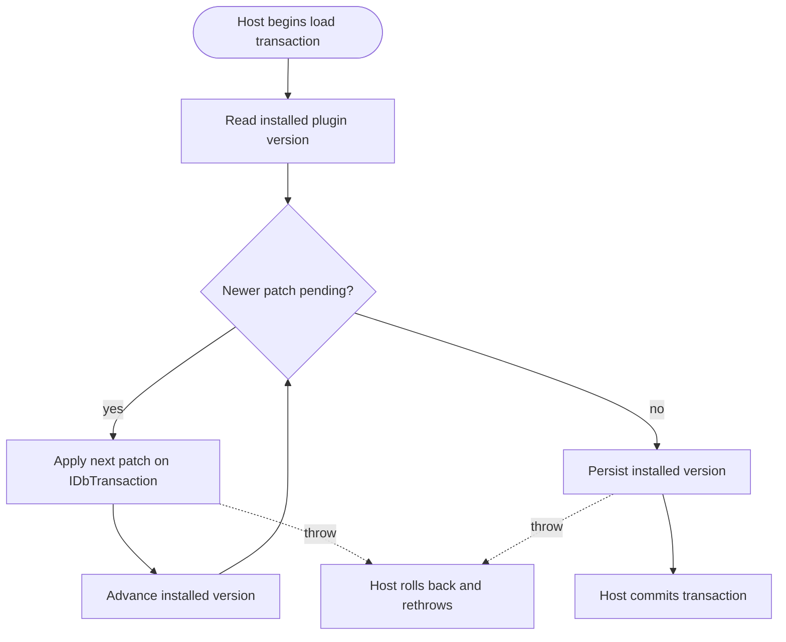

<!--{"sort_order":5, "name": "migrations-onmigrateasync", "label": "Migrations (OnMigrateAsync)"}-->
# Plugin Migrations with OnMigrateAsync

A **plugin migration** is the set of transactional schema and Record changes a plugin applies to bring the database up to the version that plugin expects. Under the headless platform the host runs each plugin's migration by calling `OnMigrateAsync(IDbTransaction transaction)` during plugin load — after `OnLoadAsync` and before `MapEndpoints`, inside a single host-owned database transaction — as shown in the [plugin load sequence](ierplugin-contract.md#plugin-load-sequence). This page is the detailed companion to the `OnMigrateAsync` section of the [IErpPlugin contract](ierplugin-contract.md); it documents the versioned-init pattern, the host-owned transaction, and the all-or-nothing rollback semantics.

## Method signature & parameters

```csharp
Task OnMigrateAsync(IDbTransaction transaction);
```

The migration method is documented here in full — purpose, inputs, outputs, side effects, and error modes.

**Purpose.** Apply the plugin's versioned schema and data patches so that, after the method returns, the database reflects the plugin's current expected version. This is the target-state replacement for the legacy versioned initialization that ran inside `Initialize`, where the plugin called `ProcessPatches()`. `Source: /WebVella.Erp.Plugins.SDK/SdkPlugin.cs:L15-22`

**Inputs.** `IDbTransaction transaction` — an **open** database transaction **supplied and owned by the host**. The plugin performs all of its writes on this transaction and **does not open its own connection**. This is the key contrast with the legacy pattern, in which the plugin itself created the connection and began the transaction via `DbContext.Current.CreateConnection()` then `connection.BeginTransaction()`. `Source: /WebVella.Erp.Plugins.SDK/SdkPlugin._.cs:L31-35`

**Outputs / return.** `Task` — the method is asynchronous and is awaited by the host before it proceeds to `MapEndpoints`.

**Side effects.** Database writes on the **shared** host transaction: Entity and Record schema changes, seed Records, and the plugin's persisted version. In the legacy model the plugin's version and settings were stored as stringified JSON in the `plugin_data` Entity's `data` text field; the same "persist the installed version" step carries into `OnMigrateAsync`. `Source: /WebVella.Erp.Plugins.SDK/SdkPlugin._.cs:L37-39,L66-73,L151`

**Error modes.** Throwing from `OnMigrateAsync` signals a failed migration: the host **rolls back** the shared transaction and rethrows, so no partial schema change is committed. This mirrors the legacy `catch { connection.RollbackTransaction(); throw; }` wrapper. `Source: /WebVella.Erp.Plugins.SDK/SdkPlugin._.cs:L156-160`

## The versioned-init pattern

A migration tracks an **installed version** for the plugin and applies only the patches **newer** than that version, in **ascending** order. Because each patch is guarded by a version check and the installed version is persisted after the patches run, re-running `OnMigrateAsync` against a database that is already up to date applies nothing — migrations are **idempotent across restarts**.

The legacy SDK plugin encoded this with a monotonically increasing integer version. Its initial version constant was `WEBVELLA_SDK_INIT_VERSION = 20181001`. `Source: /WebVella.Erp.Plugins.SDK/SdkPlugin._.cs:L12` Each patch was gated by an ascending check — for example:

```csharp
if (currentPluginSettings.Version < 20181215)
{
    currentPluginSettings.Version = 20181215;
    Patch20181215(entMan, relMan, recMan);
}
```

`Source: /WebVella.Erp.Plugins.SDK/SdkPlugin._.cs:L79-90` Each patch was an ordered, dated method — for example `private static void Patch20181215(EntityManager entMan, EntityRelationManager relMan, RecordManager recMan)`. `Source: /WebVella.Erp.Plugins.SDK/SdkPlugin.20181215.cs:L12`

In the target state, the same version-gated, ascending pattern runs inside `OnMigrateAsync`, but every write goes to the **passed-in** `transaction` rather than to a connection the plugin opens itself:

```csharp
public async Task OnMigrateAsync(IDbTransaction transaction)
{
    // Read the version previously persisted for this plugin (e.g. the plugin_data Entity).
    var installed = ReadInstalledVersion(transaction);

    // Apply only newer patches, in ascending order, on the host-owned transaction.
    if (installed < 20181215)
    {
        await Patch20181215Async(transaction);
        installed = 20181215;
    }
    if (installed < 20190227)
    {
        await Patch20190227Async(transaction);
        installed = 20190227;
    }

    // Persist the new version on the SAME transaction — no new connection is opened.
    SaveInstalledVersion(transaction, installed);
}
```

Contrast with the legacy model: the plugin's `Initialize` called `ProcessPatches()`, which opened its **own** connection and transaction before running the patches; the target `OnMigrateAsync` receives the host's transaction and only applies patches. `Source: /WebVella.Erp.Plugins.SDK/SdkPlugin.cs:L15-22`

This "run-once, then persist" mindset matches how the legacy init registered schedule plans that keep running "even if removed from the plugin initialization" — once applied, the change persists. `Source: /docs/developer/background-jobs/schedule-plan.md:L4`

## Transaction scoping & rollback semantics

The `IDbTransaction` passed to `OnMigrateAsync` is **host-owned and shared**: the host opens one transaction for the load, hands that same transaction to every plugin's migration, and decides when to commit. A plugin migration therefore runs **all-or-nothing** together with the host's unit of work — a throw anywhere aborts the shared transaction and **rolls back all pending plugin migrations**, so the database is never left in a partially migrated state.

The legacy single-transaction wrapper made this explicit: `DbContext.Current.CreateConnection()` then `connection.BeginTransaction()`, run the ordered patches, then `connection.CommitTransaction()` `Source: /WebVella.Erp.Plugins.SDK/SdkPlugin._.cs:L31-35,L153`, all inside a surrounding `catch { connection.RollbackTransaction(); throw; }`. `Source: /WebVella.Erp.Plugins.SDK/SdkPlugin._.cs:L156-160` The target model keeps the **behavior** (single transaction, atomic commit, rollback-and-rethrow on error) but moves **ownership** of the transaction to the host.

For how the engine scopes connections and transactions — and why the host can hand its open `IDbTransaction` directly to a plugin — see [Data Access](../architecture/data-access.md). For the end-to-end database-migration job flow and its rollback diagram, see the [database migration job](../migration/database-migration-job.md).

## Error modes & troubleshooting

| Failure | What happens | Remedy |
| --- | --- | --- |
| **A patch throws** | The host rolls back the shared transaction and rethrows; nothing is committed. `Source: /WebVella.Erp.Plugins.SDK/SdkPlugin._.cs:L156-160` | Fix the failing patch, then reload the plugin so the migration re-runs from the last persisted version. |
| **Partial patch** | Cannot be committed: because all writes are on one host transaction, a mid-patch failure discards every pending change atomically. | None needed — atomicity is guaranteed; re-run after fixing the fault. |
| **Version mismatch** | The stored installed version is ahead of (or behind) the patches the assembly ships. | Ship patches whose versions are strictly greater than the installed version; never lower a version number. |
| **Migration ordering** | Patches run out of order or a version gate is skipped. | Keep version constants ascending and gate every patch with `if (installed < N)`, applied lowest-to-highest. |

Because migrations run during load inside the host transaction, a failed migration means the plugin fails to load — and **no `.wvplugin` package is committed** to the running platform when any migration fails. See the [IErpPlugin contract](ierplugin-contract.md) for the surrounding load lifecycle and [Data Access](../architecture/data-access.md) for the transaction-scoping details.

## Migration flow



*Check the installed version, apply only newer patches in ascending order on the host-owned `IDbTransaction`, then commit — or roll back the entire transaction on any error. `Source: /WebVella.Erp.Plugins.SDK/SdkPlugin._.cs:L79-90,L153,L156-160`*
